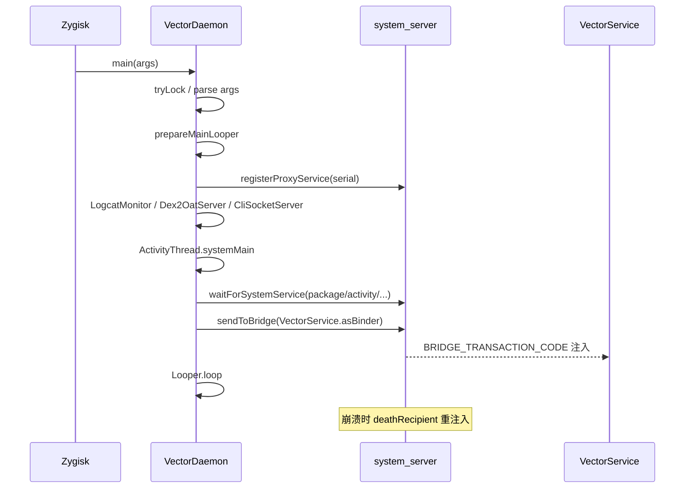

# 🚀 VectorDaemon

> 📂 `daemon/src/main/kotlin/org/matrix/vector/daemon/VectorDaemon.kt`
> 🟦 daemon 模块 · 进程入口与主 Looper 引导

## 类职责

`object VectorDaemon` 是 daemon 进程的 `main` 入口与引导器。它在 Zygisk 注入的 `system_server` 子进程里以 root 身份启动，完成单实例锁、参数解析、主 Looper 准备、代理服务抢占、环境守护进程拉起、框架预加载、系统服务等待、IPC 桥注入，最后进入 `Looper.loop()`。它还持有全局协程作用域与 system_server 崩溃恢复逻辑。

## 关键字段与常量

| 字段 | 类型 | 含义 |
| :--- | :--- | :--- |
| `scope` | `CoroutineScope` | `Dispatchers.IO + SupervisorJob + exceptionHandler`，全局后台作用域 |
| `bridgeServiceName` | `String` | `"activity"`，向 system_server 注入时使用的 rendezvous 服务名 |
| `isLateInject` | `Boolean` | 是否为晚注入模式（system_server 已启动后注入） |
| `proxyServiceName` | `String` | 默认 `"serial"`，晚注入时为 `"serial_vector"` |
| `ACTION_SEND_BINDER` | `Int` | `1`，桥事务内的动作码 |
| `TAG` | `String` | `"VectorDaemon"` |

`exceptionHandler` 为 `CoroutineExceptionHandler`，捕获后台协程致命异常并记录，避免单个任务拖垮整个 daemon。

## main 入口

```kotlin
@JvmStatic
fun main(args: Array<String>)
```

执行步骤：

1. `FileSystem.tryLock()` 抢单实例锁，失败则 `exitProcess(0)`；
2. 解析参数：`--system-server-max-retry=N` 设置重试上限，`--late-inject` 置晚注入标志并切换 `proxyServiceName`；
3. 安装 `Thread.setDefaultUncaughtExceptionHandler`，未捕获异常直接 `exitProcess(1)`；
4. `Process.setThreadPriority(THREAD_PRIORITY_FOREGROUND)` + `Looper.prepareMainLooper()`；
5. `SystemServerService.registerProxyService(proxyServiceName)` 抢占代理服务名，为 zygisk 的 system_server 特化建立早期 IPC；
6. 拉起环境守护：`LogcatMonitor.start()`、（Q 以上）`Dex2OatServer.start()`、`CliSocketServer.start()`；
7. 后台预加载框架 DEX：`scope.launch { FileSystem.getPreloadDex(...) }`；
8. `ActivityThread.systemMain()` 初始化框架，`DdmHandleAppName.setAppName("org.matrix.vector.daemon", 0)`；
9. `waitForSystemService` 阻塞等待 `package`/`activity`/`user`/`appops`；
10. `applyNotificationWorkaround()`；
11. `sendToBridge(VectorService.asBinder(), false, systemServerMaxRetry)` 注入 IPC；
12. 非 verbose 模式下 `LogcatMonitor.stopVerbose()`；
13. `Looper.loop()`，意外退出抛 `RuntimeException`。

## 桥注入与崩溃恢复

```kotlin
private fun sendToBridge(binder: IBinder, isRestart: Boolean, restartRetry: Int)
```

- 断言在主线程；`Os.seteuid(0)` 提权；
- 轮询 `ServiceManager.getService(bridgeServiceName)` 直到 `pingBinder()` 成功；
- `linkToDeath` 注册死亡监听：system_server 崩溃时 `clearSystemCaches()`、`SystemServerService.binderDied()`、重新 `addService(proxyServiceName, ...)`、`ManagerService.guard = null`，并 `Handler.post` 递归 `sendToBridge(binder, true, restartRetry - 1)`；
- 用 `BRIDGE_TRANSACTION_CODE` 发送事务，`data.writeInt(ACTION_SEND_BINDER)` + `writeStrongBinder(binder)`，最多重试 3 次；
- 全程失败且 `restartRetry > 0` 时调用 `restartSystemServer()`；
- 结束 `Os.seteuid(1000)` 复位权限。

`clearSystemCaches()` 反射清空 `ServiceManager.sServiceManager`、`sCache`、`ActivityManager.IActivityManager_singleton.mInstance`，避免拿到陈旧代理。

```kotlin
fun restartSystemServer()
```

根据 `SUPPORTED_64/32_BIT_ABIS` 决定重启 `zygote_secondary` 或 `zygote`，通过 `SystemProperties.set("ctl.restart", target)` 触发。

## waitForSystemService

```kotlin
private fun waitForSystemService(name: String) = runBlocking {
    while (ServiceManager.getService(name) == null) { delay(1000) }
}
```

`runBlocking` 阻塞主线程直到目标系统服务注册。

## 启动时序



## 相关

- [VectorService · IDaemonService 实现](./vector-service)
- [SystemServerService · 代理服务抢占](./system-server-service)
- [LogcatMonitor · 日志监控](./logcat-monitor)
- [Dex2OatServer · dex2oat 包装](./dex2oat-server)
- [CliSocketServer · CLI 套接字](./cli-socket-server)
