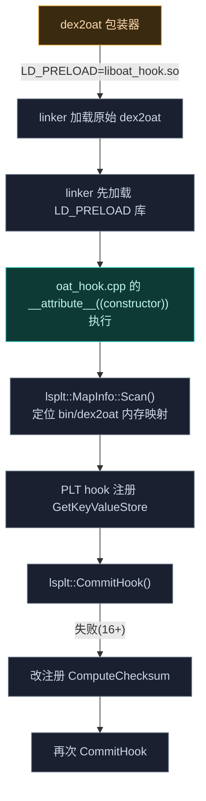
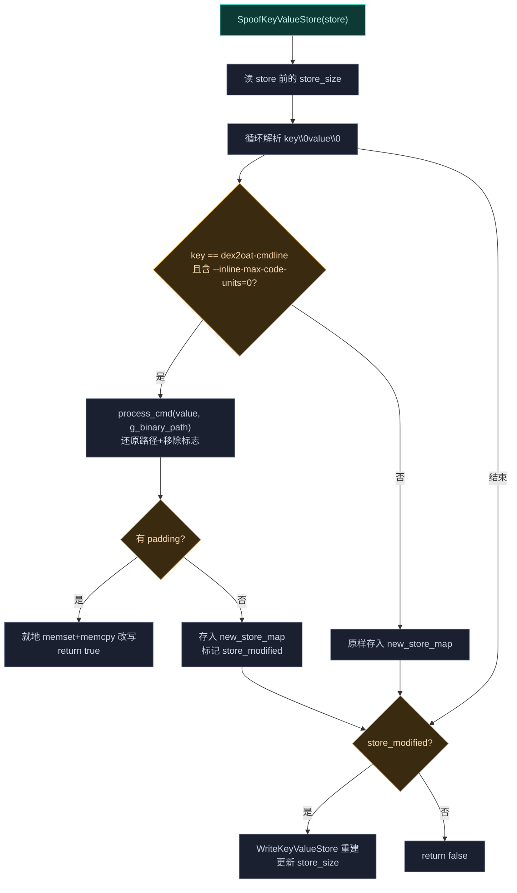

# 🔧 dex2oat · hooker

> 📂 [`dex2oat/src/main/cpp/oat_hook.cpp`](https://github.com/android-security-engineer/Vector-skills/blob/master/dex2oat/src/main/cpp/oat_hook.cpp)
> 🟦 OAT 头元数据清洗的 PLT hook 库

## 职责

`oat_hook.cpp` 编译为 `liboat_hook.so`，由包装器经 `LD_PRELOAD` 注入 dex2oat 进程。它的任务是**清洗 OAT 头的元数据**：包装器会在 `dex2oat-cmdline` 里留下 `/proc/self/fd/...` 路径与 `--inline-max-code-units=0` 标志，可被用于检测包装器存在。本库用 LSPlt 的 PLT hook 拦截 `OatHeader::GetKeyValueStore` / `ComputeChecksum`，在生成 OAT 前把 cmdline 还原成原始二进制路径并移除注入标志。

## 注入原理



## 初始化

```cpp
__attribute__((constructor)) static void initialize();
```

作为构造器在 `liboat_hook.so` 加载时自动执行（早于 dex2oat 的 `main`）。

1. `lsplt::MapInfo::Scan()` 扫描 `/proc/self/maps`，找路径含 `"bin/dex2oat"` 的映射，取 `dev`/`inode`。同时若 `g_binary_path` 为空则记下该路径作回退。
2. `PLT_HOOK_REGISTER(dev, inode, _ZNK3art9OatHeader16GetKeyValueStoreEv)` 注册 `GetKeyValueStore` hook。
3. `lsplt::CommitHook()`——成功即结束；失败（Android 16+ 该函数被内联/不可 PLT hook）则改注册 `_ZNK3art9OatHeader15ComputeChecksumEPj` 再 `CommitHook`。

## hook 宏

```cpp
#define DCL_HOOK_FUNC(ret, func, ...) \
    ret (*old_##func)(__VA_ARGS__) = nullptr; \
    ret new_##func(__VA_ARGS__)

#define PLT_HOOK_REGISTER_SYM(DEV, INODE, SYM, NAME) \
    register_hook(DEV, INODE, SYM, reinterpret_cast<void*>(new_##NAME), \
                  reinterpret_cast<void**>(&old_##NAME))

#define PLT_HOOK_REGISTER(DEV, INODE, NAME) PLT_HOOK_REGISTER_SYM(DEV, INODE, #NAME, NAME)
```

- `DCL_HOOK_FUNC`——声明 `old_<func>` 备份指针 + 定义 `new_<func>` 替换实现。
- `PLT_HOOK_REGISTER`——把 `new_<NAME>` 注册为符号 `#NAME` 的 PLT hook，`old_<NAME>` 接收原函数。

`register_hook` 封装 `lsplt::RegisterHook`，失败记 `LOGE`。

## hook 目标

### GetKeyValueStore（Android < 16）

```cpp
DCL_HOOK_FUNC(uint8_t*, _ZNK3art9OatHeader16GetKeyValueStoreEv, void* header) {
    uint8_t* const key_value_store = old__ZNK3art9OatHeader16GetKeyValueStoreEv(header);
    SpoofKeyValueStore(key_value_store);
    return key_value_store;
}
```

拦截 `OatHeader::GetKeyValueStore()`，在返回前清洗 store。调用方拿到的是已伪装的元数据。

### ComputeChecksum（Android 16+）

```cpp
DCL_HOOK_FUNC(void, _ZNK3art9OatHeader15ComputeChecksumEPj, void* header, uint32_t* checksum) {
    auto* oat_header = reinterpret_cast<art::OatHeader*>(header);
    uint8_t* const store = const_cast<uint8_t*>(oat_header->getKeyValueStore());
    SpoofKeyValueStore(store);
    old__ZNK3art9OatHeader15ComputeChecksumEPj(header, checksum);  // 在改后数据上算 checksum
}
```

16+ 上 `GetKeyValueStore` 不可 hook，改在 `ComputeChecksum` 处介入——先清洗 store 再调原函数，使 checksum 基于清洗后数据计算，保证一致性。

## SpoofKeyValueStore 核心

```cpp
bool SpoofKeyValueStore(uint8_t* store);
```



### store 布局

`store` 起始处的 `uint32_t`（前 4 字节）是 `store_size`，随后是连续的 `key\0value\0` 对。`has_padding` 判定：`dex2oat-cmdline`/`apex-versions` 是非确定性字段（见 `OatHeader::kNonDeterministicFieldsAndLengths`），写入时填充到 2048/1024 上限，故值后可能紧跟 `\0` padding。

### 两种改写策略

- **就地改写**（有 padding）：`memset` 清零原值范围后 `memcpy` 新 cmdline，返回 `true`。利用 padding 空间无需重建整个 store。
- **重建**（无 padding）：把所有项存入 `new_store_map`，`WriteKeyValueStore` 重序列化，更新 `store_size_ptr`。

### process_cmd

```cpp
std::string process_cmd(std::string_view sv, std::string_view new_cmd_path);
```

按空格分词：把首个 token（linker/包装器路径）替换为 `new_cmd_path`（即 `g_binary_path`，来自 `DEX2OAT_CMD` 环境变量或内存映射路径），移除 `--inline-max-code-units=0` 标志，重新拼接。

### WriteKeyValueStore

```cpp
uint8_t* WriteKeyValueStore(const std::map<std::string, std::string>& key_values, uint8_t* store);
```

把 map 重序列化回 store 内存：每个 entry 写 `key\0value\0`。返回写入结束位置，调用方据此更新 `store_size`。

### IsNonDeterministic

```cpp
bool IsNonDeterministic(const std::string_view& key);
```

查 `OatHeader::kNonDeterministicFieldsAndLengths` 判断该 key 是否为变长填充字段。

## 状态变量

```cpp
namespace {
const std::string_view kParamToRemove = "--inline-max-code-units=0";
std::string g_binary_path = getenv("DEX2OAT_CMD");  // 包装器设置的原始二进制路径
}
```

`g_binary_path` 初始从 `DEX2OAT_CMD` 环境变量取（包装器在 `main` 里 `setenv`），若为空则用内存映射扫到的 `bin/dex2oat` 路径回退。

## 依赖

- **[LSPlt](https://github.com/JingMatrix/LSPlt)**——PLT hook 实现，`lsplt::RegisterHook`/`CommitHook`/`MapInfo::Scan`。
- **oat.h**——`art::OatHeader` 结构镜像，提供 `kDex2OatCmdLineKey`/`kNonDeterministicFieldsAndLengths`/`getKeyValueStore`。
- **logging.h**——日志。

## 相关

- [dex2oat 模块总览](../modules/dex2oat)
- [dex2oat · wrapper](./dex2oat-wrapper)（经 `LD_PRELOAD` 注入本库，提供 `DEX2OAT_CMD`）
- [架构 · dex2oat 编译劫持](../../architecture/dex2oat)
