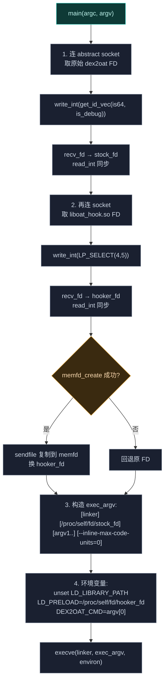

# 📦 dex2oat · wrapper 包装器

> 📂 `dex2oat/src/main/cpp/dex2oat.cpp` · `dex2oat/src/main/cpp/include/`
> 🟦 替换系统 dex2oat 二进制的包装器

## 职责

`dex2oat.cpp` 是一个**替换二进制**——它顶替系统 `dex2oat`，被系统调用时从 Daemon 经 Unix abstract socket 取回原始编译器 FD 与 `liboat_hook.so` FD，重建命令行追加 `--inline-max-code-units=0`，设 `LD_PRELOAD`，经 linker 执行原始编译器。本文件同时涵盖 `include/` 下的辅助头文件。

## 头文件清单

| 文件 | 内容 |
| :--- | :--- |
| [`include/oat.h`](#oath) | `art::OatHeader` 结构镜像（AOSP 移植） |
| [`include/base_macros.h`](#base_macrosh) | ART 基础宏（`PACKED`/`EXPORT`/`UNREACHABLE` 等） |
| [`include/macros.h`](#macrosh) | ART 通用宏（`DISALLOW_COPY_AND_ASSIGN`/`LIKELY`/`arraysize` 等） |
| [`include/logging.h`](#loggingh) | dex2oat 模块日志宏 |

---

## dex2oat.cpp

### main 流程

```cpp
int main(int argc, char **argv);
```



### Abstract Socket 协议

```cpp
constexpr char kSockName[] = "5291374ceda0aef7c5d86cd2a4f6a3ac";
```

Linux Abstract Namespace 的 Unix socket（`sun_path[0]='\0'`，名字从 `sun_path+1` 起）。`socklen_t len = sizeof(sun_family) + strlen(kSockName) + 1`。

### ID 编码

```cpp
inline int get_id_vec(bool is64, bool is_debug) {
    return (static_cast<int>(is64) << 1) | static_cast<int>(is_debug);
}
```

`(is64<<1)|is_debug` 编码架构与调试状态：Daemon 据此返回对应变体的原始 dex2oat FD。`is_debug` 由 `argv[0]` 含 `"dex2oatd"` 判定。第二次连接传 `LP_SELECT(4, 5)` 标识请求 `liboat_hook.so`。

### FD 接收辅助

```cpp
ssize_t xrecvmsg(int sockfd, struct msghdr *msg, int flags);
void *recv_fds(int sockfd, char *cmsgbuf, size_t bufsz, int cnt);
int recv_fd(int sockfd);          // 单 FD 便捷封装
int read_int(int fd);             // 读 int 确认
void write_int(int fd, int val);  // 写 int 命令/ID
```

`recv_fds` 用 `SCM_RIGHTS` 辅助消息接收 FD，严格校验 `cmsg_len`/`cmsg_level`/`cmsg_type`。`recv_fd` 是 `cnt=1` 的封装。

### memfd 复制

```cpp
int mem_fd = syscall(__NR_memfd_create, "liboat_hook_memfd", 0);
struct stat st;
fstat(hooker_fd, &st);
off_t offset = 0;
sendfile(mem_fd, hooker_fd, &offset, st.st_size);
close(hooker_fd);
hooker_fd = mem_fd;
```

把 `liboat_hook.so` 从收到的 FD 复制到新 memfd，使 `LD_PRELOAD=/proc/self/fd/<memfd>` 路径在 `execve` 后仍有效（原 FD 可能在 linker 初始化时被关闭）。失败则回退原 FD。

### 命令行与环境

```cpp
const char *linker_path = LP_SELECT(
    "/apex/com.android.runtime/bin/linker",
    "/apex/com.android.runtime/bin/linker64");

// exec_argv = [linker, /proc/self/fd/stock_fd, argv[1..], --inline-max-code-units=0, nullptr]

unsetenv("LD_LIBRARY_PATH");
setenv("LD_PRELOAD", ("/proc/self/fd/" + std::to_string(hooker_fd)).c_str(), 1);
setenv("DEX2OAT_CMD", argv[0], 1);

execve(linker_path, exec_argv.data(), environ);
```

- `argv[0]`（包装器路径）被丢弃，改用 linker 启动原始 dex2oat（经 `/proc/self/fd/` 路径）。
- `--inline-max-code-units=0` 强制禁止方法内联——这是整个包装器的目的：内联后调用方直接执行机器码、不查 `entry_point`，Hook 失效。
- `LD_LIBRARY_PATH` 清除让 linker 用内部配置。
- `LD_PRELOAD` 注入 `liboat_hook.so` 做 OAT 元数据清洗。
- `DEX2OAT_CMD` 保存原始 `argv[0]`，供 hooker 伪装 cmdline 时还原。

---

## oat.h

`namespace art`—— AOSP `art/runtime/oat/oat.h` 的移植镜像，定义 OAT 文件头结构。LICENSE: Apache 2.0。

### OatHeader

```cpp
class EXPORT PACKED(4) OatHeader {
public:
    static constexpr std::array<uint8_t,4> kOatMagic{{'o','a','t','\n'}};
    static constexpr std::array<uint8_t,4> kOatVersion{{'2','5','9','\0'}};

    static constexpr const char* kDex2OatCmdLineKey = "dex2oat-cmdline";
    static constexpr const char* kDebuggableKey = "debuggable";
    static constexpr const char* kNativeDebuggableKey = "native-debuggable";
    static constexpr const char* kCompilerFilter = "compiler-filter";
    static constexpr const char* kClassPathKey = "classpath";
    static constexpr const char* kBootClassPathKey = "bootclasspath";
    static constexpr const char* kBootClassPathChecksumsKey = "bootclasspath-checksums";
    static constexpr const char* kApexVersionsKey = "apex-versions";
    static constexpr const char* kConcurrentCopying = "concurrent-copying";
    static constexpr const char* kCompilationReasonKey = "compilation-reason";
    static constexpr const char* kRequiresImage = "requires-image";

    static constexpr std::array<std::string_view, 9> kDeterministicFields{ /* 上列 9 个确定性字段 */ };

    // 非确定性字段 → 写入时填充到长度上限并排除出 checksum 计算
    static constexpr std::array<std::pair<std::string_view, size_t>, 2>
        kNonDeterministicFieldsAndLengths{
            std::make_pair(kDex2OatCmdLineKey, 2048),
            std::make_pair(kApexVersionsKey, 1024),
        };

    const uint8_t* getKeyValueStore() const { return key_value_store_; }
    void ComputeChecksum(/*inout*/ uint32_t* checksum) const;

private:
    std::array<uint8_t,4> magic_;
    std::array<uint8_t,4> version_;
    uint32_t oat_checksum_;
    InstructionSet instruction_set_;
    uint32_t instruction_set_features_bitmap_;
    uint32_t dex_file_count_;
    uint32_t oat_dex_files_offset_;
    uint32_t bcp_bss_info_offset_;
    uint32_t base_oat_offset_;
    uint32_t executable_offset_;
    uint32_t jni_dlsym_lookup_trampoline_offset_;
    uint32_t jni_dlsym_lookup_critical_trampoline_offset_;
    uint32_t quick_generic_jni_trampoline_offset_;
    uint32_t quick_imt_conflict_trampoline_offset_;
    uint32_t quick_resolution_trampoline_offset_;
    uint32_t quick_to_interpreter_bridge_offset_;
    uint32_t nterp_trampoline_offset_;
    uint32_t key_value_store_size_;
    uint8_t key_value_store_[0];  // 变长数据
};
```

`getKeyValueStore()` 与 `ComputeChecksum()` 是 hooker PLT hook 的目标。`key_value_store_` 是变长 key-value 区，`key_value_store_size_` 在其前 4 字节。

### 确定性 vs 非确定性字段

- **kDeterministicFields**（9 个）：跨主机/设备应一致，参与 checksum。
- **kNonDeterministicFieldsAndLengths**（`dex2oat-cmdline` 2048、`apex-versions` 1024）：写入时填充到上限、**排除**出 checksum，保证 Cloud Compilation 下 oat checksum 跨主机一致。hooker 据此判断 `dex2oat-cmdline` 是否有可利用的 padding 做就地改写。

---

## base_macros.h

AOSP `art/libartbase/base_macros.h` 移植。LICENSE: Apache 2.0。

```cpp
#define ART_FRIEND_TEST(test_set_name, individual_test) friend class test_set_name##_##individual_test##_Test
#define ART_FORMAT(str, ...) ::fmt::format(FMT_STRING(str), __VA_ARGS__)
#define DISALLOW_ALLOCATION() /* 禁 new/delete，仅允许 placement new */
#define OFFSETOF_MEMBER(t, f) offsetof(t, f)
#define ALIGNED(x) __attribute__((__aligned__(x)))
#define PACKED(x) __attribute__((__aligned__(x), __packed__))
#define QUOTE(x) #x
#define STRINGIFY(x) QUOTE(x)

#ifndef NDEBUG
#define ALWAYS_INLINE
#define FLATTEN
#else
#define ALWAYS_INLINE __attribute__((always_inline))
#define FLATTEN __attribute__((flatten))
#endif

#define NO_STACK_PROTECTOR __attribute__((no_stack_protector))
#define UNREACHABLE __builtin_unreachable
#define NO_RETURN [[noreturn]]
#define HOT_ATTR __attribute__((hot))
#define COLD_ATTR __attribute__((cold))
#define PURE __attribute__((__pure__)

#ifdef NDEBUG
#define HIDDEN __attribute__((visibility("hidden")))
#define PROTECTED __attribute__((visibility("protected")))
#define EXPORT __attribute__((visibility("default")))
#else
#define HIDDEN
#define PROTECTED
#define EXPORT
#endif

#ifdef BUILDING_LIBART
#define LIBART_PROTECTED PROTECTED
#else
#define LIBART_PROTECTED EXPORT
#endif
```

`oat.h` 用 `EXPORT PACKED(4)` 标注 `OatHeader`。

---

## macros.h

AOSP `art/libartbase/macros.h` 移植。LICENSE: Apache 2.0。

```cpp
#ifndef TEMP_FAILURE_RETRY
#define TEMP_FAILURE_RETRY(exp) ({ decltype(exp) _rc; do { _rc = (exp); } while (_rc == -1 && errno == EINTR); _rc; })
#endif

#define DISALLOW_COPY_AND_ASSIGN(TypeName) \
    TypeName(const TypeName &) = delete; \
    void operator=(const TypeName &) = delete

#define DISALLOW_IMPLICIT_CONSTRUCTORS(TypeName) \
    TypeName() = delete; \
    DISALLOW_COPY_AND_ASSIGN(TypeName)

template <typename T, size_t N>
char (&ArraySizeHelper(T (&array)[N]))[N];
#define arraysize(array) (sizeof(ArraySizeHelper(array)))

#define SIZEOF_MEMBER(t, f) sizeof(std::declval<t>().f)
#define LIKELY(exp) (__builtin_expect((exp) != 0, true))
#define UNLIKELY(exp) (__builtin_expect((exp) != 0, false))
#define WARN_UNUSED __attribute__((warn_unused_result))
template <typename... T> void UNUSED(const T &...) {}
#define ATTRIBUTE_UNUSED __attribute__((__unused__))
#ifndef FALLTHROUGH_INTENDED
#define FALLTHROUGH_INTENDED [[fallthrough]]
#endif

#if defined(__arm__)
#define ABI_STRING "arm"
#elif defined(__aarch64__)
#define ABI_STRING "arm64"
#elif defined(__i386__)
#define ABI_STRING "x86"
#elif defined(__riscv)
#define ABI_STRING "riscv64"
#elif defined(__x86_64__)
#define ABI_STRING "x86_64"
#endif
```

`OatHeader` 末尾用 `DISALLOW_COPY_AND_ASSIGN` 禁拷贝。

---

## logging.h

```cpp
#ifndef LOG_TAG
#define LOG_TAG "VectorDex2Oat"
#endif
```

| 宏 | 级别 | release | debug 附加 |
| :--- | :--- | :--- | :--- |
| `LOGV` | VERBOSE | 编译掉 | — |
| `LOGD` | DEBUG | 编译掉 | 文件/行/函数 |
| `LOGI` | INFO | 输出 | — |
| `LOGW` | WARN | 输出 | — |
| `LOGE` | ERROR | 输出 | — |
| `LOGF` | FATAL | 输出 | — |
| `PLOGE` | ERROR | 输出 | 追加 `errno`+`strerror` |

`LOG_DISABLED` 定义后全部返回 0。

---

## CMakeLists.txt

```cmake
add_executable(dex2oat dex2oat.cpp)
add_library(oat_hook SHARED oat_hook.cpp)
target_include_directories(oat_hook PUBLIC include)
target_include_directories(dex2oat PUBLIC include)
target_link_libraries(dex2oat log)
target_link_libraries(oat_hook log lsplt_static)
```

构建两个产物：`dex2oat` 可执行文件（包装器）与 `liboat_hook.so`（hooker）。hooker 链接 `lsplt_static`（LSPlt）。`DEBUG_SYMBOLS_PATH` 定义时额外生成调试符号并 strip。

## 相关

- [dex2oat 模块总览](../modules/dex2oat)
- [dex2oat · hooker](./dex2oat-hooker)（经 `LD_PRELOAD` 注入的 `liboat_hook.so`）
- [架构 · dex2oat 编译劫持](../../architecture/dex2oat)
