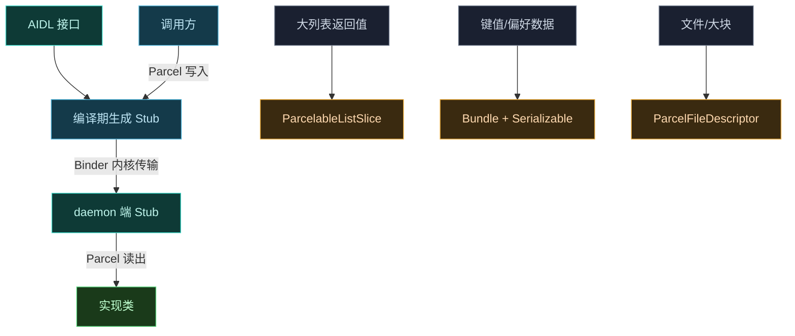

# 📦 跨进程序列化 — AIDL 数据传输机制

Vector 的 IPC 数据跨进程传输**不依赖 KotlinX serialization**，而是基于 Android 原生的 Parcel/Bundle 机制与 AIDL 生成的 Stub。本文澄清实际的序列化方案。

> 📂 [`services/daemon-service/src/main/aidl/`](https://github.com/android-security-engineer/Vector-skills/blob/master/services/daemon-service/src/main/aidl/)（AIDL 模型定义）
> 📂 [`services/manager-service/build.gradle.kts`](https://github.com/android-security-engineer/Vector-skills/blob/master/services/manager-service/build.gradle.kts)（依赖 `rikkax.parcelablelist`）
> 📡 services AIDL · 数据传输

## 实际方案：Parcel + Bundle + ParcelableListSlice

Vector 的跨进程序列化由三层构成，全部是 Android Binder 原生机制：



## 三种数据载体

| 场景 | 载体 | 典型用法 |
| :--- | :--- | :--- |
| 大列表返回值 | `ParcelableListSlice<T>` | `getInstalledPackagesFromAllUsers` 返回 `PackageInfo` 列表 |
| 键值/偏好数据 | `Bundle` + `Serializable` | 偏好 map 以 `Serializable` 塞入 Bundle |
| 文件/共享内存 | `ParcelFileDescriptor` | 共享 DEX、manager APK、日志文件 |

## ParcelableListSlice

`rikka.parcelablelist.ParcelableListSlice`（依赖 `rikkax.parcelablelist`）用于跨进程传递可能很大的 Parcelable 列表。ManagerService 中两处使用：

```kotlin
override fun getInstalledPackagesFromAllUsers(flags, filterNoProcess):
    ParcelableListSlice<PackageInfo> = ParcelableListSlice(
        packageManager?.getInstalledPackagesFromAllUsers(flags, filterNoProcess) ?: emptyList())

override fun queryIntentActivitiesAsUser(intent, flags, userId):
    ParcelableListSlice<ResolveInfo> = ParcelableListSlice(...)
```

它将列表分块写入 Parcel，避免单个事务超过 Binder 1MB 传输上限。

## Bundle + Serializable 偏好

模块偏好数据通过 `Bundle.putSerializable("map", prefs as Serializable)` 传输。`InjectedModuleService.requestRemotePreferences` 与 `ModuleService.requestRemotePreferences` 都用此方式返回偏好快照。偏好更新差异 `diff` 也是 Bundle，内含 `put`(Map) 与 `delete`(Set) 两个 Serializable 键。

## ParcelFileDescriptor

文件类数据用 PFD 传递 fd，由内核完成零拷贝：

```kotlin
ParcelFileDescriptor.open(managerApkPath.toFile(), MODE_READ_ONLY)
ParcelFileDescriptor.open(logFile, MODE_READ_ONLY)
```

共享 DEX 更进一步：`FileSystem.getPreloadDex` 返回共享内存，通过 `shm.writeToParcel` 传递，注入进程直接映射同一物理内存，实现真正的零拷贝。

## 自定义事务码

部分非 AIDL 声明的传输走硬编码事务码，在 `onTransact` 中手动处理 Parcel：

| 事务码 | 数据布局 |
| :--- | :--- |
| `DEX_TRANSACTION_CODE` | reply: 写异常 + 共享内存 + size |
| `OBFUSCATION_MAP_TRANSACTION_CODE` | reply: 写数量 + (key, value) 字符串对 |
| `BRIDGE_TRANSACTION_CODE` | data: uid + pid + processName + heartBeat binder |

## 与 KotlinX serialization 的关系

Vector 的 `daemon` 模块依赖 `kotlinx.coroutines`（协程），但**未引入 `kotlinx.serialization`**。跨进程数据传输完全由 Android Binder 原生 Parcel 机制承担——AIDL 模型（`Module`、`Application`、`UserInfo`）本身是 Parcelable，由 AIDL 编译器生成序列化代码，无需额外序列化库。

## 相关

- 各服务实现见 [services 目录](../../aidl/)
- AIDL 模型定义见 [reference/aidl/models](../../aidl/models)
- 共享 DEX 零拷贝见 [reference/classes/native/daemon-socket](../native/daemon-socket)
- 偏好传输配方见 [cookbook/remote-preference](../../../cookbook/remote-preference)
