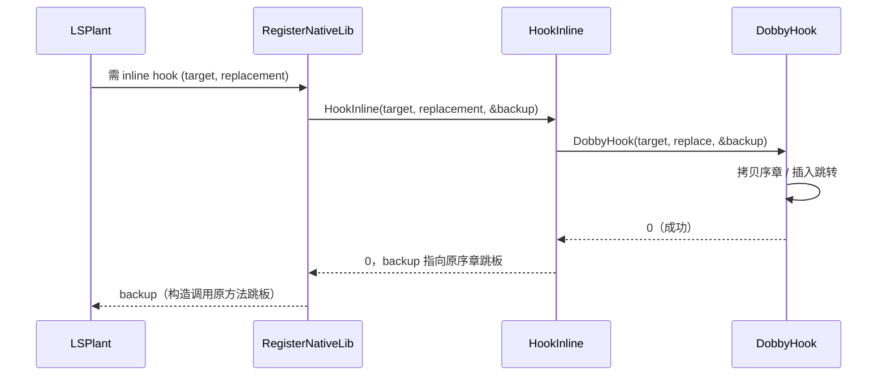
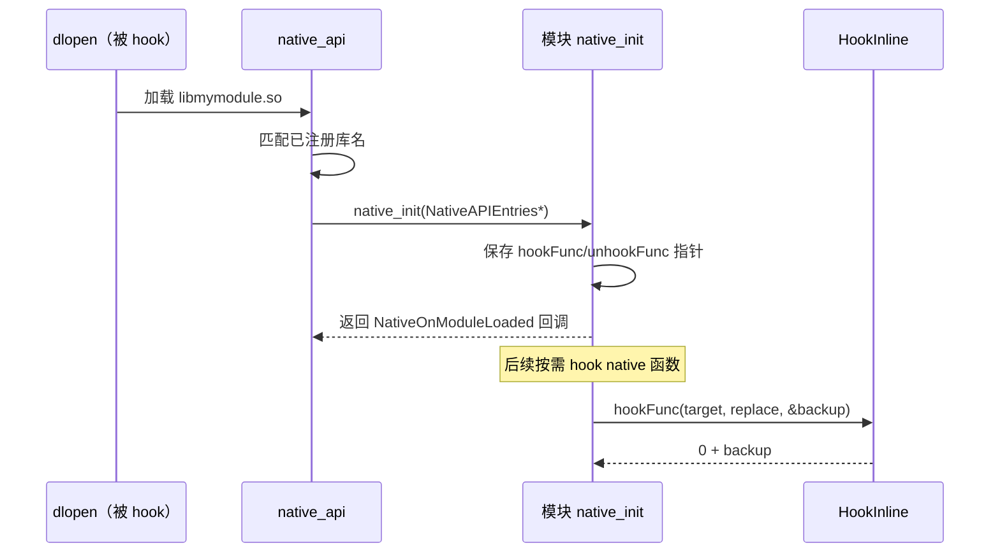

# 🪝 Dobby — inline hook 引擎

Dobby 是 Vector 使用的轻量级多平台 inline hook 框架，作为 LSPlant 的 native 函数替换底层。

> 📂 [`external/dobby/`](https://github.com/android-security-engineer/Vector-skills/blob/master/external/dobby/)（git 子模块，源见 [JingMatrix/Dobby](https://github.com/JingMatrix/Dobby)）
> 📚 external 依赖 · native 核心

## 职责

Dobby 在机器指令级改写 native 函数序章，插入跳转到替换函数，并保留原始序章拷贝作为"调用原方法"的跳板。Vector 不直接使用 Dobby，而是把它包成 `HookInline` / `UnhookInline` 两个内联函数，一方面回调给 LSPlant 作为 `inline_hooker`，另一方面通过 `NativeAPIEntries` 暴露给第三方 native 模块。Dobby 因此是 Vector native hook 能力的最底层依赖。

## 在 Vector 中的角色

LSPlant 在改写某些 ART 入口时需要 native inline hook 能力。Vector 通过 `lsplant::InitInfo::inline_hooker` 把该能力回调给 LSPlant，其实现 `HookInline` 最终调用 Dobby 完成机器指令级替换。


## 组成 / 包装函数

Dobby 的能力通过两个内联包装函数接入 Vector。二者定义在 `native/include/core/native_api.h`，分别包裹 Dobby 的 `DobbyHook` 与 `DobbyDestroy`：

| 包装函数 | Dobby 原语 | 签名 | 行为 |
| :--- | :--- | :--- | :--- |
| `HookInline` | `DobbyHook` | `int(void* original, void* replace, void** backup)` | 安装 inline hook，把原始序章拷贝到 `*backup` 供调用原方法，返回 0 表示成功 |
| `UnhookInline` | `DobbyDestroy` | `int(void* original)` | 卸载指定函数的 inline hook，返回 0 表示成功 |

Debug 构建下两者会在 hook 前 `dladdr` 解析符号名/文件名并打日志，便于排查 hook 目标；Release 构建下该分支被 `if constexpr (kIsDebugBuild)` 裁掉，零开销。

## HookInline 的位置

`native_api.cpp` 中 `NativeAPIEntries` 结构将 `hookFunc` 与 `unhookFunc` 指向 `HookInline` / `UnhookInline`，并通过 `mprotect` 将整个 API 表锁为只读后暴露给模块 native 库：

```cpp
auto *entries = new (g_api_page.get()) NativeAPIEntries{
    .version = 2,
    .hookFunc = &HookInline,
    .unhookFunc = &UnhookInline,
};
mprotect(g_api_page.get(), 4096, PROT_READ);
```

`RegisterNativeLib` 向 LSPlant 注册 inline hooker 时也调 `HookInline`：

```cpp
.inline_hooker = [](void *target, void *replacement) {
    void *backup = nullptr;
    return HookInline(target, replacement, &backup) == 0 ? backup : nullptr;
}
```

`HookInline` 返回 0 表示成功，并把原始函数序章拷贝出的 backup 指针回传，供 LSPlant 构造"调用原方法"的跳板。

## 调用时序：LSPlant 触发 inline hook

LSPlant 在改写 ART 入口时回调 `inline_hooker`，最终落到 Dobby：



## 调用时序：第三方模块通过 native_init 拿到能力

native 模块经 `do_dlopen` hook 拦截后，Vector 调其导出的 `native_init` 并传入只读 `NativeAPIEntries`：



## Native API 暴露

模块的 native 库通过导出的 `native_init` 入口拿到 `NativeAPIEntries`，其中 `hookFunc(target, replacement, **backup)` 即 Dobby 能力的对外封装。模块开发者据此 hook 任意 native 函数，无需直接依赖 Dobby。

| 入口字段 | 类型 | 作用 |
| :--- | :--- | :--- |
| `version` | `int` | API 版本（=2） |
| `hookFunc` | `int(*)(void*, void*, void**)` | 安装 inline hook，返回 backup |
| `unhookFunc` | `int(*)(void*)` | 卸载 hook |

`NativeAPIEntries` 是面向第三方模块的公共 ABI，结构固定后不得随意变更，否则破坏已编译模块的二进制兼容。整个表写入独立内存页并 `mprotect` 为只读，既防止运行期被篡改，也保证模块跨进程读到一致的指针表。

## 构建

`external/CMakeLists.txt` 通过 `add_subdirectory(dobby)` 编入，并设 `Plugin.SymbolResolver OFF`（Vector 自带 `ElfSymbolCache`/`ElfImage` 做符号解析，不重复启用 Dobby 的符号解析插件）。Dobby 静态链接进 native 库。

同时 `LSPLANT_BUILD_SHARED OFF`、`FMT_INSTALL OFF` 控制其它 external 子目录的构建形态，确保 LSPlant、fmt 均以静态库形式并入，最终归并进单一 native 库。

> ⚠️ 当前 `external/dobby/` 为空目录（子模块未检出），上文基于 `native/` 源码中的调用契约与上游公开 API 撰写。

## 使用场景与约束

- **场景一：LSPlant 的 ART 入口改写**。LSPlant 在 hook Java 方法时，部分 ART 内部函数需 inline hook 才能稳定拦截，Vector 通过 `inline_hooker` 回调把 `HookInline` 交给 LSPlant 使用。
- **场景二：第三方模块 hook native 函数**。模块在 `native_init` 收到 `NativeAPIEntries` 后，调 `hookFunc(target, replacement, &backup)` 即可 hook 任意 native 函数，`backup` 用于在替换函数内调用原逻辑。
- **约束：API 表只读且版本固定**。`NativeAPIEntries` 经 `mprotect` 锁为只读，模块应只读不改；`version=2` 是当前 ABI 版本，跨版本升级需保证向后兼容。
- **约束：符号解析不交给 Dobby**。`Plugin.SymbolResolver OFF` 关闭 Dobby 自带符号解析，所有符号查找走 Vector 的 `ElfSymbolCache`/`ElfImage`，模块若需按符号名 hook 应使用 Vector 提供的解析能力而非 Dobby 接口。
- **约束：子模块需检出**。`external/dobby/` 当前为空，本地完整构建前需初始化该子模块，否则 `add_subdirectory(dobby)` 失败；CI 与发布构建应确保子模块就位。

## 相关

- inline hook 引擎单类见 [reference/classes/native/inline-scope](../native/inline-scope)
- 符号解析见 [reference/classes/native/symbol-resolver](../native/symbol-resolver)
- native 模块开发见 [developer/native](../../../developer/native)
- 依赖总览见 [reference/modules/external](../../modules/external)
