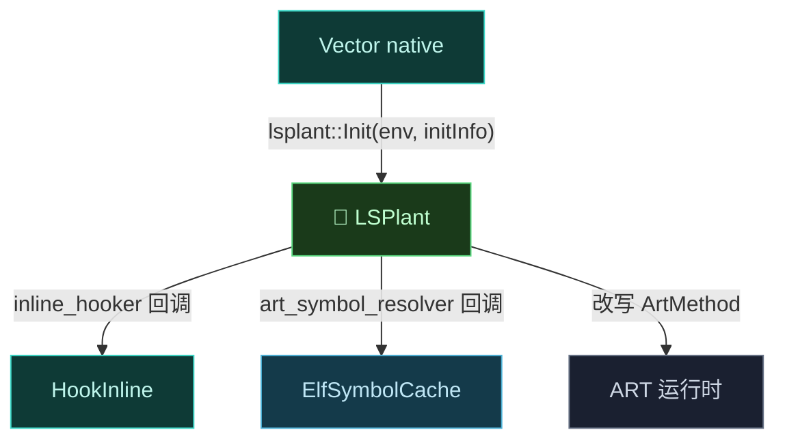

# 🧬 LSPlant — ART 方法 Hook 引擎

LSPlant 是 Vector 的**核心依赖**，实现 Android Runtime（ART）上的 Java 方法 Hook。Vector 通过其 C++20 Hook DSL 完成全部方法拦截与反优化。

> 📂 [`external/lsplant/`](https://github.com/android-security-engineer/Vector-skills/blob/master/external/lsplant/)（git 子模块，源见 [JingMatrix/LSPlant](https://github.com/JingMatrix/LSPlant)）
> 📚 external 依赖 · native 核心

## 在 Vector 中的角色

LSPlant 提供 `lsplant::Init`、`lsplant::Hook`、`lsplant::InitInfo` 等 API，是 native 层 Hook 的底层。Vector 不自研 ART Hook，而是在 `Context::InitArtHooker` 中初始化 LSPlant，并通过 `InitInfo` 把 inline hook 与符号解析回调注入回去。



## 集成与初始化

`Context::InitArtHooker` 调用 `lsplant::Init(env, initInfo)`，失败则记 `LOGE`。`InitInfo` 由 `native_api.cpp::RegisterNativeLib` 构造：

```cpp
InstallNativeAPI(lsplant::InitInfo{
    .inline_hooker = [](void *target, void *replacement) {
        void *backup = nullptr;
        return HookInline(target, replacement, &backup) == 0 ? backup : nullptr;
    },
    .art_symbol_resolver = [](auto symbol) {
        return ElfSymbolCache::GetLinker()->getSymbAddress(symbol);
    },
});
```

| InitInfo 字段 | Vector 注入的实现 | 作用 |
| :--- | :--- | :--- |
| `inline_hooker` | 调 `HookInline`（Dobby 后端） | LSPlant 需要的 native inline hook |
| `art_symbol_resolver` | `ElfSymbolCache::GetLinker()` | 解析 linker 内部符号 |

## DEX 信任提升

除方法 Hook 外，LSPlant 还提供 `MakeDexFileTrusted`，Vector 在 `Context::InitHooks` 中遍历注入 ClassLoader 的 `DexPathList.dexElements`，取出每个 DexFile 的 `mCookie`，调 `lsplant::MakeDexFileTrusted(env, cookie)` 将模块 DEX 标记为可信，绕过 Hidden API 限制。


## Hook DSL

Vector 还用 LSPlant 的 C++20 符号字面量 DSL hook `do_dlopen`，监听模块 native 库加载以触发 `native_init`：

```cpp
"__dl__Z9do_dlopenPKciPK17android_dlextinfoPKv"_sym.hook->*
[]<lsplant::Backup auto backup>(const char *name, ...) -> void * { ... }
```

`hookMethod` JNI 桥最终也调 `lsplant::Hook(env, hookMethod, hooker_object, callback_method)`，并把返回的 backup 存入 `HookItem`。

## 构建

`external/CMakeLists.txt` 通过 `add_subdirectory(lsplant/lsplant/src/main/jni)` 编入 `lsplant_static`，并设 `LSPLANT_BUILD_SHARED=OFF` 静态链接。子模块未检出时构建失败，需 `git submodule update --init --recursive`。

> ⚠️ 当前 `external/lsplant/` 为空目录（子模块未检出），上文基于 `native/` 源码中的实际调用与上游公开 API 撰写。

## 相关

- native 集成入口见 [reference/classes/native/context](../native/context)
- Hook DSL 与 do_dlopen 见 [reference/classes/native/art-method-access](../native/art-method-access)
- 原理见 [guide/art-hook](../../../guide/art-hook)
- 依赖总览见 [reference/modules/external](../../modules/external)
