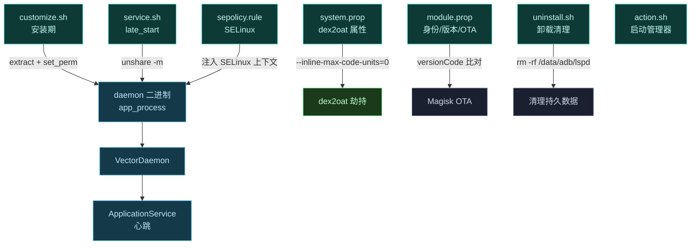
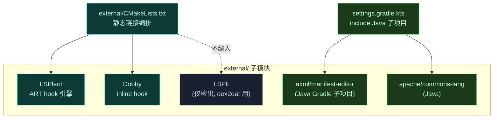

# 📐 Magisk 模块规范 — 子模块约定

Vector 作为 Magisk/KernelSU 模块分发，遵循 Magisk 模块规范。本文梳理 Vector 实际用到的规范要素与子模块约定。

> 📂 [`zygisk/module/`](https://github.com/android-security-engineer/Vector-skills/blob/master/zygisk/module/)（模块内容目录）
> 📂 [`magisk-loader/update/`](https://github.com/android-security-engineer/Vector-skills/blob/master/magisk-loader/update/)（更新通道元数据）
> 📦 magisk-loader 模块 · 规范

## 模块文件清单

Vector 模块 zip 内含以下规范文件：

| 文件 | 规范要求 | Vector 实现 |
| :--- | :--- | :--- |
| `module.prop` | 必需，模块身份 | 见 [module-prop](../magisk-loader/module-prop) |
| `customize.sh` | 可选，安装脚本 | 见 [customize-sh](../magisk-loader/customize-sh) |
| `service.sh` | 可选，late_start service | 见 [service-sh](../magisk-loader/service-sh) |
| `sepolicy.rule` | 可选，SELinux 策略 | 见 [sepolicy-rule](../magisk-loader/sepolicy-rule) |
| `system.prop` | 可选，系统属性 | `dalvik.vm.dex2oat-flags=--inline-max-code-units=0` |
| `action.sh` | 可选，Magisk Manager 动作按钮 | 启动管理器 |
| `uninstall.sh` | 可选，卸载清理 | `rm -rf /data/adb/lspd` |
| `post-fs-data.sh` | 可选，早期阶段 | Vector 不使用（见 [post-fs-data-sh](../magisk-loader/post-fs-data-sh)） |

### 模块文件依赖关系



## module.prop 规范

```properties
id=zygisk_vector
name=Vector
version=${versionName} (${versionCode})
versionCode=${versionCode}
author=JingMatrix
description=...
updateJson=https://.../update.json
```

关键约定：

- `id` 必须仅含小写字母/数字/下划线，对应安装目录 `/data/adb/modules/zygisk_vector`；
- `versionCode` 必须为整数，用于升级判定；
- `updateJson` 存在时启用 Magisk Manager 的 OTA 检查。

## 安装脚本约定

`customize.sh` 可使用 Magisk 注入的环境变量与函数：

| 变量/函数 | Vector 用法 |
| :--- | :--- |
| `SKIPUNZIP=1` | 关闭自动解压，手动 `extract` 并校验 sha256 |
| `$ARCH` / `$IS64BIT` | ABI 选择 |
| `$API` | Android SDK 版本，决定是否部署 dex2oat |
| `$MODPATH` / `$TMPDIR` | 模块安装目录与临时目录 |
| `ui_print` | 进度输出 |
| `abort` | 失败中止 |
| `set_perm` / `set_perm_recursive` | 权限与 SELinux 上下文 |
| `grep_prop` | 读取 `.prop` 文件字段 |

## 子模块约定

Vector 的 `external/` 是 git 子模块集合，约定如下：

- 子模块指向 JingMatrix 维护的 fork（LSPlant、Dobby、LSPlt、ManifestEditor），确保与 Vector 的 API 契约一致；
- [`external/CMakeLists.txt`](https://github.com/android-security-engineer/Vector-skills/blob/master/external/CMakeLists.txt) 统一编排 native 子模块的编译，静态链接（`LSPLANT_BUILD_SHARED=OFF`、`FMT_INSTALL=OFF`）；
- LSPlt 仅作项目便利检出，不编入 `external` 的 C++ 库本身（由 `dex2oat` 子项目使用）；
- Java 子模块（apache/commons-lang、axml/manifest-editor）作为独立 Gradle 子项目在 [`settings.gradle.kts`](https://github.com/android-security-engineer/Vector-skills/blob/master/settings.gradle.kts) 中 include。

### 子模块编译拓扑



> 检出要求：`git submodule update --init --recursive`，否则构建失败。

## 更新通道约定

`updateJson` 指向的 JSON 必须包含 `version`、`versionCode`、`zipUrl`、`changelog` 四字段。Vector 的更新元数据维护在 `magisk-loader/update/zygisk.json`，与 `module.prop` 的 `updateJson` URL 对应。

## 卸载约定

`uninstall.sh` 清理 `/data/adb/lspd` 持久数据目录。模块本体 `/data/adb/modules/zygisk_vector` 由 Magisk 自动删除，无需脚本处理。

## 相关

- 各脚本详解见 [magisk-loader 目录](../../modules/magisk-loader)
- 依赖清单见 [reference/modules/external](../../modules/external)
- 更新与 OTA 架构见 [architecture/update](../../../architecture/update)
