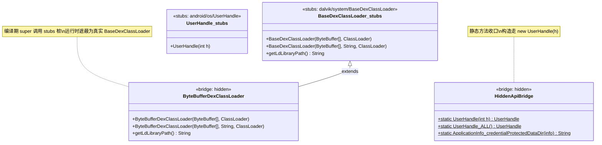
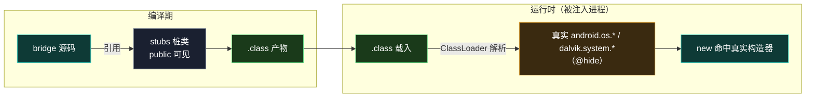

# 🏗️ HiddenApiBridge · 对象构造桥

> 📂 [`hiddenapi/bridge/src/main/java/hidden/HiddenApiBridge.java`](https://github.com/android-security-engineer/Vector-skills/blob/master/hiddenapi/bridge/src/main/java/hidden/HiddenApiBridge.java)
> 📂 [`hiddenapi/bridge/src/main/java/hidden/ByteBufferDexClassLoader.java`](https://github.com/android-security-engineer/Vector-skills/blob/master/hiddenapi/bridge/src/main/java/hidden/ByteBufferDexClassLoader.java)
> 🟦 hiddenapi · bridge · 包：`hidden`

## 本篇范围

本篇梳理 `hiddenapi/bridge` 子模块中**构造 hidden 类实例**的桥方法与类。构造 hidden 对象的途径有二：通过 `HiddenApiBridge` 的具名构造桥（如 `UserHandle(int)`），或直接使用继承 hidden 基类的桥类（如 `ByteBufferDexClassLoader`）。

## UserHandle 构造桥

`UserHandle` 的 `public UserHandle(int h)` 构造器在 SDK 中未导出（`UserHandle` 实例通常通过常量 `ALL`/`CURRENT` 获取，但 Vector 需要按任意 userId 构造）。[`HiddenApiBridge`](https://github.com/android-security-engineer/Vector-skills/blob/master/hiddenapi/bridge/src/main/java/hidden/HiddenApiBridge.java#L88-L90) 把它收口为静态方法：

```java
public static UserHandle UserHandle(int h) {
    return new UserHandle(h);                               // hidden 构造器，仅一个 int 参数
}
```

调用方写 `HiddenApiBridge.UserHandle(userId)` 而非 `new UserHandle(userId)`——后者因构造器包级可见在普通源码中无法编译。stubs 子模块的 `android/os/UserHandle.java` 声明了 `public UserHandle(int h)` 桩构造器，使 bridge 编译通过；运行时桩类被真实 `android.os.UserHandle` 遮蔽，`new` 命中真实构造器。

## ByteBufferDexClassLoader

`public class ByteBufferDexClassLoader extends BaseDexClassLoader` —— 直接从内存 `ByteBuffer` 加载 DEX 的隐藏类加载器，无需落盘。它不是 `HiddenApiBridge` 的静态方法，而是一个**继承 hidden 基类的桥类**（[`ByteBufferDexClassLoader.java`](https://github.com/android-security-engineer/Vector-skills/blob/master/hiddenapi/bridge/src/main/java/hidden/ByteBufferDexClassLoader.java)）。

```java
public ByteBufferDexClassLoader(ByteBuffer[] dexFiles, ClassLoader parent)

public ByteBufferDexClassLoader(ByteBuffer[] dexFiles, String librarySearchPath, ClassLoader parent)

public String getLdLibraryPath()
```

继承的 `BaseDexClassLoader`（stubs: `dalvik/system/BaseDexClassLoader.java`）其构造接受 `ByteBuffer[]`，是 SDK 未暴露的重载。Vector 用它把 Daemon 预加载到 `SharedMemory` 的 DEX 直接从内存装载，避免临时文件与解密开销。`getLdLibraryPath` 透传父类方法，用于查询 native 库搜索路径。

## 构造桥总览

| 桥 | 目标 | 参数 | 用途 |
| :--- | :--- | :--- | :--- |
| [`HiddenApiBridge.UserHandle(int)`](https://github.com/android-security-engineer/Vector-skills/blob/master/hiddenapi/bridge/src/main/java/hidden/HiddenApiBridge.java#L88-L90) | `new UserHandle(int)` | `int h` | 按任意 userId 构造 UserHandle |
| [`new ByteBufferDexClassLoader(...)`](https://github.com/android-security-engineer/Vector-skills/blob/master/hiddenapi/bridge/src/main/java/hidden/ByteBufferDexClassLoader.java) | hidden `BaseDexClassLoader` 子类 | `ByteBuffer[]` / `String` / `ClassLoader` | 从内存加载 DEX |

## 类继承与 stubs 协作



### 编译期 vs 运行时遮蔽



## 关于 newInstance 系列

> ⚠️ 任务描述提及的 `HiddenApiBridge.newInstance` 系列（"绕过访问检查构造对象"的通用入口）**未在当前源码中直接找到**。`HiddenApiBridge.java` 中不存在泛化的 `newInstance(Class, args...)` 反射式构造入口——构造 hidden 对象的能力仅以**具名构造桥**（`UserHandle(int)`）和**继承 hidden 基类的桥类**（`ByteBufferDexClassLoader`）两种形式提供。通用反射构造仍由 `XposedHelpers.newInstance(Class, Object...)` 承担（内部走 `Constructor.newInstance` + `setAccessible(true)`），见 legacy 模块。本篇只记录真实存在的构造桥。

## 两种构造模式对比

```mermaid
flowchart TD
    subgraph 具名桥 ["模式 A：HiddenApiBridge.UserHandle(int)"]
        A1["HiddenApiBridge.UserHandle(h)"] --> A2["new UserHandle(h)"]
        A2 --> A3["运行时真实 UserHandle.<init>"]
    end

    subgraph 继承桥 ["模式 B：ByteBufferDexClassLoader"]
        B1["new ByteBufferDexClassLoader(bufs,parent)"] --> B2["super(bufs,parent)<br/>→ BaseDexClassLoader"]
        B2 --> B3["运行时真实 BaseDexClassLoader.<init>"]
    end

    C["编译期均依赖 stubs"] --> A2
    C --> B2

    classDef vec fill:#0e3a36,stroke:#3dd8c8,color:#fff
    classDef hot fill:#3a2a10,stroke:#e8a838,color:#fff
    classDef plain fill:#1a2030,stroke:#6b7689,color:#fff
    class A1,A2,B1,B2 class vec
    class A3,B3 class vec
    class C class plain
```

模式 A 适合"只需调用某个 hidden 构造器"的场景，零状态、一次性。模式 B 适合"需要扩展 hidden 类行为"的场景，桥类本身是可实例化的子类，可添加自定义方法（如 Daemon 内存加载流程中复用 `getLdLibraryPath`）。

## 相关

- [bridge-methods-invoke · 方法调用桥](./bridge-methods-invoke)
- [bridge-methods-field · 字段访问桥](./bridge-methods-field)
- [bridge-stubs-bridge · 桩与桥协作](./bridge-stubs-bridge)
- [bridge 子模块总览](../../hiddenapi/bridge)
- [XposedHelpers · newInstance](../legacy/xposed-helpers-extra)
