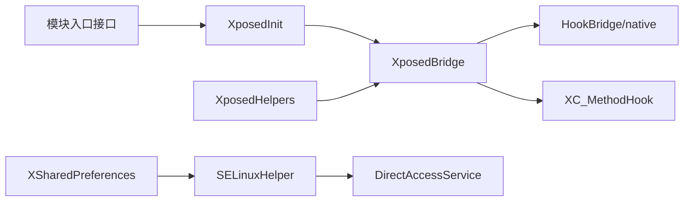
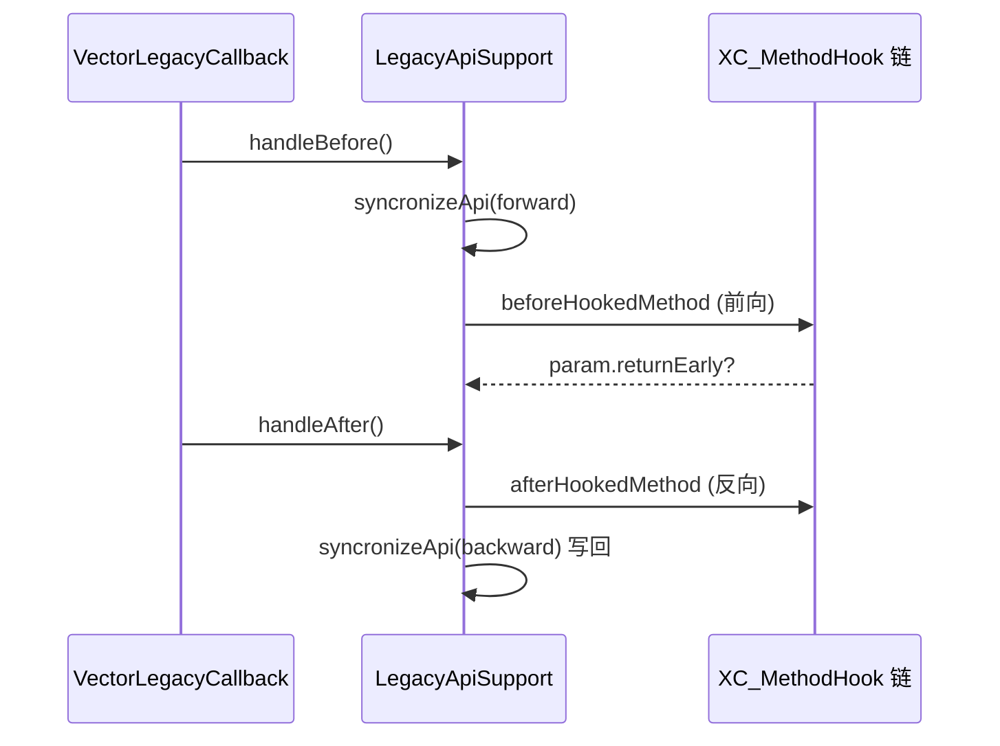

# legacy · API 根包

> 📂 `legacy/src/main/java/de/robv/android/xposed/`
> 🟦 经典 Xposed Java API 中枢

## 包职责

实现经典 `de.robv.android.xposed` 命名空间的**核心 API 表面**：方法 Hook 注册与卸载、反射工具集、模块加载、跨进程偏好读取、回调基类与各模块入口接口。所有 API 在内部路由到现代 native ART hook 引擎（`HookBridge`、`VectorNativeHooker`），让存量 Xposed 模块无需改动即可运行。



## 类清单

| 类 | 说明 |
| :--- | :--- |
| [`XposedBridge`](#xposedbridge) | API 中枢：Hook 注册/卸载、原方法调用、日志、资源初始化 |
| [`XposedHelpers`](#xposedhelpers) | 反射工具：类/方法/字段查找、Hook 快捷封装、附加字段 |
| [`XposedInit`](#xposedinit) | 模块加载：解析 `xposed_init`/`native_init`、资源 Hook 安装 |
| [`XSharedPreferences`](#xsharedpreferences) | 跨进程只读偏好读取，支持文件监听 |
| [`XC_MethodHook`](#xc_methodhook) | before/after 回调基类，承载 `MethodHookParam` 与 `Unhook` |
| [`XC_MethodReplacement`](#xc_methodreplacement) | 完全替换方法实现的回调基类 |
| [`IXposedMod`](#ixposedmod) | 模块标记接口（包级私有，不可直接实现） |
| [`IXposedHookLoadPackage`](#ixposedhookloadpackage) | 应用加载入口 |
| [`IXposedHookZygoteInit`](#ixposedhookzygoteinit) | Zygote 启动入口 |
| [`IXposedHookInitPackageResources`](#ixposedhookinitpackageresources) | 资源初始化入口 |
| [`IXposedHookCmdInit`](#ixposedhookcmdinit) | 命令行工具入口（已废弃） |
| [`SELinuxHelper`](#selinuxhelper) | SELinux 访问门面 |

---

## XposedBridge

`public final class XposedBridge` — Xposed 的**中央逻辑类**，包含初始化与 native 侧回调，并提供添加 Hook 的方法。

### 关键常量与字段

| 字段 | 类型 | 含义 |
| :--- | :--- | :--- |
| `BOOTCLASSLOADER` | `ClassLoader` | 系统类加载器，用于定位 Android 框架类（应用类不可用） |
| `TAG` | `String` | 日志标签 `"VectorLegacyBridge"` |
| `XPOSED_BRIDGE_VERSION` | `int` | 已废弃，改用 `getXposedVersion()` |
| `sLoadedPackageCallbacks` | `CopyOnWriteArraySet<XC_LoadPackage>` | 内置 loadPackage 回调集合 |
| `sInitPackageResourcesCallbacks` | `CopyOnWriteArraySet<XC_InitPackageResources>` | 内置资源初始化回调集合 |
| `dummyClassLoader` | `volatile ClassLoader` | 资源 Hook 用的伪类加载器 |

### 主要方法

```java
// 返回已安装的 Xposed 框架版本（映射到 XposedInterface.LIB_API）
public static int getXposedVersion()

// 写入模块日志（仅用于错误日志，勿刷屏）
public synchronized static void log(String text)
public synchronized static void log(Throwable t)

// 反优化方法以避免被调用方被内联
public static void deoptimizeMethod(Member deoptimizedMethod)

// Hook 任意方法/构造器，返回可卸载句柄
public static XC_MethodHook.Unhook hookMethod(Member hookMethod, XC_MethodHook callback)

// 已废弃，改用 Unhook.unhook()
@Deprecated
public static void unhookMethod(Member hookMethod, XC_MethodHook callback)

// Hook 类中所有同名方法 / 所有构造器
public static Set<XC_MethodHook.Unhook> hookAllMethods(Class<?> hookClass, String methodName, XC_MethodHook callback)
public static Set<XC_MethodHook.Unhook> hookAllConstructors(Class<?> hookClass, XC_MethodHook callback)

// 注册 loadPackage / 资源初始化回调（通常由 IXposed* 接口自动注册）
public static void hookLoadPackage(XC_LoadPackage callback)
public static void hookInitPackageResources(XC_InitPackageResources callback)

// 调用被 Hook 拦截前的原方法（绕过访问检查）
public static Object invokeOriginalMethod(Member method, Object thisObject, Object[] args) throws Throwable

// 初始化资源 Hook（构建伪类加载器让 XResources 生效）
public static void initXResources()
```

`hookMethod` 会拒绝抽象方法、`Method.invoke` 自身、以及与 `XposedBridge` 同类加载器的内部方法；实际通过 `HookBridge.hookMethod(false, executable, VectorNativeHooker.class, priority, callback)` 落到 native 引擎。

### 内部类

#### `CopyOnWriteSortedSet<E>`

写时复制的有序快照集，`add`/`remove` 同步、`getSnapshot` 无锁返回数组快照，供回调链遍历使用。

#### `LegacyApiSupport<T extends Executable>`

**legacy↔现代翻译器**。把 native 侧 `VectorLegacyCallback` 的状态同步到 `MethodHookParam`，按顺序执行 before（前向）/after（反向），异常时恢复缓存结果。仅在 `param.returnEarly` 时才把 result/throwable 写回 native callback。



---

## XposedHelpers

`public final class XposedHelpers` — 简化 Hook 与反射调用的**静态工具集**：类/方法/构造器/字段查找、字段读写、方法调用、实例化、附加字段、方法深度计数。

### 结构化反射缓存

核心是私有抽象类 `MemberCacheKey`，**以对象身份而非字符串** 作为哈希键，避免字符串拼接抹掉 `HashMap` 性能优势。三个子键：

| 子键 | 缓存目标 | 字段 |
| :--- | :--- | :--- |
| `MemberCacheKey.Field` | `Optional<Field>` | `clazz`, `name` |
| `MemberCacheKey.Method` | `Optional<Method>` | `clazz`, `name`, `parameters`, `isExact` |
| `MemberCacheKey.Constructor` | `Optional<Constructor<?>>` | `clazz`, `parameters`, `isExact` |

`isExact` 区分精确匹配与最佳匹配（best match 会考虑继承与可赋值性）。

### 类查找

```java
public static Class<?> findClass(String className, ClassLoader classLoader) throws ClassNotFoundError
public static Class<?> findClassIfExists(String className, ClassLoader classLoader)
```

支持 `java.lang.String`、`...[]`（数组）、内层类 `.` 或 `$` 分隔。`classLoader == null` 时回退到 `BOOTCLASSLOADER`。

### 方法查找与 Hook

```java
// 精确查找
public static Method findMethodExact(Class<?> clazz, String methodName, Class<?>... parameterTypes)
public static Method findMethodExact(String className, ClassLoader classLoader, String methodName, Object... parameterTypes)
public static Method findMethodExactIfExists(...)

// 最佳匹配（先试精确，再按可赋值性选最优，考虑继承）
public static Method findMethodBestMatch(Class<?> clazz, String methodName, Class<?>... parameterTypes)
public static Method findMethodBestMatch(Class<?> clazz, String methodName, Object... args)
public static Method findMethodBestMatch(Class<?> clazz, String methodName, Class<?>[] parameterTypes, Object[] args)

// 按参数类型枚举
public static Method[] findMethodsByExactParameters(Class<?> clazz, Class<?> returnType, Class<?>... parameterTypes)

// 一步查找并 Hook（末位参数须为 XC_MethodHook）
public static XC_MethodHook.Unhook findAndHookMethod(Class<?> clazz, String methodName, Object... parameterTypesAndCallback)
public static XC_MethodHook.Unhook findAndHookMethod(String className, ClassLoader classLoader, String methodName, Object... parameterTypesAndCallback)
```

参数类型可传 `Class` 或全限定类名字符串；基本类型用 `int.class` 而非 `Integer.class`。

### 构造器查找与 Hook

```java
public static Constructor<?> findConstructorExact(Class<?> clazz, Class<?>... parameterTypes)
public static Constructor<?> findConstructorExact(String className, ClassLoader classLoader, Object... parameterTypes)
public static Constructor<?> findConstructorExactIfExists(...)
public static Constructor<?> findConstructorBestMatch(Class<?> clazz, Class<?>... parameterTypes)
public static Constructor<?> findConstructorBestMatch(Class<?> clazz, Object... args)
public static XC_MethodHook.Unhook findAndHookConstructor(Class<?> clazz, Object... parameterTypesAndCallback)
public static XC_MethodHook.Unhook findAndHookConstructor(String className, ClassLoader classLoader, Object... parameterTypesAndCallback)
```

### 字段读写

`findField` 递归向上查找（含父类，止于 `Object`）。提供全套类型化访问器，模式为 `set/get` + `Static?` + `类型` + `Field`：

```java
public static void setObjectField(Object obj, String fieldName, Object value)
public static boolean getBooleanField(Object obj, String fieldName)
public static void setStaticIntField(Class<?> clazz, String fieldName, int value)
public static long getStaticLongField(Class<?> clazz, String fieldName)
// ... boolean/byte/char/double/float/int/long/short × instance/static × get/set

// 返回内部类的外层 this 引用
public static Object getSurroundingThis(Object obj)

// 按类型找首个字段（对 Proguard 类有用）
public static Field findFirstFieldByExactType(Class<?> clazz, Class<?> type)
```

### 方法调用与实例化

```java
public static Object callMethod(Object obj, String methodName, Object... args)
public static Object callMethod(Object obj, String methodName, Class<?>[] parameterTypes, Object... args)
public static Object callStaticMethod(Class<?> clazz, String methodName, Object... args)
public static Object callStaticMethod(Class<?> clazz, String methodName, Class<?>[] parameterTypes, Object... args)
public static Object newInstance(Class<?> clazz, Object... args)
public static Object newInstance(Class<?> clazz, Class<?>[] parameterTypes, Object... args)
```

均经 `findMethodBestMatch` / `findConstructorBestMatch` 解析；目标异常被包装为 `InvocationTargetError`，实例化失败包装为 `InstantiationError`。

### 附加字段（模拟动态字段）

```java
public static Object setAdditionalInstanceField(Object obj, String key, Object value)
public static Object getAdditionalInstanceField(Object obj, String key)
public static Object removeAdditionalInstanceField(Object obj, String key)
// 静态版：以 obj.getClass() 或直接传 Class 作为载体
public static Object setAdditionalStaticField(Object obj, String key, Object value)
public static Object setAdditionalStaticField(Class<?> clazz, String key, Object value)
// get/remove 同理
```

底层用 `WeakHashMap<Object, HashMap<String, Object>>`，对象被回收时附加数据自动清理。

### 方法深度计数

```java
public static int incrementMethodDepth(String method)
public static int decrementMethodDepth(String method)
public static int getMethodDepth(String method)
```

基于 `ThreadLocal<AtomicInteger>`，用于递归方法仅在最外层生效（如 drawable 替换只加载一次）。`method` 名应加模块专属前缀。

### 工具与异常

```java
public static byte[] assetAsByteArray(Resources res, String path) throws IOException
public static String getMD5Sum(String file) throws IOException
public static Class<?>[] getParameterTypes(Object... args)
public static Class<?>[] getClassesAsArray(Class<?>... clazzes)
public static int getFirstParameterIndexByType(Member method, Class<?> type)
public static int getParameterIndexByType(Member method, Class<?> type)
```

内部异常类型：

| 异常 | 说明 |
| :--- | :--- |
| `ClassNotFoundError extends Error` | 类加载失败，调用方无需显式捕获 |
| `InvocationTargetError extends Error` | 方法调用目标抛出的异常包装 |

---

## XposedInit

`public final class XposedInit` — 模块加载与资源 Hook 安装的**引导器**。

### 关键状态

| 字段 | 含义 |
| :--- | :--- |
| `startsSystemServer` | 当前进程是否启动 system_server |
| `disableResources` | 资源 Hook 是否被禁用（失败时置 true） |
| `resourceInit` | 资源初始化的 CAS 守卫，保证只执行一次 |
| `loadedModules` | 已加载模块映射（legacy 模块带 apk 路径，现代模块为空 Optional） |
| `loadedPackagesInProcess` | 进程内已加载包名集合 |

### 资源 Hook 安装

```java
public static void hookResources() throws Throwable
```

流程：调用 `VectorDeopter.deoptResourceMethods()` 反优化资源相关方法 → `ResourcesHook.initXResourcesNative()` 初始化 native → Hook `ApplicationPackageManager.getResourcesForApplication` 记录包名→资源目录映射 → Hook `ResourcesManager` 的 `createResources`/`createResourcesForActivity`/`getOrCreateResources`（按 SDK 版本选择），把返回的 `Resources` 替换为 `XResources` 子类并触发 `handleInitPackageResources` → Hook `TypedArray.obtain` 返回 `XResources.XTypedArray` → 替换系统 `Resources.mSystem`。

`cloneToXResources` 是核心桥接：构造 `XResources`、设置 `ResourcesImpl`、首次加载时触发 `XC_InitPackageResources` 回调链。

### 模块加载

```java
public static void loadLegacyModules()           // 加载 legacy 模块（读 xposed_init）
public static void loadModules(ActivityThread at) // 加载现代模块
```

`loadLegacyModules` 从 `VectorServiceClient` 取模块列表，逐个 `loadModule`：用 `VectorModuleClassLoader.loadApk` 加载 APK（含预加载 dex 与 native 库路径），校验 Xposed API 类不来自模块自身 ClassLoader，读 `assets/native_init` 记录 native 入口，再 `initModule` 实例化每个模块类并按接口分发到 `initZygote` / `hookLoadPackage` / `hookInitPackageResources`。

`loadModules` 走现代 `VectorModuleManager`，加载后从 `ActivityThread.mPackages` 移除该包名以触发重载。

### 内部方法

```java
private static void initNativeModule(List<String> moduleLibraryNames)  // 记录 native so 入口
private static boolean initModule(ClassLoader mcl, String apk, List<String> moduleClassNames)
private static boolean loadModule(String name, String apk, PreLoadedApk file)
```

---

## XSharedPreferences

`public final class XSharedPreferences implements SharedPreferences` — **跨进程只读偏好读取器**，行为类似 AOSP `SharedPreferencesImpl`，但只读、无 listener-side-effect，并对所有 ROM 兼容。

### 构造

```java
public XSharedPreferences(File prefFile)
public XSharedPreferences(String packageName)                                   // 默认 <pkg>_preferences
public XSharedPreferences(String packageName, String prefFileName)              // 自定义文件名（不含 .xml）
```

`(packageName, prefFileName)` 构造会查 `XposedInit.getLoadedModules()` 元数据：若模块声明 `xposedminversion > 92` 或 `xposedsharedprefs`，文件路径取自 Daemon 提供的安全区 `getPrefsPath(packageName)`；否则回退到 `/data/data/<pkg>/shared_prefs/<file>.xml`。

### 公开方法

```java
public boolean makeWorldReadable()      // 尝试设为全局可读（仅 root + SELinux 禁用时有效）
public File getFile()                   // 底层文件（可能不可直接访问）
public synchronized void reload()       // 文件变更时重新加载
public synchronized boolean hasFileChanged()  // 检查 mtime/size 是否变化
```

`SharedPreferences` 标准读方法：`getAll/getString/getStringSet/getInt/getLong/getFloat/getBoolean/contains`，均内部 `awaitLoadedLocked()` 等待后台加载线程完成。`edit()` 永远抛 `UnsupportedOperationException`。

### 文件监听

`registerOnSharedPreferenceChangeListener` 注册基于 `WatchService` 的文件监听：注册时 `tryRegisterWatcher` 在父目录登记 `ENTRY_CREATE/MODIFY/DELETE`，后台守护线程 `sWatcherDaemon` 检测事件，对 `.bak` 备份与真实文件都响应（避免竞态），通过 `PrefsData.hasChanged()`（先比 size 再比 MD5）确认真实变更后回调 listener。回调中 `key` 永远为 `null`（无法定位具体键）。

### 内部类

`PrefsData` — 持有 `XSharedPreferences` 引用及上次 size/hash，`hasChanged()` 先比文件 size，size 不变再比 MD5 哈希，避免无谓哈希计算。

---

## XC_MethodHook

`public abstract class XC_MethodHook extends XCallback` — 方法 Hook 回调基类。模块通常以匿名子类重写 `beforeHookedMethod` 和/或 `afterHookedMethod`。

### 构造

```java
public XC_MethodHook()          // 默认优先级
public XC_MethodHook(int priority)  // 指定优先级（after 以反序调用）
```

### 回调方法

```java
protected void beforeHookedMethod(MethodHookParam<?> param) throws Throwable  // 原方法调用前
protected void afterHookedMethod(MethodHookParam<?> param) throws Throwable   // 原方法调用后
public void callBeforeHookedMethod(MethodHookParam<?> param) throws Throwable // 内部桥接
public void callAfterHookedMethod(MethodHookParam<?> param) throws Throwable
```

### 内部类 MethodHookParam

`public static final class MethodHookParam<T extends Executable> extends XCallback.Param` — 方法调用信息载体。

| 字段 | 类型 | 含义 |
| :--- | :--- | :--- |
| `method` | `Member` | 被 Hook 的方法/构造器 |
| `thisObject` | `Object` | 实例方法的 this，静态方法为 null |
| `args` | `Object[]` | 调用参数 |
| `result` | `Object` | 方法结果 |
| `throwable` | `Throwable` | 方法抛出的异常 |
| `returnEarly` | `boolean` | 是否跳过原方法 |

```java
public Object getResult()
public void setResult(Object result)        // before 中调用会跳过原方法
public Throwable getThrowable()
public boolean hasThrowable()
public void setThrowable(Throwable t)       // before 中调用会跳过原方法
public Object getResultOrThrowable() throws Throwable  // 有异常则抛出
```

### 内部类 Unhook

`public class Unhook implements IXUnhook<XC_MethodHook>` — Hook 卸载句柄，`hookMethod` 返回。

```java
public Member getHookedMethod()       // 被 Hook 的方法
public XC_MethodHook getCallback()
public void unhook()                  // 卸载
```

---

## XC_MethodReplacement

`public abstract class XC_MethodReplacement extends XC_MethodHook` — **完全替换**原方法的回调基类。把 before/after 模型折叠为单一 `replaceHookedMethod`。

```java
protected abstract Object replaceHookedMethod(MethodHookParam param) throws Throwable
```

`beforeHookedMethod` 被 final 化为：调用 `replaceHookedMethod`，结果经 `setResult`、异常经 `setThrowable`；`afterHookedMethod` 为空。

### 预定义实例

| 实例/工厂 | 说明 |
| :--- | :--- |
| `DO_NOTHING` | 最高优先级（`PRIORITY_HIGHEST * 2`），返回 null 跳过原方法 |
| `returnConstant(result)` | 始终返回常量值 |
| `returnConstant(priority, result)` | 指定优先级的常量返回 |

---

## IXposedMod

```java
/* package */ interface IXposedMod {}
```

**模块标记接口**（包级私有）。不可直接实现——模块应实现其子接口之一（`IXposedHookLoadPackage` 等）。

---

## IXposedHookLoadPackage

`public interface IXposedHookLoadPackage extends IXposedMod` — 应用加载入口。在 `Application.onCreate` 之前很早触发，模块在此设置应用专属 Hook。

```java
void handleLoadPackage(LoadPackageParam lpparam) throws Throwable;
```

内部 `Wrapper extends XC_LoadPackage` 把接口实例适配为回调对象，由 `XposedInit.initModule` 自动注册到 `XposedBridge.hookLoadPackage`。

---

## IXposedHookZygoteInit

`public interface IXposedHookZygoteInit extends IXposedMod` — Zygote 启动入口。仅 Android 框架/系统类可用，`findAndHookMethod` 的 classLoader 传 `null`。

```java
void initZygote(StartupParam startupParam) throws Throwable;
```

`StartupParam` 字段：

| 字段 | 含义 |
| :--- | :--- |
| `modulePath` | 模块 APK 路径 |
| `startsSystemServer` | 32 位恒 true；64 位仅启动 system_server 的主进程为 true |

---

## IXposedHookInitPackageResources

`public interface IXposedHookInitPackageResources extends IXposedMod` — 资源初始化入口。在应用资源初始化时触发，可调用 `XResources` 的替换方法。

```java
void handleInitPackageResources(InitPackageResourcesParam resparam) throws Throwable;
```

内部 `Wrapper extends XC_InitPackageResources` 适配为回调；`XposedInit` 在注册前会先调用 `hookResources()` 安装资源 Hook。

---

## IXposedHookCmdInit

`public interface IXposedHookCmdInit extends IXposedMod` — 命令行工具（如 `pm`）初始化入口。**已废弃**：Xposed 不再 Hook 命令行工具，不应再实现。

```java
void initCmdApp(StartupParam startupParam) throws Throwable;
```

`StartupParam` 字段：`modulePath`（APK 路径）、`startClassName`（工具类名）。

---

## SELinuxHelper

`public final class SELinuxHelper` — SELinux 复杂性的**门面**。

```java
public static boolean isSELinuxEnabled()   // 恒 true（Vector 始终启用）
public static boolean isSELinuxEnforced()  // 恒 true（始终 enforcing）
public static String getContext()          // 当前进程安全上下文（实现返回 null）
public static BaseService getAppDataFileService()  // 访问 /data/data/* 的服务
```

`getAppDataFileService()` 返回静态 `DirectAccessService` 实例（在 Zygote 进程中获取的结果**不要**跨进程复用）。

## 相关

- [legacy 模块总览](../modules/legacy)
- [legacy · callbacks 包](./legacy-callbacks)（`XC_LoadPackage`、`XCallback` 等）
- [legacy · services 包](./legacy-services)（`BaseService`、`DirectAccessService`）
- [legacy · resources 包](./legacy-resources)（`XResources`）
- [legacy · impl 包](./legacy-impl)（`LegacyDelegateImpl`、`Startup`）
- 架构背景见 [架构 · Legacy 兼容层](../../architecture/legacy)
