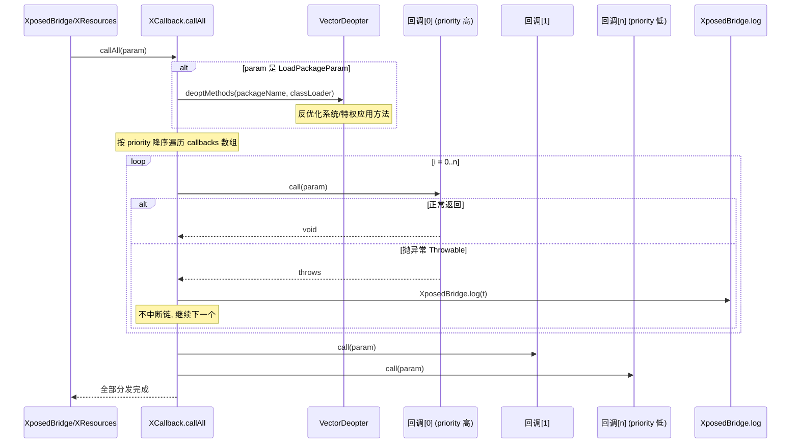

# legacy · callbacks 包

> 📂 [`legacy/src/main/java/de/robv/android/xposed/callbacks/`](https://github.com/android-security-engineer/Vector-skills/blob/master/legacy/src/main/java/de/robv/android/xposed/callbacks/)
> 🟦 Xposed 回调基类与生命周期参数

## 包职责

定义经典 Xposed 的**回调抽象基类**与对应参数对象：应用加载、资源初始化、布局填充。所有回调继承 `XCallback`，按 `priority` 排序执行；参数对象携带本次调用的上下文，并支持跨回调的临时数据存储。

## 类协作

[`XCallback`](https://github.com/android-security-engineer/Vector-skills/blob/master/legacy/src/main/java/de/robv/android/xposed/callbacks/XCallback.java) 是抽象基类，三个子类各自承载一种生命周期回调，并把具体参数对象作为内部静态类。`XC_LoadPackage`/`XC_InitPackageResources` 的参数从 `CopyOnWriteArraySet` 转数组，`XC_LayoutInflated` 的参数从 `CopyOnWriteSortedSet`（按 `compareTo` 排序）取快照。`callAll` 静态方法是统一分发入口，对 `LoadPackageParam` 会先调 `VectorDeopter.deoptMethods` 反优化。

```mermaid
classDiagram
    direction LR
    class XCallback {
        <<abstract>>
        +priority: int
        +PRIORITY_DEFAULT$ = 50
        +PRIORITY_LOWEST$ = -10000
        +PRIORITY_HIGHEST$ = 10000
        +call(Param)*
        +callAll(Param)$
    }
    class XCallback_Param {
        <<abstract>>
        +callbacks: XCallback[]
        +getExtra() Bundle
        +getObjectExtra(String) Object
        +setObjectExtra(String, Object)
    }
    class IXUnhook~T~ {
        <<interface>>
        +getCallback() T
        +unhook()
    }
    class XC_LoadPackage {
        <<abstract>>
        +handleLoadPackage(LoadPackageParam)*
        #call(Param)
    }
    class XC_LoadPackage_LoadPackageParam {
        +packageName: String
        +processName: String
        +classLoader: ClassLoader
        +appInfo: ApplicationInfo
        +isFirstApplication: boolean
    }
    class XC_InitPackageResources {
        <<abstract>>
        +handleInitPackageResources(InitPackageResourcesParam)*
        #call(Param)
    }
    class XC_InitPackageResources_Param {
        +packageName: String
        +res: XResources
    }
    class XC_LayoutInflated {
        <<abstract>>
        +compareTo(XC_LayoutInflated) int
        +handleLayoutInflated(LayoutInflatedParam)*
    }
    class XC_LayoutInflated_Param {
        +view: View
        +resNames: ResourceNames
        +variant: String
        +res: XResources
    }
    class XC_LayoutInflated_Unhook {
        -resDir: String
        -id: int
        +getId() int
        +unhook()
    }
    class VectorDeopter {
        <<impl/core>>
        +deoptMethods(pkg, cl)$
    }
    class IXposedHookLoadPackage {
        <<interface>>
    }
    class IXposedHookInitPackageResources {
        <<interface>>
    }
    class Comparable {
        <<java.lang>>
    }

    XC_LoadPackage --|> XCallback : extends
    XC_InitPackageResources --|> XCallback : extends
    XC_LayoutInflated --|> XCallback : extends
    XC_LoadPackage ..|> IXposedHookLoadPackage : implements
    XC_InitPackageResources ..|> IXposedHookInitPackageResources : implements
    XC_LayoutInflated --|> Comparable : implements
    XC_LoadPackage_LoadPackageParam --|> XCallback_Param : extends
    XC_InitPackageResources_Param --|> XCallback_Param : extends
    XC_LayoutInflated_Param --|> XCallback_Param : extends
    XC_LayoutInflated_Unhook ..|> IXUnhook : implements
    XCallback ..> XCallback_Param : callAll 分发
    XCallback ..> VectorDeopter : callAll(LoadPackageParam) 先反优化

    classDef abstract fill:#0e3a36,color:#3dd8c8,stroke:#3dd8c8
    classDef param fill:#143a4a,color:#fff,stroke:#4fb3d8
    classDef leaf fill:#1a3a1a,color:#fff,stroke:#5cd980
    class XCallback,XC_LoadPackage,XC_InitPackageResources,XC_LayoutInflated,XCallback_Param abstract
    class XC_LoadPackage_LoadPackageParam,XC_InitPackageResources_Param,XC_LayoutInflated_Param,XC_LayoutInflated_Unhook,VectorDeopter leaf
```

`XCallback.callAll` 的分发与异常隔离时序：



## 类清单

| 类 | 说明 |
| :--- | :--- |
| [`XCallback`](#xcallback) | 所有回调的抽象基类，管理优先级与参数容器 |
| [`IXUnhook`](#ixunhook) | 通用卸载接口 |
| [`XC_LoadPackage`](#xc_loadpackage) | 应用加载回调，承载 `LoadPackageParam` |
| [`XC_InitPackageResources`](#xc_initpackageresources) | 资源初始化回调，承载 `InitPackageResourcesParam` |
| [`XC_LayoutInflated`](#xc_layoutinflated) | 布局填充回调，承载 `LayoutInflatedParam` 与 `Unhook` |

---

## XCallback

[`XCallback.java`](https://github.com/android-security-engineer/Vector-skills/blob/master/legacy/src/main/java/de/robv/android/xposed/callbacks/XCallback.java) — `abstract public class XCallback` — 所有 Xposed 回调的基类，仅维护优先级字段；具体的抽象回调方法由子类添加。

### 优先级常量

| 常量 | 值 | 含义 |
| :--- | :--- | :--- |
| `PRIORITY_DEFAULT` | `50` | 默认优先级 |
| `PRIORITY_LOWEST` | `-10000` | 最晚执行 |
| `PRIORITY_HIGHEST` | `10000` | 最早执行 |

`public final int priority` — 数值越大越早执行。Xposed 不强制边界，可在区间外取值。

### 构造

```java
@Deprecated public XCallback()          // 默认优先级（因技术原因无法隐藏，勿用）
public XCallback(int priority)          // 指定优先级
```

### 静态方法 callAll

```java
public static void callAll(Param param)
```

按数组顺序逐个调用 `callback.call(param)`，单个回调抛异常被捕获并记入日志，不中断链。对 `LoadPackageParam` 会先调用 `VectorDeopter.deoptMethods(packageName, classLoader)` 反优化系统/特权应用方法。

### 内部类 Param

`public static abstract class Param` — 回调参数基类。

| 字段 | 含义 |
| :--- | :--- |
| `callbacks` | 本次调用要执行的回调数组（`@hide`） |

```java
public synchronized Bundle getExtra()             // 懒加载的临时 Bundle
public Object getObjectExtra(String key)          // 取回 setObjectExtra 存的对象
public void setObjectExtra(String key, Object o)  // 存任意对象（经 SerializeWrapper）
```

`setObjectExtra`/`getObjectExtra` 用于跨回调传递非 Bundle 可序列化数据。`SerializeWrapper` 是私有静态内部类，包装任意对象为 `Serializable`。

---

## IXUnhook

[`IXUnhook.java`](https://github.com/android-security-engineer/Vector-skills/blob/master/legacy/src/main/java/de/robv/android/xposed/callbacks/IXUnhook.java) — 

```java
public interface IXUnhook<T>
```

**通用卸载接口**，表示可移除已注册回调的对象。

```java
T getCallback()   // 已注册的回调
void unhook()     // 移除回调
```

> ⚠️ 卸载仅对当前进程有效。其他进程或应用重启后 Hook 依然生效。例外：Zygote 进程中注册的 Hook 不会被子进程继承。

---

## XC_LoadPackage

[`XC_LoadPackage.java`](https://github.com/android-security-engineer/Vector-skills/blob/master/legacy/src/main/java/de/robv/android/xposed/callbacks/XC_LoadPackage.java) — `public abstract class XC_LoadPackage extends XCallback implements IXposedHookLoadPackage` — 应用加载回调。仅供内部使用（`IXposedHookLoadPackage.Wrapper` 是其实现），外部主要用 `LoadPackageParam`。

```java
public XC_LoadPackage()
public XC_LoadPackage(int priority)

protected void call(Param param) throws Throwable  // 分发到 handleLoadPackage
```

### 内部类 LoadPackageParam

`public static final class LoadPackageParam extends XCallback.Param` — 应用加载信息载体。

| 字段 | 类型 | 含义 |
| :--- | :--- | :--- |
| `packageName` | `String` | 被加载的包名 |
| `processName` | `String` | 执行该包的进程名 |
| `classLoader` | `ClassLoader` | 该包使用的 ClassLoader |
| `appInfo` | `ApplicationInfo` | 被加载应用的更多信息 |
| `isFirstApplication` | `boolean` | 是否为该进程首个（主）应用 |

构造接收 `CopyOnWriteArraySet<XC_LoadPackage>`，转为数组赋给 `callbacks`。

---

## XC_InitPackageResources

[`XC_InitPackageResources.java`](https://github.com/android-security-engineer/Vector-skills/blob/master/legacy/src/main/java/de/robv/android/xposed/callbacks/XC_InitPackageResources.java) — `public abstract class XC_InitPackageResources extends XCallback implements IXposedHookInitPackageResources` — 资源初始化回调。仅供内部使用，外部主要用 `InitPackageResourcesParam`。

```java
public XC_InitPackageResources()
public XC_InitPackageResources(int priority)

protected void call(Param param) throws Throwable  // 分发到 handleInitPackageResources
```

### 内部类 InitPackageResourcesParam

`public static final class InitPackageResourcesParam extends XCallback.Param` — 资源初始化信息载体。

| 字段 | 类型 | 含义 |
| :--- | :--- |
| `packageName` | `String` | 资源所属包名 |
| `res` | `XResources` | 资源引用，可调用 `setReplacement` 做替换 |

---

## XC_LayoutInflated

[`XC_LayoutInflated.java`](https://github.com/android-security-engineer/Vector-skills/blob/master/legacy/src/main/java/de/robv/android/xposed/callbacks/XC_LayoutInflated.java) — `public abstract class XC_LayoutInflated extends XCallback implements Comparable<XC_LayoutInflated>` — 布局填充回调，经 `XResources.hookLayout` 注册。

```java
public XC_LayoutInflated()
public XC_LayoutInflated(int priority)

public int compareTo(XC_LayoutInflated other)  // 按优先级降序，同优先级按 identityHashCode

protected void call(Param param) throws Throwable  // 分发到 handleLayoutInflated
public abstract void handleLayoutInflated(LayoutInflatedParam liparam) throws Throwable
```

`compareTo` 先按 `priority` 降序，同优先级按 `System.identityHashCode` 比较以稳定排序。

### 内部类 LayoutInflatedParam

`public static final class LayoutInflatedParam extends XCallback.Param` — 布局填充信息载体。

| 字段 | 类型 | 含义 |
| :--- | :--- | :--- |
| `view` | `View` | 由布局创建的根视图 |
| `resNames` | `XResources.ResourceNames` | 底层资源的 ID 与名称容器 |
| `variant` | `String` | 实际加载布局的目录（如 `layout-sw600dp`） |
| `res` | `XResources` | 包含该布局的资源 |

构造接收 `CopyOnWriteSortedSet<XC_LayoutInflated>`，取快照数组赋给 `callbacks`。

### 内部类 Unhook

`public class Unhook implements IXUnhook<XC_LayoutInflated>` — 布局 Hook 卸载句柄。

```java
public Unhook(String resDir, int id)
public int getId()                 // 被 Hook 布局的资源 ID
public XC_LayoutInflated getCallback()
public void unhook()               // 调用 XResources.unhookLayout 移除
```

## 相关

- [legacy 模块总览](../modules/legacy)
- [legacy · API 根包](./legacy-api)（`XC_MethodHook`、`XposedBridge`）
- [legacy · resources 包](./legacy-resources)（`XResources.hookLayout`）
- [legacy · impl 包](./legacy-impl)（回调分发实现）
