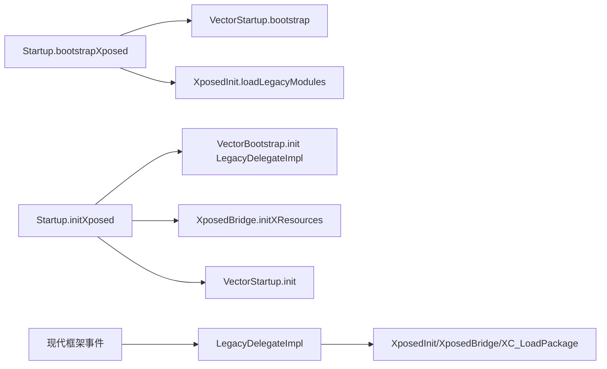
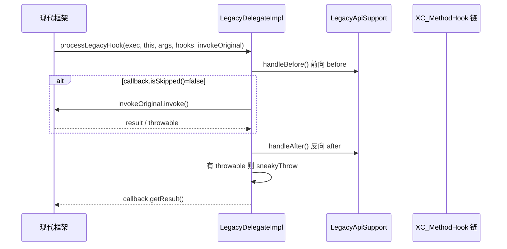

# legacy · impl 包

> 📂 [`legacy/src/main/java/org/matrix/vector/legacy/`](https://github.com/android-security-engineer/Vector-skills/blob/master/legacy/src/main/java/org/matrix/vector/legacy/) · [`org/matrix/vector/`](https://github.com/android-security-engineer/Vector-skills/blob/master/org/matrix/vector/)
> 🟦 现代↔legacy 翻译边界与 DI 引导

## 包职责

`org.matrix.vector` 命名空间下的实现类把**现代生命周期事件与 Hook 调用翻译**成经典 Xposed API 操作。`LegacyDelegateImpl` 实现依赖注入契约 `LegacyFrameworkDelegate`，在应用加载、system_server 加载、方法 Hook 执行时桥接到 legacy API；`Startup` 是入口引导，建立 DI 契约并把控制权交给现代框架。



## 类清单

| 类 | 说明 |
| :--- | :--- |
| [`LegacyDelegateImpl`](#legacydelegateimpl) | `LegacyFrameworkDelegate` 实现，现代↔legacy 翻译边界 |
| [`Startup`](#startup) | DI 契约建立与框架初始化入口 |

---

## LegacyDelegateImpl

`public class LegacyDelegateImpl implements LegacyFrameworkDelegate` — 显式依赖注入契约的实现，把现代生命周期事件与 Hook 翻译为 legacy Xposed API 操作。

### 模块加载

```java
public void loadModules(Object activityThread)
```

委托 `XposedInit.loadModules((ActivityThread) activityThread)`，在现代框架需要加载模块时触发 legacy 加载流程。

### 应用加载

```java
public void onPackageLoaded(LegacyPackageInfo info)
```

构造 `XC_LoadPackage.LoadPackageParam`（从 `XposedBridge.sLoadedPackageCallbacks` 取回调），填入 `packageName`/`processName`/`classLoader`/`appInfo`/`isFirstApplication`。若是首个应用且存在 legacy 模块，调用 `hookNewXSP` 处理新式偏好路径。最后 `XC_LoadPackage.callAll(lpparam)` 触发回调链（内部会先 `VectorDeopter.deoptMethods`）。

### system_server 加载

```java
public void onSystemServerLoaded(ClassLoader classLoader)
```

把 `"android"` 加入 `XposedInit.loadedPackagesInProcess`，构造 `LoadPackageParam`（`packageName`/`processName` 均为 `"android"`，兼容 rovo89 原版设定），`isFirstApplication = true`，触发回调链。

### 方法 Hook 执行

```java
public Object processLegacyHook(Executable executable, Object thisObject, Object[] args,
                                Object[] legacyHooks, OriginalInvoker invokeOriginal)
```

**核心翻译逻辑**。把 native 侧收集的 legacy 回调快照 `legacyHooks` 经 `XposedBridge.LegacyApiSupport` 执行：



`sneakyThrow` 利用泛型擦除把受检异常"偷渡"抛出，不改变签名。

### 状态查询

```java
public boolean isResourceHookingDisabled()   // = XposedInit.disableResources
public boolean hasLegacyModule(String packageName)  // = XposedInit.getLoadedModules().containsKey
```

### 资源路径设置

```java
public void setPackageNameForResDir(String packageName, String resDir)
```

委托静态内部类 `ResourceProxy.set`，后者调用 `XResources.setPackageNameForResDir`。**分离到独立类** 是为避免 verifier 在 `LegacyDelegateImpl` 加载时连带校验 `XResources`——`ResourceProxy` 只在首次 `set` 调用时才被验证。

### 新式偏好 Hook（hookNewXSP）

```java
private void hookNewXSP(XC_LoadPackage.LoadPackageParam lpparam)
```

对声明 `xposedminversion > 92` 或 `xposedsharedprefs` 的模块，Hook `android.app.ContextImpl`：

- `checkMode(int)`：`afterHookedMethod` 中若 args[0] 低位为 1（`MODE_WORLD_READABLE`），`setThrowable(null)` 吞掉权限异常。
- `getPreferencesDir()`：用 `XC_MethodReplacement` 完全替换，返回 `VectorServiceClient.getPrefsPath(packageName)` 指向的 Daemon 安全区目录。

### 内部类 ResourceProxy

```java
private static class ResourceProxy {
    static void set(String p, String r)  // XResources.setPackageNameForResDir(p, r)
}
```

延迟验证的资源代理，见上。

---

## Startup

`public class Startup` — 框架初始化入口，建立 DI 契约并交接给现代框架。提供两个静态入口。

### bootstrapXposed

```java
public static void bootstrapXposed(boolean systemServerStarted)
```

**Zygote 早期引导**。调用 `VectorStartup.bootstrap(XposedInit.startsSystemServer, systemServerStarted)` 做现代侧引导，再 `XposedInit.loadLegacyModules()` 加载 legacy 模块（在 Zygote 中初始化 Zygote 级 Hook）。异常被捕获并记入错误日志，不传播。

### initXposed

```java
public static void initXposed(boolean isSystem, String processName, String appDir, ILSPApplicationService service)
```

**应用进程初始化**。顺序：

1. `VectorBootstrap.INSTANCE.init(new LegacyDelegateImpl())` — 建立 DI 契约，注册 `LegacyDelegateImpl` 为现代框架的 legacy 翻译器。
2. `XposedBridge.initXResources()` — 初始化资源 Hook（构建伪 ClassLoader 让 `XResources` 生效）。
3. `XposedInit.startsSystemServer = isSystem` — 记录是否为 system_server。
4. `VectorStartup.init(isSystem, processName, appDir, service)` — 把控制权交给现代框架初始化，后续事件经 DI 契约回流到 `LegacyDelegateImpl`。

## 相关

- [legacy 模块总览](../modules/legacy)
- [legacy · API 根包](./legacy-api)（`XposedInit`、`XposedBridge.LegacyApiSupport`）
- [legacy · callbacks 包](./legacy-callbacks)（`XC_LoadPackage.LoadPackageParam`）
- [legacy · resources 包](./legacy-resources)（`XResources`、`XposedBridge.initXResources`）
- 架构背景见 [架构 · Legacy 兼容层](../../architecture/legacy)
