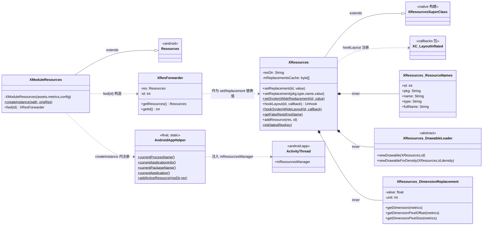
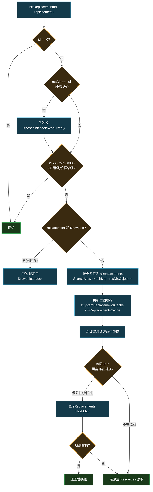
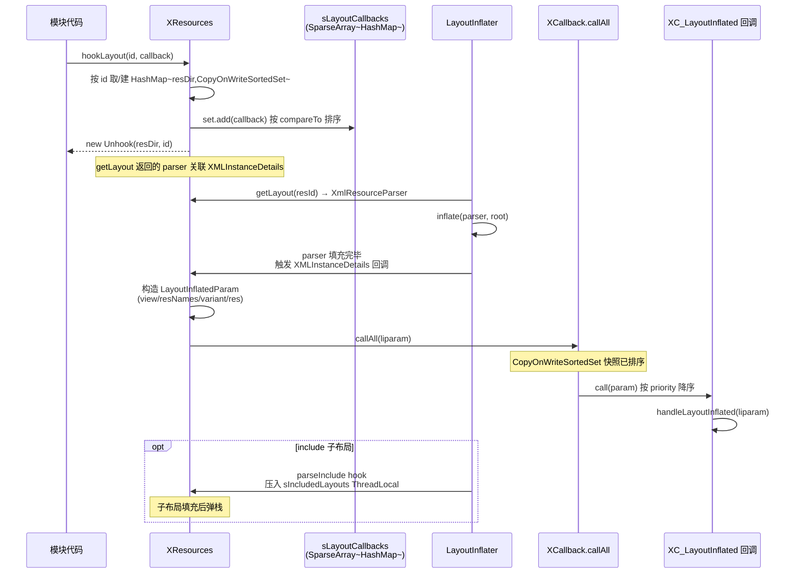

# legacy · resources 包与 AndroidAppHelper

> 📂 [`legacy/src/main/java/android/content/res/`](https://github.com/android-security-engineer/Vector-skills/blob/master/legacy/src/main/java/android/content/res/) · [`legacy/src/main/java/android/app/`](https://github.com/android-security-engineer/Vector-skills/blob/master/legacy/src/main/java/android/app/)
> 🟦 资源 Hook 与应用信息助手

## 包职责

实现经典 Xposed 的**资源替换体系**：`XResources` 是 `Resources` 的子类，覆写所有资源读取方法以支持运行时替换；`XModuleResources` 让模块加载自身 APK 资源；`XResForwarder` 把请求转发到其他 `Resources` 实例。`AndroidAppHelper` 提供当前进程的应用信息工具集。

## 类协作

[`XResources`](https://github.com/android-security-engineer/Vector-skills/blob/master/legacy/src/main/java/android/content/res/XResources.java) 是替换体系核心，继承 native 侧构建的伪超类 `XResourcesSuperClass`；[`XModuleResources`](https://github.com/android-security-engineer/Vector-skills/blob/master/legacy/src/main/java/android/content/res/XModuleResources.java) 继承标准 `Resources`，经 `createInstance` 把模块 APK 路径加入 `AssetManager`；[`XResForwarder`](https://github.com/android-security-engineer/Vector-skills/blob/master/legacy/src/main/java/android/content/res/XResForwarder.java) 是替换值的转发载体，通常由 `XModuleResources.fwd(id)` 构造后传给 `XResources.setReplacement`；[`AndroidAppHelper`](https://github.com/android-security-engineer/Vector-skills/blob/master/legacy/src/main/java/android/app/AndroidAppHelper.java) 静态工具集，`addActiveResource` 把 `XModuleResources` 注册进 `ActivityThread` 的 `mResourcesManager`。



`XResources.setReplacement` 的替换缓存查找流程：



## 类清单

| 类 | 说明 |
| :--- | :--- |
| [`XResources`](#xresources) | 可替换个别资源的 `Resources` 子类 |
| [`XModuleResources`](#xmoduleresources) | 从指定路径（通常是模块 APK）加载的资源 |
| [`XResForwarder`](#xresforwarder) | 把资源请求转发到另一 `Resources` 的转发器 |
| [`AndroidAppHelper`](#androidapphelper) | 当前应用/进程信息工具集 |

---

## XResources

[`XResources.java`](https://github.com/android-security-engineer/Vector-skills/blob/master/legacy/src/main/java/android/content/res/XResources.java) — `public class XResources extends XResourcesSuperClass` — Xposed 用此类替换标准 `Resources`，覆写个别资源读取方法并增加替换能力。继承自 native 侧构建的伪超类 `XResourcesSuperClass`。

### 替换缓存机制

资源 ID 形如 `PPTTNNNN`（PP=包，TT=类型，NNNN=名称；应用资源 PP 恒为 `0x7f`）。替换查找先用**位图缓存**快速判断某 ID 是否可能存在替换（允许假阳性以省内存），再查 `sReplacements`（`SparseArray<HashMap<resDir, Object>>`）。

| 缓存 | 范围 | 说明 |
| :--- | :--- | :--- |
| `sSystemReplacementsCache` | 框架资源（id < 0x7f000000） | 256 字节位图 |
| `mReplacementsCache` | 应用资源 | 128 字节位图，按 resDir 存于 `sReplacementsCacheMap` |

### 构造与包名

```java
public XResources(ClassLoader classLoader, String resDir)
public String getPackageName()                        // "android" 或应用包名
public static String getPackageNameDuringConstruction()  // getTopLevelResources 期间临时获取
public static void setPackageNameForResDir(String packageName, String resDir)  // @hide
public boolean isFirstLoad()                          // @hide，基于 resDir 的 lastModified 判断
```

`getPackageName(resDir)` 先查 `sResDirPackageNames` 缓存，未命中则用 `PackageParser.parsePackageLite` 解析 APK。`isFirstLoad` 在 APK 变更时清除旧替换。

### 设置替换

```java
public void setReplacement(int id, Object replacement)
public void setReplacement(String pkg, String type, String name, Object replacement)
@Deprecated public void setReplacement(String fullName, Object replacement)

public static void setSystemWideReplacement(int id, Object replacement)
public static void setSystemWideReplacement(String pkg, String type, String name, Object replacement)
@Deprecated public static void setSystemWideReplacement(String fullName, Object replacement)
```

`resDir == null` 表示框架级替换，会先触发 `XposedInit.hookResources()`。拒绝 `id == 0`、把应用 ID（≥0x7f000000）设为框架级、以及 `Drawable` 类型替换（已废弃，改用 `DrawableLoader`）。

### 替换值与资源类型对照

所有类型都接受 `XResForwarder`（转发）。其余按类型：

| 资源类型 | 额外接受的替换类型 | 读取方法 |
| :--- | :--- | :--- |
| Bool | `Boolean` | `getBoolean` |
| Color | `Integer`（也用于 `ColorDrawable`/`ColorStateList`） | `getColor`/`getDrawable`/`getColorStateList` |
| ColorStateList | `ColorStateList`/`Integer` | `getColorStateList` |
| Dimension | `DimensionReplacement` | `getDimension`/`getDimensionPixelOffset`/`getDimensionPixelSize` |
| Drawable | `DrawableLoader`/`Integer` | `getDrawable`/`getDrawableForDensity` |
| Float | `Float` | `getFloat` |
| Font | `Typeface` | `getFont` |
| Integer | `Integer` | `getInteger` |
| IntegerArray | `int[]` | `getIntArray` |
| String | `String`/`CharSequence` | `getString`/`getText` |
| StringArray | `String[]`/`CharSequence[]` | `getStringArray`/`getTextArray` |
| Animation/Layout/XML/Movie/Fraction/Plurals | 仅 `XResForwarder` | 对应方法 |

Styles、raw resources、typed arrays 不可替换。`getValue`/`getValueForDensity` 对非 `XResForwarder` 替换会打日志并回退（提示改用 `XResForwarder`）。

### Drawable 深度保护

`getDrawable`/`getDrawableForDensity` 用 `incrementMethodDepth("getDrawable"/"getDrawableForDensity")` 保证递归调用（多个 drawable 变体互相调用）时只在最外层应用一次替换。

### XML 引用重写

转发 XML（`getAnimation`/`getLayout`/`getXml`）时，若目标未缓存，调用 `rewriteXmlReferencesNative(parseState, this, repRes)` 把模块 XML 中对自身资源的引用重写为原始 `XResources` 中对应的 ID。`translateResId` 按名称+类型在原始包查找同义资源，找不到则用 `getFakeResId` 生成伪 ID 并注册转发替换。

```java
public static int getFakeResId(String resName)            // 0x7e000000 | hashCode
public static int getFakeResId(Resources res, int id)
public int addResource(Resources res, int id)             // 生成伪 ID 并注册转发
```

### 布局 Hook

```java
public XC_LayoutInflated.Unhook hookLayout(int id, XC_LayoutInflated callback)
public XC_LayoutInflated.Unhook hookLayout(String pkg, String type, String name, XC_LayoutInflated callback)
@Deprecated public XC_LayoutInflated.Unhook hookLayout(String fullName, XC_LayoutInflated callback)

public static XC_LayoutInflated.Unhook hookSystemWideLayout(int id, XC_LayoutInflated callback)
public static XC_LayoutInflated.Unhook hookSystemWideLayout(String pkg, String type, String name, XC_LayoutInflated callback)
@Deprecated public static XC_LayoutInflated.Unhook hookSystemWideLayout(String fullName, XC_LayoutInflated callback)

public static void unhookLayout(String resDir, int id, XC_LayoutInflated callback)  // @hide
```

布局回调存于 `sLayoutCallbacks`（`SparseArray<HashMap<resDir, CopyOnWriteSortedSet<XC_LayoutInflated>>>`）。`getLayout` 返回的 `XmlResourceParser` 关联 `XMLInstanceDetails`，在 `LayoutInflater.inflate` 后触发 `XCallback.callAll(liparam)`。`<include>` 通过 `parseInclude` hook 与 `sIncludedLayouts` ThreadLocal 栈协作处理。

布局 Hook 注册与填充触发时序：



### 初始化

```java
public static void init(ThreadLocal<Object> latestResKey) throws Exception  // @hide
```

Hook `LayoutInflater.inflate` 与 `parseInclude`，建立布局填充到回调的桥接。

### 内部类

#### `ResourceNames`

`public static class ResourceNames` — 单个资源的名称信息容器。

| 字段 | 含义 |
| :--- | :--- |
| `id` | 资源 ID |
| `pkg` | 包名 |
| `name` | 条目名 |
| `type` | 类型名 |
| `fullName` | `pkg:type/name` |

`equals(pkg, name, type, id)` 对非 null 参数逐一匹配。

#### `XTypedArray`

`public static class XTypedArray extends XTypedArraySuperClass` — `TypedArray` 替换类，布局填充时按索引即时替换值。覆写 `getBoolean/getColor/getColorStateList/getDimension/getDimensionPixelOffset/getDimensionPixelSize/getDrawable/getFloat/getFont/getFraction/getInt/getInteger/getLayoutDimension/getString/getText/getTextArray/getValue/peekValue`，模式与 `XResources` 对应方法一致。

#### `DrawableLoader`

`public static abstract class DrawableLoader` — drawable 替换回调。

```java
public abstract Drawable newDrawable(XResources res, int id) throws Throwable
public Drawable newDrawableForDensity(XResources res, int id, int density) throws Throwable  // 默认委托 newDrawable
```

> ⚠️ 每次调用都应返回**新** `Drawable` 实例，drawable 通常不可复用。

#### `DimensionReplacement`

`public static class DimensionReplacement` — 维度替换，封装值与单位。

```java
public DimensionReplacement(float value, int unit)   // unit 为 TypedValue.COMPLEX_UNIT_*
public float getDimension(DisplayMetrics metrics)
public int getDimensionPixelOffset(DisplayMetrics metrics)
public int getDimensionPixelSize(DisplayMetrics metrics)
```

---

## XModuleResources

[`XModuleResources.java`](https://github.com/android-security-engineer/Vector-skills/blob/master/legacy/src/main/java/android/content/res/XModuleResources.java) — `public class XModuleResources extends Resources` — 从指定路径（通常是模块自身 APK）加载资源的 `Resources`。

```java
public static XModuleResources createInstance(String path, XResources origRes)
public XResForwarder fwd(int id)
```

`createInstance` 创建 `AssetManager` 并经 `HiddenApiBridge.AssetManager_addAssetPath` 加入模块 APK 路径；`origRes != null` 时复制其 `DisplayMetrics` 与 `Configuration`，否则传 null。注册到 `AndroidAppHelper.addActiveResource`。`fwd(id)` 便捷构造转发器，供 `XResources.setReplacement` 使用。

构造函数私有，只能经 `createInstance` 创建。

---

## XResForwarder

[`XResForwarder.java`](https://github.com/android-security-engineer/Vector-skills/blob/master/legacy/src/main/java/android/content/res/XResForwarder.java) — `public class XResForwarder` — 转发器，把资源请求转发到另一 `Resources` 实例（可能有不同 ID）。

```java
public XResForwarder(Resources res, int id)
public Resources getResources()   // 目标 Resources
public int getId()                // 目标资源 ID
```

通常不直接构造，而经 `XModuleResources.fwd(id)` 获取。作为替换值传给 `XResources.setReplacement` 的各重载。

---

## AndroidAppHelper

[`AndroidAppHelper.java`](https://github.com/android-security-engineer/Vector-skills/blob/master/legacy/src/main/java/android/app/AndroidAppHelper.java) — `public final class AndroidAppHelper` — 当前应用/进程信息的**静态工具集**。因历史原因位于 `android.app` 包，无法移动以免破坏兼容。

### 进程与应用信息

```java
public static String currentProcessName()           // 通常等于主包名，无则 "android"
public static ApplicationInfo currentApplicationInfo()  // 主应用信息（多应用取首个）
public static String currentPackageName()           // 主应用包名，无则 "android"
public static Application currentApplication()      // 主 Application 对象
```

多应用同进程场景（如 SystemUI 与 Keyguard 共享 `com.android.systemui` 进程）返回首个初始化的应用。

### 资源注册

```java
public static void addActiveResource(String resDir, Resources resources)              // @hide
public static void addActiveResource(String resDir, float scale, boolean isThemeable, Resources resources)  // @hide 兼容
```

把 `Resources` 注册进 `ActivityThread.mResourcesManager.mResourceImpls`，以 `CompatibilityInfo.applicationScale = resources.hashCode()` 作为 key 的一部分。`XModuleResources.newInstance` 内部调用。

### 偏好（已废弃）

```java
@Deprecated public static SharedPreferences getSharedPreferencesForPackage(String packageName, String prefFileName, int mode)
@Deprecated public static SharedPreferences getDefaultSharedPreferencesForPackage(String packageName)
@Deprecated public static void reloadSharedPreferencesIfNeeded(SharedPreferences pref)
```

均委托给 `XSharedPreferences`，新代码应直接用 `XSharedPreferences`。

## 相关

- [legacy 模块总览](../modules/legacy)
- [legacy · API 根包](./legacy-api)（`XposedInit.hookResources`、`XposedHelpers` 深度计数）
- [legacy · callbacks 包](./legacy-callbacks)（`XC_LayoutInflated`、`XC_InitPackageResources`）
- [legacy · services 包](./legacy-services)（`XSharedPreferences` 用的文件服务）
- 资源 Hook 架构见 [架构 · Legacy 兼容层](../../architecture/legacy)
