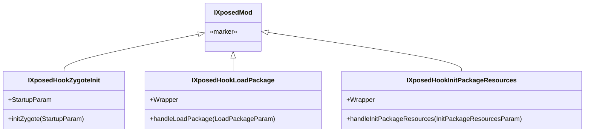

# 🚀 入口回调契约 · Zygote / LoadPackage / InitPackageResources

> 📂 [`legacy/src/main/java/de/robv/android/xposed/IXposedHookZygoteInit.java`](https://github.com/android-security-engineer/Vector-skills/blob/master/legacy/src/main/java/de/robv/android/xposed/IXposedHookZygoteInit.java)
> 📂 [`legacy/src/main/java/de/robv/android/xposed/IXposedHookLoadPackage.java`](https://github.com/android-security-engineer/Vector-skills/blob/master/legacy/src/main/java/de/robv/android/xposed/IXposedHookLoadPackage.java)
> 📂 [`legacy/src/main/java/de/robv/android/xposed/IXposedHookInitPackageResources.java`](https://github.com/android-security-engineer/Vector-skills/blob/master/legacy/src/main/java/de/robv/android/xposed/IXposedHookInitPackageResources.java)
> 📂 [`legacy/src/main/java/de/robv/android/xposed/XposedInit.java`](https://github.com/android-security-engineer/Vector-skills/blob/master/legacy/src/main/java/de/robv/android/xposed/XposedInit.java) · `initModule`
> 🟦 legacy 模块 · 模块生命周期的三个入口契约

## 契约总览

Xposed 模块的主类可实现以下任意组合的接口，`XposedInit.initModule` 会用 `instanceof` 逐个探测并注册。三个接口都继承自包级标记接口 `IXposedMod`（不可直接实现）。



## IXposedHookZygoteInit

Zygote 启动早期回调，**全进程生效**。此时只有 Android 框架类可用，应用类尚未加载，`findAndHookMethod` 的 classLoader 应传 `null`（用 `XposedBridge.BOOTCLASSLOADER`）。

```java
public interface IXposedHookZygoteInit extends IXposedMod {
    void initZygote(StartupParam startupParam) throws Throwable;

    final class StartupParam {
        public String modulePath;            // 模块 APK 路径
        public boolean startsSystemServer;   // 32位恒 true；64位仅启动 system_server 的主进程为 true
    }
}
```

`initZygote` 抛出的 Throwable 会被捕获并阻止该模块后续初始化，但不会崩溃宿主。适合放"对所有应用都生效"的框架级 hook。

## IXposedHookLoadPackage

应用（包）加载时回调，**按包生效**。在 `Application.onCreate` 之前触发，模块在此挂载针对特定应用的 hook。

```java
public interface IXposedHookLoadPackage extends IXposedMod {
    void handleLoadPackage(LoadPackageParam lpparam) throws Throwable;

    final class Wrapper extends XC_LoadPackage {            // 适配器：把接口实现包装成 XC_LoadPackage 回调
        public Wrapper(IXposedHookLoadPackage instance);
        @Override public void handleLoadPackage(LoadPackageParam lpparam) throws Throwable;
    }
}
```

`LoadPackageParam`（定义在 `XC_LoadPackage`）携带 `packageName`、`appInfo`、`classLoader` 等。`Wrapper` 是 `@hide` 的适配器——`XposedInit` 把模块实例包进 `Wrapper` 后调用 `XposedBridge.hookLoadPackage(wrapper)` 注册到 `sLoadedPackageCallbacks`。异常被捕获并记日志，不影响其他模块。

## IXposedHookInitPackageResources

应用资源初始化时回调，用于**资源替换**（改字符串/布局/图片）。模块在此调用 `XResources` 的特殊方法注册资源替换。

```java
public interface IXposedHookInitPackageResources extends IXposedMod {
    void handleInitPackageResources(InitPackageResourcesParam resparam) throws Throwable;

    final class Wrapper extends XC_InitPackageResources {
        public Wrapper(IXposedHookInitPackageResources instance);
        @Override public void handleInitPackageResources(InitPackageResourcesParam resparam) throws Throwable;
    }
}
```

`InitPackageResourcesParam` 携带 `packageName`、`res`（`XResources` 实例）。同样通过 `Wrapper` 注册到 `sInitPackageResourcesCallbacks`。

## 注册调度：initModule

`XposedInit.initModule(ClassLoader mcl, String apk, List<String> moduleClassNames)` 逐个加载 `assets/xposed_init` 声明的模块类，用 `instanceof` 探测接口并分别注册：

```java
Class<?> moduleClass = mcl.loadClass(moduleClassName);
if (!IXposedMod.class.isAssignableFrom(moduleClass)) {
    Log.e(TAG, "    This class doesn't implement any sub interface of IXposedMod, skipping it");
    continue;
}
Object moduleInstance = moduleClass.newInstance();

if (moduleInstance instanceof IXposedHookZygoteInit) {
    StartupParam param = new StartupParam();
    param.modulePath = apk;
    param.startsSystemServer = startsSystemServer;
    ((IXposedHookZygoteInit) moduleInstance).initZygote(param);   // 同步立即调用
}
if (moduleInstance instanceof IXposedHookLoadPackage) {
    XposedBridge.hookLoadPackage(new IXposedHookLoadPackage.Wrapper((IXposedHookLoadPackage) moduleInstance));  // 注册到集合，后续触发
}
if (moduleInstance instanceof IXposedHookInitPackageResources) {
    hookResources();                                              // 懒初始化 XResources（dummyClassLoader）
    XposedBridge.hookInitPackageResources(new IXposedHookInitPackageResources.Wrapper(...));
}
```

要点：

- `initZygote` 在模块加载时**立即同步**调用（因 Zygote 启动只发生一次）。
- `handleLoadPackage` / `handleInitPackageResources` 是**注册**而非调用——实际触发发生在后续包加载/资源初始化时，由 `XCallback.callAll` 遍历 `sLoadedPackageCallbacks` / `sInitPackageResourcesCallbacks` 快照分发。
- 资源回调注册前先 `hookResources()`（确保 `initXResources()` 的 dummy classloader 已就绪）。
- 任一模块类加载/初始化失败只记日志，不影响其他模块类（`count > 0` 才视为成功）。

## 触发时机对比

| 接口 | 触发时机 | 生效范围 | 注册方式 | 调用方式 |
| :--- | :--- | :--- | :--- | :--- |
| `IXposedHookZygoteInit` | Zygote 启动早期 | 全进程 | 直接调用 | 同步立即 |
| `IXposedHookLoadPackage` | 包加载（onCreate 前） | 单包 | Wrapper → `sLoadedPackageCallbacks` | `callAll` 异步触发 |
| `IXposedHookInitPackageResources` | 资源初始化 | 单包 | Wrapper → `sInitPackageResourcesCallbacks` | `callAll` 异步触发 |

## 相关

- [xposed-module-interface · IXposedMod 规范](./xposed-module-interface)
- [XposedBridge · 包/资源回调注册](./xposed-bridge)
- [XposedInit · 模块加载](./xposed-init) （如已存在）
- [XposedHelpers · findAndHookMethod](./xposed-helpers-extra)
