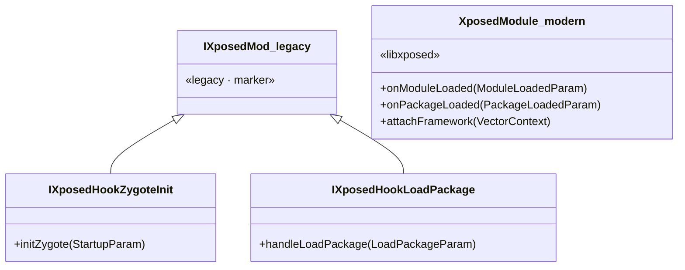

# 🧩 IXposedMod 规范与现代入口对比

> 📂 [`legacy/src/main/java/de/robv/android/xposed/IXposedMod.java`](https://github.com/android-security-engineer/Vector-skills/blob/master/legacy/src/main/java/de/robv/android/xposed/IXposedMod.java)
> 📂 [`legacy/src/main/java/de/robv/android/xposed/XposedInit.java`](https://github.com/android-security-engineer/Vector-skills/blob/master/legacy/src/main/java/de/robv/android/xposed/XposedInit.java) · `initModule`
> 📂 [`xposed/src/main/kotlin/org/matrix/vector/impl/core/VectorModuleManager.kt`](https://github.com/android-security-engineer/Vector-skills/blob/master/xposed/src/main/kotlin/org/matrix/vector/impl/core/VectorModuleManager.kt)
> 🟦 legacy 模块 · 旧接口规范 vs libxposed 现代入口

## IXposedMod 规范

`/* package */ interface IXposedMod` 是一个**包级可见的标记接口**（marker interface），本身不声明任何方法：

```java
package de.robv.android.xposed;

/** Marker interface for Xposed modules. Cannot be implemented directly. */
/* package */ interface IXposedMod {
}
```

它存在的唯一目的是作为三个入口接口的**共同父类型**，让 `XposedInit.initModule` 能用单个 `instanceof` 校验"这个类是不是合法的 Xposed 模块入口"。`/* package */` 可见性意味着模块开发者**不能直接 `implements IXposedMod`**——必须实现它的子接口 `IXposedHookZygoteInit` / `IXposedHookLoadPackage` / `IXposedHookInitPackageResources` 之一。

`initModule` 的校验逻辑：

```java
Class<?> moduleClass = mcl.loadClass(moduleClassName);
if (!IXposedMod.class.isAssignableFrom(moduleClass)) {
    Log.e(TAG, "    This class doesn't implement any sub-interface of IXposedMod, skipping it");
    continue;
}
Object moduleInstance = moduleClass.newInstance();
// 之后用 instanceof 分别探测三个子接口并注册
```

不实现任何子接口的类会被静默跳过（记 error 日志），不抛异常、不影响其他模块类。

## legacy 三入口（IXposedMod 子接口）

| 接口 | 回调方法 | 调度方式 |
| :--- | :--- | :--- |
| `IXposedHookZygoteInit` | `initZygote(StartupParam)` | 加载时同步立即调用 |
| `IXposedHookLoadPackage` | `handleLoadPackage(LoadPackageParam)` | Wrapper 注册到集合，`callAll` 异步触发 |
| `IXposedHookInitPackageResources` | `handleInitPackageResources(InitPackageResourcesParam)` | Wrapper 注册，`callAll` 异步触发 |

三者的触发时机与契约详见 [init-zygote-callback](./init-zygote-callback)。

## 现代入口：libxposed XposedModule

Vector 同时支持 libxposed 的**现代 API**，模块主类改为继承 `io.github.libxposed.api.XposedModule`（Kotlin 侧）。调度由 `VectorModuleManager.loadModule` 负责：

```kotlin
val moduleInstance = constructor.newInstance() as XposedModule
moduleInstance.attachFramework(vectorContext)                 // 注入框架上下文（packageName/IPC client）
VectorLifecycleManager.activeModules.add(moduleInstance)      // 注册到活跃集合，接收后续生命周期事件
moduleInstance.onModuleLoaded(                                // 首次回调：模块装载完成
    object : ModuleLoadedParam {
        override fun isSystemServer(): Boolean = isSystemServer
        override fun getProcessName(): String = processName
    }
)
```

随后由 `VectorLifecycleManager` 在包加载时分发：

```kotlin
// VectorLifecycleManager.kt
fun onPackageLoaded(param: PackageLoadedParam) {
    activeModules.forEach { module ->
        runCatching { module.onPackageLoaded(param) }
            .onFailure { Log.e(TAG, "Error in onPackageLoaded for ${module.moduleApplicationInfo.packageName}", it) }
    }
}
```

> ⚠️ 任务描述提及的 `initModule` / `startModule` 并非 libxposed 现代入口的精确方法名。源码中现代入口的实际生命周期回调为 `onModuleLoaded(ModuleLoadedParam)`（模块装载时）与 `onPackageLoaded(PackageLoadedParam)`（包加载时），均定义在 `XposedModuleInterface`。`initModule` 在源码中是 `XposedInit` 的 **legacy 私有方法**名，不是现代 API 方法。

## 两种入口对比



| 维度 | legacy (`IXposedMod`) | 现代 (`XposedModule`) |
| :--- | :--- | :--- |
| 语言 | Java | Kotlin（兼容 Java 调用） |
| 入口发现 | `instanceof` 探测三子接口 | 继承 `XposedModule` 单基类 |
| 上下文注入 | 无，各接口自带 Param | `attachFramework(VectorContext)` |
| 模块装载回调 | 无（`initZygote` 仅 Zygote） | `onModuleLoaded` |
| 包加载回调 | `handleLoadPackage` | `onPackageLoaded` |
| 资源回调 | `handleInitPackageResources` | 由 `PackageLoadedParam` 统一承载 |
| 调度器 | `XposedInit.initModule`（Java） | `VectorModuleManager.loadModule`（Kotlin） |
| 异常隔离 | 单类失败记日志，不影响其他 | `runCatching` 包裹，失败记日志 |

## 共存与选择

Vector 的 legacy 层是 **libxposed 现代 API 之上的兼容垫片**：`XC_LoadPackage` / `XC_InitPackageResources` 的 `Param` 内部引用了 `io.github.libxposed.api.XposedModuleInterface`（见源码 import），说明 legacy 回调的参数对象本身借用了现代 API 的类型。开发者写 legacy 接口代码时，底层仍走现代管线；写现代 `XposedModule` 子类则直接对接原生生命周期。两者可在同一框架内共存，由各自的调度器独立加载。

## 相关

- [init-zygote-callback · 三个入口回调](./init-zygote-callback)
- [XposedBridge · 中枢门面](./xposed-bridge)
- [VectorModuleManager · 现代模块管理](../xposed/vector-module-manager) （如已存在）
- [libxposed API 总览](../../modules/xposed)
