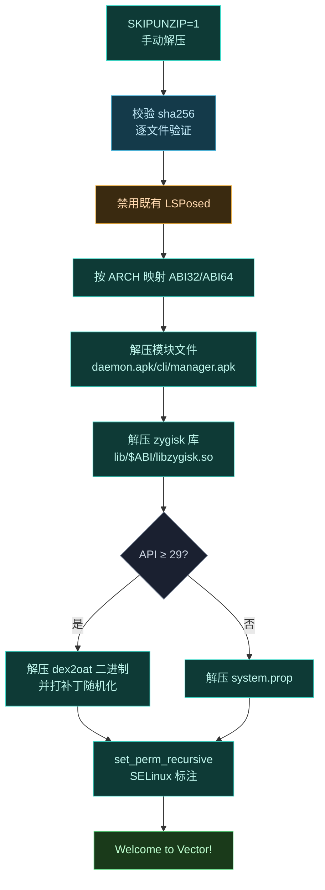

# 📦 customize.sh — Magisk 模块安装脚本

Vector 以 Magisk/KernelSU 模块 zip 形式分发，`customize.sh` 是刷入时执行的核心安装脚本。

> 📂 `zygisk/module/customize.sh`
> 📦 magisk-loader 模块 · 安装阶段执行

## 职责

`customize.sh` 在 Magisk 刷入流程中被调用，负责：解压并校验模块文件、按设备 ABI 选择原生库、部署 daemon 与 dex2oat 二进制、随机化路径特征以对抗检测、设置 SELinux 标注与文件权限。

## 安装流程



## 文件校验

脚本开头 `SKIPUNZIP=1` 关闭 Magisk 自动解压，改用自定义 `extract` 函数。每个文件附带 `.sha256` 校验文件，解压后用 `sha256sum -c -s -` 比对，失败则 `abort_verify` 中止安装。

```bash
unzip -oj "$ZIPFILE" "$file" -d "$dir"
read -r expected_hash < "$hash_path"
echo "$expected_hash  $file_path" | sha256sum -c -s -
```

## ABI 选择

通过 Magisk 注入的 `$ARCH` 变量映射标准 ABI 路径：

| `$ARCH` | ABI32 | ABI64 |
| :--- | :--- | :--- |
| `arm` / `arm64` | `armeabi-v7a` | `arm64-v8a` |
| `x86` / `x64` | `x86` | `x86_64` |
| 其它 | `abort` | — |

64 位库仅在 `IS64BIT=true` 时解压。

## dex2oat 部署与反检测

`API ≥ 29`（Android 10+）时部署自定义 dex2oat 包装器。安装阶段对 daemon.apk 与 dex2oat 二进制执行路径特征随机化：

```bash
DEV_PATH=$(tr -dc 'a-z0-9' </dev/urandom | head -c 32)
sed -i "s/5291374ceda0aef7c5d86cd2a4f6a3ac/$DEV_PATH/g" "$MODPATH/daemon.apk"
```

固定特征串 `5291374ceda0aef7c5d86cd2a4f6a3ac` 被替换为随机串，使每个安装的实例在 dex2oat 通信路径上具有不同指纹。

## 权限与 SELinux

```bash
set_perm_recursive "$MODPATH" 0 0 0755 0644
set_perm_recursive "$MODPATH/bin" 0 2000 0755 0755 u:object_r:xposed_file:s0
set_perm "$MODPATH/daemon" 0 0 0744
set_perm "$MODPATH/cli" 0 0 0744
```

`bin/` 目录归 `shell` 组（gid 2000）并标注 `xposed_file` 上下文，与 `sepolicy.rule` 中声明的 `xposed_file` 类型呼应。

## 既有 LSPosed 处理

检测到 `/data/adb/modules/zygisk_lsposed` 存在时，写入 `disable` 文件将其禁用，避免两个框架冲突。

## 相关

- 权限标注的 SELinux 来源见 [sepolicy-rule](./sepolicy-rule)
- daemon 启动逻辑见 [service.sh](./service-sh)
- 模块元数据见 [module-prop](./module-prop)
