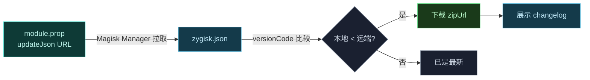

# 🏷️ module.prop — 模块元数据

`module.prop` 是 Magisk/KernelSU 识别模块的元数据文件，定义身份、版本与 OTA 更新通道。

> 📂 `zygisk/module/module.prop`
> 📦 magisk-loader 模块 · 模块清单

## 字段详解

```properties
id=zygisk_vector
name=Vector
version=${versionName} (${versionCode})
versionCode=${versionCode}
author=JingMatrix
description=A modern, Xposed-compatible framework for Android application hooking. (Android 8.1 ~ 16)
updateJson=https://raw.githubusercontent.com/JingMatrix/LSPosed/master/zygisk/update.json
```

| 字段 | 值 | 含义 |
| :--- | :--- | :--- |
| `id` | `zygisk_vector` | 模块唯一标识，Magisk 用此名建目录 `/data/adb/modules/zygisk_vector` |
| `name` | `Vector` | 显示名 |
| `version` | `${versionName} (${versionCode})` | 人类可读版本，构建期由 Gradle 替换占位符 |
| `versionCode` | `${versionCode}` | 数值版本号，用于升级判定 |
| `author` | `JingMatrix` | 作者 |
| `description` | `A modern, Xposed-compatible...` | 描述，标注支持范围 Android 8.1 ~ 16 |
| `updateJson` | `https://.../update.json` | OTA 更新元数据 URL |

> ⚠️ `${versionName}` / `${versionCode}` 是构建期占位符，由 Gradle 的 zip 打包任务在生成模块 zip 时替换为实际值。文件系统中看到的是替换后的结果。

## updateJson 联动

`updateJson` 指向一个 JSON，Magisk Manager 据此检查更新。Vector 的更新元数据结构见 `magisk-loader/update/zygisk.json`：

```json
{
  "version": "v2.0",
  "versionCode": 3021,
  "zipUrl": "https://github.com/JingMatrix/LSPosed/releases/download/v2.0/Vector-v2.0-Release.zip",
  "changelog": "https://raw.githubusercontent.com/JingMatrix/LSPosed/master/zygisk/changelog.md"
}
```



| JSON 字段 | 作用 |
| :--- | :--- |
| `version` | 远端人类可读版本 |
| `versionCode` | 与本地 `module.prop` 的 `versionCode` 比较 |
| `zipUrl` | 新版 zip 下载地址 |
| `changelog` | 更新日志 Markdown URL |

## 与安装脚本的协作

`customize.sh` 通过 `grep_prop version "${TMPDIR}/module.prop"` 读取 `version` 字段并打印，让用户在刷入时看到版本号。`cli` 脚本则通过 `/data/adb/modules/zygisk_vector` 路径定位模块目录，依赖 `id` 字段确定的目录名。

## 相关

- 更新通道详情见 [reference/modules/magisk-loader](../../modules/magisk-loader)
- 安装脚本读取版本见 [customize.sh](./customize-sh)
- 构建期占位符替换见 [architecture/build](../../../architecture/build)
