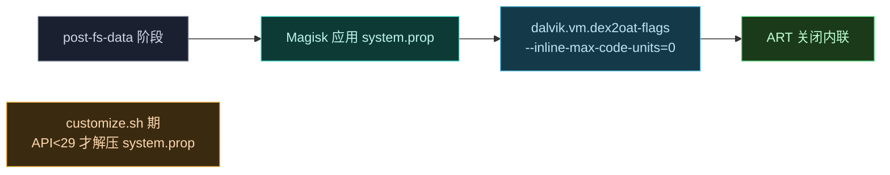
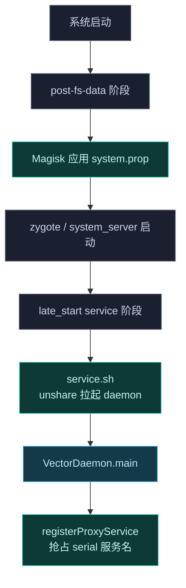

# ⏱️ post-fs-data.sh — 早期挂载阶段

Vector 模块**不提供** `post-fs-data.sh`。本文说明这一设计选择及其替代方案。

> 📂 `zygisk/module/` · 无此文件
> 📦 magisk-loader 模块 · 早期阶段

## 职责

Magisk 的 `post-fs-data.sh` 在 `/data` 挂载后、zygote 启动前执行，常用于早期属性设置与模块文件替换。Vector 不提供该脚本，转而把早期配置拆给静态机制承担：文件落盘交给 `customize.sh` 安装期完成，属性注入交给 Magisk 对 `system.prop` 的原生应用。本文界定 Vector 在启动早期做了什么、把什么交给了谁。

## 为什么没有 post-fs-data.sh

Magisk 的 `post-fs-data.sh` 在 `/data` 挂载后、zygote 启动前执行，常用于早期属性设置与模块替换。Vector 不使用该阶段，原因有二：

1. **dex2oat 与 zygisk 库走 `customize.sh` 部署**，文件已在安装期落盘，无需运行时早期挂载。
2. **属性预置改用 `system.prop`**，由 Magisk 在 `post-fs-data` 阶段统一应用，无需脚本介入。

## 早期配置职责归属

Vector 在启动早期需要的配置被拆分到不同机制，下表说明各自归属：

| 早期需求 | 承担方 | 落地方式 |
| :--- | :--- | :--- |
| 关闭 ART 内联 | `system.prop` | Magisk 在 post-fs-data 阶段应用属性 |
| 关闭 Maple 编译器 | `system.prop` | `customize.sh` 检测后追加，再由 Magisk 应用 |
| daemon / zygisk 库部署 | `customize.sh` | 安装期解压落盘，不依赖早期挂载 |
| dex2oat 包装器部署 | `customize.sh` | 仅 `API ≥ 29` 安装期解压并打补丁 |
| zygisk 进程特化旗标 | zygisk 模块代码 | 运行时设置，不预置 |
| 作用域 / 模块列表 | daemon 数据库 | system_server 派发上下文后读取 |

## 实际的早期配置：system.prop

Vector 通过 `system.prop` 在早期阶段注入一个关键属性：

```properties
dalvik.vm.dex2oat-flags=--inline-max-code-units=0
```

该属性关闭 ART 的内联优化，确保被 hook 的方法不会被内联到调用点，否则 hook 失效。`ManagerService.dex2oatFlagsLoaded()` 会读取该属性验证是否生效。

```kotlin
override fun dex2oatFlagsLoaded() =
    SystemProperties.get("dalvik.vm.dex2oat-flags").contains("--inline-max-code-units=0")
```

## 早期阶段时序



## customize.sh 中的条件分支

`customize.sh` 在 `API < 29`（Android 9 以下）时才显式解压 `system.prop`；`API ≥ 29` 时改走 dex2oat 包装器路径，属性仍由模块自带的 `system.prop` 在 post-fs-data 应用。此外 `customize.sh` 会按需追加 `ro.maple.enable=0`：

```bash
if [ "$(grep_prop ro.maple.enable)" = "1" ]; then
    echo "ro.maple.enable=0" >>"$MODPATH/system.prop"
fi
```

Maple 编译器在某些设备上会干扰 hook，检测到启用时强制关闭。

## 完整启动链路

把 post-fs-data 放回 Vector 整体启动链路中观察其位置：它只在属性应用这一环出现，文件部署与 daemon 拉起都在更靠后的阶段。



## zygisk P/S 旗标

zygisk 的进程特化旗标（preload / specialize）由 zygisk 模块代码本身在运行时设置，而非 post-fs-data 脚本预置。配置数据（作用域、模块列表）由 daemon 在 `system_server` 派发上下文后从数据库读取，无需早期落盘。

## 使用场景与约束

- **场景一：自定义早期属性**。若需在 `/data` 挂载后、zygote 前注入属性，正确做法是向模块的 `system.prop` 追加，由 Magisk 在 post-fs-data 统一应用，而不是新增 `post-fs-data.sh`。
- **场景二：文件替换 / 挂载覆盖**。Vector 不走该路径——所有二进制（zygisk 库、dex2oat 包装器、daemon.apk）在 `customize.sh` 安装期落盘，运行期无需早期挂载即可被后续阶段引用。
- **约束：不新增 post-fs-data.sh**。Vector 故意不提供该脚本，自定义脚本会与 Magisk 各启动阶段的语义耦合，难以在多设备上稳定；新增早期需求应优先归入 `system.prop` 或 `customize.sh`。
- **约束：内联关闭是硬前提**。`--inline-max-code-units=0` 不生效则 hook 会被内联吞掉，daemon 启动后通过 `dex2oatFlagsLoaded()` 自检，失败需排查 `system.prop` 是否被正确应用。
- **约束：Maple 关闭依赖设备检测**。`ro.maple.enable=0` 仅在检测到 Maple 启用时追加，并非所有设备都有该编译器，未启用时不会写入该行。

## 相关

- 属性验证见 [manager-service-impl · dex2oatFlagsLoaded](../services/manager-service-impl)
- 安装期部署见 [customize.sh](./customize-sh)
- daemon 拉起见 [service.sh](./service-sh)
- dex2oat 包装器见 [reference/modules/dex2oat](../../modules/dex2oat)
