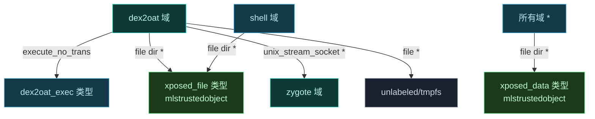

# 🛡️ sepolicy-rule — SELinux 策略注入

`sepolicy.rule` 是 Magisk 模块的 SELinux 策略扩展文件，由 `magiskpolicy` 在启动早期应用，为 Vector 的 dex2oat 包装器与数据目录放行必要权限。

> 📂 `zygisk/module/sepolicy.rule`
> 📦 magisk-loader 模块 · SELinux 策略

## 策略内容

```text
allow dex2oat dex2oat_exec file execute_no_trans
allow dex2oat system_linker_exec file execute_no_trans

allow shell shell dir write

type xposed_file file_type
typeattribute xposed_file mlstrustedobject
allow {dex2oat installd isolated_app shell} xposed_file {file dir} *

allow dex2oat {unlabeled tmpfs} file *
allow zygote dex2oat unix_stream_socket *

type xposed_data file_type
typeattribute xposed_data mlstrustedobject
allow * xposed_data {file dir} *
```

## 规则分组

| 分组 | 规则 | 目的 |
| :--- | :--- | :--- |
| dex2oat 执行 | `allow dex2oat dex2oat_exec ... execute_no_trans` | dex2oat 包装器可执行自身与 linker，无域转换 |
| xposed_file 访问 | `type xposed_file` + `typeattribute ... mlstrustedobject` | 模块文件目录对 dex2oat/installd/isolated_app/shell 全开 |
| dex2oat 临时文件 | `allow dex2oat {unlabeled tmpfs} file *` | dex2oat 读写 tmpfs 上的临时产物 |
| zygote socket | `allow zygote dex2oat unix_stream_socket *` | zygote 与 dex2oat 通信 |
| xposed_data 访问 | `type xposed_data` + `allow * xposed_data ...` | 模块数据目录对所有域可读写 |
| shell 写目录 | `allow shell shell dir write` | shell 创建模块相关目录 |

## 域与类型关系



## mlstrustedobject 的含义

`typeattribute xposed_file mlstrustedobject` 将 `xposed_file` 标记为"受信任对象"，使其可被任意域访问而无需逐一声明 `allow`。这简化了跨域访问，因为模块文件需要被 dex2oat、installd、isolated_app、shell 等多个域读取。规则中仍显式列出主要访问者以保持清晰。

## 与 customize.sh 的呼应

`customize.sh` 在安装时为 `bin/` 目录设置 `u:object_r:xposed_file:s0` 上下文：

```bash
set_perm_recursive "$MODPATH/bin" 0 2000 0755 0755 u:object_r:xposed_file:s0
```

`sepolicy.rule` 声明该类型的访问规则，二者配合完成"文件落盘 + 策略放行"闭环。

## 策略生效验证

`ManagerService.isSepolicyLoaded()` 通过 `SELinux.checkSELinuxAccess` 探测策略是否生效：

```kotlin
SELinux.checkSELinuxAccess(
    "u:r:dex2oat:s0", "u:object_r:dex2oat_exec:s0", "file", "execute_no_trans")
```

管理器据此显示 SELinux 策略加载状态。

## 相关

- 文件上下文设置见 [customize.sh · 权限与 SELinux](./customize-sh)
- 策略验证见 [manager-service-impl · isSepolicyLoaded](../services/manager-service-impl)
- SELinux 边界架构见 [architecture/selinux](../../../architecture/selinux)
