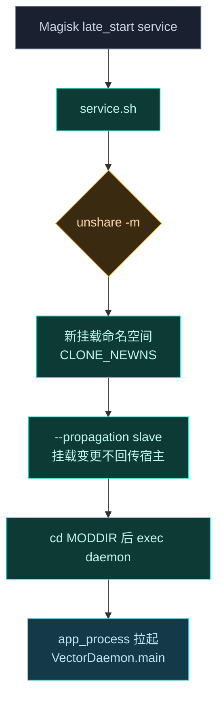
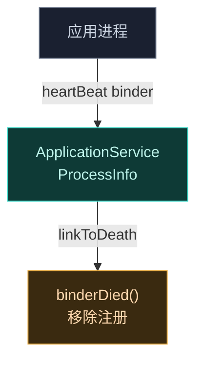
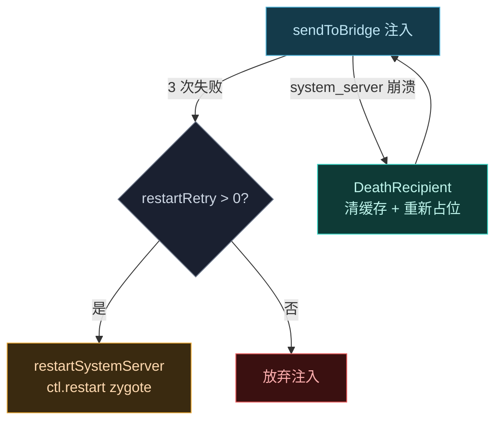

# 🚀 service.sh — late_start service

`service.sh` 是 Magisk 的 `late_start service` 脚本，在系统启动后期以 root 执行，负责拉起 Vector daemon。

> 📂 [`zygisk/module/service.sh`](https://github.com/android-security-engineer/Vector-skills/blob/master/zygisk/module/service.sh)
> 📦 magisk-loader 模块 · 启动阶段执行

## 职责

脚本本身极简，核心是用 `unshare` 在私有挂载命名空间内启动 daemon 二进制。daemon 的实际启动逻辑、心跳、重启策略都在 `daemon` 脚本与 [`VectorDaemon`](https://github.com/android-security-engineer/Vector-skills/blob/master/daemon/src/main/kotlin/org/matrix/vector/daemon/VectorDaemon.kt) 中。

### unshare 命名空间隔离



`--propagation slave` 让新命名空间接收宿主挂载事件但不向宿主反向传播——daemon 内部任何挂载操作（如镜像 `/data/adb/lspd`）都不会污染系统全局挂载表，避免触发 Magisk 自身的 mount 侦测。后台 `&` 确保不阻塞 Magisk 的 service 队列。

## 启动命令

```bash
MODDIR="${0%/*}"
cd "$MODDIR" || exit 1

unshare --propagation slave -m "$MODDIR/daemon" \
    --system-server-max-retry=3 "$@" &
```

| 要素 | 说明 |
| :--- | :--- |
| `MODDIR="${0%/*}"` | 取脚本所在目录作为模块根 |
| `unshare --propagation slave -m` | 创建私有挂载命名空间，传播设为 slave |
| `"$MODDIR/daemon"` | 实际启动 daemon 包装脚本 |
| `--system-server-max-retry=3` | 传递给 daemon 的 system_server 重启重试上限 |
| `&` | 后台运行，不阻塞 Magisk service 队列 |

## 启动链路

```mermaid
sequenceDiagram
    participant BOOT as Magisk late_start
    participant SVC as service.sh
    participant UNS as unshare -m
    participant D as daemon 包装脚本
    participant VD as VectorDaemon.main
    participant SS as system_server

    BOOT->>SVC: 执行
    SVC->>SVC: MODDIR=${0%/*}; cd MODDIR
    SVC->>UNS: unshare --propagation slave -m daemon --system-server-max-retry=3 &
    UNS->>D: 新挂载命名空间内 exec
    D->>VD: app_process 拉起 main
    VD->>VD: 解析 --system-server-max-retry=3
    VD->>SS: sendToBridge 注入 (最多重试 3 次)
    alt 注入成功
        SS-->>VD: VectorService.asBinder() 已注入
    else 3 次失败
        VD->>VD: restartSystemServer() ctl.restart zygote
    end
    VD->>VD: Looper.loop() 常驻
```


## 心跳与进程死亡

daemon 本身是常驻进程，通过 `app_process` 启动后进入 `Looper.loop()`。进程级别的"心跳"由 [`ApplicationService`](https://github.com/android-security-engineer/Vector-skills/blob/master/daemon/src/main/kotlin/org/matrix/vector/daemon/ipc/ApplicationService.kt) 管理：每个被注入的应用进程注册一个 `heartBeat` Binder，`linkToDeath` 后 daemon 在进程死亡时自动清理注册表。



## system_server 重启策略

`service.sh` 传入 `--system-server-max-retry=3`，由 [`VectorDaemon`](https://github.com/android-security-engineer/Vector-skills/blob/master/daemon/src/main/kotlin/org/matrix/vector/daemon/VectorDaemon.kt) 解析。当 daemon 通过桥事务向 system_server 注入失败（重试 3 次无响应）时，会触发 `restartSystemServer()`，通过 `ctl.restart` 重启 zygote：



system_server 崩溃时 `DeathRecipient` 会清除 `ServiceManager`/`ActivityManager` 缓存、重新注册代理服务名，并递减重试计数后再次注入。

## 相关

- daemon 包装脚本见 [customize.sh · daemon 脚本](./customize-sh)
- 注入与重启细节见 [daemon-service-impl](../services/daemon-service-impl)
- 早期阶段说明见 [post-fs-data-sh](./post-fs-data-sh)
