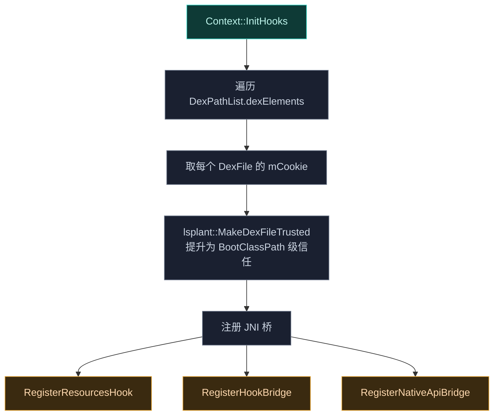
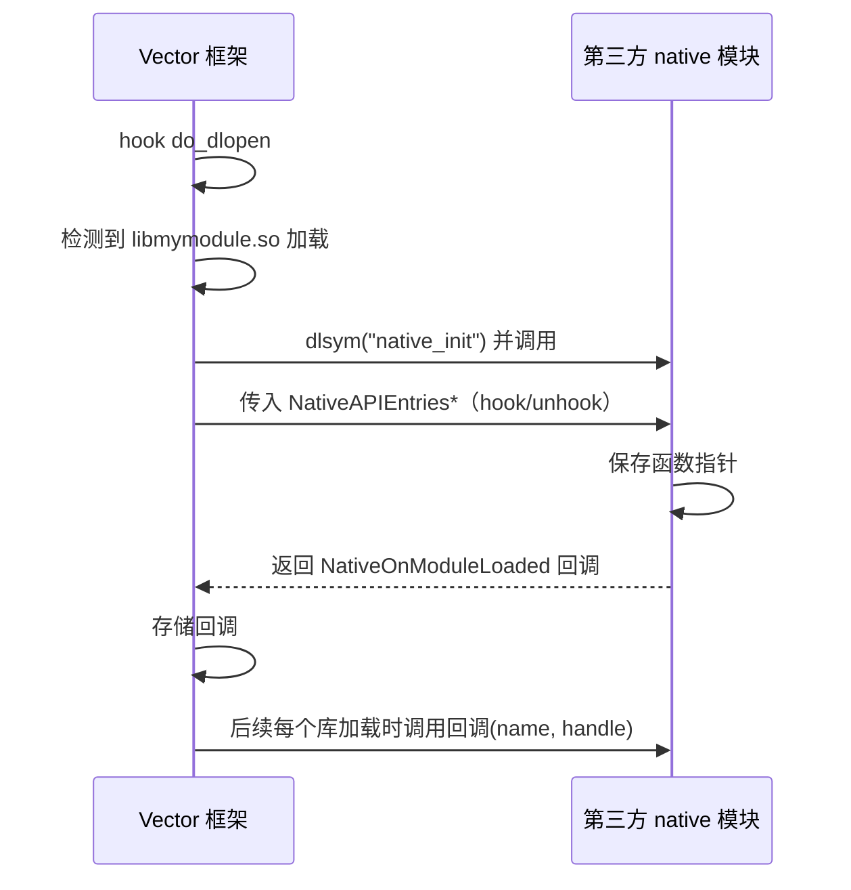

# 🧠 native · core 包

> 📂 [`native/include/core/`](https://github.com/android-security-engineer/Vector-skills/blob/master/native/include/core/) · [`native/src/core/`](https://github.com/android-security-engineer/Vector-skills/blob/master/native/src/core/)
> 🟦 native 库的抽象引擎层

## 包职责

`core` 是 native 库的核心抽象层，定义运行时上下文 `Context`、配置缓存 `ConfigBridge` 与第三方 native 模块支持 `native_api`。它**不假设自己如何被加载**——抽象方法（`LoadDex`/`SetupEntryClass`）由消费者（Zygisk 模块）实现，核心引擎与具体注入环境解耦。

## 类清单

| 类 | 头文件 | 说明 |
| :--- | :--- | :--- |
| [`Context`](#context) | `context.h` | 运行时上下文单例：管理注入类加载器、DEX 加载、JNI hook 注册 |
| [`ConfigBridge`](#configbridge) | `config_bridge.h` | 配置缓存单例：保存混淆映射表 |
| [Native API 公共 ABI](#native-api-公共-abi) | `native_api.h` | 第三方 native 模块的稳定 ABI（`NativeAPIEntries` 等） |

---

## Context

`class Context`（`namespace vector::native`）—— native 库的**全局运行时上下文单例**。持有注入类加载器与入口类引用，负责初始化 LSPlant、注册 JNI 桥、提升 DEX 信任级、从内存加载 DEX、查找框架类。

### 单例管理

```cpp
static Context *GetInstance();
static std::unique_ptr<Context> ReleaseInstance();
```

`GetInstance()` 返回 `instance_` 持有的指针；`ReleaseInstance()` 转移所有权供关闭时清理，调用后 `GetInstance()` 返回 `nullptr` 直至新实例创建。

### 类加载器与类查找

```cpp
[[nodiscard]] jobject GetCurrentClassLoader() const;
[[nodiscard]] lsplant::ScopedLocalRef<jclass> FindClassFromCurrentLoader(
    JNIEnv *env, std::string_view class_name) const;
```

- `GetCurrentClassLoader()` 返回注入的 `PathClassLoader` 全局引用。
- `FindClassFromCurrentLoader()` 委托 `FindClassFromLoader`，用注入类加载器反射调用 `DexClassLoader.loadClass`（回退 `findClass`）查找框架类。失败时清除异常避免崩溃并返回 `nullptr`。

### 模板工具：FindAndCall

```cpp
template <typename... Args>
void FindAndCall(JNIEnv *env, std::string_view method_name,
                 std::string_view method_sig, Args &&...args) const;
```

内部 native↔Java 通信的便捷调用：在 `entry_class_` 上定位静态方法并 `CallStaticVoidMethod`，参数经 `lsplant::UnwrapScope` 解包 `ScopedLocalRef`。

### 虚方法（平台实现钩子）

```cpp
virtual void InitArtHooker(JNIEnv *env, const lsplant::InitInfo &initInfo);
virtual void InitHooks(JNIEnv *env);
virtual void LoadDex(JNIEnv *env, PreloadedDex &&dex) = 0;
virtual void SetupEntryClass(JNIEnv *env) = 0;
```

| 方法 | 默认实现 | 子类须实现 |
| :--- | :--- | :--- |
| `InitArtHooker` | 调用 `lsplant::Init` | — |
| `InitHooks` | DEX 提权 + 注册 JNI 桥 | — |
| `LoadDex` | 纯虚 | ✅ |
| `SetupEntryClass` | 纯虚 | ✅ |

### InitHooks 流程



遍历注入类加载器的 `DexPathList.dexElements`，从每个 `DexFile` 取 `mCookie`（指向 ART 内部 `DexFile` C++ 对象），用 `lsplant::MakeDexFileTrusted` 提升信任级——等效于把 DEX 视为 BootClassPath 一部分，绕过 Hidden API 限制。

### 嵌套类 PreloadedDex

```cpp
class PreloadedDex {
public:
    PreloadedDex(int fd, size_t size);  // mmap(PROT_READ, MAP_SHARED)
    ~PreloadedDex();                    // munmap
    explicit operator bool() const;
    auto size() const;
    auto data() const;
};
```

`mmap` 文件描述符到内存的 DEX 包装，析构时 `munmap`。仅可移动。用于把框架 DEX 从内存加载进目标进程。

### 受保护成员

```cpp
static std::unique_ptr<Context> instance_;
jobject inject_class_loader_ = nullptr;  // 注入类加载器全局引用
jclass entry_class_ = nullptr;            // native→Java 入口类全局引用
```

---

## ConfigBridge

`class ConfigBridge`（`namespace vector::native`）—— native 侧配置缓存单例。当前唯一持有的配置是**混淆映射表**（原始包名前缀 → 混淆后的 JNI 签名前缀），供 `jni_bridge.h::GetNativeBridgeSignature()` 与 `resources_hook.cpp::GetXResourcesClassName()` 解析运行时类名。

```cpp
static ConfigBridge *GetInstance();
static std::unique_ptr<ConfigBridge> ReleaseInstance();

virtual std::map<std::string, std::string> &obfuscation_map() = 0;
virtual void obfuscation_map(std::map<std::string, std::string> map) = 0;
```

`instance_` 与 `Context::instance_` 在 `context.cpp` 同一翻译单元实例化。纯虚访问器由消费者子类实现。

---

## Native API 公共 ABI

`native_api.h` 定义第三方 native 模块（如 `libmymodule.so`）与 Vector 框架交互的**稳定公共 ABI**。

### 函数指针类型

```cpp
using HookFunType = int (*)(void *func, void *replace, void **backup);
using UnhookFunType = int (*)(void *func);
using NativeOnModuleLoaded = void (*)(const char *name, void *handle);
using NativeInit = NativeOnModuleLoaded (*)(const NativeAPIEntries *entries);
```

### NativeAPIEntries 结构体

```cpp
struct NativeAPIEntries {
    uint32_t version;          // API 版本（当前 2）
    HookFunType hookFunc;      // inline hook（Dobby）
    UnhookFunType unhookFunc;  // unhook（Dobby）
};
```

> ⚠️ 这些类型构成模块的公共 ABI，修改须考虑向后兼容。

### 初始化流程



### 框架侧函数

```cpp
bool InstallNativeAPI(const lsplant::HookHandler &handler);
void RegisterNativeLib(const std::string &library_name);

inline int HookInline(void *original, void *replace, void **backup);  // DobbyHook 包装
inline int UnhookInline(void *original);                               // DobbyDestroy 包装
```

- `RegisterNativeLib`：注册一个 `.so` 文件名为 native 模块。首次调用时**惰性**完成 `InitializeApiEntries()` + `InstallNativeAPI()`（hook `do_dlopen`）。
- `HookInline`/`UnhookInline`：Dobby 的包装；debug 构建下用 `dladdr` 记录符号/文件信息后调用 `DobbyHook`/`DobbyDestroy`。

### do_dlopen hook 实现

`native_api.cpp` 用 LSPlant 的 C++20 Hooking DSL 拦截 linker 的 `__dl__Z9do_dlopenPKciPK17android_dlextinfoPKv`：

1. 调用原 `do_dlopen` 取 handle；
2. 遍历 `g_module_native_libs`，文件名后缀匹配则 `dlsym("native_init")`，调用并收集返回的 `NativeOnModuleLoaded` 回调；
3. 对所有已注册回调广播 `(name, handle)`，使模块可对后续加载的库做"延迟 hook"。

### API 页保护

`InitializeApiEntries()` 在匿名内存页上 placement-new 构造 `NativeAPIEntries`，随后 `mprotect` 为只读——模块拿到的函数指针表不可被篡改。

## 相关

- [native 模块总览](../modules/native)
- [native · elf 包](./native-elf)（符号解析，被 `native_api.cpp` 用于 `art_symbol_resolver`）
- [native · jni 包](./native-jni)（`InitHooks` 注册的三个 JNI 桥）
- [架构 · Native 原生库](../../architecture/native)
