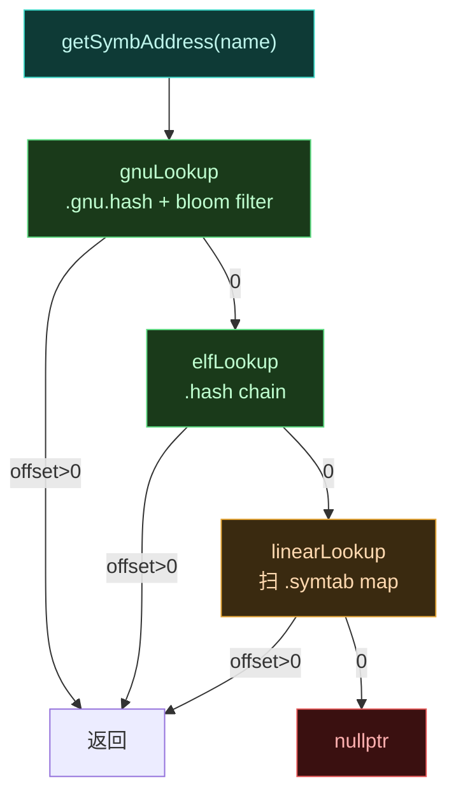

# 🔍 native · elf 包

> 📂 `native/include/elf/` · `native/src/elf/`
> 🟦 内存 ELF 解析与符号缓存

## 包职责

`elf` 包负责从内存中解析已加载的 ELF 共享库，定位符号地址。它能处理 stripped 二进制（解压 `.gnu_debugdata`），支持 GNU hash、ELF hash、线性扫描三种查找策略，并提供线程安全的常用库符号缓存。

## 类清单

| 类 | 头文件 | 说明 |
| :--- | :--- | :--- |
| [`ElfImage`](#elfimage) | `elf_image.h` | 内存中的 ELF 镜像：解析头、解压 debugdata、级联符号查找 |
| [`ElfSymbolCache`](#elfsymbolcache) | `symbol_cache.h` | libart/libbinder/linker 的惰性符号缓存单例 |

---

## ElfImage

`class ElfImage`（`namespace vector::native`）—— 表示当前进程内一个已加载的 ELF 共享库。构造时按库名（如 `"libart.so"`）解析 `/proc/self/maps` 取基址，再从磁盘 `mmap` 文件解析 ELF 头。

### 构造与生命周期

```cpp
explicit ElfImage(std::string_view lib_name);
~ElfImage();
ElfImage(const ElfImage &) = delete;
ElfImage &operator=(const ElfImage &) = delete;

[[nodiscard]] bool IsValid() const;            // base_ != nullptr
[[nodiscard]] const std::string &GetPath() const;  // maps 中的规范路径
```

构造流程：

1. `findModuleBase()`——解析 `/proc/self/maps`，过滤含 `lib_name` 的行，优先匹配 `r--p` 紧接 `r-xp` 的模式（libart.so 最可靠），否则取首个 `r-xp`，再否则取首条；记录基址与规范路径。
2. `open`+`mmap` 文件（`PROT_READ`/`MAP_SHARED`）。
3. `parseHeaders()`——遍历 section header，识别 `.dynsym`、`.symtab`、`.strtab`、`SHT_HASH`、`SHT_GNU_HASH`，计算 load bias（`sh_addr - sh_offset`）。
4. `decompressGnuDebugData()`——若存在 `.gnu_debugdata`，XZ 解压后再次 `parseHeaders` 以恢复 `.symtab`。

### 符号查找

```cpp
template <typename T = void *>
    requires(std::is_pointer_v<T>)
const T getSymbAddress(std::string_view name) const;

template <typename T = void *>
    requires(std::is_pointer_v<T>)
const T getSymbPrefixFirstAddress(std::string_view prefix) const;
```

返回值 = `base_ + offset - bias_`。`getSymbAddress` 内部级联调用三种查找；`getSymbPrefixFirstAddress` 用于 mangled 名前缀匹配（仅扫 `.symtab`，可能较慢）。

### 级联查找策略



`getSymbOffset` 依次尝试：

- **gnuLookup**：GNU hash 表 + bloom filter 快速过滤，命中后遍历 chain 比对名字。
- **elfLookup**：标准 ELF hash 表 chain 遍历。
- **linearLookup**：惰性构建 `symtabs_`（仅 `STT_FUNC`/`STT_OBJECT` 且 `st_size>0`）后 `std::map::find`。

### 哈希函数（编译期）

```cpp
[[nodiscard]] static constexpr uint32_t ElfHash(std::string_view name);
[[nodiscard]] static constexpr uint32_t GnuHash(std::string_view name);
```

`ElfHash`：经典 `(h<<4)+p` 带 `0xf0000000` 折叠。`GnuHash`：`h = h*33 + p`（初值 5381）。两者均为 `constexpr`，调用点可预计算。

### 私有查找方法

```cpp
ElfW(Addr) elfLookup(std::string_view name, uint32_t hash) const;
ElfW(Addr) gnuLookup(std::string_view name, uint32_t hash) const;
ElfW(Addr) linearLookup(std::string_view name) const;
std::vector<ElfW(Addr)> linearRangeLookup(std::string_view name) const;
ElfW(Addr) prefixLookupFirst(std::string_view prefix) const;
ElfW(Addr) getSymbOffset(std::string_view name, uint32_t gnu_hash, uint32_t elf_hash) const;
void ensureLinearMapInitialized() const;  // mutable，const 方法内惰性建 map
```

### .gnu_debugdata 解压

`decompressGnuDebugData()` 用 Linux 内核 XZ 解码器（`xz_dec_init`/`xz_dec_run`）解压 `.gnu_debugdata` 节——这是 stripped 库里保存完整 `.symtab` 的压缩节。输出缓冲区按需倍增。

### 成员变量

```cpp
std::string path_;
void *base_ = nullptr;          // 进程内基址
void *file_map_ = nullptr;      // 磁盘文件 mmap
size_t file_size_ = 0;
ElfW(Addr) bias_ = 0;           // load bias
bool bias_calculated_ = false;

ElfW(Ehdr) *header_ = nullptr;
ElfW(Shdr) *dynsym_ = nullptr;
ElfW(Sym) *dynsym_start_ = nullptr;
const char *strtab_start_ = nullptr;

// ELF hash
uint32_t nbucket_ = 0; uint32_t *bucket_ = nullptr; uint32_t *chain_ = nullptr;
// GNU hash
uint32_t gnu_nbucket_ = 0; uint32_t gnu_symndx_ = 0; uint32_t gnu_bloom_size_ = 0;
uint32_t gnu_shift2_ = 0; uintptr_t *gnu_bloom_filter_ = nullptr;
uint32_t *gnu_bucket_ = nullptr; uint32_t *gnu_chain_ = nullptr;

// .gnu_debugdata
std::string elf_debugdata_;
ElfW(Ehdr) *header_debugdata_ = nullptr;
ElfW(Sym) *symtab_start_ = nullptr; ElfW(Off) symtab_count_ = 0;
const char *symtab_str_start_ = nullptr;

mutable std::map<std::string_view, ElfW(Sym) *> symtabs_;  // 惰性线性查找 map
```

---

## ElfSymbolCache

`class ElfSymbolCache`（`namespace vector::native`）—— 常用系统库 `ElfImage` 的线程安全惰性缓存单例。避免运行时反复解析 libart/libbinder/linker。

### 静态访问器

```cpp
static const ElfImage *GetArt();        // libart.so
static const ElfImage *GetLibBinder();  // libbinder.so
static const ElfImage *GetLinker();     / /linker
```

每个访问器用**双重检查锁定**：先无锁读 `g_*_image`，为空则加锁再检查，仍空则 `make_unique` 构造；构造后若 `!IsValid()` 立即 `reset()` 释放。失败时返回 `nullptr`。

### 缓存失效

```cpp
static bool ClearCache(const ElfImage *image_to_clear);  // 清指定项
static void ClearCache();                                 // 清全部
```

`ClearCache(ptr)` 逐个加锁比对指针，命中即 `reset` 并返回 `true`。无参版本一次性获取全部三把锁后清空，用于测试或关闭场景。

### 内部存储

```cpp
namespace {
std::unique_ptr<const ElfImage> g_art_image;
std::mutex g_art_mutex;
std::unique_ptr<const ElfImage> g_binder_image;
std::mutex g_binder_mutex;
std::unique_ptr<const ElfImage> g_linker_image;
std::mutex g_linker_mutex;
}
```

每张缓存配独立互斥锁，避免不同库初始化互相阻塞。

## 相关

- [native 模块总览](../modules/native)
- [native · core 包](./native-core)（`native_api.cpp` 用 `ElfSymbolCache::GetLinker()` 作 `art_symbol_resolver`）
- [native · jni 包](./native-jni)（`resources_hook.cpp::PrepareSymbols` 用 `ElfImage` 解析 libandroidfw 符号）
