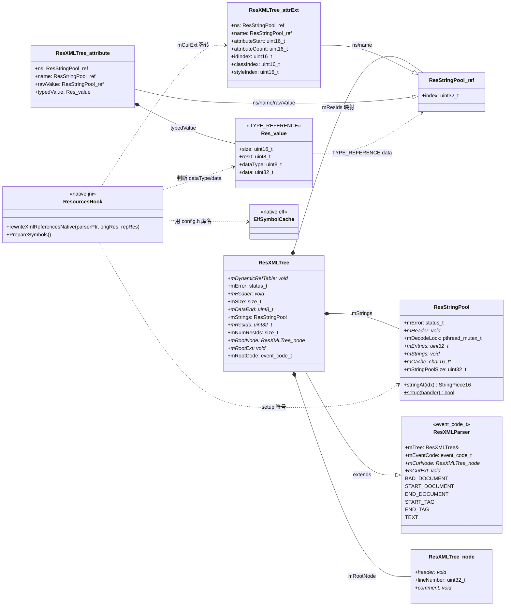
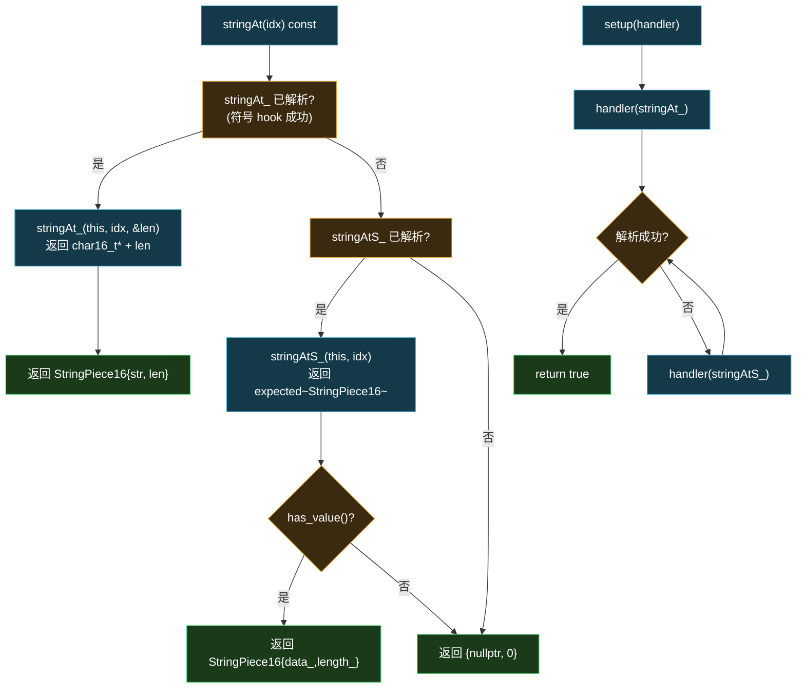

# 🧱 native · framework / common 包

> 📂 [`native/include/framework/android_types.h`](https://github.com/android-security-engineer/Vector-skills/blob/master/native/include/framework/android_types.h) · [`native/include/common/config.h`](https://github.com/android-security-engineer/Vector-skills/blob/master/native/include/common/config.h) · [`native/include/common/logging.h`](https://github.com/android-security-engineer/Vector-skills/blob/master/native/include/common/logging.h)
> 🟦 系统库结构镜像与编译期常量

## 包职责

- **framework**：镜像 `libandroidfw.so` 与 ART 内部 C++ 结构（`ResXMLParser`、`ResStringPool`、`Res_value` 等），供 native 层直接操作二进制资源。结构布局严格对齐 AOSP `frameworks/base/libs/androidfw`。
- **common**：编译期常量（库名、版本、调试标志、位宽选择宏）与基于 `fmt` 的轻量日志框架。

## 类协作

[`android_types.h`](https://github.com/android-security-engineer/Vector-skills/blob/master/native/include/framework/android_types.h) 镜像 AOSP 资源结构，其中 `ResXMLTree` 继承 `ResXMLParser`，持有 `ResStringPool` 与 `ResXMLTree_node` 数组；`ResStringPool` 用 LSPlant DSL 声明 32/64 位双签名符号 `stringAt_`/`stringAtS_`，经 `setup` 交给 `HookHandler` 解析；[`config.h`](https://github.com/android-security-engineer/Vector-skills/blob/master/native/include/common/config.h) 的库名常量供符号解析使用，[`logging.h`](https://github.com/android-security-engineer/Vector-skills/blob/master/native/include/common/logging.h) 提供 `LOG*` 宏。`mCurExt` 在 `START_TAG` 时指向 `ResXMLTree_attrExt`，被 `ResourcesHook::rewriteXmlReferencesNative` 直接强转使用。



`ResStringPool.stringAt` 的 32/64 位符号 hook 选择流程：



## 文件清单

| 文件 | 子包 | 内容 |
| :--- | :--- | :--- |
| `framework/android_types.h` | framework | `libandroidfw` 内部结构镜像、`ResStringPool` 符号 hook |
| `common/config.h` | common | 编译期常量、`LP_SELECT` 位宽宏 |
| `common/logging.h` | common | `LOGV/LOGD/LOGI/LOGW/LOGE/LOGF/PLOGE` 宏 |

---

## framework/android_types.h

`namespace android`—— 镜像 AOSP `ResourceTypes.h` 的内部结构。引用源：[android/platform/superproject · frameworks/base/libs/androidfw](https://cs.android.com/android/platform/superproject/+/android-latest-release:frameworks/base/libs/androidfw/include/androidfw/ResourceTypes.h)。

### 基础类型与工具

```cpp
typedef int32_t status_t;

template <class E> struct unexpected { E val_; };
template <class T, class E> struct expected {
    using value_type = T; using error_type = E; using unexpected_type = unexpected<E>;
    std::variant<value_type, unexpected_type> var_;
    constexpr bool has_value() const noexcept;
    constexpr const T &value() const &;
    constexpr T &value() &;
    constexpr const T *operator->() const;
    constexpr T *operator->();
};

enum class IOError { PAGES_MISSING = -1 };

template <typename TChar> struct BasicStringPiece { const TChar *data_; size_t length_; };
using StringPiece16 = BasicStringPiece<char16_t>;
using NullOrIOError = std::variant<std::nullopt_t, IOError>;
```

`expected` 是 C++23 前的 `std::expected` 简化镜像，`ResStringPool::stringAtS_` 返回 `expected<StringPiece16, NullOrIOError>`。

### 资源 chunk 类型枚举

```cpp
enum {
    RES_NULL_TYPE = 0x0000, RES_STRING_POOL_TYPE = 0x0001,
    RES_TABLE_TYPE = 0x0002, RES_XML_TYPE = 0x0003,
    RES_XML_FIRST_CHUNK_TYPE = 0x0100, RES_XML_START_NAMESPACE_TYPE = 0x0100,
    RES_XML_END_NAMESPACE_TYPE = 0x0101, RES_XML_START_ELEMENT_TYPE = 0x0102,
    RES_XML_END_ELEMENT_TYPE = 0x0103, RES_XML_CDATA_TYPE = 0x0104,
    RES_XML_LAST_CHUNK_TYPE = 0x017f, RES_XML_RESOURCE_MAP_TYPE = 0x0180,
    RES_TABLE_PACKAGE_TYPE = 0x0200, RES_TABLE_TYPE_TYPE = 0x0201,
    RES_TABLE_TYPE_SPEC_TYPE = 0x0202, RES_TABLE_LIBRARY_TYPE = 0x0203
};
```

### ResXMLParser / ResXMLTree

```cpp
class ResXMLParser {
public:
    enum event_code_t {
        BAD_DOCUMENT = -1, START_DOCUMENT = 0, END_DOCUMENT = 1,
        FIRST_CHUNK_CODE = RES_XML_FIRST_CHUNK_TYPE,
        START_NAMESPACE = RES_XML_START_NAMESPACE_TYPE,
        END_NAMESPACE = RES_XML_END_NAMESPACE_TYPE,
        START_TAG = RES_XML_START_ELEMENT_TYPE,
        END_TAG = RES_XML_END_ELEMENT_TYPE,
        TEXT = RES_XML_CDATA_TYPE
    };
    const ResXMLTree &mTree;
    event_code_t mEventCode;
    const ResXMLTree_node *mCurNode;
    const void *mCurExt;
};

class ResXMLTree : public ResXMLParser {
public:
    void *mDynamicRefTable;
    status_t mError;
    void *mOwnedData;
    const void *mHeader;
    size_t mSize;
    const uint8_t *mDataEnd;
    ResStringPool mStrings;
    const uint32_t *mResIds;
    size_t mNumResIds;
    const ResXMLTree_node *mRootNode;
    const void *mRootExt;
    event_code_t mRootCode;
};
```

`mCurExt` 在 `START_TAG` 时指向 `ResXMLTree_attrExt`，被 `ResourcesHook::rewriteXmlReferencesNative` 直接强转使用。

### ResStringPool（含符号 hook）

```cpp
class ResStringPool {
public:
    status_t mError;
    void *mOwnedData;
    const void *mHeader;
    size_t mSize;
    mutable pthread_mutex_t mDecodeLock;
    const uint32_t *mEntries;
    const uint32_t *mEntryStyles;
    const void *mStrings;
    char16_t mutable **mCache;
    uint32_t mStringPoolSize;
    const uint32_t *mStyles;
    uint32_t mStylePoolSize;

    using stringAtRet = expected<StringPiece16, NullOrIOError>;

    // 32/64 位双签名（| 运算符编译期选择）
    inline static auto stringAtS_ = ("_ZNK7android13ResStringPool8stringAtEjPj"_sym |
                                     "_ZNK7android13ResStringPool8stringAtEmPm"_sym)
                                        .as<stringAtRet (ResStringPool::*)(size_t)>;
    inline static auto stringAt_ = ("_ZNK7android13ResStringPool8stringAtEj"_sym |
                                    "_ZNK7android13ResStringPool8stringAtEm"_sym)
                                       .as<const char16_t *(ResStringPool::*)(size_t, size_t *)>;

    StringPiece16 stringAt(size_t idx) const;
    static bool setup(const lsplant::HookHandler &handler);
};
```

`stringAt_`/`stringAtS_` 是 LSPlant DSL 的符号引用，用 `|` 在 32 位（`j`/`m` 为 `unsigned int`）与 64 位（`m`/`Pm` 为 `unsigned long`）mangled 名间编译期选择。`setup` 把它们交给 `HookHandler` 解析。`stringAt(idx)` 优先用 `stringAt_`（返回 `char16_t*`+长度），回退 `stringAtS_`（返回 `expected`）。

### 资源值结构

```cpp
struct Res_value {
    uint16_t size;
    uint8_t res0;
    enum : uint8_t {
        TYPE_NULL = 0x00, TYPE_REFERENCE = 0x01, TYPE_ATTRIBUTE = 0x02,
        TYPE_STRING = 0x03, TYPE_FLOAT = 0x04, TYPE_DIMENSION = 0x05,
        TYPE_FRACTION = 0x06, TYPE_DYNAMIC_REFERENCE = 0x07, TYPE_DYNAMIC_ATTRIBUTE = 0x08,
        TYPE_FIRST_INT = 0x10, TYPE_INT_DEC = 0x10, TYPE_INT_HEX = 0x11,
        TYPE_INT_BOOLEAN = 0x12, TYPE_FIRST_COLOR_INT = 0x1c,
        TYPE_INT_COLOR_ARGB8 = 0x1c, TYPE_INT_COLOR_RGB8 = 0x1d,
        TYPE_INT_COLOR_ARGB4 = 0x1e, TYPE_INT_COLOR_RGB4 = 0x1f,
        TYPE_LAST_COLOR_INT = 0x1f, TYPE_LAST_INT = 0x1f
    };
    uint8_t dataType;
    enum { /* COMPLEX_UNIT_* / COMPLEX_RADIX_* / COMPLEX_MANTISSA_* */ };
    enum { DATA_NULL_UNDEFINED = 0, DATA_NULL_EMPTY = 1 };
    typedef uint32_t data_type;
    data_type data;
};

struct ResStringPool_ref { uint32_t index; };

struct ResXMLTree_attrExt {
    struct ResStringPool_ref ns;
    struct ResStringPool_ref name;
    uint16_t attributeStart;
    uint16_t attributeSize;
    uint16_t attributeCount;
    uint16_t idIndex;
    uint16_t classIndex;
    uint16_t styleIndex;
};

struct ResXMLTree_attribute {
    struct ResStringPool_ref ns;
    struct ResStringPool_ref name;
    struct ResStringPool_ref rawValue;
    Res_value typedValue;
};

struct ResXMLTree_node {
    void *header;
    uint32_t lineNumber;
    void *comment;
};
```

`Res_value.dataType` 与 `data` 是 `ResourcesHook::rewriteXmlReferencesNative` 判断是否翻译属性值引用的依据（`TYPE_REFERENCE` 且 `data >= 0x7f000000`）。

---

## common/config.h

`namespace vector::native`—— 编译期常量。

```cpp
[[nodiscard]] constexpr bool IsDebugBuild();  // NDEBUG → false
inline constexpr bool kIsDebugBuild = IsDebugBuild();

#if defined(__LP64__)
#define LP_SELECT(lp32, lp64) lp64
#else
#define LP_SELECT(lp32, lp64) lp32
#endif

inline constexpr auto kArtLibraryName      = "libart.so";
inline constexpr auto kBinderLibraryName   = "libbinder.so";
inline constexpr auto kFrameworkLibraryName = "libandroidfw.so";
inline constexpr auto kLinkerPath          = "/linker";

const int kVersionCode = VERSION_CODE;       // 构建系统注入
const char *const kVersionName = VERSION_NAME;
```

- `kIsDebugBuild`——控制 `HookInline`/`UnhookInline` 是否 `dladdr` 记录符号、`hookMethod` 是否计时。
- `LP_SELECT(lp32, lp64)`——按位宽选择值，用于 mangled 名（`ResXMLParser::getAttributeNameID`）与签名差异。
- 库名常量供 `ElfSymbolCache` 与 `ResourcesHook::PrepareSymbols` 使用。

---

## common/logging.h

基于 `fmt` + `__android_log_write` 的轻量日志。tag 默认 `"VectorNative"`（可被 `-DLOG_TAG=...` 覆盖）。

### 实现

```cpp
namespace vector::native::detail {
template <typename... T>
inline void LogToAndroid(int prio, const char *tag, fmt::format_string<T...> fmt, T &&...args) {
    std::array<char, 1024> buf{};
    auto result = fmt::format_to_n(buf.data(), buf.size() - 1, fmt, std::forward<T>(args)...);
    buf[result.size] = '\0';
    __android_log_write(prio, tag, buf.data());
}
}
```

栈上 1024 字节缓冲，`format_to_n` 防溢出。`fmt::format_string<T...>` 保证编译期格式串校验。

### 宏

```cpp
#ifdef LOG_DISABLED
#define LOGV(...) ((void)0)  // ... 全部空操作
#else
#ifndef NDEBUG
#define LOGD(fmt, ...)  // 带 __FILE__/__LINE__/__PRETTY_FUNCTION__
#define LOGV(fmt, ...)  // 仅格式串
#else
#define LOGV(...) ((void)0)
#define LOGD(...) ((void)0)
#endif
#define LOGI(fmt, ...)  // ANDROID_LOG_INFO
#define LOGW(fmt, ...)  // ANDROID_LOG_WARN
#define LOGE(fmt, ...)  // ANDROID_LOG_ERROR
#define LOGF(fmt, ...)  // ANDROID_LOG_FATAL
#define PLOGE(fmt, ...) LOGE(fmt " failed with error {}: {}", ##__VA_ARGS__, errno, strerror(errno))
#endif
```

| 宏 | 级别 | release | debug 附加信息 |
| :--- | :--- | :--- | :--- |
| `LOGV` | VERBOSE | 编译掉 | 仅格式串 |
| `LOGD` | DEBUG | 编译掉 | 文件/行/函数 |
| `LOGI` | INFO | 输出 | — |
| `LOGW` | WARN | 输出 | — |
| `LOGE` | ERROR | 输出 | — |
| `LOGF` | FATAL | 输出 | — |
| `PLOGE` | ERROR | 输出 | 追加 `errno`+`strerror` |

`LOG_DISABLED` 定义后全部宏变空操作。

## 相关

- [native 模块总览](../modules/native)
- [native · jni 包](./native-jni)（`ResourcesHook` 依赖 `android_types.h` 的结构镜像）
- [native · elf 包](./native-elf)（`ElfSymbolCache` 用 `config.h` 的库名常量）
- [架构 · Native 原生库](../../architecture/native)
