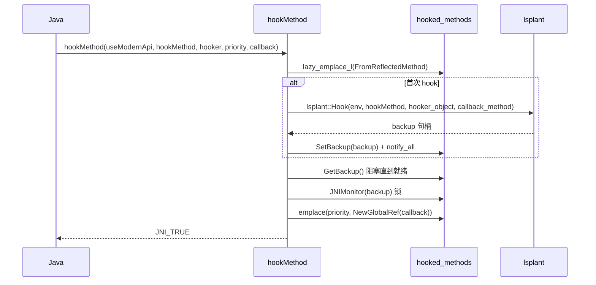
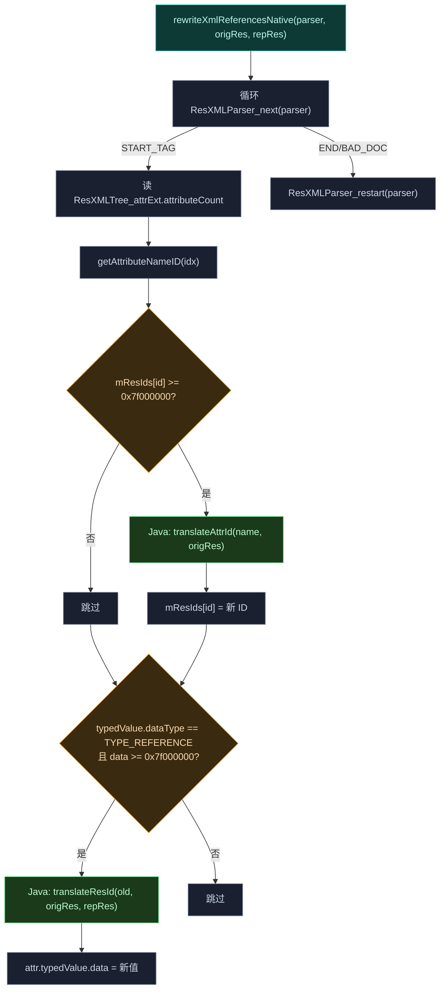

# 🔌 native · jni 包

> 📂 [`native/src/jni/`](https://github.com/android-security-engineer/Vector-skills/blob/master/native/src/jni/) · [`native/include/jni/`](https://github.com/android-security-engineer/Vector-skills/blob/master/native/include/jni/)
> 🟦 native↔Java 业务逻辑桥

## 包职责

`jni` 包实现 native 库对 Java 层暴露的 JNI 桥：ART 方法 hook 引擎、二进制 XML 资源改写、第三方 native 模块注册入口。所有桥通过 `Context::InitHooks` 统一注册。

## 文件清单

| 文件 | 类/桥 | 说明 |
| :--- | :--- | :--- |
| `hook_bridge.cpp` | `HookBridge` | ART 方法 hook 引擎：并发 registry、回调优先级、原方法调用 |
| `resources_hook.cpp` | `ResourcesHook` | 二进制 XML 资源改写 + 动态 DEX 构建 |
| `native_api_bridge.cpp` | `NativeAPI` | native 模块注册入口（记录 `.so` 名） |
| `jni_bridge.h` | — | JNI 桥宏与混淆签名解析 |
| `jni_hooks.h` | — | 三个注册函数声明 |

---

## HookBridge

`namespace vector::native::jni`—— ART 方法 hook 的核心引擎。维护线程安全的 hook registry，原子管理备份方法句柄，支持 modern/legacy 两类回调按优先级排序。

### 内部结构 HookItem

```cpp
struct HookItem {
    std::multimap<jint, jobject, std::greater<>> legacy_callbacks;  // 优先级→回调
    std::multimap<jint, jobject, std::greater<>> modern_callbacks;
    std::atomic<jobject> backup{nullptr};  // 原方法句柄，三态：nullptr/FAILED/有效
    static inline jobject FAILED = reinterpret_cast<jobject>(
        std::numeric_limits<uintptr_t>::max());  // hook 失败哨兵

    jobject GetBackup();   // 阻塞等待 backup 非 nullptr，FAILED 返回 nullptr
    void SetBackup(jobject);  // CAS 一次性设置，notify_all 唤醒等待者
};
```

`backup` 是 `std::atomic<jobject>`（`is_always_lock_free`），三态语义：

- `nullptr`——hook 尚未初始化，`GetBackup` 用 `backup.wait` 阻塞；
- `FAILED`——hook 失败，`GetBackup` 返回 `nullptr`；
- 有效 `jobject`——原方法句柄。

### registry

```cpp
template <class K, class V, ...>
using SharedHashMap = phmap::parallel_flat_hash_map<..., std::shared_mutex>;

SharedHashMap<jmethodID, std::unique_ptr<HookItem>> hooked_methods;
jmethodID invoke = nullptr;  // 缓存 Method.invoke
```

用 `parallel_flat_hash_map` + `shared_mutex` 支持并发读、独占写。`jmethodID` → `HookItem`。

### JNI 方法

```cpp
// 安装 hook（首次时 lsplant::Hook，注册回调）
VECTOR_DEF_NATIVE_METHOD(jboolean, HookBridge, hookMethod,
    jboolean useModernApi, jobject hookMethod, jclass hooker,
    jint priority, jobject callback);

// 移除指定回调
VECTOR_DEF_NATIVE_METHOD(jboolean, HookBridge, unhookMethod,
    jboolean useModernApi, jobject hookMethod, jobject callback);

// 请求去优化（JIT 编译方法）
VECTOR_DEF_NATIVE_METHOD(jboolean, HookBridge, deoptimizeMethod, jobject hookMethod);

// 调用原方法（经 backup + Method.invoke）
VECTOR_DEF_NATIVE_METHOD(jobject, HookBridge, invokeOriginalMethod,
    jobject hookMethod, jobject thiz, jobjectArray args);

// 非虚调用 + 特殊初始化（CallNonvirtual*MethodA）
VECTOR_DEF_NATIVE_METHOD(jobject, HookBridge, invokeSpecialMethod,
    jobject method, jcharArray shorty, jclass cls,
    jobject thiz, jobjectArray args);

VECTOR_DEF_NATIVE_METHOD(jobject, HookBridge, allocateObject, jclass cls);
VECTOR_DEF_NATIVE_METHOD(jboolean, HookBridge, instanceOf, jobject object, jclass expected_class);
VECTOR_DEF_NATIVE_METHOD(jboolean, HookBridge, setTrusted, jobject cookie);
VECTOR_DEF_NATIVE_METHOD(jobjectArray, HookBridge, callbackSnapshot, jclass callback_class, jobject method);
VECTOR_DEF_NATIVE_METHOD(jobject, HookBridge, getStaticInitializer, jclass target_class);
```

### hookMethod 流程



### invokeSpecialMethod 设计

非虚方法调用的 JNI 后端，镜像标准 Java 反射语义：

1. **全局缓存**包装类（`Number`/`Boolean`/`Character`/`Integer`/`Double`/`Long`/`Float`/`Short`/`Byte`）与 `InvocationTargetException`，进程级一次初始化。
2. **参数校验**：`args.length` 须匹配 `shorty` 参数数；`thiz` 非空；基本类型遇 `null` 抛 `IllegalArgumentException`。
3. **栈上分配** `jvalue`（`alloca`）。
4. **安全拆箱**：按 `shorty` 字符（`Z`/`C`/`I`/`D`/`J`/`F`/`S`/`B`/`L`/`[`）取值，`Character` 可隐式宽化为数值。
5. **非虚分发**：按返回类型 switch `CallNonvirtual*MethodA`。
6. **异常包装**：捕获目标异常包装为 `InvocationTargetException` 抛出。
7. **装箱返回**：按返回类型 `valueOf` 装箱。

### 注册

```cpp
void RegisterHookBridge(JNIEnv *env);
```

缓存 `Method.invoke` 后调用 `REGISTER_VECTOR_NATIVE_METHODS(HookBridge)` 注册 `gMethods` 表（10 个方法）。debug 构建下 `hookMethod` 用 RAII `finally` 计时新 hook 耗时。

---

## ResourcesHook

`namespace vector::native::jni`—— 二进制 XML 资源改写 + 运行时 DEX 构建。依赖 `framework/android_types.h` 镜像的 `libandroidfw.so` 内部结构。

### 类型别名

```cpp
using TYPE_GET_ATTR_NAME_ID = int32_t (*)(void *, int);
using TYPE_STRING_AT = char16_t *(*)(const void *, int32_t, size_t *);
using TYPE_RESTART = void (*)(void *);
using TYPE_NEXT = int32_t (*)(void *);
```

### PrepareSymbols

```cpp
static bool PrepareSymbols();
```

用 `ElfImage(kFrameworkLibraryName)` 解析 `libandroidfw.so`，按 mangled 名定位私有函数：

- `_ZN7android12ResXMLParser4nextEv` → `ResXMLParser_next`
- `_ZN7android12ResXMLParser7restartEv` → `ResXMLParser_restart`
- `LP_SELECT(...)` → `ResXMLParser_getAttributeNameID`（32/64 位不同签名）

并调 `android::ResStringPool::setup` 注册 `stringAt` 符号解析。

### JNI 方法

```cpp
// 初始化：解析混淆的 XResources 类名、缓存方法 ID、PrepareSymbols
VECTOR_DEF_NATIVE_METHOD(jboolean, ResourcesHook, initXResourcesNative);

// 去除 final 修饰（lsplant::MakeClassInheritable）
VECTOR_DEF_NATIVE_METHOD(jboolean, ResourcesHook, makeInheritable, jclass target_class);

// 内存构建含 dummy 类的 InMemoryDexClassLoader
VECTOR_DEF_NATIVE_METHOD(jobject, ResourcesHook, buildDummyClassLoader,
    jobject parent, jstring resource_super_class, jstring typed_array_super_class);

// 核心：遍历二进制 XML 改写资源引用
VECTOR_DEF_NATIVE_METHOD(void, ResourcesHook, rewriteXmlReferencesNative,
    jlong parserPtr, jobject origRes, jobject repRes);
```

### rewriteXmlReferencesNative 核心



遍历二进制 XML token，对 `START_TAG` 逐属性处理：属性名 ID 与属性值引用只要 `>= 0x7f000000`（应用包资源段）就回调 Java 翻译，**直接修改解析器内存**中的资源 ID 表。`goto leave` 统一退出后 `restart` 重置解析器供重读。

### buildDummyClassLoader

用 `startop::dex::DexBuilder` 在内存生成 DEX，含 `xposed/dummy/XResourcesSuperClass` 与 `xposed/dummy/XTypedArraySuperClass` 两个 dummy 子类（超类由 Java 调用方指定），`CreateImage` 后包进 `ByteBuffer` 交 `InMemoryDexClassLoader`。

### 混淆类名解析

```cpp
static std::string GetXResourcesClassName();
```

从 `ConfigBridge::obfuscation_map()` 查 key `"android.content.res.XRes"`，取混淆前缀 + `"ources"` 拼出运行时类名。静态局部变量仅解析一次。

---

## NativeAPI

`native_api_bridge.cpp`—— 第三方 native 模块注册入口的 JNI 桥。

```cpp
VECTOR_DEF_NATIVE_METHOD(void, NativeAPI, recordNativeEntrypoint, jstring jstr) {
    lsplant::JUTFString str(env, jstr);
    vector::native::RegisterNativeLib(str);  // 委托 core/native_api
}

static JNINativeMethod gMethods[] = {
    VECTOR_NATIVE_METHOD(NativeAPI, recordNativeEntrypoint, "(Ljava/lang/String;)V")};

void RegisterNativeApiBridge(JNIEnv *env);
```

Java 层调用 `NativeAPI.recordNativeEntrypoint("libmymodule.so")` 即把该 `.so` 登记为 native 模块，后续 `do_dlopen` 加载时触发其 `native_init`。

---

## jni_bridge.h（宏与辅助）

`namespace vector::native::jni`—— JNI 桥的通用基础设施。

### ArraySize

```cpp
template <typename T, size_t N>
[[nodiscard]] constexpr inline size_t ArraySize(T (&)[N]);
```

编译期静态数组元素数，用于指针会编译报错。

### GetNativeBridgeSignature

```cpp
inline std::string GetNativeBridgeSignature();
```

从 `ConfigBridge::obfuscation_map()` 查 key `"org.matrix.vector.nativebridge."`，返回混淆后的 JNI 包签名前缀（如 `"org/matrix/vector/nativebridge/"`）。找不到则回退默认值。

### RegisterNativeMethodsInternal

```cpp
[[gnu::always_inline]]
inline bool RegisterNativeMethodsInternal(JNIEnv *env, std::string_view class_name,
                                          const JNINativeMethod *methods, jint method_count);
```

经 `Context::FindClassFromCurrentLoader` 定位类后 `RegisterNatives`。`Context` 为空或类找不到时 `LOGF` 并返回 `false`。

### 宏

```cpp
#define VECTOR_JNI_CAST(to) reinterpret_cast<to>

#define VECTOR_NATIVE_METHOD(className, functionName, signature) \
    {#functionName, signature, \
     VECTOR_JNI_CAST(void *)(Java_org_matrix_vector_nativebridge_##className##_##functionName)}

#define JNI_START [[maybe_unused]] JNIEnv *env, [[maybe_unused]] jclass clazz

#define VECTOR_DEF_NATIVE_METHOD(ret, className, functionName, ...) \
    extern "C" JNIEXPORT ret JNICALL \
        Java_org_matrix_vector_nativebridge_##className##_##functionName(JNI_START, ##__VA_ARGS__)

#define REGISTER_VECTOR_NATIVE_METHODS(class_name) \
    RegisterNativeMethodsInternal(env, GetNativeBridgeSignature() + #class_name, \
                                  gMethods, ArraySize(gMethods))
```

- `VECTOR_NATIVE_METHOD`——构造 `JNINativeMethod` 条目，自动生成 JNI 期望的 mangled C 函数名。
- `VECTOR_DEF_NATIVE_METHOD`——定义带正确 name-mangling 的 C++ 函数实现。
- `REGISTER_VECTOR_NATIVE_METHODS`——把 `gMethods` 表注册到混淆签名后的类。

---

## jni_hooks.h（注册声明）

```cpp
namespace vector::native::jni {
void RegisterHookBridge(JNIEnv *env);
void RegisterNativeApiBridge(JNIEnv *env);
void RegisterResourcesHook(JNIEnv *env);
}
```

三个注册函数的声明，由 `Context::InitHooks` 依次调用。各 `.cpp` 文件提供实现。

## 相关

- [native 模块总览](../modules/native)
- [native · core 包](./native-core)（`Context::InitHooks` 调用三个 `Register*`）
- [native · framework 包](./native-framework)（`android_types.h` 被 `resources_hook.cpp` 依赖）
- [架构 · Native 原生库](../../architecture/native)
