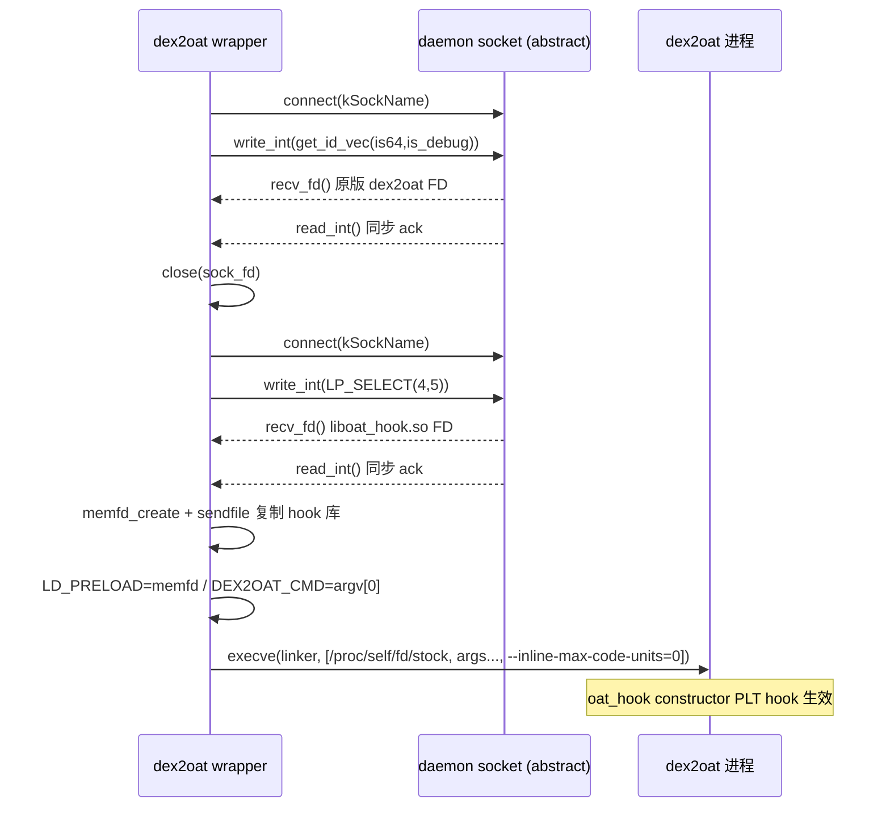

# 🧩 Daemon Socket（C++）

> 📂 [`dex2oat/src/main/cpp/dex2oat.cpp`](https://github.com/android-security-engineer/Vector-skills/blob/master/dex2oat/src/main/cpp/dex2oat.cpp)
> 🟦 dex2oat 模块 · dex2oat wrapper 与 daemon 间的 unix domain socket

## 类职责

`dex2oat.cpp`（匿名命名空间内的辅助函数 + `main`）是 **dex2oat wrapper 的 socket 客户端**。Vector 用自研 wrapper 替换系统 `dex2oat`，wrapper 启动时通过 **abstract namespace unix domain socket** 连接 daemon，用 `SCM_RIGHTS` 辅助数据接收两个文件描述符（原版 `dex2oat` 二进制 FD、`liboat_hook.so` FD），再 `memfd_create`+`sendfile` 把 hook 库复制到匿名内存文件，最后经 linker `LD_PRELOAD` 注入执行原版 dex2oat。

socket 名 `kSockName = "5291374ceda0aef7c5d86cd2a4f6a3ac"` 是固定摘要名，daemon 端 `bind` 同名 socket 监听。

## socket 地址（abstract namespace）

```cpp
constexpr char kSockName[] = "5291374ceda0aef7c5d86cd2a4f6a3ac";

struct sockaddr_un sock = {};
sock.sun_family = AF_UNIX;
std::strncpy(sock.sun_path + 1, kSockName, sizeof(sock.sun_path) - 2);  // sun_path[0]='\0'
socklen_t len = sizeof(sock.sun_family) + strlen(kSockName) + 1;        // 摘要长度

int sock_fd = socket(AF_UNIX, SOCK_STREAM, 0);
connect(sock_fd, reinterpret_cast<struct sockaddr *>(&sock), len);
```

`sun_path[0]` 保持 `\0` 即 abstract namespace（不落盘，进程退出自动消失，免权限文件）。`len` 只算 family + 前导 `\0` + 名长度，不含尾部 padding——这是 abstract socket 的正确长度计算。

## FD 传递 SCM_RIGHTS

```cpp
void *recv_fds(int sockfd, char *cmsgbuf, size_t bufsz, int cnt) {
    struct iovec iov = { .iov_base = &cnt, .iov_len = sizeof(cnt) };  // 数据载荷：期望 FD 数
    struct msghdr msg = { .msg_name=nullptr, .msg_namelen=0, .msg_iov=&iov, .msg_iovlen=1,
                          .msg_control=cmsgbuf, .msg_controllen=bufsz, .msg_flags=0 };
    if (xrecvmsg(sockfd, &msg, MSG_WAITALL) < 0) return nullptr;
    struct cmsghdr *cmsg = CMSG_FIRSTHDR(&msg);
    if (msg.msg_controllen != bufsz || cmsg == nullptr ||
        cmsg->cmsg_len != CMSG_LEN(sizeof(int) * cnt) ||
        cmsg->cmsg_level != SOL_SOCKET || cmsg->cmsg_type != SCM_RIGHTS) {
        return nullptr;   // 严格校验辅助数据
    }
    return CMSG_DATA(cmsg);
}

int recv_fd(int sockfd) {
    char cmsgbuf[CMSG_SPACE(sizeof(int))];
    void *data = recv_fds(sockfd, cmsgbuf, sizeof(cmsgbuf), 1);
    if (data == nullptr) return -1;
    int result; std::memcpy(&result, data, sizeof(int));
    return result;
}
```

`recvmsg` 同时收数据载荷（`iov` 里放期望 FD 数 `cnt`）与辅助数据（`cmsgbuf` 里 `SCM_RIGHTS` 携带的 FD 数组）。严格校验 `cmsg_len`/level/type，防止畸形消息。`recv_fd` 是 `cnt=1` 的便捷封装。`MSG_WAITALL` 确保收全。

## 命令/同步原语

```cpp
int read_int(int fd) { int val; if (read(fd,&val,sizeof(val))!=sizeof(val)) return -1; return val; }
void write_int(int fd, int val) { if (fd < 0) return; (void)write(fd, &val, sizeof(val)); }
```

每轮交互：`write_int` 发请求 ID → `recv_fd` 收 FD → `read_int` 收同步 ack，然后 `close`。请求 ID 含义由 daemon 端定义。

## 请求 ID 计算

```cpp
inline int get_id_vec(bool is64, bool is_debug) {
    return (static_cast<int>(is64) << 1) | static_cast<int>(is_debug);
}
// 用法
write_int(sock_fd, get_id_vec(LP_SELECT(false, true), is_debug));   // 要原版 dex2oat FD
write_int(sock_fd, LP_SELECT(4, 5));                                 // 要 liboat_hook.so FD
```

`get_id_vec` 把架构位与 debug 位编码成一个 int，daemon 据此返回对应架构的原版 dex2oat（32/64、release/debug 共 4 种）。第二请求用纯数字 ID（4=32位 hook 库、5=64位）。`is_debug` 由 `argv[0]` 含 `dex2oatd` 判定。

## memfd 复制 hook 库

```cpp
int mem_fd = syscall(__NR_memfd_create, "liboat_hook_memfd", 0);
struct stat st; fstat(hooker_fd, &st);
off_t offset = 0;
sendfile(mem_fd, hooker_fd, &offset, st.st_size);   // 内核态直接拷贝
close(hooker_fd);
hooker_fd = mem_fd;   // 用 memfd 替换原始 FD
```

daemon 传来的 `hooker_fd` 是其进程内的 FD，跨进程后仍有效但语义脆弱。wrapper 用 `memfd_create` 建匿名内存文件，`sendfile` 把 hook 库内容拷进去，得到一个完全属于自己的、可 `mmap` 执行的 FD。失败则回退用原 FD。

## 执行与注入

```cpp
std::vector<const char *> exec_argv;
exec_argv.push_back(linker_path);                          // /apex/.../linker64
exec_argv.push_back(stock_fd_path);                        // /proc/self/fd/<stock_fd>
for (int i = 1; i < argc; ++i) exec_argv.push_back(argv[i]);  // 原始参数
exec_argv.push_back("--inline-max-code-units=0");          // 禁用 inline（反优化目的）
exec_argv.push_back(nullptr);

unsetenv("LD_LIBRARY_PATH");
setenv("LD_PRELOAD", ("/proc/self/fd/" + std::to_string(hooker_fd)).c_str(), 1);
setenv("DEX2OAT_CMD", argv[0], 1);   // 原始 dex2oat 路径，供 oat_hook 伪造 cmdline
execve(linker_path, const_cast<char *const *>(exec_argv.data()), environ);
```

不直接 `execve(dex2oat)`，而是经 **linker** 执行 `/proc/self/fd/<stock_fd>`（原版二进制），并 `LD_PRELOAD` 指向 hook 库的 memfd 路径——这样 `liboat_hook.so` 的 `__attribute__((constructor))` 在 dex2oat 进程启动时自动跑，PLT hook `OatHeader::GetKeyValueStore`（见 [deopt-trampoline](./deopt-trampoline)）。`--inline-max-code-units=0` 强制 dex2oat 不做方法 inline，让被 hook 的目标方法保持可 hook。

## socket 交互时序



## 相关

- [deopt-trampoline.md · 反优化跳板](./deopt-trampoline) — wrapper 注入的 `oat_hook.so` 伪造 dex2oat cmdline
- [dex2oat-wrapper.md · Kotlin 侧](../dex2oat-wrapper) — daemon 端 socket 服务与 FD 分发
- [dex2oat-hooker.md · dex2oat hook](../dex2oat-hooker) — 整体 dex2oat 拦截架构
- [native-core · native 总览](../native-core)
