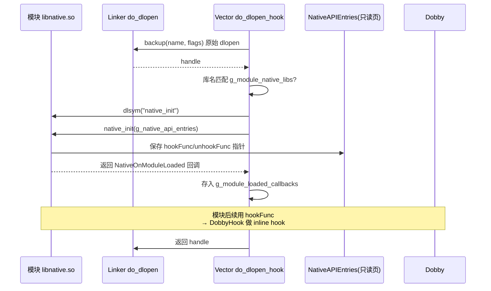

# 🧩 Inline Scope（C++）

> 📂 [`native/include/core/native_api.h`](https://github.com/android-security-engineer/Vector-skills/blob/master/native/include/core/native_api.h)
> 📂 [`native/src/core/native_api.cpp`](https://github.com/android-security-engineer/Vector-skills/blob/master/native/src/core/native_api.cpp)
> 🟦 native 模块 · Dobby inline hook 与 dlopen 拦截

## 类职责

`namespace vector::native` 的 **native API 子系统**（`native_api.h/cpp`）为 Vector 的 native 模块生态提供**稳定的 inline hook 公共 ABI**。它通过拦截动态链接器的 `do_dlopen`，在注册的模块 `.so` 被加载时调用其导出的 `native_init`，传入 `NativeAPIEntries` 结构体（含 `hookFunc`/`unhookFunc` 两个函数指针），让模块能用 Dobby 做 inline hook。

inline hook 的底层实现是 **Dobby**（`DobbyHook`/`DobbyDestroy`），非 edhook/ShadowHook。LSPlant 自身的 `inline_hooker` 回调也委托给同一 `HookInline`，保证 ART hook 与模块 native hook 共用一套 inline 引擎。

## NativeAPIEntries 公共 ABI

```cpp
// 函数指针类型
using HookFunType   = int (*)(void *func, void *replace, void **backup);
using UnhookFunType = int (*)(void *func);
using NativeOnModuleLoaded = void (*)(const char *name, void *handle);

// 暴露给 native 模块的结构体（公共 ABI，勿随意改）
struct NativeAPIEntries {
    uint32_t version;          // 版本号
    HookFunType hookFunc;      // inline hook
    UnhookFunType unhookFunc;  // unhook
};

using NativeInit = NativeOnModuleLoaded (*)(const NativeAPIEntries *entries);
```

模块 `.so` 必须导出 `NativeInit native_init`：接收 `NativeAPIEntries*`，保存函数指针，返回 `NativeOnModuleLoaded` 回调（之后每次有库加载时被回调，做"迟到"的 hook）。`version` 用于 ABI 兼容判断。

## HookInline / UnhookInline

```cpp
inline int HookInline(void *original, void *replace, void **backup) {
    if constexpr (kIsDebugBuild) {
        Dl_info info;
        if (dladdr(original, &info)) {
            LOGD("Dobby hooking {} ({}) from {} ({})",
                 info.dli_sname ?: "(unknown symbol)", info.dli_saddr ?: original,
                 info.dli_fname ?: "(unknown file)", info.dli_fbase);
        }
    }
    return DobbyHook(original, reinterpret_cast<dobby_dummy_func_t>(replace),
                     reinterpret_cast<dobby_dummy_func_t *>(backup));
}

inline int UnhookInline(void *original) {
    if constexpr (kIsDebugBuild) { /* dladdr 日志 */ }
    return DobbyDestroy(original);
}
```

直接转调 Dobby。debug 构建下用 `dladdr` 打印被 hook 符号名/来源文件，便于排查。`kIsDebugBuild` 编译期分支消除 release 日志开销。

## 只读 ABI 页

```cpp
std::unique_ptr<void, std::function<void(void *)>> g_api_page(
    mmap(nullptr, 4096, PROT_READ | PROT_WRITE, MAP_ANONYMOUS | MAP_PRIVATE, -1, 0),
    [](void *ptr) { if (ptr != MAP_FAILED) munmap(ptr, 4096); });

void InitializeApiEntries() {
    auto *entries = new (g_api_page.get()) NativeAPIEntries{
        .version = 2, .hookFunc = &HookInline, .unhookFunc = &UnhookInline};
    mprotect(g_api_page.get(), 4096, PROT_READ);   // 写完改只读
    g_native_api_entries = entries;
}
```

`NativeAPIEntries` 放在**单独的 mmap 页**，placement-new 填好后 `mprotect` 改 `PROT_READ`——模块拿到的只读指针，防止恶意/有 bug 的模块改写全局 hook 函数指针。RAII unique_ptr 析构 `munmap`。

## dlopen 拦截

```cpp
inline static auto do_dlopen_hook =
    "__dl__Z9do_dlopenPKciPK17android_dlextinfoPKv"_sym.hook->*
    []<lsplant::Backup auto backup>(const char *name, int flags, const void *extinfo,
                                    const void *caller_addr) static -> void * {
    void *handle = backup(name, flags, extinfo, caller_addr);   // 先放行原 dlopen
    const std::string lib_name = name ?: "null";
    if (handle == nullptr) return nullptr;

    std::lock_guard<std::mutex> lock(g_module_registry_mutex);
    for (std::string_view module_lib : g_module_native_libs) {       // 注册名匹配?
        if (HasEnding(lib_name, module_lib)) {
            void *init_sym = dlsym(handle, "native_init");
            auto native_init = reinterpret_cast<NativeInit>(init_sym);
            if (auto callback = native_init(g_native_api_entries))
                g_module_loaded_callbacks.push_back(callback);
            break;
        }
    }
    for (const auto &callback : g_module_loaded_callbacks)           // 通知所有模块
        callback(name, handle);
    return handle;
};

bool InstallNativeAPI(const lsplant::HookHandler &handler) { return handler(do_dlopen_hook); }
```

用 LSPlant 的 C++20 hook DSL（`"_sym".hook ->* []<auto backup>(...){...}`）hook linker 的 `do_dlopen`。每次 dlopen 完成后：检查库名是否匹配已注册模块，匹配则 `dlsym("native_init")` 调用之传 ABI，回收其 `NativeOnModuleLoaded` 回调；最后对所有已初始化模块回调本次加载事件。`backup` 是原 `do_dlopen` trampoline。

## RegisterNativeLib 与 LSPlant 集成

```cpp
void RegisterNativeLib(const std::string &library_name) {
    static bool is_initialized = []() {
        InitializeApiEntries();
        return InstallNativeAPI(lsplant::InitInfo{
            .inline_hooker = [](void *target, void *replacement) {
                void *backup = nullptr;
                return HookInline(target, replacement, &backup) == 0 ? backup : nullptr;
            },
            .art_symbol_resolver = [](auto symbol) {
                return ElfSymbolCache::GetLinker()->getSymbAddress(symbol);
            },
        });
    }();
    // ...
    std::lock_guard<std::mutex> lock(g_module_registry_mutex);
    g_module_native_libs.push_back(library_name);
}
```

首次调用时一次性初始化 ABI 页并 `InstallNativeAPI`——同时把 LSPlant 的 `inline_hooker` 接到 `HookInline`（Dobby）、`art_symbol_resolver` 接到 `ElfSymbolCache::GetLinker()`。之后只把库名加入 `g_module_native_libs` 待匹配。`static` lambda 保证初始化只跑一次。

## 模块加载与 hook 流程



## 相关

- [symbol-resolver.md · ElfImage 符号查找](./symbol-resolver) — `ElfSymbolCache::GetLinker()` 服务 `art_symbol_resolver`
- [art-method-access.md · ArtMethod 跨版本访问](./art-method-access) — LSPlant 通过 `inline_hooker` 委托 Dobby
- [hook-bridge-cpp.md · ART hook 引擎](./hook-bridge-cpp) — `lsplant::Hook` 的 Java 侧注册
- [native-core · native 总览](../native-core)
