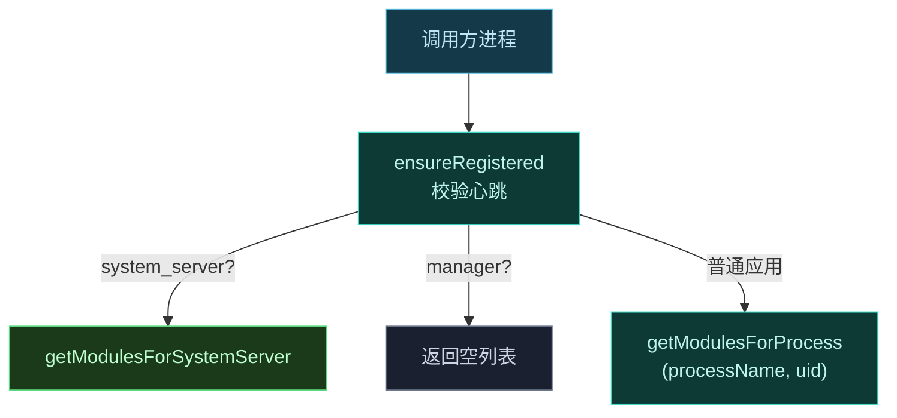
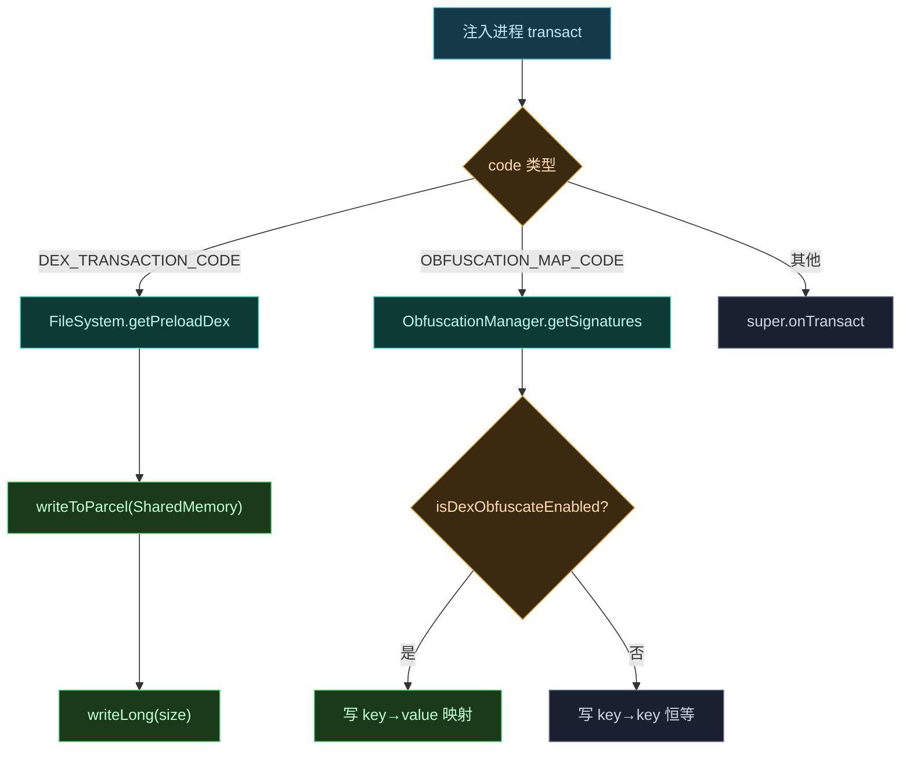

# 🔌 ILSPApplicationService · 注入进程端实现

`ApplicationService` 实现 `ILSPApplicationService`，是被注入的**应用进程**与 daemon 通信的桥梁，提供模块列表、偏好路径、管理器 binder 与共享 DEX。

> 📂 [`daemon/src/main/kotlin/org/matrix/vector/daemon/ipc/ApplicationService.kt`](https://github.com/android-security-engineer/Vector-skills/blob/master/daemon/src/main/kotlin/org/matrix/vector/daemon/ipc/ApplicationService.kt)
> 📡 services AIDL · `ILSPApplicationService`

## 职责

[`object ApplicationService : ILSPApplicationService.Stub()`](https://github.com/android-security-engineer/Vector-skills/blob/master/daemon/src/main/kotlin/org/matrix/vector/daemon/ipc/ApplicationService.kt#L27) 是注入进程获取运行时信息的服务端。每个应用进程通过 `requestApplicationService` 注册心跳后，即可调用本服务的接口。

## 核心方法

| 方法 | 职责 | 关键逻辑 |
| :--- | :--- | :--- |
| [`getAllModules`](https://github.com/android-security-engineer/Vector-skills/blob/master/daemon/src/main/kotlin/org/matrix/vector/daemon/ipc/ApplicationService.kt#L90-L99) | 按调用方身份返回模块集 | system_server→`getModulesForSystemServer`，管理器→空，普通应用→`getModulesForProcess` |
| [`getModulesList`](https://github.com/android-security-engineer/Vector-skills/blob/master/daemon/src/main/kotlin/org/matrix/vector/daemon/ipc/ApplicationService.kt#L101) | 现代模块列表 | 过滤 `file.legacy==false` |
| [`getLegacyModulesList`](https://github.com/android-security-engineer/Vector-skills/blob/master/daemon/src/main/kotlin/org/matrix/vector/daemon/ipc/ApplicationService.kt#L103) | legacy 模块列表 | 过滤 `file.legacy==true` |
| [`getPrefsPath`](https://github.com/android-security-engineer/Vector-skills/blob/master/daemon/src/main/kotlin/org/matrix/vector/daemon/ipc/ApplicationService.kt#L107-L110) | 返回模块共享偏好路径 | `ConfigCache.getPrefsPath(pkg, uid)` |
| [`requestInjectedManagerBinder`](https://github.com/android-security-engineer/Vector-skills/blob/master/daemon/src/main/kotlin/org/matrix/vector/daemon/ipc/ApplicationService.kt#L112-L131) | 寄生管理器 APK + Binder | 校验调用方为管理器，`InstallerVerifier` 校验签名 |
| [`onTransact`](https://github.com/android-security-engineer/Vector-skills/blob/master/daemon/src/main/kotlin/org/matrix/vector/daemon/ipc/ApplicationService.kt#L46-L68) | 自定义事务码分发 | DEX / OBFUSCATION_MAP 事务 |
| `registerHeartBeat` | 注册进程心跳 | `ProcessInfo.linkToDeath` |
| `ensureRegistered` | 越权防护 | `getCallingUid/Pid` 查表，未注册抛 `RemoteException` |

## 类结构

```mermaid
classDiagram
    class ILSPApplicationService_Stub {
        <<AIDL Stub>>
    }
    class ApplicationService {
        <<object>>
        -ConcurrentHashMap processes
        +registerHeartBeat(uid,pid,name,heartBeat) boolean
        +hasRegister(uid,pid) boolean
        -ensureRegistered() ProcessInfo
        -getAllModules() List~Module~
        +getModulesList() List~Module~
        +getLegacyModulesList() List~Module~
        +isLogMuted() boolean
        +getPrefsPath(pkg) String
        +requestInjectedManagerBinder(binderList) PFD?
        +onTransact(code,data,reply,flags) boolean
    }
    class ProcessKey {
        +int uid
        +int pid
    }
    class ProcessInfo {
        -ProcessKey key
        -String processName
        -IBinder heartBeat
        +binderDied()
    }
    class IBinder_DeathRecipient {
        <<interface>>
    }

    ILSPApplicationService_Stub <|-- ApplicationService : extends
    ApplicationService "1" o-- "many ProcessInfo" : processes map
    ProcessInfo --> ProcessKey : key
    IBinder_DeathRecipient <|.. ProcessInfo : implements
    note for ProcessInfo "init: linkToDeath + 写入 processes map\nbinderDied: unlinkToDeath + remove"
```

## 接口契约

```aidl
interface ILSPApplicationService {
    boolean isLogMuted();
    List<Module> getLegacyModulesList();
    List<Module> getModulesList();
    String getPrefsPath(String packageName);
    ParcelFileDescriptor requestInjectedManagerBinder(out List<IBinder> binder);
}
```

## 模块装载：按作用域分发

`getAllModules()` 是模块装载的核心，按调用进程身份返回不同模块集：



- `getModulesList()` 过滤掉 legacy 模块；
- `getLegacyModulesList()` 只返回 legacy 模块；
- system_server 进程取 `ConfigCache.getModulesForSystemServer()`；
- 管理器进程返回空（管理器不装载业务模块）。

## 心跳与作用域

`ProcessInfo` 持有 `(uid, pid, processName, heartBeat)`，`heartBeat.linkToDeath` 后进程死亡自动清理。`ensureRegistered()` 强制每次调用都校验调用方已注册，未注册抛 `RemoteException`，防止越权 IPC。

## 偏好路径

`getPrefsPath(packageName)` 返回模块共享偏好在调用方用户下的路径，供注入进程的 `XSharedPreferences` 读取：

```kotlin
override fun getPrefsPath(packageName: String): String {
    val info = ensureRegistered()
    return ConfigCache.getPrefsPath(packageName, info.key.uid)
}
```

## 自定义事务码

除 AIDL 声明的方法外，`onTransact` 还处理三个硬编码事务码，用于注入进程获取框架资源：

| 事务码 | 计算 | 作用 |
| :--- | :--- | :--- |
| `BRIDGE_TRANSACTION_CODE` | `('_'<<24)|('V'<<16)|('E'<<8)|'C'` | 桥接请求 |
| `DEX_TRANSACTION_CODE` | `('_'<<24)|('D'<<16)|('E'<<8)|'X'` | 返回预加载共享 DEX 的共享内存 |
| `OBFUSCATION_MAP_TRANSACTION_CODE` | `('_'<<24)|('O'<<16)|('B'<<8)|'F'` | 返回类名混淆映射表 |

混淆映射在 dex 混淆启用时返回 `key→value`，否则返回 `key→key`（恒等），保证注入进程按需还原真实类名。

### 事务码分发流程



## 寄生管理器 binder

`requestInjectedManagerBinder` 既返回 manager APK 的文件描述符，又向 `binderList` 塞入管理器 Binder。流程：校验调用方为管理器进程或 `postStartManager` 命中 → `ManagerService.obtainManagerBinder` 注册 `ManagerGuard` → `InstallerVerifier.verifyInstallerSignature` 校验 APK 签名 → 打开 `managerApkPath` 为只读 PFD。

## 相关

- daemon 端入口见 [daemon-service-impl](./daemon-service-impl)
- 管理器 binder 来源见 [manager-service-impl](./manager-service-impl)
- 混淆映射见 [reference/classes/daemon/obfuscation-manager](../daemon/obfuscation-manager)
- AIDL 契约见 [reference/aidl/ilspapplicationservice](../../aidl/ilspapplicationservice)
