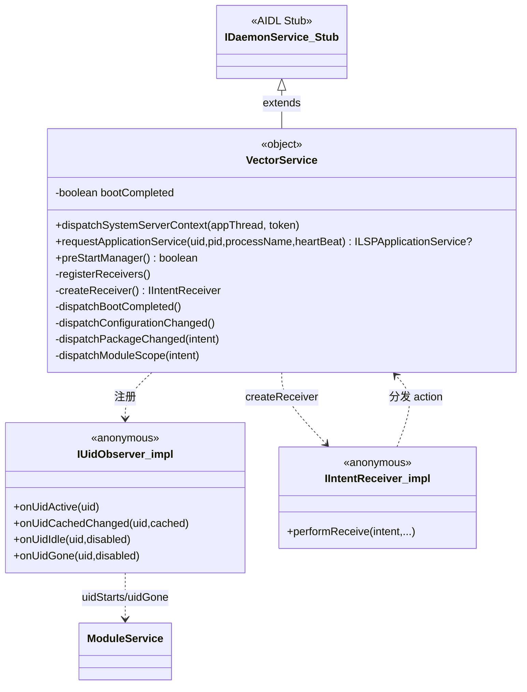
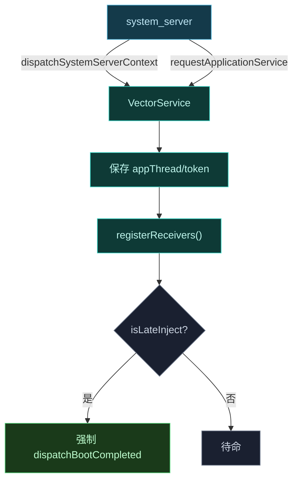
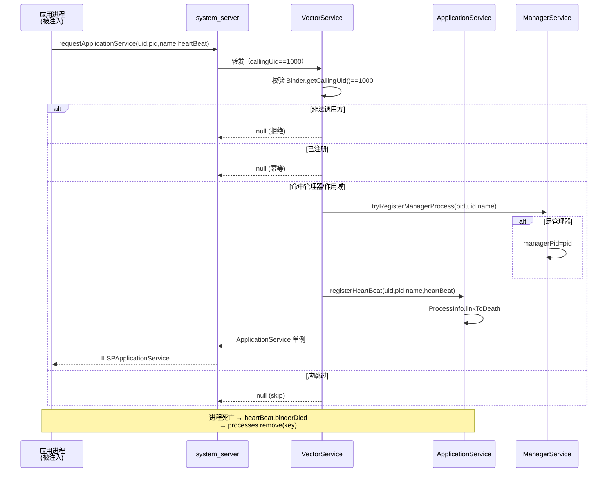

# 🛰️ IDaemonService · daemon 端实现

`IDaemonService` 是 Vector daemon 对外暴露的**根 Binder 服务**，由 `VectorService` 单例实现，经桥事务注入 `system_server`。

> 📂 [`daemon/src/main/kotlin/org/matrix/vector/daemon/VectorService.kt`](https://github.com/android-security-engineer/Vector-skills/blob/master/daemon/src/main/kotlin/org/matrix/vector/daemon/VectorService.kt)
> 📂 [`daemon/src/main/kotlin/org/matrix/vector/daemon/VectorDaemon.kt`](https://github.com/android-security-engineer/Vector-skills/blob/master/daemon/src/main/kotlin/org/matrix/vector/daemon/VectorDaemon.kt)（注入逻辑）
> 📡 services AIDL · `IDaemonService`

## 职责

[`object VectorService : IDaemonService.Stub()`](https://github.com/android-security-engineer/Vector-skills/blob/master/daemon/src/main/kotlin/org/matrix/vector/daemon/VectorService.kt#L33) 是 daemon 的入口 Binder。它接收 `system_server` 派发的上下文、注册系统广播与 UID 观察者、响应应用进程的服务请求、派发系统事件。命令分发与心跳管理是其核心。

## 核心方法

| 方法 | 职责 | 关键逻辑 |
| :--- | :--- | :--- |
| [`dispatchSystemServerContext`](https://github.com/android-security-engineer/Vector-skills/blob/master/daemon/src/main/kotlin/org/matrix/vector/daemon/VectorService.kt#L41-L55) | 接收 system_server 上下文 | 存 `appThread`/`token`，`registerReceivers()`，晚期注入则强制 boot completed |
| [`requestApplicationService`](https://github.com/android-security-engineer/Vector-skills/blob/master/daemon/src/main/kotlin/org/matrix/vector/daemon/VectorService.kt#L57-L79) | 响应应用进程心跳注册 | 校验 `callingUid==1000`，幂等去重，作用域判定，注册心跳后返回单例 |
| [`preStartManager`](https://github.com/android-security-engineer/Vector-skills/blob/master/daemon/src/main/kotlin/org/matrix/vector/daemon/VectorService.kt#L81) | 标记寄生管理器将启 | 转发 `ManagerService.preStartManager()` |
| `registerReceivers` | 注册系统广播与 UID 观察者 | 7 个 IntentFilter + 1 个 IUidObserver，Android 14+ 用 `RECEIVER_NOT_EXPORTED` |
| `dispatchPackageChanged` | 包变更派发 | 更新模块 DB、自动包含、广播通知管理器 |

## 类结构



## 接口契约

```aidl
interface IDaemonService {
    ILSPApplicationService requestApplicationService(int uid, int pid, String processName, IBinder heartBeat);
    oneway void dispatchSystemServerContext(in IBinder activityThread, in IBinder activityToken);
    boolean preStartManager();
}
```

## 命令分发

`dispatchSystemServerContext` 是 system_server 派发上下文的入口：保存 `appThread` 与 `activityToken`，注册广播接收器，若为晚期注入则强制派发 boot completed。



## 心跳：requestApplicationService

应用进程通过此方法向 daemon 申请 `ILSPApplicationService`。流程：

1. 校验调用方 `uid == 1000`（system_server 中转），否则拒绝；
2. 若进程已注册则返回 null（幂等）；
3. 判断是否为管理器进程，或是否命中作用域；命中则注册心跳；
4. `ApplicationService.registerHeartBeat` 成功才返回单例。

心跳的"活性"由 `ProcessInfo` 实现 `IBinder.DeathRecipient`：进程死亡时 `binderDied` 自动移除注册项，无需显式注销。

### requestApplicationService 时序



## 状态查询与事件派发

VectorService 通过广播接收器维护 daemon 运行状态：

| 事件 | 派发方法 | 处理 |
| :--- | :--- | :--- |
| `LOCKED_BOOT_COMPLETED` | `dispatchBootCompleted` | 标记 `bootCompleted`，按偏好显示状态通知 |
| `CONFIGURATION_CHANGED` | `dispatchConfigurationChanged` | 刷新状态通知 |
| 包变更 | `dispatchPackageChanged` | 更新模块 DB、自动包含、通知管理器 |
| 作用域请求 | `dispatchModuleScope` | approve/deny/delete/block 回调 |

UID 观察者将 `onUidActive`/`onUidCachedChanged`/`onUidIdle` 映射到 `ModuleService.uidStarts`，驱动模块 binder 的推模式投递。

## preStartManager

`preStartManager()` 转发至 `ManagerService.preStartManager()`，设置 `pendingManager` 标志，标记寄生管理器即将启动，使后续 `tryRegisterManagerProcess` 能识别首个管理器进程。

## 注入与 system_server 重启

注入逻辑在 `VectorDaemon.sendToBridge`：以 root 占位 `activity` 服务，通过 `BRIDGE_TRANSACTION_CODE` 把 `VectorService.asBinder()` 投递进 system_server。注入失败重试 3 次；system_server 崩溃时 `DeathRecipient` 清缓存并重新占位代理服务名后再次注入。

## 相关

- 应用侧服务见 [application-service-impl](./application-service-impl)
- 管理器侧见 [manager-service-impl](./manager-service-impl)
- system_server 通道见 [system-server-service-impl](./system-server-service-impl)
- AIDL 契约见 [reference/aidl/idaemonservice](../../aidl/idaemonservice)
