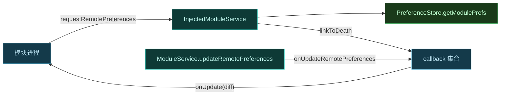

# 🧩 ILSPInjectedModuleService · 模块与宿主/Daemon 通信桥

`InjectedModuleService` 实现 `ILSPInjectedModuleService`，是注入到模块进程内的服务端，提供框架属性、远程偏好与远程文件访问。

> 📂 [`daemon/src/main/kotlin/org/matrix/vector/daemon/ipc/InjectedModuleService.kt`](https://github.com/android-security-engineer/Vector-skills/blob/master/daemon/src/main/kotlin/org/matrix/vector/daemon/ipc/InjectedModuleService.kt)
> 📂 [`daemon/src/main/kotlin/org/matrix/vector/daemon/ipc/ModuleService.kt`](https://github.com/android-security-engineer/Vector-skills/blob/master/daemon/src/main/kotlin/org/matrix/vector/daemon/ipc/ModuleService.kt)（推模式 binder 投递）
> 📡 services AIDL · `ILSPInjectedModuleService`

## 职责

`class InjectedModuleService(private val packageName: String) : ILSPInjectedModuleService.Stub()` 是**每模块实例**的服务端，由 daemon 创建并投递到模块进程。模块进程通过它读取框架能力、订阅偏好变更、读写远程文件。

## 接口契约

```aidl
interface ILSPInjectedModuleService {
    long getFrameworkProperties();
    Bundle requestRemotePreferences(String group, IRemotePreferenceCallback callback);
    ParcelFileDescriptor openRemoteFile(String path);
    String[] getRemoteFileList();
}
```

## 框架能力声明

`getFrameworkProperties()` 返回能力位掩码：

```kotlin
var prop = IXposedService.PROP_CAP_SYSTEM or IXposedService.PROP_CAP_REMOTE
if (ConfigCache.state.isDexObfuscateEnabled) {
    prop = prop or IXposedService.PROP_RT_API_PROTECTION
}
```

| 能力位 | 含义 |
| :--- | :--- |
| `PROP_CAP_SYSTEM` | 支持 system_server 作用域 |
| `PROP_CAP_REMOTE` | 支持远程偏好/文件 |
| `PROP_RT_API_PROTECTION` | dex 混淆启用时的运行时 API 保护 |

## 偏好回调

`requestRemotePreferences` 返回当前 group 的偏好快照（Bundle 内 `map`），并注册 `IRemotePreferenceCallback`。回调通过 `linkToDeath` 与进程生命周期绑定：



`onUpdateRemotePreferences(group, diff)` 在 daemon 侧偏好更新时被 `ModuleService` 调用，遍历该 group 的所有回调推送 `diff`，失败则移除死回调。

## 远程文件

| 方法 | 行为 |
| :--- | :--- |
| `openRemoteFile(path)` | `FileSystem.ensureModuleFilePath` 校验路径后以只读打开 |
| `getRemoteFileList()` | 列出模块 `files` 目录内容 |

文件目录按 `Binder.getCallingUid() / PER_USER_RANGE` 解析到正确用户，防止跨用户越权。

## binder 投递机制

`InjectedModuleService` 不走常规 `bindService`，而由 `ModuleService.sendBinder` 通过 ContentProvider call 伪造投递：

```kotlin
val provider = activityManager?.getContentProviderExternal(authority, userId, null, null)?.provider
provider.call(..., SEND_BINDER, null, extra)  // extra.putBinder("binder", asBinder())
```

模块进程的目标 ContentProvider（authority = `包名 + AUTHORITY_SUFFIX`）收到 call 后取出 binder，转为 `ILSPInjectedModuleService`。这绕过了 `bindService` 的可见性限制。

## 与 ModuleService 的关系

`ModuleService` 实现 `IXposedService`（libxposed 标准 API），持有 `loadedModule.service`（即 `InjectedModuleService`）。偏好更新时 `ModuleService.updateRemotePreferences` 写库后调 `loadedModule.service.onUpdateRemotePreferences` 触发回调推送，形成"daemon 写库 → 推送给模块进程"的实时同步闭环。

## 相关

- 推模式投递见 [reference/classes/daemon/module-service](../daemon/module-service)
- 偏好存储见 [reference/classes/daemon/preference-store](../daemon/preference-store)
- 远程偏好配方见 [cookbook/remote-preference](../../../cookbook/remote-preference)
- AIDL 契约见 [reference/aidl/ilspinjectedmoduleservice](../../aidl/ilspinjectedmoduleservice)
