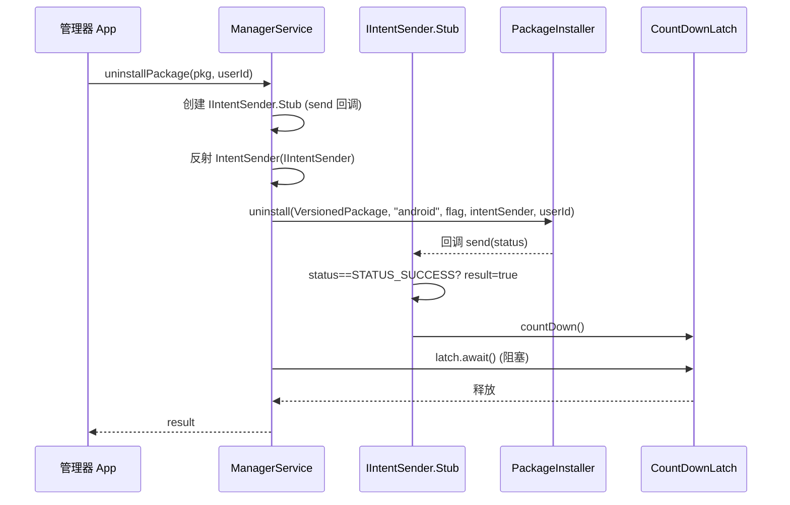

# 🧰 ILSPManagerService · daemon 端实现

`ManagerService` 实现 `ILSPManagerService`，是管理器 App 调用的全套管理 API：模块启停、作用域读写、日志、安装卸载、系统查询。

> 📂 [`daemon/src/main/kotlin/org/matrix/vector/daemon/ipc/ManagerService.kt`](https://github.com/android-security-engineer/Vector-skills/blob/master/daemon/src/main/kotlin/org/matrix/vector/daemon/ipc/ManagerService.kt)
> 📡 services AIDL · `ILSPManagerService`

## 职责

[`object ManagerService : ILSPManagerService.Stub()`](https://github.com/android-security-engineer/Vector-skills/blob/master/daemon/src/main/kotlin/org/matrix/vector/daemon/ipc/ManagerService.kt#L43) 是管理器面板背后的服务端。它代理 `ModuleDatabase`、`PreferenceStore`、`ConfigCache`、`LogcatMonitor` 等数据层，并持有寄生管理器的生命周期守卫。

## 核心方法

| 方法 | 职责 | 委托 |
| :--- | :--- | :--- |
| [`enableModule`](https://github.com/android-security-engineer/Vector-skills/blob/master/daemon/src/main/kotlin/org/matrix/vector/daemon/ipc/ManagerService.kt#L230) / [`disableModule`](https://github.com/android-security-engineer/Vector-skills/blob/master/daemon/src/main/kotlin/org/matrix/vector/daemon/ipc/ManagerService.kt#L232) | 启停模块 | `ModuleDatabase` |
| [`setModuleScope`](https://github.com/android-security-engineer/Vector-skills/blob/master/daemon/src/main/kotlin/org/matrix/vector/daemon/ipc/ManagerService.kt#L234-L235) / [`getModuleScope`](https://github.com/android-security-engineer/Vector-skills/blob/master/daemon/src/main/kotlin/org/matrix/vector/daemon/ipc/ManagerService.kt#L237) | 作用域读写 | 写 `ModuleDatabase`，读 `ConfigCache` |
| [`uninstallPackage`](https://github.com/android-security-engineer/Vector-skills/blob/master/daemon/src/main/kotlin/org/matrix/vector/daemon/ipc/ManagerService.kt#L274-L332) | 卸载应用 | `PackageInstaller.uninstall` + `CountDownLatch` 同步 |
| [`isSepolicyLoaded`](https://github.com/android-security-engineer/Vector-skills/blob/master/daemon/src/main/kotlin/org/matrix/vector/daemon/ipc/ManagerService.kt#L334-L336) | SELinux 策略加载检查 | `SELinux.checkSELinuxAccess` |
| [`obtainManagerBinder`](https://github.com/android-security-engineer/Vector-skills/blob/master/daemon/src/main/kotlin/org/matrix/vector/daemon/ipc/ManagerService.kt#L203-L209) | 寄生管理器 Binder 守卫 | 创建 `ManagerGuard` + 修复 WebView 权限 |
| [`startActivityAsUserWithFeature`](https://github.com/android-security-engineer/Vector-skills/blob/master/daemon/src/main/kotlin/org/matrix/vector/daemon/ipc/ManagerService.kt#L356-L382) | 跨用户启动 Activity | 必要时 `switchUser` + `lockNow` |

## 类结构

```mermaid
classDiagram
    class ILSPManagerService_Stub {
        <<AIDL Stub>>
    }
    class ManagerService {
        <<object>>
        -int managerPid
        -boolean pendingManager
        -Intent managerIntent
        +ManagerGuard guard
        +preStartManager() boolean
        +tryRegisterManagerProcess(pid,uid,name) boolean
        +postStartManager(pid) boolean
        +obtainManagerBinder(heartbeat,pid,uid) IBinder
        +isRunningManager(pid,uid) boolean
        +uninstallPackage(pkg,userId) boolean
        +isSepolicyLoaded() boolean
    }
    class ManagerGuard {
        -IBinder binder
        +int pid
        +int uid
        +binderDied()
    }
    class IBinder_DeathRecipient {
        <<interface>>
    }
    class IServiceConnection_stub {
        <<anonymous>>
        +connected(name,service,dead)
    }

    ILSPManagerService_Stub <|-- ManagerService : extends
    ManagerService "1" o-- "0..1 ManagerGuard" : guard
    IBinder_DeathRecipient <|.. ManagerGuard : implements
    ManagerGuard --> IServiceConnection_stub : XspaceWorkaround
    note for ManagerGuard "binderDied: unlinkToDeath + unbindService + guard=null"
```

## 模块管理 API

| 方法 | 委托 | 作用 |
| :--- | :--- | :--- |
| `enableModule(pkg)` | `ModuleDatabase.enableModule` | 启用模块 |
| `disableModule(pkg)` | `ModuleDatabase.disableModule` | 禁用模块 |
| `enabledModules()` | `ConfigCache.state.modules.keys` | 列出已启用模块 |
| `setModuleScope(pkg, scope)` | `ModuleDatabase.setModuleScope` | 写入作用域 |
| `getModuleScope(pkg)` | `ConfigCache.getModuleScope` | 读取作用域 |
| `setAutoInclude(pkg, on)` | `ModuleDatabase.setAutoInclude` | 自动包含开关 |
| `getAutoInclude(pkg)` | `ConfigCache.getAutoInclude` | 查询自动包含 |

## 作用域读写流程


写操作直写数据库并使缓存失效，读操作优先走 `ConfigCache`。

## 寄生管理器守卫

`ManagerGuard` 实现死亡监听，绑定管理器进程 binder：

```kotlin
class ManagerGuard(binder: IBinder, pid: Int, uid: Int) : IBinder.DeathRecipient
```

- `obtainManagerBinder` 创建守卫、修复 WebView 权限、返回 `this`；
- `binderDied` 解绑并清空 `guard`；
- `tryRegisterManagerProcess` 配合 `preStartManager` 识别寄生 vs 用户安装的管理器进程。

WebView 权限修复：为寄生管理器的 `cache` 目录设 `xposed_file` 上下文并 chown 到目标 UID，解决 WebView 在被注入进程内读写缓存问题。

## 状态查询

| 方法 | 返回 |
| :--- | :--- |
| `getXposedApiVersion()` | `IXposedService.LIB_API` |
| `getXposedVersionCode()` / `getXposedVersionName()` | `BuildConfig` |
| `isSepolicyLoaded()` | `SELinux.checkSELinuxAccess(dex2oat, dex2oat_exec, execute_no_trans)` |
| `dex2oatFlagsLoaded()` | 检查 `--inline-max-code-units=0` 属性 |
| `systemServerRequested()` | `SystemServerService.systemServerRequested` |
| `getUsers()` | 真实用户列表 |

## 日志与安装

- `isVerboseLog` / `setVerboseLog`：控制 logcat 详细日志开关，启停 `LogcatMonitor`；
- `getVerboseLog` / `getModulesLog`：返回日志文件 PFD；
- `clearLogs`：刷新日志；
- `uninstallPackage`：通过反射构造 `IntentSender`，调 `PackageInstaller.uninstall`，`CountDownLatch` 同步结果；
- `installExistingPackageAsUser`：安装已存在包到指定用户；
- `forceStopPackage` / `reboot` / `clearApplicationProfileData`：系统操作代理。

### uninstallPackage 时序



`userId == -1` 时使用 `DELETE_ALL_USERS` flag (0x2)，否则按指定用户卸载。`CountDownLatch.await()` 将异步的 `PackageInstaller` 回调同步为同步返回值。

## startActivityAsUserWithFeature

支持跨用户启动 Activity，必要时切换用户并锁屏。`queryIntentActivitiesAsUser` 返回 `ParcelableListSlice<ResolveInfo>`，跨进程传递大量 ResolveInfo。

## 相关

- 应用侧服务见 [application-service-impl](./application-service-impl)
- 数据层见 [reference/classes/daemon/config-cache](../daemon/config-cache)
- 日志监控见 [reference/classes/daemon/logcat-monitor](../daemon/logcat-monitor)
- AIDL 契约见 [reference/aidl/ilspmanagerservice](../../aidl/ilspmanagerservice)
