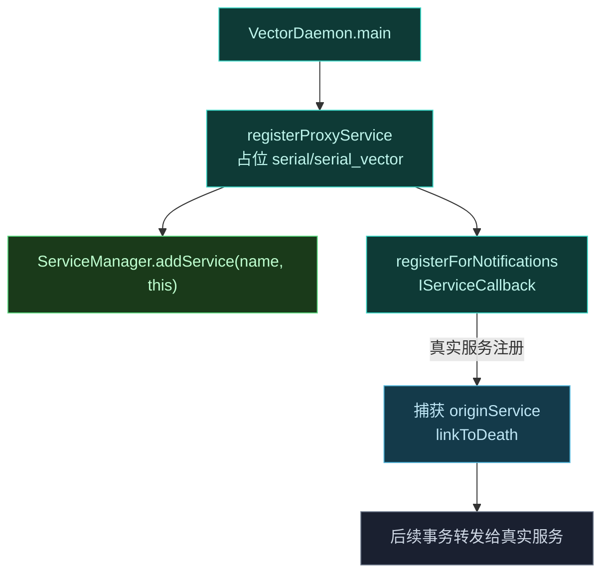
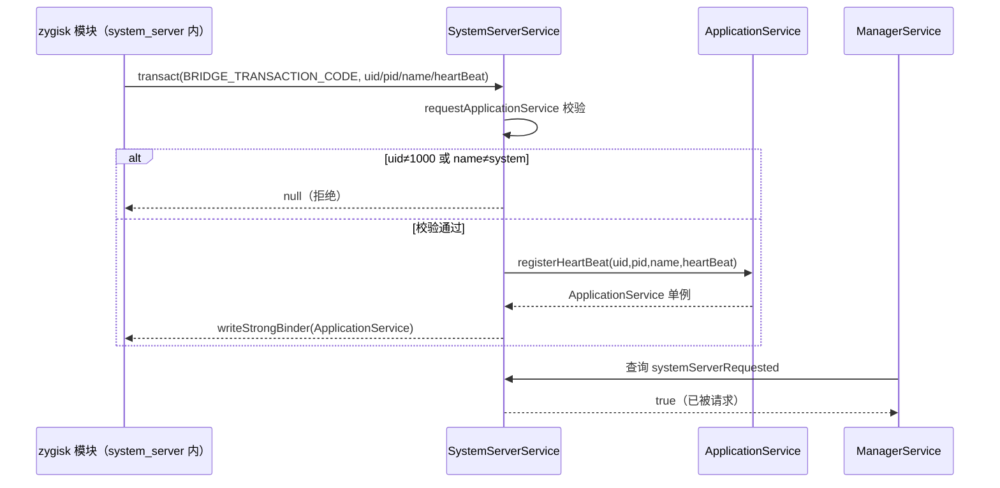

# 🏛️ ILSPSystemServerService · system_server 专用通道

`SystemServerService` 实现 `ILSPSystemServerService`，是 daemon 为 `system_server` 进程专门架设的代理服务，在真实系统服务注册前抢占其名字。

> 📂 [`daemon/src/main/kotlin/org/matrix/vector/daemon/ipc/SystemServerService.kt`](https://github.com/android-security-engineer/Vector-skills/blob/master/daemon/src/main/kotlin/org/matrix/vector/daemon/ipc/SystemServerService.kt)
> 📂 [`daemon/src/main/kotlin/org/matrix/vector/daemon/VectorDaemon.kt`](https://github.com/android-security-engineer/Vector-skills/blob/master/daemon/src/main/kotlin/org/matrix/vector/daemon/VectorDaemon.kt)（占位逻辑）
> 📡 services AIDL · `ILSPSystemServerService`

## 职责

`object SystemServerService : ILSPSystemServerService.Stub(), IBinder.DeathRecipient` 在 system_server 特化阶段充当代理 Binder，让 zygisk 模块在 system_server 内能找到 daemon 入口，而无需依赖已注册的系统服务。

具体承担四件事：

1. **抢占服务名**：在 system_server 真实服务注册前，以目标名 `addService` 占位，让 zygisk 模块能通过 `ServiceManager.getService` 拿到代理。
2. **派发应用服务**：解析 zygisk 模块发来的 uid/pid/processName/heartBeat，校验后返回 `ApplicationService` 单例 binder。
3. **捕获真实服务**：注册 `IServiceCallback` 监听同名真实服务上线，捕获后转发后续事务，避免长期拦截系统流量。
4. **崩溃自愈**：system_server 重启时清理旧引用并重新占位，确保新 system_server 仍能找到代理。

## 组成 / 字段

| 成员 | 类型 | 作用 |
| :--- | :--- | :--- |
| `proxyServiceName` | `String?` | 当前占位的服务名（`serial` 或 `serial_vector`） |
| `originService` | `IBinder?` | 捕获到的真实系统服务 binder，未捕获前为 null |
| `systemServerRequested` | `Boolean` | 是否已被 system_server 请求过，供 `ManagerService.systemServerRequested()` 查询 |

## 代理服务抢占

`registerProxyService(serviceName)` 是核心：以 `ServiceManager.addService` 用自身占位目标服务名，同时注册 `IServiceCallback` 监听真实服务的注册。



服务名由 `VectorDaemon` 决定：正常启动用 `serial`，晚期注入用 `serial_vector`。抢占发生在 daemon 入口最早处，先于任何环境服务与系统服务等待，确保代理在 system_server 特化前已就位。

## 请求转发

`onTransact` 实现转发逻辑：

- 若 `originService` 已捕获，转发到真实服务（system_server 崩溃重启场景）；
- `BRIDGE_TRANSACTION_CODE`：解析 uid/pid/processName/heartBeat，调 `requestApplicationService` 返回 `ApplicationService` binder；
- `DEX_TRANSACTION_CODE` / `OBFUSCATION_MAP_TRANSACTION_CODE`：直接委托 `ApplicationService.onTransact`；
- 其它：走父类默认。

转发优先级最高：一旦捕获真实服务，所有事务都先尝试转给真实服务，避免长期拦截系统对 `serial` 的访问。

## requestApplicationService

system_server 专用入口，严格校验：

```kotlin
if (uid != 1000 || heartBeat == null || processName != "system") return null
systemServerRequested = true
```

仅接受 system_server（uid 1000、进程名 `system`），注册心跳后返回 `ApplicationService` 单例。`systemServerRequested` 标志供 `ManagerService.systemServerRequested()` 查询。

## 调用时序：zygisk 模块请求应用服务

zygisk 模块在 system_server 特化时通过代理 binder 发起 `BRIDGE_TRANSACTION_CODE` 事务，daemon 校验后派发应用服务：



## 死亡与恢复

`binderDied()` 在 `originService` 死亡时清理引用。`VectorDaemon.sendToBridge` 的 `DeathRecipient` 在 system_server 整体崩溃时调用 `SystemServerService.binderDied()` 清旧引用，并立即重新 `addService(proxyServiceName, SystemServerService)` 重新占位，确保重启后的 system_server 仍能找到代理。

崩溃恢复链路还做三件配套清理：清空 `ServiceManager`/`ActivityManager` 缓存（反射置空静态字段）、移除 `ManagerService.guard` 死引用、递减重试计数后重新 `sendToBridge` 注入。重试耗尽则 `restartSystemServer()` 通过 `ctl.restart` 重启 zygote。

## 晚期注入

`--late-inject` 参数将 `proxyServiceName` 改为 `serial_vector`，`isLateInject=true`。晚期注入时 system_server 已运行，daemon 需用不同服务名避免与已存在的真实 `serial` 服务冲突，并由 `VectorService.dispatchSystemServerContext` 强制派发 boot completed。

## 使用场景与约束

- **场景一：system_server 内的模块入口**。zygisk 模块注入 system_server 后，通过 `ServiceManager.getService("serial")`（或晚期注入时的 `"serial_vector"`）拿到 `SystemServerService` 代理，再以 `BRIDGE_TRANSACTION_CODE` 换取 `ApplicationService`，从而接入 daemon 的配置与 DEX 服务。
- **场景二：崩溃后自动恢复**。system_server 崩溃重启时，daemon 的 `DeathRecipient` 会清缓存、重新占位并重注入，无需人工干预；此路径依赖 `--system-server-max-retry` 控制重试上限。
- **约束：仅接受 system_server**。`requestApplicationService` 写死 `uid==1000 && processName=="system"`，其它进程的请求一律返回 null，应用进程的应用服务入口走 `DaemonService` 而非此处。
- **约束：服务名由启动模式决定**。正常启动占位 `serial`，晚期注入占位 `serial_vector`，二者不可混用；晚期注入时真实 `serial` 已存在，强行占同名会失败。
- **约束：捕获后停止拦截**。`IServiceCallback` 一旦捕获真实服务，`onTransact` 会把事务转给真实服务，代理本身不再处理业务码，避免长期影响系统对 `serial` 的访问。

## 相关

- daemon 入口见 [daemon-service-impl](./daemon-service-impl)
- 应用服务复用见 [application-service-impl](./application-service-impl)
- 启动与注入链路见 [architecture/boot-flow](../../../architecture/boot-flow)
- AIDL 契约见 [reference/aidl/ilspsystemserverservice](../../aidl/ilspsystemserverservice)
