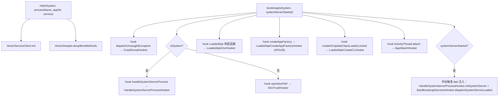
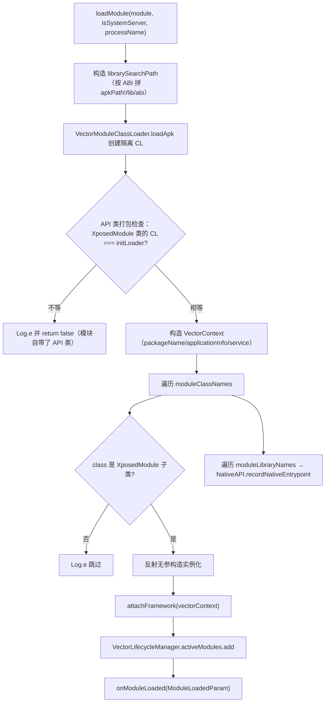

# xposed · core 包

> 📂 [`xposed/src/main/kotlin/org/matrix/vector/impl/core/`](https://github.com/android-security-engineer/Vector-skills/blob/master/xposed/src/main/kotlin/org/matrix/vector/impl/core/)
> 🟦 框架核心引擎：启动、反优化、模块加载、Daemon IPC

## 包职责

`impl/core` 承载 Vector 框架运行时的**启动序列**与**基础能力**：进程初始化时反优化被内联的框架方法、装载模块 APK、建立与 Daemon 的 Binder 通道、在系统服务器与应用进程分别部署拦截器。它是 `xposed` 模块中最底层的 Kotlin 层，向上对接 `impl/hooks`（Hook 引擎）、`impl/hookers`（生命周期 Hook 点），向下经 `nativebridge` 调用 native ART 引擎。

## 类清单

| 类 | 说明 |
| :--- | :--- |
| [`VectorStartup`](#vectorstartup) | 启动引导：初始化 ServiceClient、反优化 boot 镜像、部署各阶段拦截器 |
| [`VectorDeopter`](#vectordeopter) | 反优化引擎：扫描内联调用者并通知 native 层去优化 |
| [`VectorInlinedCallers`](#vectorinlinedcallers) | 内联调用者注册表：声明需反优化的目标方法签名 |
| [`VectorModuleManager`](#vectormodulemanager) | 模块装载器：加载 APK、隔离 ClassLoader、实例化入口类 |
| [`VectorServiceClient`](#vectorserviceclient) | Daemon IPC 客户端：单例 Binder，处理死亡通知 |

---

## VectorStartup

`object VectorStartup` — 现代 API 框架的**初始化与引导序列**。在被注入进程早期调用，负责向 ART 运行时部署拦截器，并执行进程级反优化。分两阶段：`init` 在极早期跑，`bootstrap` 在 ART 就绪后跑。

### 启动流程



### 方法签名

```kotlin
@JvmStatic
fun init(
    isSystem: Boolean,
    processName: String?,
    appDir: String?,
    service: ILSPApplicationService?,
)

@JvmStatic
fun bootstrap(isSystem: Boolean, systemServerStarted: Boolean)
```

### 关键设计

- **`init` 只做两件事**：绑定 Daemon 服务客户端、对 boot 镜像做反优化。保持极早期阶段尽量轻量，避免在 ART 未完全就绪时触碰反射。
- **`bootstrap` 区分 system 与非 system 进程**：system 进程 hook `ZygoteInit.handleSystemServerProcess`；普通进程 hook `DexFile.openDexFile/openInMemoryDexFile*`，由 `DexTrustHooker` 把框架 ClassLoader 标记为可信。
- **LoadedApk 全构造函数 hook**：对所有 `LoadedApk` 声明的构造函数部署 `LoadedApkCtorHooker`，以捕获早期实例化。
- **late system server 注入**：若进程在 `systemServerStarted` 之后才被注入（即 `bootstrap` 被迟到调用），则直接通过 `ServiceManager.getService("activity")` 拿到 binder，手动触发本应由 hook 触发的初始化路径。

---

## VectorDeopter

`object VectorDeopter` — 反优化引擎。扫描 `VectorInlinedCallers` 注册表，把那些**内联了 hook 目标**的预编译框架方法交给 native 层去优化（deopt），确保 hook 真正生效。

### 方法签名

```kotlin
@JvmStatic
fun deoptMethods(where: String, cl: ClassLoader?)

fun deoptBootMethods()

@JvmStatic
fun deoptResourceMethods()

fun deoptSystemServerMethods(sysCL: ClassLoader)
```

### 行为说明

| 方法 | 反优化目标 | 传入 ClassLoader |
| :--- | :--- | :--- |
| `deoptBootMethods` | `KEY_BOOT_IMAGE`（boot 镜像内联调用者） | 系统 ClassLoader |
| `deoptResourceMethods` | `KEY_BOOT_IMAGE_MIUI_RES`（仅 MIUI） | 系统类加载器 |
| `deoptSystemServerMethods` | `KEY_SYSTEM_SERVER` | system server 的 ClassLoader |
| `deoptMethods(where, cl)` | 任意 key | `cl` 为空时退回 `ClassLoader.getSystemClassLoader()` |

`deoptMethods` 内部对每个 `TargetExecutable`：用 `Class.forName` 解析类、取 `Executable`（构造函数或方法）、`isAccessible = true`、再调 `HookBridge.deoptimizeMethod(executable)`。单条失败仅打 verbose 日志、不中断整体。

---

## VectorInlinedCallers

`object VectorInlinedCallers` — **内联调用者注册表**。声明哪些框架方法因内联了 hook 目标而需要反优化。以 `String` key 分组，每组是 `List<TargetExecutable>`。

### 常量 key

| 常量 | 值 | 用途 |
| :--- | :--- | :--- |
| `KEY_BOOT_IMAGE` | `"boot_image"` | boot 镜像中的内联调用者 |
| `KEY_BOOT_IMAGE_MIUI_RES` | `"boot_image_miui_res"` | MIUI 资源相关内联调用者 |
| `KEY_SYSTEM_SERVER` | `"system_server"` | system server 内联调用者（当前为空列表） |

### 注册的目标（节选）

`KEY_BOOT_IMAGE` 覆盖 `Instrumentation.newApplication`（两个重载）、`LoadedApk.makeApplicationInner`/`makeApplication`、`ContextImpl.getSharedPreferencesPath` 等。

`KEY_BOOT_IMAGE_MIUI_RES` 覆盖 `MiuiResources.init`/`updateMiuiImpl`/`loadOverlayValue`/`getThemeString`/多个 `<init>`、`ResourcesManager.initMiuiResource`、`LoadedApk.getResources`、`Resources.getSystem`、`ApplicationPackageManager.getResourcesForApplication`、`ContextImpl.setResources`。

### 方法

```kotlin
fun get(where: String): List<TargetExecutable>
```

### TargetExecutable

`data class TargetExecutable(className, methodName, params)` — 强类型可执行签名。`isConstructor` 由 `methodName == "<init>"` 推得。因 `params` 是数组，手动重写了 `equals`/`hashCode`（用 `contentEquals`/`contentHashCode`）。

---

## VectorModuleManager

`object VectorModuleManager` — 模块装载器。把一个模块 APK 加载进目标进程：构造 native library 搜索路径、创建隔离 ClassLoader、做 API 类打包安全检查、实例化入口类、注入框架上下文、注册 JNI 入口。

### 装载流程



### 方法签名

```kotlin
fun loadModule(module: Module, isSystemServer: Boolean, processName: String): Boolean
```

### 关键设计

- **ABI 选择**：`Process.is64Bit()` 决定用 `SUPPORTED_64_BIT_ABIS` 还是 `SUPPORTED_32_BIT_ABIS`，把每个 ABI 拼成 `apkPath!/lib/<abi>` 并以 `File.pathSeparator` 串接。
- **API 类打包检查**：加载完隔离 CL 后，立即 `loadClass(XposedModule::class.java.name)`，校验其 `classLoader` 必须等于 API 自身的 `initLoader`。若模块把 API 类编译进了自己的 APK，则 CL 不一致、直接拒绝加载。
- **入口类过滤**：只接受 `XposedModule::class.java.isAssignableFrom(moduleClass)` 的类；其余仅打日志跳过，不中断其它入口类。
- **每类容错**：单个入口类的实例化用 `runCatching` 包裹，失败仅 `Log.e`，不影响其它类。
- **JNI 入口注册**：遍历 `module.file.moduleLibraryNames`，调 `NativeAPI.recordNativeEntrypoint`，让 native 层记录模块声明的 JNI 库。

---

## VectorServiceClient

`object VectorServiceClient : ILSPApplicationService, IBinder.DeathRecipient` — 与注入的管理器服务（Daemon）通信的**单例 Binder 客户端**。实现 `ILSPApplicationService` 全部方法，所有调用经 `runCatching` 包裹，远程异常退回安全默认值；并实现 `DeathRecipient` 处理 Binder 死亡。

### 状态

```kotlin
private var service: ILSPApplicationService?   // 持有的远程服务代理
var processName: String                         // 绑定时记录的进程名（私有 setter）
    private set
```

### 方法签名

```kotlin
@Synchronized
fun init(appService: ILSPApplicationService?, niceName: String)

override fun isLogMuted(): Boolean
override fun getLegacyModulesList(): List<Module>
override fun getModulesList(): List<Module>
override fun getPrefsPath(packageName: String): String?
override fun requestInjectedManagerBinder(binder: List<IBinder>): ParcelFileDescriptor?
override fun asBinder(): IBinder?
override fun binderDied()
```

### 关键设计

- **`init` 幂等且同步**：仅在 `service == null` 且 binder 非空时绑定一次，绑定后 `linkToDeath(this, 0)`。绑定失败回滚 `service = null`。
- **所有查询容错**：`getModulesList` 等方法用 `runCatching { service?.xxx }.getOrNull() ?: emptyList()`，Binder 死亡时返回空列表而非崩溃。
- **`binderDied` 清理**：`unlinkToDeath` 后置 `service = null`，后续调用因 `service` 为空走容错默认值，直到下次 `init` 重绑。

## 相关

- [xposed 模块总览](../modules/xposed)
- [xposed · hooks 包](./xposed-hooks)（`VectorHookBuilder`、拦截器链）
- [xposed · hookers 包](./xposed-hookers)（各生命周期 Hook 点）
- [xposed · di 包](./xposed-di)（`VectorBootstrap` 注入 legacy delegate）
- 启动序列详见 [架构 · Xposed API 实现](../../architecture/xposed)
