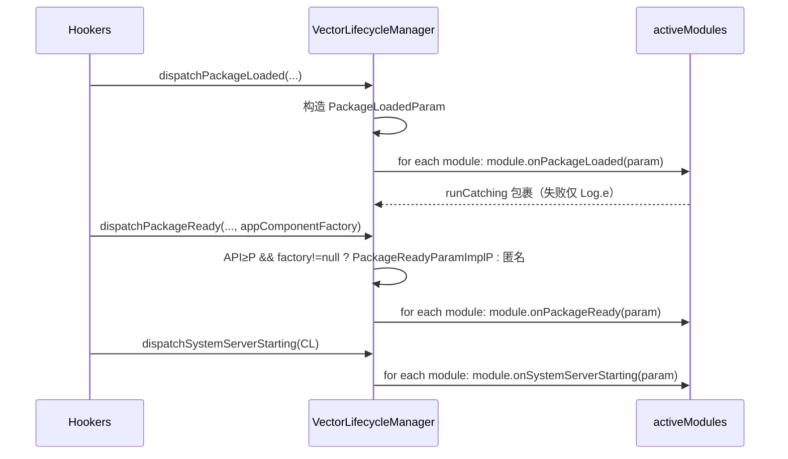

# xposed · di 与 impl 根

> 📂 [`xposed/src/main/kotlin/org/matrix/vector/impl/di/`](https://github.com/android-security-engineer/Vector-skills/blob/master/xposed/src/main/kotlin/org/matrix/vector/impl/di/) 与 [`impl/`](https://github.com/android-security-engineer/Vector-skills/blob/master/impl/) 根
> 🟦 依赖注入、框架上下文、生命周期分发、远程偏好

## 包职责

本篇覆盖两处源码：`impl/di/` 的依赖注入契约与引导、以及 `impl/` 根目录的三个核心类。`VectorBootstrap` 定义 `legacy` 模块必须实现的 `LegacyFrameworkDelegate` 契约并在启动时注入，让现代 API 框架能在合适时机委派 legacy 兼容逻辑。`VectorContext` 是 `XposedInterface` 的实现，给每个模块提供 hook、Invoker、远程文件、日志能力。`VectorLifecycleManager` 负责把现代生命周期事件（`onPackageLoaded`/`onPackageReady`/`onSystemServerStarting`）分发给已装载模块。`VectorRemotePreferences` 实现跨进程只读 `SharedPreferences`。

## 类清单

| 类 | 说明 |
| :--- | :--- |
| [`VectorBootstrap`](#vectorbootstrap) | DI 中心：持有 `LegacyFrameworkDelegate`，提供安全委派 |
| [`LegacyFrameworkDelegate`](#legacyframeworkdelegate) | legacy 模块须实现的契约接口 |
| [`LegacyPackageInfo`](#legacypackageinfo) | 传给 legacy `handleLoadPackage` 的包信息载体 |
| [`OriginalInvoker`](#originalinvoker) | legacy hook 中执行原方法的功能接口 |
| [`VectorContext`](#vectorcontext) | `XposedInterface` 实现：模块的框架上下文 |
| [`VectorLifecycleManager`](#vectorlifecyclemanager) | 现代生命周期事件分发器 |
| [`VectorRemotePreferences`](#vectorremotepreferences) | 跨进程只读 `SharedPreferences` |

---

## VectorBootstrap

`object VectorBootstrap` — 框架引导的**中心注册表**。持有 `LegacyFrameworkDelegate` 单例，让现代框架的各 hooker 安全地把 legacy 兼容逻辑委派出去。

### 状态与方法

```kotlin
@Volatile
var delegate: LegacyFrameworkDelegate? = null   // private set
    private set

fun init(frameworkDelegate: LegacyFrameworkDelegate)

inline fun withLegacy(block: (LegacyFrameworkDelegate) -> Unit)
```

### 关键设计

- **`init` 一次性**：`check(delegate == null) { "VectorBootstrap is already initialized!" }`，重复初始化直接抛异常。由 `legacy` 模块在启动时调用一次注入实现。
- **`delegate` 为 `@Volatile`**：保证多线程可见性，hooker 在 hot path 读取无需加锁。
- **`withLegacy` 内联安全委派**：`delegate?.let(block)`——delegate 未注入时为空操作，让 `AppAttachHooker`、`LoadedApkCtorHooker`、`LoadedApkCreateCLHooker`、`StartBootstrapServicesHooker` 等在启动顺序未到时也不崩。

---

## LegacyFrameworkDelegate

`interface LegacyFrameworkDelegate` — **legacy 模块必须实现的契约**。现代框架在以下时机调用对应方法：

```kotlin
fun loadModules(activityThread: Any)
fun onPackageLoaded(info: LegacyPackageInfo)
fun onSystemServerLoaded(classLoader: ClassLoader)
fun processLegacyHook(
    executable: Executable,
    thisObject: Any?,
    args: Array<Any?>,
    legacyHooks: Array<Any?>,
    invokeOriginal: OriginalInvoker,
): Any?

val isResourceHookingDisabled: Boolean
fun setPackageNameForResDir(packageName: String, resDir: String?)
fun hasLegacyModule(packageName: String): Boolean
```

### 方法调用时机

| 契约方法 | 调用方 | 时机 |
| :--- | :--- | :--- |
| `loadModules` | `AppAttachHooker` | `ActivityThread.attach` 完成后 |
| `onPackageLoaded` | `LoadedApkCreateCLHooker` | 初始包装载时（`isInitialLoad`） |
| `onSystemServerLoaded` | `StartBootstrapServicesHooker.dispatchSystemServerLoaded` | system server bootstrap 时 |
| `processLegacyHook` | `VectorNativeHooker`/`BaseInvoker` 的 terminal | 每次被 hook 方法命中且 legacy hook 非空时 |
| `isResourceHookingDisabled` | `LoadedApkCtorHooker` | `LoadedApk` 构造时判断是否登记资源目录 |
| `setPackageNameForResDir` | `LoadedApkCtorHooker` | 资源 hook 未禁用时登记包名/资源目录 |
| `hasLegacyModule` | （契约暴露，供查询某包是否有 legacy 模块） | — |

### processLegacyHook 的桥接语义

`processLegacyHook` 是现代链 terminal 与 legacy hook 之间的关键粘合层：当某方法同时有现代与 legacy hook 时，terminal 不直接调原方法，而是把 `legacyHooks` 与一个 `OriginalInvoker`（`() -> HookBridge.invokeOriginalMethod(...)`）交给 delegate，由 legacy 实现决定如何编排 legacy 回调与原方法调用。

---

## LegacyPackageInfo

`data class LegacyPackageInfo(packageName, processName, classLoader, appInfo, isFirstApplication)` — 传给 legacy `handleLoadPackage` 的包信息载体。字段对应 legacy API 需要的上下文：包名、进程名、ClassLoader、`ApplicationInfo`、是否首个应用实例。

---

## OriginalInvoker

`fun interface OriginalInvoker` — 在 legacy hook 旁路中执行原方法的功能接口。

```kotlin
fun interface OriginalInvoker {
    fun invoke(): Any?
}
```

`fun interface` 允许调用方用 lambda 传入（如 `{ HookBridge.invokeOriginalMethod(executable, tObj, *tArgs) }`），由 `BaseInvoker` 与 `VectorNativeHooker` 在构造 terminal 时创建。

---

## VectorContext

`class VectorContext(packageName, applicationInfo, service) : XposedInterface` — **主框架上下文实现**。每个模块实例化时获得一个 `VectorContext`（由 `VectorModuleManager.loadModule` 构造并经 `attachFramework` 注入），通过它 hook 方法、请求 Invoker、读写远程文件、打日志。

### 构造

```kotlin
class VectorContext(
    private val packageName: String,
    private val applicationInfo: ApplicationInfo,
    private val service: ILSPInjectedModuleService,
) : XposedInterface
```

### 框架元信息

```kotlin
override fun getFrameworkName(): String          // BuildConfig.FRAMEWORK_NAME
override fun getFrameworkVersion(): String       // BuildConfig.VERSION_NAME
override fun getFrameworkVersionCode(): Long     // BuildConfig.VERSION_CODE
override fun getFrameworkProperties(): Long      // service.getFrameworkProperties()
```

### Hook 与 Invoker

```kotlin
override fun hook(origin: Executable): XposedInterface.HookBuilder
override fun hookClassInitializer(origin: Class<*>): XposedInterface.HookBuilder
override fun deoptimize(executable: Executable): Boolean
override fun getInvoker(method: Method): XposedInterface.Invoker<*, Method>
override fun <T : Any> getInvoker(constructor: Constructor<T>): XposedInterface.CtorInvoker<T>
```

- `hook` 返回 `VectorHookBuilder(origin)`。
- `hookClassInitializer` 先 `HookBridge.getStaticInitializer(origin)` 取 `<clinit>`，为空抛 `IllegalArgumentException`，否则包成 `VectorHookBuilder`。
- `deoptimize` 直接转 `HookBridge.deoptimizeMethod`。
- `getInvoker(Method)` → `VectorMethodInvoker`；`getInvoker(Constructor)` → `VectorCtorInvoker`。

### 远程文件与偏好

```kotlin
override fun getModuleApplicationInfo(): ApplicationInfo
override fun getRemotePreferences(name: String): SharedPreferences
override fun listRemoteFiles(): Array<String>
override fun openRemoteFile(name: String): ParcelFileDescriptor
```

- `getRemotePreferences`：`remotePrefs` 是 `ConcurrentHashMap` 缓存，按 name 懒创建 `VectorRemotePreferences(service, name)`，重复请求复用同一实例。
- `listRemoteFiles`：`service.remoteFileList`。
- `openRemoteFile`：`service.openRemoteFile(name)`，为空抛 `FileNotFoundException`。

### 日志

```kotlin
override fun log(priority: Int, tag: String?, msg: String)
override fun log(priority: Int, tag: String?, msg: String, tr: Throwable?)
```

`tag` 为空时默认 `"VectorContext"`；消息前缀 `"$packageName: "`（包名非空时）；带 `Throwable` 时追加 `Log.getStackTraceString(tr)`；最终 `Log.println(priority, finalTag, fullMsg)`。

---

## VectorLifecycleManager

`object VectorLifecycleManager` — 现代生命周期事件的**分发器**。维护活跃模块集合，把 `onPackageLoaded`/`onPackageReady`/`onSystemServerStarting` 三个事件 fan-out 到所有已装载模块。

### 状态

```kotlin
val activeModules: MutableSet<XposedModule>   // ConcurrentHashMap.newKeySet()
```

由 `VectorModuleManager.loadModule` 在实例化模块后 `add`，持有弱引用语义外的强引用，模块在整个进程生命周期内常驻。

### 分发方法

```kotlin
fun dispatchPackageLoaded(
    packageName: String,
    appInfo: ApplicationInfo,
    isFirst: Boolean,
    defaultClassLoader: ClassLoader,
)

fun dispatchPackageReady(
    packageName: String,
    appInfo: ApplicationInfo,
    isFirst: Boolean,
    defaultClassLoader: ClassLoader,
    classLoader: ClassLoader,
    appComponentFactory: Any?,
)

fun dispatchSystemServerStarting(classLoader: ClassLoader)
```

每个方法构造对应的 `*Param`（实现 libxposed API 的 `PackageLoadedParam`/`PackageReadyParam`/`SystemServerStartingParam`），遍历 `activeModules` 调对应回调。每个模块的回调用 `runCatching` 包裹，失败仅 `Log.e("VectorLifecycle", ...)`，**单模块崩溃不阻断其它模块**。

### PackageReadyParam 的 API 分流

`dispatchPackageReady` 按 API 级别与 `appComponentFactory` 是否非空分流：

| 条件 | 实现 |
| :--- | :--- |
| API≥P 且 `appComponentFactory != null` | `PackageReadyParamImplP`（独立类，见下） |
| 否则 | 匿名 `PackageReadyParam`，`getAppComponentFactory()` 抛 `UnsupportedOperationException` |

### PackageReadyParamImplP

```kotlin
@RequiresApi(Build.VERSION_CODES.P)
private class PackageReadyParamImplP(...) : PackageReadyParam
```

**单独隔离成类**，注释说明：避免 Verifier 在 Android 8.1 及以下因引用 `android.app.AppComponentFactory`（API 28+ 类）而崩溃。`getAppComponentFactory()` 直接 `appComponentFactory as android.app.AppComponentFactory`。

### 分发时序



---

## VectorRemotePreferences

`internal class VectorRemotePreferences(service: ILSPInjectedModuleService, group: String) : SharedPreferences` — **跨进程只读 `SharedPreferences`**。模块经 `VectorContext.getRemotePreferences(name)` 获取，数据实际存在于 Daemon 进程，通过 Binder 同步。

### 初始化

```kotlin
init {
    val output = service.requestRemotePreferences(group, callback)
    // 把 output["map"] 反序列化后 putAll 到本地 map
}
```

`init` 时注册一个 `IRemotePreferenceCallback.Stub`，并 `requestRemotePreferences(group, callback)` 拉取初始快照。`RemoteException` 时抛 `XposedFrameworkError("Remote preferences IPC failure", e)`。

### 远程更新回调

```kotlin
private val callback = object : IRemotePreferenceCallback.Stub() {
    @Synchronized
    override fun onUpdate(bundle: Bundle)
}
```

`onUpdate` 处理两种变更（Bundle key 区分）：

| Bundle key | 含义 | 处理 |
| :--- | :--- | :--- |
| `"delete"` | `Set<String>` 删除键集 | 从 `map` 移除 |
| `"put"` | `Map<String, Any>` 新增/更新 | `map.putAll` |

收集所有变更 key，在 `synchronized(listeners)` 下通知每个 `OnSharedPreferenceChangeListener`。

### SharedPreferences 实现

```kotlin
override fun getAll(): Map<String, *>          // TreeMap(map) 排序快照
override fun getString(key, defValue): String?
override fun getStringSet(key, defValues): Set<String>?
override fun getInt(key, defValue): Int
override fun getLong(key, defValue): Long
override fun getFloat(key, defValue): Float
override fun getBoolean(key, defValue): Boolean
override fun contains(key): Boolean
override fun edit(): SharedPreferences.Editor   // 抛 UnsupportedOperationException（只读）
override fun registerOnSharedPreferenceChangeListener(listener)
override fun unregisterOnSharedPreferenceChangeListener(listener)
```

### 关键设计

- **只读**：`edit()` 直接抛 `UnsupportedOperationException("Read only implementation")`。写操作必须经 Daemon 侧完成，再通过 `onUpdate` 回推。
- **`ConcurrentHashMap` 存储**：读无锁；变更通知在 `synchronized(listeners)` 下进行。
- **`getAll` 返回 `TreeMap`**：排序快照，调用方拿到的是拷贝。
- **`getSerializableCompat`**：私有内联函数，按 SDK≥Tiramisu 用类型安全的 `getSerializable(key, Class)`，否则用废弃的 `getSerializable(key)`。同时兼顾编译期 deprecation 与 unchecked cast 警告。

## 相关

- [xposed 模块总览](../modules/xposed)
- [xposed · core 包](./xposed-core)（`VectorModuleManager` 构造 `VectorContext` 并注入）
- [xposed · hookers 包](./xposed-hookers)（各 hooker 经 `VectorBootstrap.withLegacy` 委派、经 `VectorLifecycleManager` 分发）
- [xposed · hooks 包](./xposed-hooks)（`VectorContext.hook` 返回 `VectorHookBuilder`）
- 依赖注入契约详见 [架构 · Xposed API 实现](../../architecture/xposed#6-di-与-legacy-桥)
