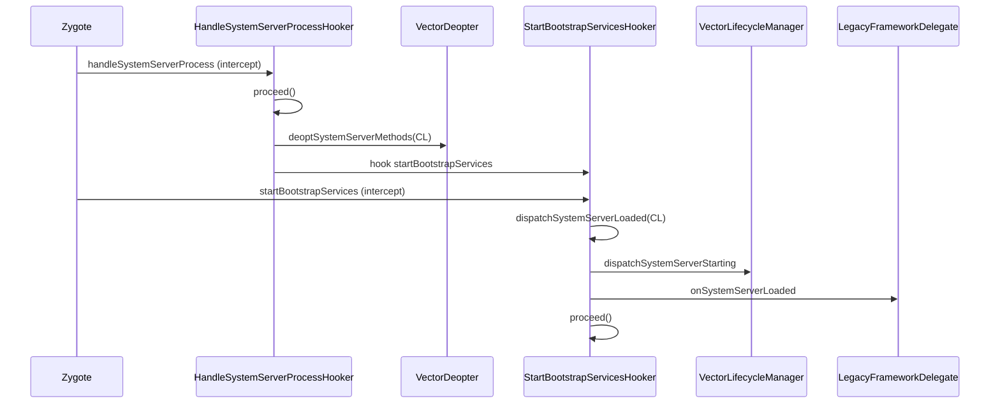

# xposed · hookers 包

> 📂 `xposed/src/main/kotlin/org/matrix/vector/impl/hookers/`
> 🟦 生命周期 Hook 点：各阶段 `XposedInterface.Hooker` 实现

## 包职责

`impl/hookers` 收纳框架在各生命周期阶段部署的 **`Hooker` 实现**。这些 hooker 由 `VectorStartup.bootstrap` 注册到对应框架方法上，在被 hook 方法命中时拦截，向现代模块分发生命周期事件、或向 legacy 桥委派兼容逻辑。每个 hooker 都是 `object`，实现 `XposedInterface.Hooker.intercept(chain)`。

## 类清单

| 类 | 说明 |
| :--- | :--- |
| [`CrashDumpHooker`](#crashdumphooker) | 拦截 `Thread.dispatchUncaughtException`，崩溃前打诊断日志 |
| [`DexTrustHooker`](#dextrusthooker) | 拦截 DEX 解析，把框架 ClassLoader 标记为可信 |
| [`AppAttachHooker`](#appattachhooker) | 拦截 `ActivityThread.attach`，委派 legacy 装载模块 |
| [`LoadedApkCtorHooker`](#loadedapkctorhooker) | 拦截 `LoadedApk` 构造函数：资源目录登记 + 实例跟踪 |
| [`LoadedApkCreateAppFactoryHooker`](#loadedapkcreateappfactoryhooker) | 拦截 `createAppFactory`：分发 `onPackageLoaded`（API≥29） |
| [`LoadedApkCreateCLHooker`](#loadedapkcreateclhooker) | 拦截 `createOrUpdateClassLoaderLocked`：分发 `onPackageReady` 与 legacy `handleLoadPackage` |
| [`HandleSystemServerProcessHooker`](#handlesystemserverprocesshooker) | 拦截 `handleSystemServerProcess`：反优化 system server 并 hook `startBootstrapServices` |
| [`StartBootstrapServicesHooker`](#startbootstrapserviceshooker) | 拦截 `startBootstrapServices`：分发 system server 加载事件 |

---

## CrashDumpHooker

`object CrashDumpHooker : XposedInterface.Hooker` — 拦截 `Thread.dispatchUncaughtException`，在进程彻底终止前打印诊断日志。

```kotlin
override fun intercept(chain: XposedInterface.Chain): Any?
```

从 `chain.args.firstOrNull()` 取 `Throwable`，`Utils.logE("Crash unexpectedly", throwable)` 打日志后 `chain.proceed()`。取参本身用 `try/catch` 吞所有异常，确保日志逻辑不会干扰原始崩溃路径。

---

## DexTrustHooker

`object DexTrustHooker : XposedInterface.Hooker` — 拦截 `DexFile.openDexFile` / `openInMemoryDexFile` / `openInMemoryDexFiles`，把框架自己的 ClassLoader 标记为可信 DEX，防止 ART 拦截 hook 引擎的反射访问。

```kotlin
override fun intercept(chain: XposedInterface.Chain): Any?
```

`chain.proceed()` 后从 `args` 找首个 `ClassLoader`，沿 `parent` 链向上找；命中 `DexTrustHooker::class.java.classLoader` 时调 `HookBridge.setTrusted(result)`（`result` 是 DEX 解析返回的 cookie），随后 break。Android P 特例：`classLoader == null` 时回退用 hooker 自身 CL。

---

## AppAttachHooker

`object AppAttachHooker : XposedInterface.Hooker` — 拦截 `ActivityThread.attach`，在 attach 完成后触发 legacy 兼容层装载现代模块。

```kotlin
override fun intercept(chain: XposedInterface.Chain): Any?
```

先 `chain.proceed()` 执行真实 attach，再取 `chain.thisObject`（ActivityThread），非空时经 `VectorBootstrap.withLegacy { delegate -> delegate.loadModules(activityThread) }` 委派 legacy 桥加载模块。`withLegacy` 在 delegate 未注入时为空操作，保证启动顺序未到时不崩。

---

## LoadedApkCtorHooker

`object LoadedApkCtorHooker : XposedInterface.Hooker` — 拦截 `LoadedApk` 的所有构造函数。做两件事：登记资源目录（供资源 hook）、把实例加入跟踪集合。

```kotlin
val trackedApks: ConcurrentHashMap.newKeySet<Any>()

override fun intercept(chain: XposedInterface.Chain): Any?
```

### 行为

1. `chain.proceed()` 构造 `LoadedApk`。
2. 反射取 `mPackageName`，为空则直接返回。
3. `VectorBootstrap.withLegacy`：若 legacy 未禁用资源 hook，取 `mResDir` 调 `delegate.setPackageNameForResDir(packageName, resDir)`。
4. OnePlus 规避：检查调用栈是否来自 `ActivityThread$ApplicationThread.schedulePreload`，是预加载则**不**加入跟踪集。
5. 否则 `LoadedApkTracker.activeApks.add(loadedApk)`，标记此实例处于初始引导阶段。

> 注：`trackedApks`（公开字段）与文件内部私有的 `LoadedApkTracker.activeApks` 是两个集合；`LoadedApkCreateAppFactoryHooker` / `LoadedApkCreateCLHooker` 读的是 `LoadedApkTracker.activeApks`。

---

## LoadedApkCreateAppFactoryHooker

`@RequiresApi(P) object LoadedApkCreateAppFactoryHooker : XposedInterface.Hooker` — 拦截 `LoadedApk.createAppFactory`（API≥28），分发现代 API 的 `onPackageLoaded` 事件。

```kotlin
override fun intercept(chain: XposedInterface.Chain): Any?
```

仅对 `LoadedApkTracker.activeApks` 跟踪中的实例分发。取 `args[0]`（`ApplicationInfo`）与 `args[1]`（默认 ClassLoader，为空则跳过）。API≥29 时由 `PackageContextHelper.resolve` 解析包名/进程名/是否首包，调 `VectorLifecycleManager.dispatchPackageLoaded(...)`。最终 `chain.proceed()`。

---

## LoadedApkCreateCLHooker

`object LoadedApkCreateCLHooker : XposedInterface.Hooker` — 拦截 `createOrUpdateClassLoaderLocked(List<String> addedPaths)`。同时承担**现代 `onPackageReady`** 与 **legacy `handleLoadPackage`** 两路分发。

```kotlin
override fun intercept(chain: XposedInterface.Chain): Any?
```

### 分发逻辑

1. 判定 `isInitialLoad`：`args.firstOrNull() == null`（无 addedPaths）且实例在 `activeApks` 中。
2. `chain.proceed()` 执行真实 CL 创建。
3. 反射取 `mPackageName`/`mApplicationInfo`/`mClassLoader`/`mDefaultClassLoader`，任一缺失即返回。
4. `PackageContextHelper.resolve` 解析上下文信息。
5. **现代 `onPackageReady`**（API≥28）：取 `mAppComponentFactory`，调 `VectorLifecycleManager.dispatchPackageReady(...)`。
6. **legacy `handleLoadPackage`**（仅 `isInitialLoad`）：取 `mIncludeCode`（默认 true），当 `isFirstPackage || mIncludeCode` 时经 `VectorBootstrap.withLegacy` 调 `delegate.onPackageLoaded(LegacyPackageInfo(...))`。
7. `finally`：从 `activeApks` 移除该实例——后续 Split APK 调用将不再视为初始加载。

> 整个 post-proceed 阶段用 `try/catch` 包裹，失败仅 `Utils.logE`，不影响原方法返回值。

---

## HandleSystemServerProcessHooker

`object HandleSystemServerProcessHooker : XposedInterface.Hooker` — 拦截 `ZygoteInit.handleSystemServerProcess`。system server 启动时反优化内联路径、动态 hook `startBootstrapServices`、回调监听者。

### 状态与回调

```kotlin
interface Callback {
    fun onSystemServerLoaded(classLoader: ClassLoader)
}

@Volatile var callback: Callback? = null
@Volatile var systemServerCL: ClassLoader?   // private set，只初始化一次
```

### intercept 与 initSystemServer

```kotlin
override fun intercept(chain: XposedInterface.Chain): Any?

fun initSystemServer(classLoader: ClassLoader, isLate: Boolean = false)
```

`intercept`：`proceed()` 后取当前线程 `contextClassLoader`，非空则 `initSystemServer(classLoader)`。

`initSystemServer` 流程：
1. `systemServerCL != null` 则直接返回（保证只跑一次）；否则记录 CL。
2. `VectorDeopter.deoptSystemServerMethods(classLoader)` 反优化 system server 内联路径。
3. `isLate == false` 时：反射定位 `com.android.server.SystemServer.startBootstrapServices`，`VectorHookBuilder(startMethod).intercept(StartBootstrapServicesHooker)` 部署下一阶段 hook。
4. `callback?.onSystemServerLoaded(classLoader)` 通知监听者。

> `VectorStartup.bootstrap` 在 late 注入场景下会直接调 `initSystemServer(classLoader, isLate = true)`，跳过 `startBootstrapServices` 的 hook（因为此时该方法可能已执行过）。

---

## StartBootstrapServicesHooker

`object StartBootstrapServicesHooker : XposedInterface.Hooker` — 拦截 `SystemServer.startBootstrapServices`，把 system server 加载事件分发到现代与 legacy 两套模块引擎。

```kotlin
override fun intercept(chain: XposedInterface.Chain): Any?

fun dispatchSystemServerLoaded(classLoader: ClassLoader)
```

`intercept`：取 `HandleSystemServerProcessHooker.systemServerCL`，非空调 `dispatchSystemServerLoaded(it)`，再 `chain.proceed()`。

`dispatchSystemServerLoaded`：
- `VectorLifecycleManager.dispatchSystemServerStarting(classLoader)` —— 现代 API。
- `VectorBootstrap.withLegacy { delegate -> delegate.onSystemServerLoaded(classLoader) }` —— legacy API。

### system server 事件分发时序



## 相关

- [xposed 模块总览](../modules/xposed)
- [xposed · core 包](./xposed-core)（`VectorStartup.bootstrap` 注册这些 hooker）
- [xposed · di 包](./xposed-di)（`VectorBootstrap.withLegacy` 委派 legacy）
- [xposed · hooks 包](./xposed-hooks)（`VectorHookBuilder`/`VectorChain` 执行机制）
- 生命周期事件详见 [架构 · Xposed API 实现](../../architecture/xposed#3-生命周期分发)
