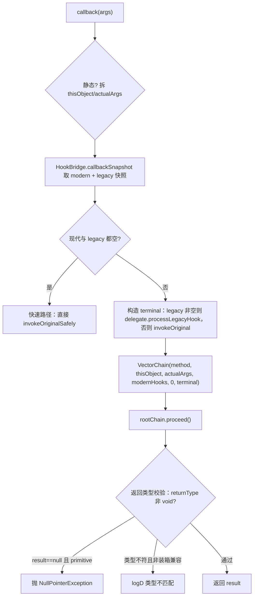

# xposed · hooks 包

> 📂 [`xposed/src/main/kotlin/org/matrix/vector/impl/hooks/`](https://github.com/android-security-engineer/Vector-skills/blob/master/xposed/src/main/kotlin/org/matrix/vector/impl/hooks/)
> 🟦 Hook 引擎：拦截器链、JNI trampoline、调用系统

## 包职责

`impl/hooks` 是 Vector 现代 API 的 **Hook 执行核心**。它实现 OkHttp 风格的递归拦截器链、native trampoline 回调入口，以及让模块绕过 JVM 访问检查执行原方法的 Invoker 系统。这一层把 `libxposed` API 的 `HookBuilder`/`Hooker`/`Chain`/`Invoker` 契约落到 Kotlin 实现，所有真正的 hook 逻辑最终都经 `VectorNativeHooker.callback` 进入 `VectorChain.proceed()`。详见 [架构 · Hook 引擎](../../architecture/xposed#1-hook-引擎)。

## 类清单

| 类 | 说明 |
| :--- | :--- |
| [`VectorHookBuilder`](#vectorhookbuilder) | Hook 注册构建器：配置优先级/异常模式，调 native 注册 |
| [`VectorNativeHooker`](#vectornativehooker) | JNI trampoline 目标：被 C++ 回调，构造根链 |
| [`VectorChain`](#vectorchain) | 拦截器链状态机：递归 `proceed()`，按 `ExceptionMode` 处理崩溃 |
| [`VectorHookRecord`](#vectorhookrecord) | 已注册 hook 的数据载体：hooker + 优先级 + 异常模式 |
| [`BaseInvoker`](#baseinvoker) | Invoker 基类：解析 `Type` 决定走原方法还是部分链 |
| [`VectorMethodInvoker`](#vectormethodinvoker) | `Method` 专用 Invoker |
| [`VectorCtorInvoker`](#vectorctorinvoker) | `Constructor` 专用 Invoker：分离分配与初始化 |
| [`VectorLegacyCallback`](#vectorlegacycallback) | legacy API 回调适配器：承载 result/throwable/skip 状态 |

---

## VectorHookBuilder

`class VectorHookBuilder(private val origin: Executable) : HookBuilder` — Hook 注册的**构建器**。流式配置 `priority` 与 `exceptionMode`，调 `intercept(hooker)` 时把配置打包成 `VectorHookRecord` 交给 `HookBridge.hookMethod` 注册到 native 层。

### 方法签名

```kotlin
override fun setPriority(priority: Int): HookBuilder
override fun setExceptionMode(mode: ExceptionMode): HookBuilder
override fun intercept(hooker: Hooker): HookHandle
```

### 注册前置校验

`intercept` 中三道防线，任一不满足抛 `IllegalArgumentException`：

| 校验 | 拒绝场景 |
| :--- | :--- |
| `Modifier.isAbstract` | 不能 hook 抽象方法 |
| `origin.declaringClass.classLoader == 自身 CL` | 不允许 hook 框架内部方法 |
| `origin is Method && declaringClass == Method::class.java && name == "invoke"` | 不能 hook `Method.invoke` 本身 |

校验通过后构造 `VectorHookRecord(hooker, priority, exceptionMode)`，调 `HookBridge.hookMethod(true, origin, VectorNativeHooker::class.java, priority, record)`。注册失败抛 `HookFailedError`。返回的 `HookHandle` 的 `unhook()` 调 `HookBridge.unhookMethod`。

> 默认值：`priority = XposedInterface.PRIORITY_DEFAULT`、`exceptionMode = ExceptionMode.DEFAULT`。

---

## VectorNativeHooker

`class VectorNativeHooker<T : Executable>(private val method: T)` — **native trampoline 目标**。由 C++ 在被 hook 方法命中时经 JNI 实例化并回调 `callback(args)`。它负责取快照、构造根 `VectorChain`、并在返回前做类型安全校验。

### callback 入口

```kotlin
fun callback(args: Array<Any?>): Any?
```

### 执行流程



### 关键设计

- **静态/实例参数拆分**：静态方法 `thisObject = null`、全部 args 是实参；实例方法 `args[0]` 是 `this`、其余是实参。
- **快照双数组**：`HookBridge.callbackSnapshot` 返回 `[modernHooks[], legacyHooks[]]`。现代 hook 是 `VectorHookRecord[]`，legacy hook 透传给 delegate。
- **快速路径**：两个数组都空时跳过整条链，直接调原方法，避免无 hook 时的链开销。
- **返回类型校验**：返回 `null` 给 primitive 返回类型会抛 NPE；返回类型与实际结果不匹配且非装箱兼容时仅 `logD`（不阻断，留给上层处理）。`isBoxingCompatible` 处理 `Integer↔int` 等装箱情形。
- **`invokeOriginalSafely`**：解包 `InvocationTargetException`，抛真实 cause 而非包装异常。

---

## VectorChain

`class VectorChain(...) : Chain` — **拦截器链状态机**。每个节点持有一个 `hookIndex`，`proceed()` 递归构造下一节点形成链。同时实现 `ExceptionMode` 保护：hooker 崩溃时按配置决定跳过、恢复下游状态还是直接抛出。

### 构造参数（内部）

```kotlin
class VectorChain(
    private val executable: Executable,
    private val thisObj: Any?,
    private val args: Array<Any?>,
    private val hooks: Array<VectorHookRecord>,
    private val hookIndex: Int,
    private val terminal: (thisObj: Any?, args: Array<Any?>) -> Any?,
)
```

### Chain 接口实现

```kotlin
override fun getExecutable(): Executable
override fun getThisObject(): Any?
override fun getArgs(): List<Any?>
override fun getArg(index: Int): Any?
override fun proceed(): Any?
override fun proceed(currentArgs: Array<Any?>): Any?
override fun proceedWith(thisObject: Any): Any?
override fun proceedWith(thisObject: Any, currentArgs: Array<Any?>): Any?
```

四种 `proceed` 变体都汇到 `internalProceed(thisObject, currentArgs)`，区别只是是否替换 `this` 或 `args`。

### 内部状态（供异常恢复）

```kotlin
internal var proceedCalled: Boolean       // 本节点是否已把执行下传
internal var downstreamResult: Any?        // 下游返回值缓存
internal var downstreamThrowable: Throwable?   // 下游抛出的异常缓存
```

### 异常处理策略

`handleInterceptorException` 按 `ExceptionMode` 与崩溃时机分流：

| 情形 | 处理 |
| :--- | :--- |
| 异常来自下游（`t === nextChain.downstreamThrowable`） | 原样抛出，不吞 |
| `ExceptionMode.PASSTHROUGH` | 原样抛出，不救援 |
| 崩溃在 `proceed()` 之前 | `logD` 跳过该 hooker，继续 `nextChain.internalProceed` |
| 崩溃在 `proceed()` 之后 | `logD` 恢复下游状态：有下游异常抛之，否则返回 `downstreamResult` |

### 链终止

`hookIndex >= hooks.size` 时调 `terminal(thisObject, currentArgs)`——即 `VectorNativeHooker`/`BaseInvoker` 注入的尾节点，它要么调 `delegate.processLegacyHook`（legacy 非空时）包装 legacy hook，要么直接 `invokeOriginalMethod`。

---

## VectorHookRecord

`data class VectorHookRecord(hooker, priority, exceptionMode)` — 单条已注册 hook 的**数据载体**。native 层（`HookBridge`）按方法存储 `VectorHookRecord[]`，取代旧的 `HookerCallback`。字段：

| 字段 | 类型 | 含义 |
| :--- | :--- | :--- |
| `hooker` | `XposedInterface.Hooker` | 拦截器实例 |
| `priority` | `Int` | 优先级（越大越靠后，`maxPriority` 过滤用） |
| `exceptionMode` | `ExceptionMode` | 异常处理模式 |

---

## BaseInvoker

`internal abstract class BaseInvoker<T : Invoker<T, U>, U : Executable>(executable: U) : Invoker<T, U>` — Invoker 系统的**基类**。解析当前 `Invoker.Type`，决定是绕过所有 hook 直接走原方法（`Type.Origin`），还是构造一条只含 `priority <= maxPriority` 的部分链（`Type.Chain`）。

### 核心方法

```kotlin
protected fun proceedInvocation(thisObject: Any?, args: Array<out Any?>): Any?
protected fun getExecutableShorty(): CharArray
```

### Type 分发

```kotlin
when (val currentType = type) {
    is Invoker.Type.Origin -> HookBridge.invokeOriginalMethod(executable, thisObject, *args)
    is Invoker.Type.Chain  -> 构造过滤后的 VectorChain 并 proceed()
}
```

`Type.Chain` 分支：从 `HookBridge.callbackSnapshot` 取全部 modern hook，按 `it.priority <= currentType.maxPriority` 过滤，构造 `VectorChain(executable, thisObject, args, filteredHooks, 0, terminal)`。terminal 同样在 legacy 非空时走 `delegate.processLegacyHook`。

### shorty 生成

`getExecutableShorty()` 生成 JNI shorty 字符数组（首位返回类型，其余参数类型），供非虚拟 special 调用用。`getTypeShorty` 把 `Int→'I'`、`Long→'J'`、对象→`'L'` 等映射。

> 默认 `type = Invoker.Type.Chain.FULL`（即完整链）。`setType` 链式返回 `this`。

---

## VectorMethodInvoker

`internal class VectorMethodInvoker(method: Method) : BaseInvoker<VectorMethodInvoker, Method>(method)` — `Method` 专用 Invoker。

```kotlin
override fun invoke(thisObject: Any?, vararg args: Any?): Any?
override fun invokeSpecial(thisObject: Any, vararg args: Any?): Any?
```

`invoke` 走 `proceedInvocation`（尊重 `Type`）；`invokeSpecial` 绕过 hook，用 `HookBridge.invokeSpecialMethod` + shorty 做非虚拟直接调用。

---

## VectorCtorInvoker

`internal class VectorCtorInvoker<T : Any>(constructor: Constructor<T>) : BaseInvoker<CtorInvoker<T>, Constructor<T>>(constructor), CtorInvoker<T>` — `Constructor` 专用 Invoker。把**内存分配**与**初始化**分离，支持安全构造对象。

```kotlin
override fun invoke(thisObject: Any?, vararg args: Any?): Any?          // 返回 null（构造无返回值）
override fun invokeSpecial(thisObject: Any, vararg args: Any?): Any?
override fun newInstance(vararg args: Any?): T                           // 先分配再驱动初始化
override fun <U : Any> newInstanceSpecial(subClass: Class<U>, vararg args: Any?): U   // 子类 special 构造
```

### 关键设计

- **`newInstance`**：`HookBridge.allocateObject(declaringClass)` 先分配内存（不调 `<init>`），再用分配好的对象 `proceedInvocation` 驱动 origin 或链初始化。这让 hook 链能在已分配对象上跑。
- **`newInstanceSpecial`**：校验 `subClass` 必须继承自 `declaringClass`，否则抛 `IllegalArgumentException`；然后对 `subClass` 分配对象并用 `invokeSpecialMethod` 做非虚拟初始化。

---

## VectorLegacyCallback

`class VectorLegacyCallback<T : Executable>(val method: T, var thisObject: Any?, var args: Array<Any?>)` — legacy `XposedBridge.LegacyApiSupport` 的**回调适配器**。承载可变状态供 legacy 模块读写结果/异常/跳过标志。**仅为兼容旧 API 而存在**，状态变更限于 legacy 路径。

```kotlin
var result: Any?        // private set
var throwable: Throwable?   // private set
var isSkipped: Boolean       // private set

fun setResult(res: Any?)
fun setThrowable(t: Throwable?)
```

`setResult` / `setThrowable` 同时置 `isSkipped = true`，并互斥清空另一字段。

## 相关

- [xposed 模块总览](../modules/xposed)
- [xposed · core 包](./xposed-core)（`VectorStartup` 部署拦截器）
- [xposed · nativebridge 包](./xposed-nativebridge)（`HookBridge` 的 native 实现）
- 拦截器链与 Invoker 详解见 [架构 · Hook 引擎](../../architecture/xposed#1-hook-引擎) 与 [架构 · 调用系统](../../architecture/xposed#2-调用系统)
