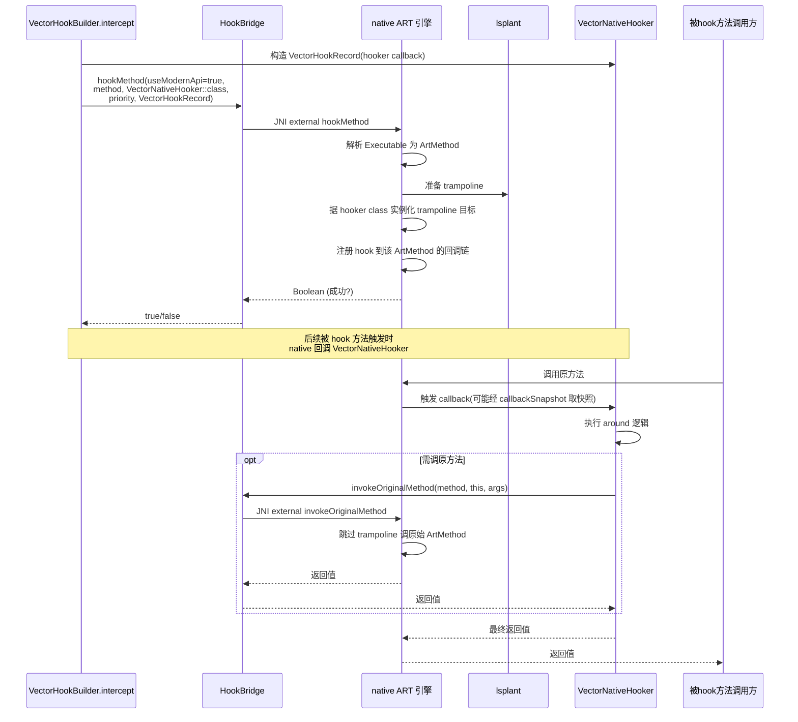

# xposed · nativebridge 包

> 📂 [`xposed/src/main/kotlin/org/matrix/vector/nativebridge/`](https://github.com/android-security-engineer/Vector-skills/blob/master/xposed/src/main/kotlin/org/matrix/vector/nativebridge/)
> 🟦 Native 层 Kotlin 门面：`external` JNI 声明

## 包职责

`nativebridge` 是 Kotlin 层与 C++ native ART 引擎之间的**薄门面**。三个 `object` 全部由 `external` JNI 函数组成，没有 Kotlin 逻辑——它们只是给上层（`impl/hooks`、`impl/core`、`impl/hookers`）提供类型安全的调用入口。真正的实现位于 native 子模块（lsplant + 自有 JNI），由 `VectorNativeHooker`、`BaseInvoker`、`VectorDeopter`、`ResourcesHook` 等消费。详见 [架构 · Native 桥](../../architecture/xposed#5-native-桥)。

## 类协作

三个 `object` 按职责分工：[`HookBridge`](https://github.com/android-security-engineer/Vector-skills/blob/master/xposed/src/main/kotlin/org/matrix/vector/nativebridge/HookBridge.kt) 是 hook 引擎主桥（注册/卸载/反优化/原方法调用/快照）；[`NativeAPI`](https://github.com/android-security-engineer/Vector-skills/blob/master/xposed/src/main/kotlin/org/matrix/vector/nativebridge/NativeAPI.kt) 仅一个方法，登记模块 JNI 入口库；[`ResourcesHook`](https://github.com/android-security-engineer/Vector-skills/blob/master/xposed/src/main/kotlin/org/matrix/vector/nativebridge/ResourcesHook.kt) 是资源替换 native 门面。消费者分布在 `impl/hooks`（`VectorNativeHooker`/`BaseInvoker`）、`impl/core`（`VectorDeopter`/`VectorContext`）、`impl/hookers`（`DexTrustHooker`）。

```mermaid
classDiagram
    direction LR
    class HookBridge {
        <<object>>
        +hookMethod(useModernApi,method,hooker,priority,callback)$ bool
        +unhookMethod(useModernApi,method,callback)$ bool
        +deoptimizeMethod(method)$ bool
        +allocateObject~T~(clazz)$ T
        +invokeOriginalMethod(method,this,args)$ Any?
        +invokeSpecialMethod~T~(method,shorty,clazz,this,args)$ Any?
        +instanceOf(obj,clazz)$ bool
        +setTrusted(cookie)$ bool
        +callbackSnapshot(hooker_callback,method)$ Array
        +getStaticInitializer(clazz)$ Method?
    }
    class NativeAPI {
        <<object>>
        +recordNativeEntrypoint(library_name)$
    }
    class ResourcesHook {
        <<object>>
        +initXResourcesNative()$ bool
        +makeInheritable(clazz)$ bool
        +buildDummyClassLoader(parent,resSuper,taSuper)$ ClassLoader
        +rewriteXmlReferencesNative(parserPtr,origRes,repRes)$
    }
    class VectorNativeHooker {
        <<impl/hooks>>
        -callback 字段
        -terminal 原方法
    }
    class BaseInvoker {
        <<impl/hooks>>
        +proceedInvocation()
        +getExecutableShorty()
    }
    class VectorDeopter {
        <<impl/core>>
        +deoptMethods(pkg,cl)
    }
    class VectorContext {
        <<impl/core>>
        +deoptimize()
        +hookClassInitializer()
    }
    class DexTrustHooker {
        <<impl/hookers>>
    }
    class VectorHookBuilder {
        <<impl/hooks>>
        +intercept()
    }
    class HookHandle {
        <<impl/hooks>>
        +unhook()
    }
    class VectorModuleManager {
        <<impl/core>>
        +loadModule()
    }

    VectorHookBuilder ..> HookBridge : hookMethod
    HookHandle ..> HookBridge : unhookMethod
    VectorDeopter ..> HookBridge : deoptimizeMethod
    VectorContext ..> HookBridge : deoptimizeMethod/getStaticInitializer
    VectorNativeHooker ..> HookBridge : instanceOf/callbackSnapshot
    BaseInvoker ..> HookBridge : invokeOriginalMethod/invokeSpecialMethod/callbackSnapshot
    DexTrustHooker ..> HookBridge : setTrusted
    VectorModuleManager ..> NativeAPI : recordNativeEntrypoint
    ResourcesHook ..> HookBridge : 无(独立资源线)

    classDef facade fill:#0e3a36,color:#3dd8c8,stroke:#3dd8c8
    classDef consumer fill:#1a3a1a,color:#fff,stroke:#5cd980
    class HookBridge,NativeAPI,ResourcesHook facade
    class VectorNativeHooker,BaseInvoker,VectorDeopter,VectorContext,DexTrustHooker,VectorHookBuilder,HookHandle,VectorModuleManager consumer
```

`hookMethod` 从 Kotlin 下沉到 native 的注册时序：



## 类清单

| 类 | 说明 |
| :--- | :--- |
| [`HookBridge`](#hookbridge) | Hook 引擎主桥：注册/卸载 hook、反优化、原方法调用、快照查询 |
| [`NativeAPI`](#nativeapi) | 模块 JNI 入口登记 |
| [`ResourcesHook`](#resourceshook) | 资源替换 native 支持：XResources 初始化、CL 伪造、XML 引用重写 |

---

## HookBridge

`object HookBridge` — Hook 引擎的**主 JNI 桥**。所有 hook 注册、卸载、反优化、原方法/特殊方法调用、回调快照、类型检查都经此处下沉到 native。

### 方法清单

```kotlin
@JvmStatic
external fun hookMethod(
    useModernApi: Boolean,
    hookMethod: Executable,
    hooker: Class<*>,
    priority: Int,
    callback: Any?,
): Boolean

@JvmStatic
external fun unhookMethod(
    useModernApi: Boolean,
    hookMethod: Executable,
    callback: Any?,
): Boolean

@JvmStatic external fun deoptimizeMethod(method: Executable): Boolean

@JvmStatic
@Throws(InstantiationException::class)
external fun <T> allocateObject(clazz: Class<T>): T

@JvmStatic
@Throws(IllegalAccessException::class, IllegalArgumentException::class, InvocationTargetException::class)
external fun invokeOriginalMethod(method: Executable, thisObject: Any?, vararg args: Any?): Any?

@JvmStatic
@Throws(IllegalAccessException::class, IllegalArgumentException::class, InvocationTargetException::class)
external fun <T> invokeSpecialMethod(
    method: Executable,
    shorty: CharArray,
    clazz: Class<T>,
    thisObject: Any?,
    vararg args: Any?,
): Any?

@JvmStatic @FastNative external fun instanceOf(obj: Any?, clazz: Class<*>): Boolean

@JvmStatic @FastNative external fun setTrusted(cookie: Any?): Boolean

@JvmStatic
external fun callbackSnapshot(hooker_callback: Class<*>, method: Executable): Array<Array<Any?>>

@JvmStatic external fun getStaticInitializer(clazz: Class<*>): Method?
```

### 方法分组

| 分组 | 方法 | 调用方 |
| :--- | :--- | :--- |
| Hook 注册/卸载 | `hookMethod`、`unhookMethod` | `VectorHookBuilder.intercept` / `HookHandle.unhook` |
| 反优化 | `deoptimizeMethod` | `VectorDeopter.deoptMethods`、`VectorContext.deoptimize` |
| 对象分配 | `allocateObject` | `VectorCtorInvoker.newInstance` / `newInstanceSpecial` |
| 原方法调用 | `invokeOriginalMethod` | `BaseInvoker`、`VectorNativeHooker` 的 terminal |
| 特殊调用 | `invokeSpecialMethod` | `VectorMethodInvoker.invokeSpecial`、`VectorCtorInvoker` |
| 类型检查 | `instanceOf` | `VectorNativeHooker` 返回值校验 |
| DEX 信任 | `setTrusted` | `DexTrustHooker` |
| 快照查询 | `callbackSnapshot` | `VectorNativeHooker.callback`、`BaseInvoker.proceedInvocation` |
| 静态初始化器 | `getStaticInitializer` | `VectorContext.hookClassInitializer` |

### 关键约定

- **`hookMethod` 的 `callback` 参数**：现代 API 传 `VectorHookRecord`（不再是旧的 `HookerCallback`）；`hooker` 传 `VectorNativeHooker::class.java`，native 层据此实例化 trampoline 目标。`useModernApi = true` 表示走现代链路。
- **`callbackSnapshot` 返回双数组**：`Array<Array<Any?>>`，`[0]` 是现代 `VectorHookRecord[]`、`[1]` 是 legacy hook 数组。两个调用方（`VectorNativeHooker`、`BaseInvoker`）都依赖此结构。
- **`invokeSpecialMethod` 需 shorty**：非虚拟直接调用必须传 JNI shorty 字符数组（由 `BaseInvoker.getExecutableShorty` 生成），native 层据此正确处理基本类型。
- **`@FastNative`**：`instanceOf` 与 `setTrusted` 标注 `FastNative`，表示这些是高频、无阻塞的快速 JNI 调用，运行时可省去部分 JNI 开销。
- **异常声明**：`invokeOriginalMethod`/`invokeSpecialMethod` 声明 `IllegalAccessException`/`IllegalArgumentException`/`InvocationTargetException`；`allocateObject` 声明 `InstantiationException`。调用方（`BaseInvoker`）会解包 `InvocationTargetException` 抛出真实 cause。

---

## NativeAPI

`object NativeAPI` — 单方法对象，供模块登记自己声明的 native JNI 入口库。

```kotlin
@JvmStatic external fun recordNativeEntrypoint(library_name: String)
```

### 调用方

`VectorModuleManager.loadModule` 在装载模块时遍历 `module.file.moduleLibraryNames`，对每个库名调 `NativeAPI.recordNativeEntrypoint(libraryName)`。native 层据此记录该模块的 JNI 入口，便于后续按模块定位并加载其 `.so`。

---

## ResourcesHook

`object ResourcesHook` — 资源 hook 的 **native 支持门面**。提供 XResources 兼容所需的底层能力：初始化 native 资源 hook、让 ClassLoader 可继承、构造伪造 CL、在 XML 解析时重写资源引用。

### 方法清单

```kotlin
@JvmStatic external fun initXResourcesNative(): Boolean

@JvmStatic external fun makeInheritable(clazz: Class<*>): Boolean

@JvmStatic
external fun buildDummyClassLoader(
    parent: ClassLoader,
    resourceSuperClass: String,
    typedArraySuperClass: String,
): ClassLoader

@JvmStatic
@FastNative
external fun rewriteXmlReferencesNative(parserPtr: Long, origRes: Any, repRes: Resources)
```

### 方法说明

| 方法 | 用途 |
| :--- | :--- |
| `initXResourcesNative` | 初始化资源 hook 的 native 状态（如 patch `Resources`/`TypedArray` 父类），返回是否成功 |
| `makeInheritable` | 让给定 `Class` 可被继承（移除 final 等），供资源替换类继承 |
| `buildDummyClassLoader` | 按 `resourceSuperClass` / `typedArraySuperClass` 名字构造一个伪造 ClassLoader，用于资源替换场景下的类查找 |
| `rewriteXmlReferencesNative` | `@FastNative`。在 XML 解析器（`parserPtr`）层把对 `origRes` 的资源引用重写为 `repRes`，实现资源替换 |

> `rewriteXmlReferencesNative` 直接拿 native `parserPtr`，属于性能敏感路径，故标 `@FastNative`。

## 相关

- [xposed 模块总览](../modules/xposed)
- [xposed · hooks 包](./xposed-hooks)（`VectorNativeHooker`/`BaseInvoker` 消费 `HookBridge`）
- [xposed · core 包](./xposed-core)（`VectorDeopter` 调 `deoptimizeMethod`）
- [xposed · hookers 包](./xposed-hookers)（`DexTrustHooker` 调 `setTrusted`）
- native 引擎实现见 [架构 · Native 桥](../../architecture/xposed#5-native-桥)
