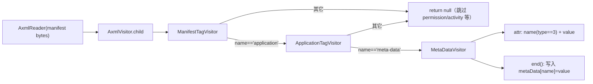
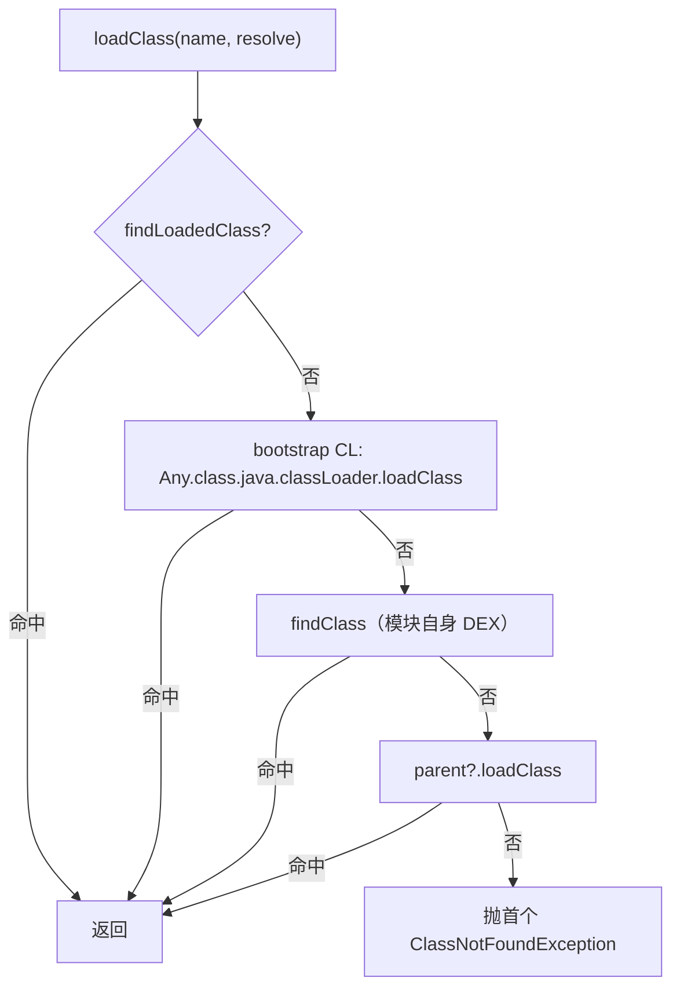

# xposed · utils 包

> 📂 `xposed/src/main/kotlin/org/matrix/vector/impl/utils/`
> 🟦 模块工具：元数据解析、内存 ClassLoader、jar: 资源处理

## 包职责

`impl/utils` 提供模块装载所需的**三项基础设施**：从 APK 的 `AndroidManifest.xml` 提取 `meta-data` 元数据、用内存 `ByteBuffer` 加载模块 DEX 的隔离 ClassLoader、以及直接从 APK 内读取 JAR/ZIP 条目的自定义 `URLStreamHandler`。三者协同实现模块的**内存 ClassLoading 与隔离**——模块代码不落盘、ClassLoader 独占挂在框架私有分支、`jar:` 请求被拦截。详见 [架构 · 内存 Classloading](../../architecture/xposed#4-内存-classloading-与隔离)。

## 类清单

| 类 | 说明 |
| :--- | :--- |
| [`VectorMetaDataReader`](#vectormetadatareader) | 解析 `AndroidManifest.xml` 的 `meta-data`，不依赖完整 APK 提取 |
| [`VectorModuleClassLoader`](#vectormoduleclassloader) | 内存 DEX ClassLoader：隔离加载模块、native 库与资源查找 |
| [`VectorURLStreamHandler`](#vectorurlstreamhandler) | 自定义 `jar:` 协议处理器：直接从 APK 读条目 |

---

## VectorMetaDataReader

`class VectorMetaDataReader private constructor(apk: File)` — **严格从 `AndroidManifest.xml` 解析 `meta-data`** 的工具类。用 AXML 读取器（`pxb.android.axml`）遍历二进制 manifest，提取 `<application><meta-data>` 键值对，无需完整 APK 反编译。

### 公开 API

```kotlin
companion object {
    @JvmStatic
    @Throws(IOException::class)
    fun getMetaData(apk: File): Map<String, Any>

    @JvmStatic
    fun extractIntPart(str: String): Int
}
```

### 解析架构

用访问者模式遍历 AXML 节点，只深入关心的标签：



### 关键设计

- **只关心 `<manifest>`→`<application>`→`<meta-data>` 路径**：`ManifestTagVisitor` 对 `permission`/`activity` 等返回 `null` 直接剪枝。
- **`attr` 类型判断**：`MetaDataVisitor.attr` 中 `type == 3 && name == "name"` 取键名（type 3 为字符串），`name == "value"` 取值。
- **`extractIntPart`**：从字符串前缀逐字符提取数字（遇非数字即停），用于解析如 `minXposedVersion` 等版本字段。
- **`getBytesFromInputStream`**：私有工具，把 `InputStream` 读成 `ByteArray` 供 AxmlReader 使用。

---

## VectorModuleClassLoader

`class VectorModuleClassLoader : ByteBufferDexClassLoader` — **模块专用 ClassLoader**。用内存 `ByteBuffer`（来自 `SharedMemory` 只读映射）加载 DEX，避免把模块代码提取到磁盘。重写类查找、native 库查找、资源查找，确保隔离与安全。

### 构造

两个私有构造（按 API 级别分流），均调 `super` 的 `ByteBufferDexClassLoader`：

```kotlin
@RequiresApi(Q)
private constructor(dexBuffers, librarySearchPath, parent, apkPath)

private constructor(dexBuffers, parent, apkPath, librarySearchPath)   // API < 29
```

### 工厂方法

```kotlin
companion object {
    @JvmStatic
    fun loadApk(
        apk: String,
        dexes: List<SharedMemory>,
        librarySearchPath: String,
        parent: ClassLoader?,
    ): ClassLoader
}
```

`loadApk` 把 `dexes` 的 `SharedMemory` 并行 `mapReadOnly` 成 `ByteBuffer`，按 SDK 选构造，最后**并行 unmap 并 close 所有 SharedMemory**（CL 已实例化、fd 不再需要）。

### 类查找策略（loadClass）

重写 `loadClass(name, resolve)`，查找顺序与默认 CL 不同：



> 关键点：**先走 bootstrap CL**（`Any::class.java.classLoader`），确保框架/API 类优先从系统加载，模块无法覆盖。这与典型 `parent-first` 顺序略有差异——bootstrap 优先级被显式提前。

### native 库查找（findLibrary）

```kotlin
override fun findLibrary(libraryName: String): String?
```

`System.mapLibraryName` 得到文件名后，遍历 `nativeLibraryDirs`（搜索路径 + 系统 `java.library.path`）：
- **zip 内条目**（路径含 `!/`）：在 JAR 中找 `dir/fileName`，仅当 `method == STORED`（未压缩）才返回 `apkPath!/entryName`——未压缩才能 mmap。
- **目录**：`Os.open` 探测文件可读，成功返回路径，`ErrnoException` 吞掉继续。

### 资源查找（findResource / findResources）

```kotlin
override fun findResource(name: String): URL?
override fun findResources(name: String): Enumeration<URL>
```

委托 `VectorURLStreamHandler(apkPath).getEntryUrlOrNull(name)` 构造 `jar:` URL。`findResources` 把单个结果包成单元素 `Enumeration`。

### 其它

- `toString()`：`"VectorModuleClassLoader[module=<apkPath>, <super>]"`。
- 常量：`ZIP_SEPARATOR = "!/"`、`SYSTEM_NATIVE_LIBRARY_DIRS = splitPaths(System.getProperty("java.library.path"))`。

---

## VectorURLStreamHandler

`internal class VectorURLStreamHandler(jarFileName: String) : Handler()` — 继承 JDK `sun.net.www.protocol.jar.Handler`，**自定义 `jar:` 协议处理**。直接从模块 APK 读取内部条目，无需解压到文件系统。

### 构造与状态

```kotlin
private val fileUri: String = File(jarFileName).toURI().toString()
private val jarFile: JarFile = JarFile(jarFileName)
```

### 公开方法

```kotlin
fun getEntryUrlOrNull(entryName: String): URL?

@Throws(IOException::class)
override fun openConnection(url: URL): URLConnection

@Throws(IOException::class)
protected fun finalize()   // 关闭 jarFile
```

`getEntryUrlOrNull`：条目存在则构造 `URL("jar", null, -1, "$fileUri!/$encodedName", this)`，`entryName` 经 `Uri.encode(entryName, "/")` 编码（保留 `/`）。

### ClassPathURLConnection（内部类）

`private inner class ClassPathURLConnection(url: URL) : JarURLConnection(url)` — 实际的连接实现。

```kotlin
override fun connect()
override fun getJarFile(): JarFile
override fun getInputStream(): InputStream
override fun getContentType(): String
override fun getContentLength(): Int
```

### 关键设计

- **`useCaches = false`**：`init` 强制关闭缓存，避免 JAR 缓存持有文件句柄导致模块卸载后无法更新。
- **`connect`** 惰性：首次连接时从外层 `jarFile` 取 `ZipEntry`，找不到抛 `FileNotFoundException`。
- **`getInputStream`** 返回 `FilterInputStream` 包装，其 `close()` 同时关闭流、外层 `jarFile`、连接级 `connectionJarFile`——确保资源彻底释放。
- **`getJarFile`**：连接级懒加载独立 `JarFile`（`connectionJarFile`），与外层 `jarFile` 分离，避免重复 open 又能各自释放。
- **`finalize`**：`@Suppress("deprecation")` 关闭外层 `jarFile`，作为兜底清理。
- **`getContentLength`**：`connect()` 后取 `jarEntry.size`，IO 异常返回 `-1`。

## 相关

- [xposed 模块总览](../modules/xposed)
- [xposed · core 包](./xposed-core)（`VectorModuleManager` 调 `loadApk` 装载模块）
- [xposed · nativebridge 包](./xposed-nativebridge)（`ResourcesHook.buildDummyClassLoader` 与资源 CL 协同）
- 内存 Classloading 隔离机制详见 [架构 · Xposed API 实现](../../architecture/xposed#4-内存-classloading-与隔离)
