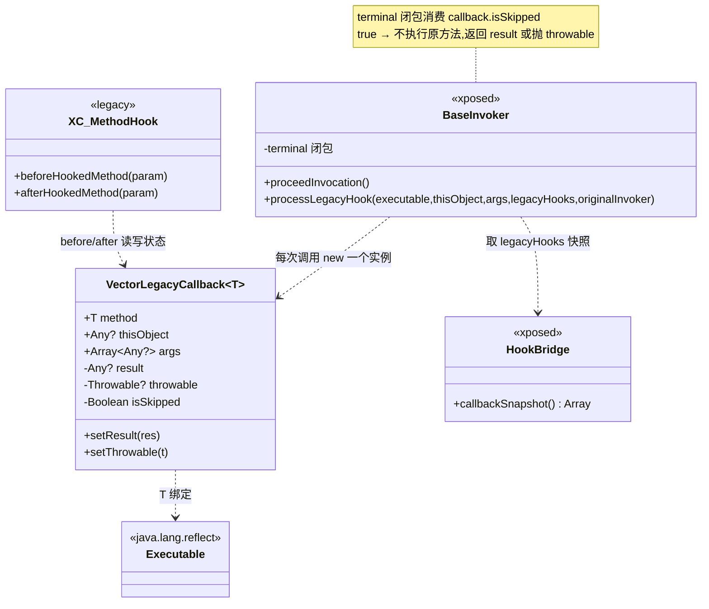
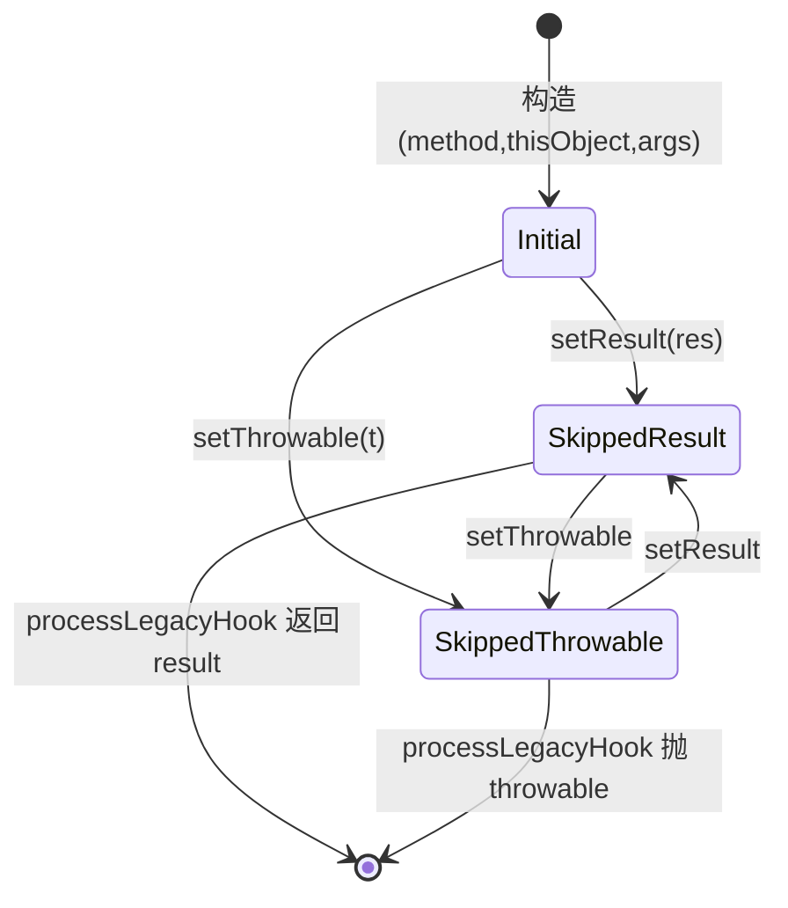
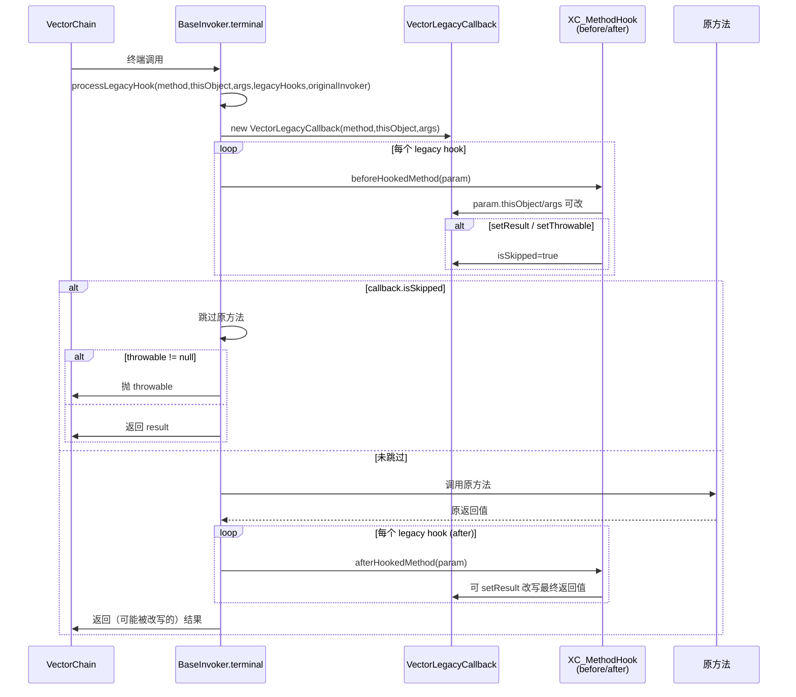

# 🪝 VectorLegacyCallback · legacy 回调桥接

> 📂 [`xposed/src/main/kotlin/org/matrix/vector/impl/hooks/VectorLegacyCallback.kt`](https://github.com/android-security-engineer/Vector-skills/blob/master/xposed/src/main/kotlin/org/matrix/vector/impl/hooks/VectorLegacyCallback.kt)
> 🟦 xposed 模块 · `XposedBridge.LegacyApiSupport` 的状态适配器

## 类职责

[`class VectorLegacyCallback<T : Executable>`](https://github.com/android-security-engineer/Vector-skills/blob/master/xposed/src/main/kotlin/org/matrix/vector/impl/hooks/VectorLegacyCallback.kt#L9) 是面向 legacy Xposed API（`XposedBridge`/`XC_MethodHook`）的可变状态容器。当 legacy 模块通过 `BaseInvoker` 的 `Chain` 终端被调用时，框架把当前方法、`thisObject`、`args` 装进本对象传给 legacy hook，legacy hook 通过 `setResult`/`setThrowable` 改写返回值或抛异常，`isSkipped` 标记是否短路了原方法。

> 注释明确：本类包含的状态变更**仅供 legacy 模块支持**，不参与现代 API 路径。

## 核心字段与方法

| 成员 | 签名 | 作用 |
| :--- | :--- | :--- |
| `method` | `val method: T : Executable` | 被挂钩的方法/构造，不可变 |
| `thisObject` | `var thisObject: Any?` | 调用接收者，框架进入前设置 |
| `args` | `var args: Array<Any?>` | 实参数组，legacy hook 可改写元素 |
| `result` | `var result: Any? (private set)` | legacy hook 设置的返回值 |
| `throwable` | `var throwable: Throwable? (private set)` | legacy hook 设置的异常 |
| `isSkipped` | `var isSkipped: Boolean (private set)` | 是否短路原方法 |
| [`setResult`](https://github.com/android-security-engineer/Vector-skills/blob/master/xposed/src/main/kotlin/org/matrix/vector/impl/hooks/VectorLegacyCallback.kt#L23-L27) | `fun setResult(res: Any?)` | 置 `result`，清 `throwable`，`isSkipped=true` |
| [`setThrowable`](https://github.com/android-security-engineer/Vector-skills/blob/master/xposed/src/main/kotlin/org/matrix/vector/impl/hooks/VectorLegacyCallback.kt#L29-L33) | `fun setThrowable(t: Throwable?)` | 置 `throwable`，清 `result`，`isSkipped=true` |

## 与调用栈的协作结构



## 关键字段

| 字段 | 类型 | 可见性 | 含义 |
| :--- | :--- | :--- | :--- |
| `method` | `T : Executable` | `val` 公开 | 被挂钩的方法/构造 |
| `thisObject` | `Any?` | `var` 公开 | 调用接收者 |
| `args` | `Array<Any?>` | `var` 公开 | 实参数组 |
| `result` | `Any?` | `private set` | legacy hook 设置的返回值 |
| `throwable` | `Throwable?` | `private set` | legacy hook 设置的异常 |
| `isSkipped` | `Boolean` | `private set` | 是否短路原方法 |

## 方法签名

```kotlin
// 设置返回值，清异常，标记跳过原方法
fun setResult(res: Any?)

// 设置异常，清返回值，标记跳过原方法
fun setThrowable(t: Throwable?)
```

`setResult` 与 `setThrowable` 互斥：任一调用都会把另一个字段清空，并把 `isSkipped` 置 true。`BaseInvoker` 的 `terminal` 闭包通过 `delegate.processLegacyHook` 消费这些字段——`isSkipped` 时原方法不执行，返回 `result` 或抛 `throwable`。

## 字段语义与默认值

| 字段 | 初始值 | 何时被改 | 消费方 |
| :--- | :--- | :--- | :--- |
| `method` | 构造传入 | 不可变 | legacy hook 读取被挂钩方法元信息 |
| `thisObject` | 构造传入 | 框架在进入前设置 | legacy `beforeHookedMethod` 的 `param.thisObject` |
| `args` | 构造传入 | legacy hook 可改写元素 | 同上 `param.args` |
| `result` | `null` | `setResult` | `processLegacyHook` 返回 |
| `throwable` | `null` | `setThrowable` | `processLegacyHook` 抛出 |
| `isSkipped` | `false` | `setResult`/`setThrowable` | `processLegacyHook` 判断是否短路原方法 |

## 与现代 Invoker 的边界

- 现代模块走 `BaseInvoker.proceedInvocation` 的 `Chain` 路径，hook 串由 `VectorChain` 直接驱动，**不经过**本类；
- 本类仅服务于 `XposedBridge.LegacyApiSupport` 注册的 legacy 回调，是兼容旧生态 `XC_MethodHook` 的桥接态；
- `processLegacyHook` 的签名 `(executable, thisObject, args, legacyHooks, originalInvoker)` 中，本对象承载 `thisObject`/`args` 的可变性，而 `legacyHooks` 数组由 `HookBridge.callbackSnapshot` 提供。

## 使用要点

- legacy hook 若既不调 `setResult` 也不调 `setThrowable`，`isSkipped` 保持 false，原方法照常执行，`beforeHookedMethod`/`afterHookedMethod` 仅作观察；
- 多个 legacy hook 链式执行时，后一个可能覆盖前一个的 `result`/`throwable`——这与经典 Xposed 的 `param.setResult` 语义一致；
- `throwable` 为 null 且 `isSkipped` 为 true（即 `setResult(null)`）表示把返回值改为 null，与"未跳过"区分。

## 状态转移



### legacy hook 调用时序



## 使用要点

- 本类是**可变状态容器**，每次被 hook 方法调用都会新建一个实例，不复用、不缓存；
- `thisObject`/`args` 在进入 `processLegacyHook` 前由框架填好，legacy hook 的 `beforeHookedMethod` 可直接改 `args` 元素，`afterHookedMethod` 读 `result`；
- `setResult`/`setThrowable` 由 legacy hook 在 `beforeHookedMethod` 中调用以短路原方法；`afterHookedMethod` 中调用则改写最终返回值；
- `isSkipped` 是消费方判断分支的唯一依据——框架不单独传"是否跳过"参数，而是查 `callback.isSkipped`。
- 本类不做线程同步：legacy hook 的 `before`/`after` 在调用线程同步执行，无并发访问同一实例的场景。
- `method` 字段让 legacy hook 能在回调内拿到被挂钩方法的反射对象，用于按方法名做条件分支。

## 相关

- [BaseInvoker · 调用系统基类](./base-invoker)（`terminal` 经 `processLegacyHook` 消费本类）
- xposed 模块总览见 [modules · xposed](../../modules/xposed)
