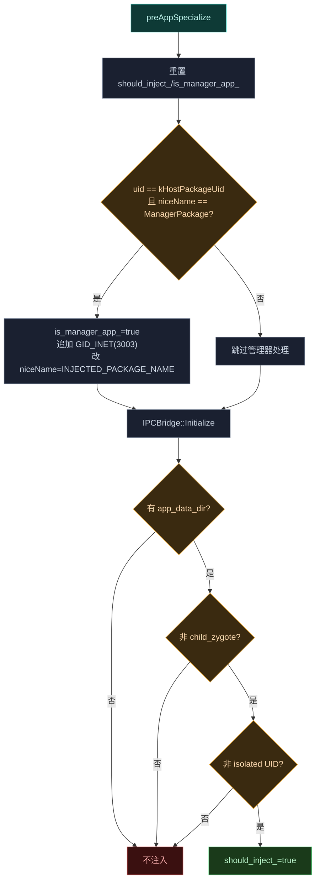
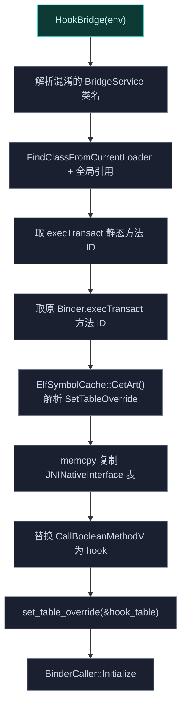

# 🧬 zygisk · cpp 包

> 📂 `zygisk/src/main/cpp/`（含 `include/`）
> 🟦 Zygisk 子系统的 Native 层

## 包职责

`cpp` 包是 Zygisk 子系统的 Native 层。它实现 `ZygiskModule` 接口，在 Zygote fork 子进程时过滤目标、建立与 Daemon 的 IPC 桥、从内存加载框架 DEX、初始化 ART hook，最后把控制权交给 Java 侧入口 `Main.forkCommon`。它同时实现 JNI Binder Trap——全局拦截 `Binder.execTransact`，把自定义 `_VEC` 事务码转给框架的 `BridgeService`。

## 文件清单

| 文件 | 类 | 说明 |
| :--- | :--- | :--- |
| `module.cpp` | `VectorModule` | Zygisk 模块入口，进程过滤 + 框架注入编排 |
| `module.cpp` | `ConfigImpl` | `ConfigBridge` 的内存实现（混淆映射） |
| `ipc_bridge.cpp` / `include/ipc_bridge.h` | `IPCBridge` | 与 Daemon 的 Binder IPC + JNI Binder Trap |
| `ipc_bridge.cpp` | `BinderCaller` | libbinder 符号解析，取调用者 UID/PID |

---

## VectorModule

`class VectorModule : public zygisk::ModuleBase, public vector::native::Context`（`namespace vector::native::module`）—— Zygisk 模块主类。多重继承：`ModuleBase` 提供 Zygisk 生命周期回调，`Context` 提供 native 库的注入能力（DEX 加载、ART hook）。`REGISTER_ZYGISK_MODULE(VectorModule)` 注册。

### 生命周期回调

```cpp
void onLoad(zygisk::Api *api, JNIEnv *env) override;
void preAppSpecialize(zygisk::AppSpecializeArgs *args) override;
void postAppSpecialize(const zygisk::AppSpecializeArgs *args) override;
void preServerSpecialize(zygisk::ServerSpecializeArgs *args) override;
void postServerSpecialize(const zygisk::ServerSpecializeArgs *args) override;
```

### Context 纯虚实现

```cpp
void LoadDex(JNIEnv *env, PreloadedDex &&dex) override;
void SetupEntryClass(JNIEnv *env) override;
```

- `LoadDex`：取 `SystemClassLoader` 作父加载器，把内存 DEX 包进 `DirectByteBuffer`，构造 `InMemoryDexClassLoader`，全局引用存入 `inject_class_loader_`。
- `SetupEntryClass`：从 `ConfigBridge::obfuscation_map()` 取 key `"org.matrix.vector.core."` 的混淆前缀 + `"Main"` 得入口类名，经 `FindClassFromLoader` 在注入类加载器中查找，全局引用存入 `entry_class_`。

### 注入决策（preAppSpecialize）



isolated UID 范围常量（参考 `android_filesystem_config.h`）：

```cpp
constexpr int FIRST_ISOLATED_UID = 99000;
constexpr int LAST_ISOLATED_UID = 99999;
constexpr int FIRST_APP_ZYGOTE_ISOLATED_UID = 90000;
constexpr int LAST_APP_ZYGOTE_ISOLATED_UID = 98999;
constexpr int SHARED_RELRO_UID = 1037;
constexpr int PER_USER_RANGE = 100000;  // UID = AppID + UserID*100000
```

### 框架注入（postAppSpecialize）

```cpp
auto binder = ipc_bridge.RequestAppBinder(env_, args->nice_name);
auto [dex_fd, dex_size] = ipc_bridge.FetchFrameworkDex(env_, binder.get());
auto obfs_map = ipc_bridge.FetchObfuscationMap(env_, binder.get());
ConfigBridge::GetInstance()->obfuscation_map(std::move(obfs_map));
{ PreloadedDex dex(dex_fd, dex_size); this->LoadDex(env_, std::move(dex)); }
close(dex_fd);
this->InitArtHooker(env_, init_info_);
this->InitHooks(env_);
this->SetupEntryClass(env_);
this->FindAndCall(env_, "forkCommon",
    "(ZZLjava/lang/String;Ljava/lang/String;Landroid/os/IBinder;)V",
    JNI_FALSE, JNI_FALSE, args->nice_name, args->app_data_dir, binder.get(), is_manager_app_);
```

不注入则 `SetAllowUnload(true)` 让 Zygisk `dlclose` 本 `.so`。

### system_server 注入（postServerSpecialize）

system_server 总是注入目标。`preServerSpecialize` 仅置 `should_inject_=true` 并初始化 IPCBridge。`postServerSpecialize` 流程：

1. ZTE 设备 workaround——检测 `ro.vendor.product.ztename`，调 `Process.setArgV0("system_server")`。
2. 取 system_server binder：`bridgeServiceName` 默认 `"serial"`，若 `runtime_flags & LATE_INJECT` 则用 `"serial_vector"`；`RequestSystemServerBinder` 轮询最多 10 秒。
3. `RequestManagerBinderFromSystemServer` 试图直连 manager binder，失败则经 system binder 代理（`effective_binder`）。
4. 同 app 路径取 DEX/混淆图、`LoadDex`、`HookBridge`（装 JNI Binder Trap）、`InitArtHooker`/`InitHooks`/`SetupEntryClass`。
5. `FindAndCall("forkCommon", ..., JNI_TRUE, is_late_inject, "system", nullptr, manager_binder, is_manager_app_)`。

```cpp
enum RuntimeFlags : uint32_t { LATE_INJECT = 1 << 30 };  // NeoZygisk 定义
```

### SetAllowUnload

```cpp
void SetAllowUnload(bool unload);
```

`unload=true` 时 `api_->setOption(zygisk::DLCLOSE_MODULE_LIBRARY)` 并 `instance_.release()`——静态 `unique_ptr` 析构不会再 `delete` 本对象，避免 Zygisk 清理时的 double-free。`unload=false` 时阻止卸载（已注入须常驻）。

### lsplant::InitInfo 配置

```cpp
const lsplant::InitInfo init_info_{
    .inline_hooker = [](auto target, auto replace) { ... HookInline ... },
    .inline_unhooker = [](auto target) { ... UnhookInline ... },
    .art_symbol_resolver = [](auto s) { return ElfSymbolCache::GetArt()->getSymbAddress(s); },
    .art_symbol_prefix_resolver = [](auto s) { return ElfSymbolCache::GetArt()->getSymbPrefixFirstAddress(s); },
    .generated_class_name = "Vector_",
    .generated_source_name = "Dobby",
};
```

inline hook 委托 native 库的 `HookInline`/`UnhookInline`（Dobby）；ART 符号解析经 `ElfSymbolCache::GetArt()`。

### CMake 注入常量

```cpp
constexpr uid_t kHostPackageUid = INJECTED_PACKAGE_UID;
const char *const kHostPackageName = INJECTED_PACKAGE_NAME;
const char *const kManagerPackageName = MANAGER_PACKAGE_NAME;
constexpr uid_t GID_INET = 3003;
```

由 CMake 生成宏注入。

---

## ConfigImpl

`class ConfigImpl : public ConfigBridge`—— `ConfigBridge` 的内存实现，持有混淆映射表。

```cpp
using obfuscation_map_t = std::map<std::string, std::string>;
class ConfigImpl : public ConfigBridge {
public:
    inline static void Init() { instance_ = std::make_unique<ConfigImpl>(); }
    virtual obfuscation_map_t &obfuscation_map() override;
    virtual void obfuscation_map(obfuscation_map_t m) override;
private:
    obfuscation_map_t obfuscation_map_;
};
```

`onLoad` 中 `ConfigImpl::Init()` 创建单例，`Context::instance_.reset(this)` 让 `Context` 单例指向本 `VectorModule` 实例。

---

## IPCBridge

`class IPCBridge`（`namespace vector::native::module`）—— Zygisk 模块与 Daemon 通信的 IPC 桥单例。职责：发现并连接 Daemon、请求框架 DEX 与混淆映射、安装 JNI Binder Trap。

### 单例与初始化

```cpp
static IPCBridge &GetInstance();  // static local 单例
void Initialize(JNIEnv *env);      // 幂等，缓存全部 JNI 类/方法 ID
```

`Initialize` 缓存 `ServiceManager`/`IBinder`/`Binder`/`Parcel`/`ParcelFileDescriptor` 的类与方法 ID（全局引用），任一失败则 `initialized_` 保持 `false`。

### Binder 请求

```cpp
lsplant::ScopedLocalRef<jobject> RequestAppBinder(JNIEnv *env, jstring nice_name);
lsplant::ScopedLocalRef<jobject> RequestSystemServerBinder(JNIEnv *env, std::string bridgeServiceName);
lsplant::ScopedLocalRef<jobject> RequestManagerBinderFromSystemServer(
    JNIEnv *env, jobject system_server_binder);
std::tuple<int, size_t> FetchFrameworkDex(JNIEnv *env, jobject binder);
std::map<std::string, std::string> FetchObfuscationMap(JNIEnv *env, jobject binder);
```

| 方法 | 事务码 | 返回 |
| :--- | :--- | :--- |
| `RequestAppBinder` | `_VEC` | app 专属 binder（带 heartbeat） |
| `RequestSystemServerBinder` | — | 经 `ServiceManager.getService(name)`，轮询 10 秒 |
| `RequestManagerBinderFromSystemServer` | `_VEC` | 从 system_server 取 manager binder |
| `FetchFrameworkDex` | `_DEX` | `{fd, size}`（经 `ParcelFileDescriptor.detachFd`） |
| `FetchObfuscationMap` | `_OBF` | `map<string,string>`（读 int size，循环 readString） |

### IPC 协议常量

```cpp
constexpr auto kBridgeServiceName = "activity"sv;  // 系统服务会合点
constexpr jint kBridgeTransactionCode = ('_'<<24)|('V'<<16)|('E'<<8)|'C';  // _VEC
constexpr jint kDexTransactionCode     = ('_'<<24)|('D'<<16)|('E'<<8)|'X';  // _DEX
constexpr jint kObfuscationMapTransactionCode = ('_'<<24)|('O'<<16)|('B'<<8)|'F';  // _OBF
constexpr jint kActionGetBinder = 2;
```

`_VEC` 事务的 data parcel 写入：`writeInt(kActionGetBinder)` + `writeString(nice_name/uid,pid)` + `writeStrongBinder(heartbeat)`。heartbeat binder 在成功后转全局引用，进程死亡时 Daemon 收到 `binderDied` 清理。

### 嵌套类 ParcelWrapper

```cpp
class ParcelWrapper {
public:
    ParcelWrapper(JNIEnv *env, IPCBridge *bridge);
    ~ParcelWrapper();  // RAII：recycle data 与 reply
    lsplant::ScopedLocalRef<jobject> data;
    lsplant::ScopedLocalRef<jobject> reply;
};
```

构造时 `Parcel.obtain` 两个 Parcel，析构时 `recycle`，保证异常路径也不泄漏。

### JNI Binder Trap（HookBridge）

```cpp
void HookBridge(JNIEnv *env);
```

安装流程：



ART 符号 `_ZN3art9JNIEnvExt16SetTableOverrideEPK18JNINativeInterface` 替换进程级 JNI 函数表。`CallBooleanMethodV_Hook` 检查 `methodId == exec_transact_backup_method_id_`，命中则尝试 `ExecTransact_Replace`。

### CallBooleanMethodV_Hook 逻辑

```cpp
static jboolean JNICALL CallBooleanMethodV_Hook(JNIEnv *env, jobject obj,
                                                jmethodID methodId, va_list args);
static jboolean ExecTransact_Replace(jboolean *res, JNIEnv *env, jobject obj, va_list args);
```

- 若 `methodId` 是 `Binder.execTransact` 且调用者非"上次失败者"，调 `ExecTransact_Replace`。
- `ExecTransact_Replace` 从 `va_list` 提取 `(code, data, reply, flags)`，`code == _VEC` 则调 Java `BridgeService.execTransact(obj, code, data, reply, flags)`，返回 `true`（已处理）。
- Java 返回 `false` 时记录 `g_last_failed_id = caller_id`，下次该调用者直接放行原函数，避免重复拦截开销。
- 非命中或处理失败则调 `call_boolean_method_v_backup_`（原函数）。

### BinderCaller

```cpp
class BinderCaller {
public:
    static void Initialize();  // 解析 libbinder 符号
    static uint64_t GetId();   // (uid<<32)|pid
private:
    struct IPCThreadState;
    inline static IPCThreadState *(*s_self_or_null_fn)() = nullptr;
    inline static pid_t (*s_get_calling_pid_fn)(IPCThreadState *) = nullptr;
    inline static uid_t (*s_get_calling_uid_fn)(IPCThreadState *) = nullptr;
};
```

经 `ElfSymbolCache::GetLibBinder()` 解析 libbinder 的 `IPCThreadState::selfOrNull`/`getCallingPid`/`getCallingUid` 三个 mangled 符号，组合出 64 位调用者 ID。符号缺失时 `GetId()` 返回 0（禁用 caller 检查）。

### 成员变量（节选）

```cpp
bool initialized_ = false;
jclass service_manager_class_, binder_class_, parcel_class_, parcel_fd_class_;
jmethodID get_service_method_, transact_method_, binder_ctor_;
jmethodID obtain_method_, recycle_method_, write_interface_token_method_,
         write_int_method_, write_string_method_, write_strong_binder_method_,
         read_exception_method_, read_strong_binder_method_, read_file_descriptor_method_,
         read_int_method_, read_long_method_, read_string_method_;
jmethodID detach_fd_method_;

JNINativeInterface native_interface_hook_{};
jmethodID exec_transact_backup_method_id_ = nullptr;
jboolean (*call_boolean_method_v_backup_)(JNIEnv *, jobject, jmethodID, va_list) = nullptr;
jclass bridge_service_class_ = nullptr;
jmethodID exec_transact_replace_method_id_ = nullptr;
```

## 相关

- [zygisk 模块总览](../modules/zygisk)
- [zygisk · kotlin 包](./zygisk-kotlin)（`Main.forkCommon` 是 `module.cpp` `FindAndCall` 的目标）
- [zygisk · service 包](./zygisk-service)（`BridgeService` 是 Binder Trap 的 Kotlin 侧）
- [native · core 包](./native-core)（`VectorModule` 继承 `Context`）
- [native · elf 包](./native-elf)（`ElfSymbolCache` 提供符号解析）
- [架构 · Zygisk 模块](../../architecture/zygisk) · [架构 · IPC](../../architecture/ipc#jni-binder-trap)
