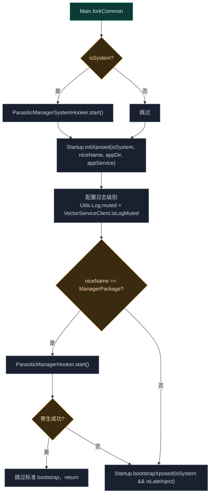
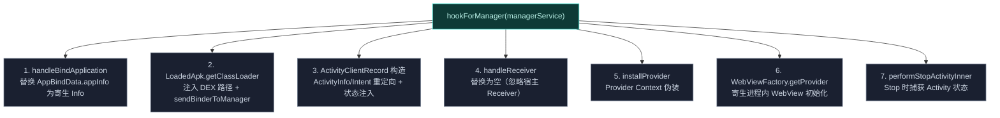

# ☕ zygisk · kotlin 根包

> 📂 [`zygisk/src/main/kotlin/org/matrix/vector/`](https://github.com/android-security-engineer/Vector-skills/blob/master/zygisk/src/main/kotlin/org/matrix/vector/)
> 🟦 Zygisk 子系统的 Framework Loader 层（Kotlin）

## 包职责

Kotlin 根包是 Zygisk 子系统的高层框架操作层。`core.Main` 是 native 经 JNI 调用的 Java 入口，`ParasiticManagerHooker` 与 `ParasiticManagerSystemHooker` 实现**寄生式管理器**——把管理器 APK 注入宿主进程运行，无独立包名。

## 类清单

| 类 | 文件 | 说明 |
| :--- | :--- | :--- |
| [`Main`](#main) | `core/Main.kt` | 框架引导入口 `forkCommon`：从内存加载的 DEX 启动 Xposed 框架 |
| [`ParasiticManagerHooker`](#parasiticmanagerhooker) | `ParasiticManagerHooker.kt` | 寄生管理器：宿主进程身份移植、Activity 生命周期接管 |
| [`ParasiticManagerSystemHooker`](#parasiticmanagersystemhooker) | `ParasiticManagerSystemHooker.kt` | system_server 内 Intent 重定向，启动寄生管理器 |

---

## Main

`object Main`（`package org.matrix.vector.core`）—— Java 侧框架引导入口，由 native `VectorModule` 经 `FindAndCall` 调用静态方法 `forkCommon`。

### forkCommon

```kotlin
@JvmStatic
fun forkCommon(
    isSystem: Boolean,
    isLateInject: Boolean,
    niceName: String,
    appDir: String?,
    binder: IBinder,
)
```

native 侧签名 `"(ZZLjava/lang/String;Ljava/lang/String;Landroid/os/IBinder;)V"`。

### 引导流程



`binder` 经 `ILSPApplicationService.Stub.asInterface` 包装为 app service 传入 `Startup.initXposed`。寄生管理器进程跳过标准 Xposed 模块加载（`return`），其余进程走 `Startup.bootstrapXposed`。

### 判定管理器类型

```kotlin
if (niceName == BuildConfig.ManagerPackageName) {
    val type = if (Process.myUid() == BuildConfig.HostPackageUid) "parasitic" else "user-installed"
    if (ParasiticManagerHooker.start()) { ...; return }
}
```

按 UID 区分"寄生"（注入宿主）与"用户安装"两种管理器形态。

---

## ParasiticManagerHooker

`object ParasiticManagerHooker`（`package org.matrix.vector`）—— "寄生虫"逻辑，把 LSPosed Manager APK 注入宿主进程（通常是 shell）运行。无独立包名，全程复用宿主身份。

### start

```kotlin
@JvmStatic
fun start(): Boolean
```

经 `VectorServiceClient.requestInjectedManagerBinder` 取管理器 APK 的 `ParcelFileDescriptor` 与 manager service binder，`detachFd` 拿到 fd 后调 `hookForManager` 安装全部 hook。失败返回 `false` 回退标准 bootstrap。

### getManagerPkgInfo

```kotlin
@Synchronized
private fun getManagerPkgInfo(appInfo: ApplicationInfo?): PackageInfo?
```

构造**混合 PackageInfo**：取管理器 APK 代码 + 宿主环境身份。

- APK 路径默认 `/proc/self/fd/$managerFd`；SDK ≤ 28（Android 9）FD 路径解析不可靠，复制到宿主 `cache/lsposed.apk` 再解析。
- `getPackageArchiveInfo` 解析后，**身份移植**：保留宿主 `nativeLibraryDir`/`packageName`/`dataDir`/`deviceProtectedDataDir`/`processName`/`uid`/`overlayPaths`/`resourceDirs`，仅替换 `sourceDir`/`publicSourceDir` 指向管理器 APK。
- A14 QPR3 修复：置 `FLAG_HAS_CODE`。

### hookForManager 安装的 7 个 hook



| Hook | 目的 |
| :--- | :--- |
| `handleBindApplication` | 应用绑定时把宿主 `appInfo` 换成寄生 `applicationInfo`，让系统加载管理器代码 |
| `LoadedApk.getClassLoader` | 首次取 ClassLoader 时确认管理器 DEX 已在路径中，否则 `addDexPath`，再 `sendBinderToManager` 传 IPC binder 后 unhook |
| `ActivityClientRecord` 构造 | 把 `MainActivity` 的 `ActivityInfo` 注入参数、`Intent.component` 重定向到管理器 Activity；`scheduleLaunchActivity` 时注入上次保存的 `state`/`persistentState` |
| `handleReceiver` | `XC_MethodReplacement` 返回 null 并 `finish()` 所有 `PendingResult`，忽略宿主广播 |
| `installProvider` | 给管理器 Provider 伪造 origin Context 满足内部包名校验 |
| `WebViewFactory.getProvider` | `XC_MethodReplacement`，反射构造 Chromium provider（`create(WebViewDelegate)`）并设 `sProviderInstance` |
| `performStopActivityInner` | Stop 时 `callActivityOnSaveInstanceState` 取 `state`/`persistentState` 存入 `states`/`persistentStates`，供下次 launch 恢复 |

### sendBinderToManager

```kotlin
private fun sendBinderToManager(classLoader: ClassLoader, binder: IBinder)
```

反射调管理器 `<ManagerPackage>.Constants.setBinder(IBinder)`，让管理器内部拿到与 Daemon 通信的 binder。返回 `false` 抛异常。

### 状态跟踪

```kotlin
private val states = ConcurrentHashMap<String, Bundle>()
private val persistentStates = ConcurrentHashMap<String, PersistableBundle>()
```

因系统不认识伪造的 Activity，须手动跟踪其 `state`/`persistentState`，在 `scheduleLaunchActivity` 注入、`performStopActivityInner` 捕获。

---

## ParasiticManagerSystemHooker

`class ParasiticManagerSystemHooker : HandleSystemServerProcessHooker.Callback`（`package org.matrix.vector`）—— system_server 侧逻辑。用户打开 Vector Manager 时系统本不知如何处理（未安装），此类拦截 Activity 解析，重定向到寄生进程。

### start / onSystemServerLoaded

```kotlin
companion object {
    @JvmStatic
    fun start() {
        HandleSystemServerProcessHooker.callback = ParasiticManagerSystemHooker()
    }
}

override fun onSystemServerLoaded(classLoader: ClassLoader)
```

`start` 把自身注册为 system_server 初始化回调，hook 延迟到 SystemServer ClassLoader 就绪。

### Activity Supervisor 类解析

```kotlin
val supervisorClass = try {
    Class.forName("com.android.server.wm.ActivityTaskSupervisor", false, classLoader)  // 12.0-14+
} catch (e: ClassNotFoundException) {
    try {
        Class.forName("com.android.server.wm.ActivityStackSupervisor", false, classLoader)  // 10-11
    } catch (e2: ClassNotFoundException) {
        Class.forName("com.android.server.am.ActivityStackSupervisor", false, classLoader)  // 8.1-9
    }
}
```

跨 Android 版本适配 Activity 跟踪类的包名迁移。

### resolveActivity 重定向

```kotlin
val resolveMethod = supervisorClass.declaredMethods.first { it.name == "resolveActivity" }
VectorHookBuilder(resolveMethod).intercept { chain ->
    val result = chain.proceed()  // 先执行原解析
    val intent = chain.args[0] as? Intent ?: return@intercept result
    if (!intent.hasCategory(BuildConfig.ManagerPackageName + ".LAUNCH_MANAGER"))
        return@intercept result
    val originalActivityInfo = result as? ActivityInfo ?: return@intercept result
    if (originalActivityInfo.packageName != BuildConfig.InjectedPackageName)
        return@intercept result

    val redirectedInfo = ActivityInfo(originalActivityInfo).apply {
        processName = BuildConfig.ManagerPackageName
        theme = android.R.style.Theme_DeviceDefault_Settings
        flags = flags and (FLAG_EXCLUDE_FROM_RECENTS or FLAG_FINISH_ON_CLOSE_SYSTEM_DIALOGS).inv()
    }
    BridgeService.getService()?.preStartManager()
    redirectedInfo
}
```

仅当 Intent 带 `<ManagerPackage>.LAUNCH_MANAGER` category 且当前解析到宿主/回退包时介入：

- 复制 `ActivityInfo`（不污染系统缓存），改 `processName` 为管理器包名，设标准主题，清除"从最近任务排除"等标志。
- 调 `BridgeService.getService()?.preStartManager()` 通知 Daemon 即将启动管理器。
- 返回重定向后的 `ActivityInfo`，系统据此在寄生进程名下启动。

## 相关

- [zygisk 模块总览](../modules/zygisk)
- [zygisk · cpp 包](./zygisk-cpp)（`module.cpp` 调 `Main.forkCommon`）
- [zygisk · service 包](./zygisk-service)（`BridgeService.preStartManager` 被 system hooker 调用）
- [架构 · 寄生机制](../../architecture/zygisk#寄生式管理器与身份移植)
