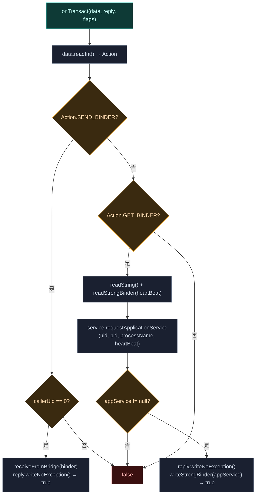

# 📡 zygisk · service 包

> 📂 `zygisk/src/main/kotlin/org/matrix/vector/service/`
> 🟦 Binder Trap 的 Kotlin 侧与 Parcel 辅助

## 包职责

`service` 包是 JNI Binder Trap 的 Kotlin 侧。`BridgeService` 不在 `ServiceManager` 注册，而是由 native `IPCBridge` 拦截全局 `Binder.execTransact`，把自定义 `_VEC` 事务码转给它处理。`ParcelUtils` 提供从 native 指针重建 Java `Parcel` 的能力。

## 类清单

| 类 | 文件 | 说明 |
| :--- | :--- | :--- |
| [`BridgeService`](#bridgeservice) | `BridgeService.kt` | `_VEC` 事务的分发中心：binder 接收、app service 请求 |
| [`ParcelUtils`](#parcelutils) | `ParcelUtils.kt` | native parcel 指针 → Java Parcel 重建 |

---

## BridgeService

`object BridgeService`（`package org.matrix.vector.service`）—— 手动 Binder 事务的管理器。不注册到 `ServiceManager`，由 Zygisk native 模块拦截 `Binder.execTransact`，把 `TRANSACTION_CODE` 的调用重定向到本类。

### 常量与状态

```kotlin
private const val TRANSACTION_CODE =
    ('_'.code shl 24) or ('V'.code shl 16) or ('E'.code shl 8) or 'C'.code  // _VEC
private const val TAG = "VectorZygiskBridge"

private enum class Action {
    UNKNOWN,
    SEND_BINDER,  // Daemon 推送 system service binder
    GET_BINDER,   // 进程请求自己的 app service
}

@Volatile private var serviceBinder: IBinder? = null
@Volatile private var service: IDaemonService? = null
```

`TRANSACTION_CODE` 与 native `IPCBridge::kBridgeTransactionCode` 一致（`('_'<<24)|('V'<<16)|('E'<<8)|'C'`）。

### 死亡回收

```kotlin
private val serviceRecipient: DeathRecipient = DeathRecipient {
    Log.e(TAG, "Vector daemin service died.")
    serviceBinder?.unlinkToDeath(this.serviceRecipient, 0)
    serviceBinder = null
    service = null
}

@JvmStatic fun getService(): IDaemonService? = service
```

Daemon 崩溃时 `serviceBinder` 收到死亡通知，清理引用，下次请求会重新初始化。

### receiveFromBridge

```kotlin
private fun receiveFromBridge(binder: IBinder?)
```

初始化与 Daemon 服务的连接：

1. `Binder.clearCallingIdentity()` 保护调用身份，清理旧 death recipient。
2. `Binder_allowBlocking(binder)` 允许阻塞调用（fork 同步路径常需要）。
3. `IDaemonService.Stub.asInterface` 包装，`linkToDeath(serviceRecipient)` 注册死亡监听。
4. system_server 场景：取 `ActivityThread.applicationThread` 与 system context，调 `service.dispatchSystemServerContext(atBinder, activityToken)` 把系统上下文交给 Daemon。

### execTransact（JNI 入口）

```kotlin
@JvmStatic
fun execTransact(obj: IBinder, code: Int, dataObj: Long, replyObj: Long, flags: Int): Boolean
```

native `IPCBridge::ExecTransact_Replace` 调用此静态方法。

- `code != TRANSACTION_CODE` 立即返回 `false`（非本服务事务）。
- `dataObj`/`replyObj` 是 native parcel 指针（`Long`），经 `asParcel()` 扩展函数转 Java `Parcel`。
- 任一 parcel 为 null 则丢弃事务返回 `false`。
- 调 `onTransact(data, reply, flags)` 处理。
- 异常路径：非 oneway 事务时 `reply.setDataPosition(0)` + `writeException(e)` 回传异常，仍返回 `true`（已处理）。
- `finally` 中 `data.recycle()` / `reply.recycle()`。

### onTransact

```kotlin
@JvmStatic
fun onTransact(data: Parcel, reply: Parcel?, flags: Int): Boolean
```



| Action | 调用者 | 行为 |
| :--- | :--- | :--- |
| `SEND_BINDER` | 仅 root（UID 0） | Daemon 推送 system service binder，`receiveFromBridge` 初始化连接 |
| `GET_BINDER` | 任意进程 | 读 `processName` + heartbeat binder，调 `IDaemonService.requestApplicationService` 返回 app 专属 service binder |

`GET_BINDER` 的 heartbeat binder 让 Daemon 在调用进程死亡时收到通知清理资源。

---

## ParcelUtils

`object ParcelUtils`（`package org.matrix.vector.service`）—— 原始 `Parcel` 操作工具，用于绕过标准 AIDL 的手动 IPC 事务。

```kotlin
private val obtainMethod: Method by lazy {
    Parcel::class.java.getDeclaredMethod("obtain", Long::class.java).apply {
        isAccessible = true
    }
}

@JvmStatic
fun fromNativePointer(ptr: Long): Parcel?
```

`fromNativePointer(ptr)` 反射调 `Parcel.obtain(long)`，从 native C++ parcel 指针重建 Java `Parcel` 包装对象。`ptr == 0L` 返回 `null`，反射失败抛 `RuntimeException`。

### asParcel 扩展

```kotlin
fun Long.asParcel(): Parcel? = ParcelUtils.fromNativePointer(this)
```

`BridgeService.execTransact` 用 `dataObj.asParcel()` / `replyObj.asParcel()` 把 native 传入的 `Long` 指针转成 Java Parcel，是 JNI Binder Trap 数据传递的关键一环。

## 相关

- [zygisk 模块总览](../modules/zygisk)
- [zygisk · cpp 包](./zygisk-cpp)（`IPCBridge::HookBridge` 装 trap，`ExecTransact_Replace` 调 `BridgeService.execTransact`）
- [zygisk · kotlin 包](./zygisk-kotlin)（`ParasiticManagerSystemHooker` 调 `BridgeService.getService()?.preStartManager()`）
- [架构 · IPC · JNI Binder Trap](../../architecture/ipc#jni-binder-trap)
