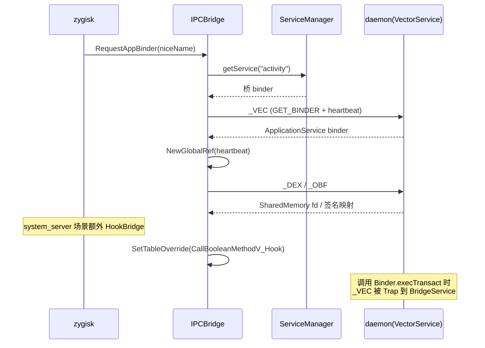

# 🌉 IPCBridge (ipc_bridge.cpp)

> 📂 `zygisk/src/main/cpp/ipc_bridge.cpp`
> 📂 `zygisk/src/main/cpp/include/ipc_bridge.h`
> 🟦 zygisk 模块 · JNI Binder Trap 与 `_VEC` 事务

## 类职责

`IPCBridge`（命名空间 `vector::native::module`）是 zygisk 端与 daemon 通信的**核心 native 桥**。它用 JNI 直接操作 `ServiceManager`/`IBinder`/`Parcel`，绕过 Java 层完成三类握手：向 `system_server` 代理服务请求 ApplicationService binder、拉取框架 DEX 共享内存与混淆映射；并在 system_server 里安装 `Binder.execTransact` 的 JNI 函数表覆盖（`SetTableOverride`），把 `_VEC` 事务劫持到 Java 侧 `BridgeService.execTransact`。

## 协议常量

```cpp
constexpr auto kBridgeServiceName = "activity"sv;
constexpr jint kBridgeTransactionCode = ('_' << 24) | ('V' << 16) | ('E' << 8) | 'C';
constexpr jint kDexTransactionCode = ('_' << 24) | ('D' << 16) | ('E' << 8) | 'X';
constexpr jint kObfuscationMapTransactionCode = ('_' << 24) | ('O' << 16) | ('B' << 8) | 'F';
constexpr jint kActionGetBinder = 2;
```

`_VEC`/`_DEX`/`_OBF` 与 daemon 的 `ApplicationService`/`SystemServerService` 常量逐字一致。`activity` 作为应用进程的 rendezvous 服务名（system_server 代理已注入）。

## ParcelWrapper · RAII

```cpp
class IPCBridge::ParcelWrapper {
    ParcelWrapper(JNIEnv *env, IPCBridge *bridge);  // Parcel.obtain() × 2
    ~ParcelWrapper();                                // recycle() × 2
    ScopedLocalRef<jobject> data, reply;
};
```

构造时从池里 `obtain` 两个 Parcel，析构保证 `recycle`，即使事务中途异常也不泄漏。

## Initialize · JNI 缓存

```cpp
void IPCBridge::Initialize(JNIEnv *env)
```

`std::call_once` 缓存 `ServiceManager.getService`、`IBinder.transact`、`Binder.<init>`、`Parcel.obtain/recycle/writeInt/writeString/writeStrongBinder/writeInterfaceToken/readException/readStrongBinder/readFileDescriptor/readInt/readLong/readString`、`ParcelFileDescriptor.detachFd`。任一查找失败置 `initialized_=false`，后续调用全部短路。

## 应用进程 binder 请求

```cpp
ScopedLocalRef<jobject> RequestAppBinder(JNIEnv *env, jstring nice_name)
```

1. `ServiceManager.getService("activity")` 取桥服务；
2. `ParcelWrapper` 准备 data/reply，新建一个 `Binder` 作为 heartbeat（进程死亡时 daemon 收到 `binderDied` 清理）；
3. data 写 `kActionGetBinder` + `nice_name` + heartbeat binder；
4. `transact(kBridgeTransactionCode, ...)`，成功先 `readException`（清异常），再 `readStrongBinder`；
5. **关键**：拿到结果 binder 后 `env->NewGlobalRef(heartbeat_binder.get())`，防止 GC 回收导致 daemon 误判进程死亡。

## system_server 与 manager binder

```cpp
ScopedLocalRef<jobject> RequestSystemServerBinder(JNIEnv *env, std::string bridgeServiceName)
```

轮询 `getService(bridgeServiceName)` 最多 10 次（每次 sleep 1s），适配 daemon 与 system_server 并行启动的慢设备。

```cpp
ScopedLocalRef<jobject> RequestManagerBinderFromSystemServer(JNIEnv *env, jobject system_server_binder)
```

通过 system_server 代理发 `_VEC` 事务：写 `getuid()`/`getpid()`/`"system"`/heartbeat，读回 manager binder。

## DEX 与混淆映射拉取

```cpp
std::tuple<int, size_t> FetchFrameworkDex(JNIEnv *env, jobject binder)
std::map<std::string, std::string> FetchObfuscationMap(JNIEnv *env, jobject binder)
```

`FetchFrameworkDex` 发 `_DEX`，`readFileDescriptor` + `detachFd` 拿原生 fd，`readLong` 拿 size。`FetchObfuscationMap` 发 `_OBF`，`readInt` 读对数 `size`，逐对 `readString` 装入 `std::map`。

## Binder Trap · SetTableOverride

```cpp
jboolean IPCBridge::ExecTransact_Replace(jboolean *res, JNIEnv *env, jobject obj, va_list args)
jboolean JNICALL IPCBridge::CallBooleanMethodV_Hook(JNIEnv *env, jobject obj, jmethodID methodId, va_list args)
void IPCBridge::HookBridge(JNIEnv *env)
```

`HookBridge` 在 system_server 里安装：

1. 从 `ConfigBridge.obfuscation_map()` 拿混淆后的 `BridgeService` 类名，`FindClassFromCurrentLoader` 找到该类；
2. 缓存 `BridgeService.execTransact(IBinder,int,long,long,int)Z` 静态方法 ID；
3. 取 `Binder.execTransact(int,long,long,int)Z` 原方法 ID；
4. 通过 `ElfSymbolCache::GetArt()->getSymbAddress("_ZN3art9JNIEnvExt16SetTableOverrideEPK18JNINativeInterface")` 拿 ART 的 `SetTableOverride`；
5. `memcpy` 复制 `JNINativeInterface` 表，替换 `CallBooleanMethodV` 为 `CallBooleanMethodV_Hook`，`set_table_override_func(&native_interface_hook_)` 原子替换。

`CallBooleanMethodV_Hook` 检测调用的是否为 `execTransact`：若是，先尝试 `ExecTransact_Replace`——`_VEC` 事务转调 Java `BridgeService.execTransact`，命中则返回；不命中或调用方刚失败过则回落原函数。

## BinderCaller · 调用方身份

```cpp
class BinderCaller {
    static void Initialize();  // 解析 libbinder IPCThreadState 三个符号
    static uint64_t GetId();   // (uid << 32) | pid
};
```

`g_last_failed_id`（`std::atomic<uint64_t>`）记录最近被 Java 侧拒绝的调用方。`CallBooleanMethodV_Hook` 命中 `execTransact` 时：若当前调用方 == `g_last_failed_id`，跳过劫持直接走原函数，避免反复重试开销；Java 侧返回 `false` 时记录失败 ID，成功时复位为 `~0`。

## 劫持与握手时序



## 相关

- [module.cpp · VectorModule 调用方](./module-cpp)
- [bridge-service · Java 侧 execTransact](./bridge-service)
- [main-fork-common · forkCommon Java 入口](./main-fork-common)
- daemon 侧事务码见 [application-service](../daemon/application-service)
