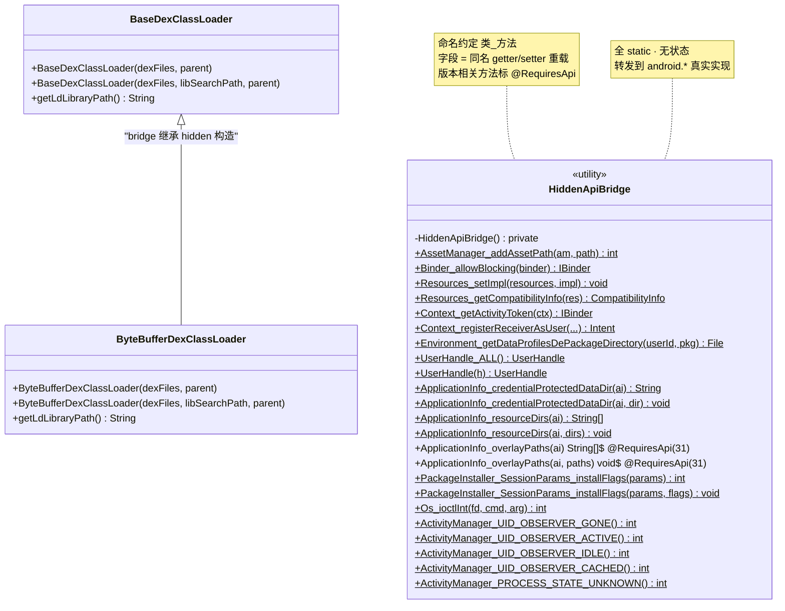
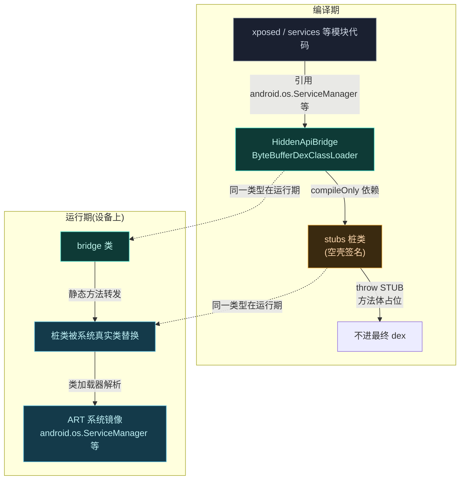
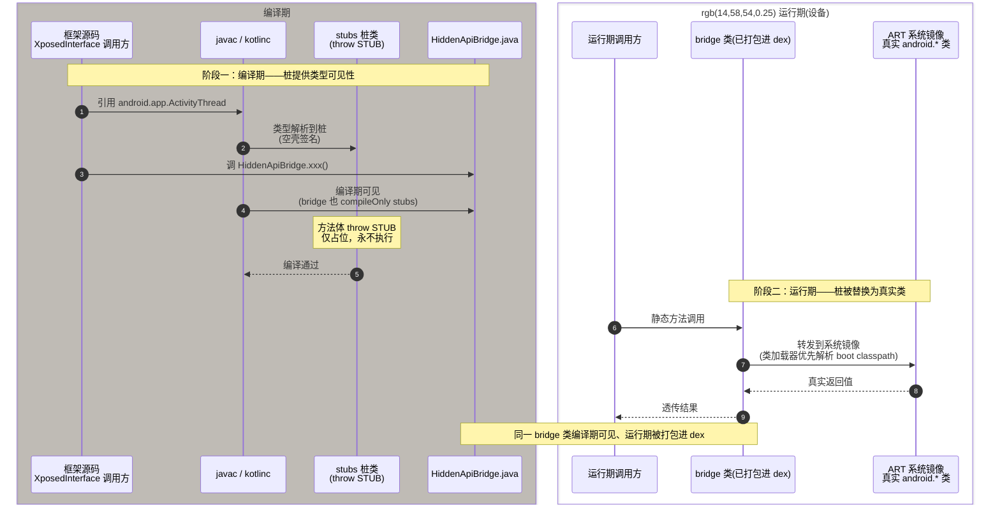

# 🌉 bridge 子模块

运行时桥接层：把编译期桩方法调用转发到真实的 Android hidden API。两个类，职责清晰。

> 📂 [`hiddenapi/bridge/src/main/java/hidden/`](https://github.com/android-security-engineer/Vector-skills/blob/master/hiddenapi/bridge/src/main/java/hidden/)
> 🏛️ hiddenapi · bridge · 包：`hidden`

## 类清单

| 类 | 说明 |
| :--- | :--- |
| [`HiddenApiBridge`](#hiddenapibridge) | 桥接总入口：静态方法转发到真实 hidden API |
| [`ByteBufferDexClassLoader`](#bytebufferdexclassloader) | 直接从 `ByteBuffer` 加载 DEX 的隐藏类加载器 |

---

## HiddenApiBridge

`public class HiddenApiBridge` — 一组**静态方法**，每个方法对应一个 hidden API 调用。方法名采用 `类_方法` 命名约定（如 `AssetManager_addAssetPath`），把对隐藏方法/字段的访问集中收口。

### 方法签名

```java
// 资源
public static int AssetManager_addAssetPath(AssetManager am, String path)
public static void Resources_setImpl(Resources resources, ResourcesImpl impl)
public static CompatibilityInfo Resources_getCompatibilityInfo(Resources res)

// Binder
public static IBinder Binder_allowBlocking(IBinder binder)

// Context / 环境
public static IBinder Context_getActivityToken(Context ctx)
public static Intent Context_registerReceiverAsUser(Context ctx, BroadcastReceiver receiver,
        UserHandle user, IntentFilter filter, String broadcastPermission, Handler scheduler)
public static File Environment_getDataProfilesDePackageDirectory(int userId, String packageName)

// UserHandle
public static UserHandle UserHandle_ALL()
public static UserHandle UserHandle(int h)

// ApplicationInfo 字段访问
public static String ApplicationInfo_credentialProtectedDataDir(ApplicationInfo applicationInfo)
public static void ApplicationInfo_credentialProtectedDataDir(ApplicationInfo applicationInfo, String dir)
public static String[] ApplicationInfo_resourceDirs(ApplicationInfo applicationInfo)
public static void ApplicationInfo_resourceDirs(ApplicationInfo applicationInfo, String[] resourceDirs)
@RequiresApi(31) public static String[] ApplicationInfo_overlayPaths(ApplicationInfo applicationInfo)
@RequiresApi(31) public static void ApplicationInfo_overlayPaths(ApplicationInfo applicationInfo, String[] overlayPaths)

// PackageInstaller
public static int PackageInstaller_SessionParams_installFlags(PackageInstaller.SessionParams params)
public static void PackageInstaller_SessionParams_installFlags(PackageInstaller.SessionParams params, int flags)

// Os（ioctl，多版本分支）
public static int Os_ioctlInt(FileDescriptor fd, int cmd, int arg) throws ErrnoException

// ActivityManager 常量
public static int ActivityManager_UID_OBSERVER_GONE()
public static int ActivityManager_UID_OBSERVER_ACTIVE()
public static int ActivityManager_UID_OBSERVER_IDLE()
public static int ActivityManager_UID_OBSERVER_CACHED()
public static int ActivityManager_PROCESS_STATE_UNKNOWN()
```

### HiddenApiBridge 类视图

`HiddenApiBridge` 是纯静态工具类（无实例字段、无构造），所有方法按"目标类_方法名"约定组织，把对 hidden API 的反射式访问收口成可读的调用点：



> 类图里 `$` 后缀表示 `static`。两个类同处 `hidden` 包，但职责正交：`HiddenApiBridge` 收口 hidden API 调用，`ByteBufferDexClassLoader` 复用 hidden 的 `BaseDexClassLoader` 构造以支持内存 DEX 加载。

### 关键设计

#### 字段访问的 getter/setter 对

`ApplicationInfo` 的 `credentialProtectedDataDir`、`resourceDirs`、`overlayPaths` 字段是包级可见的 hidden 字段。bridge 为每个字段提供同名的**重载 getter/setter**——读时返回字段值，写时赋值。`overlayPaths` 标 `@RequiresApi(31)`，Android 12+ 才存在。

#### Os_ioctlInt 的版本分支

```java
if (Build.VERSION.SDK_INT == Build.VERSION_CODES.O_MR1) {
    return Os.ioctlInt(fd, cmd, new MutableInt(arg));      // 8.1
} else if (Build.VERSION.SDK_INT < Build.VERSION_CODES.S) {
    return Os.ioctlInt(fd, cmd, new Int32Ref(arg));        // 9~11
} else {
    return Os.ioctlInt(fd, cmd);                           // 12+（签名简化）
}
```

`ioctlInt` 的参数类型在不同版本是 `MutableInt`、`Int32Ref`、或裸 `int`，bridge 据版本选择正确重载——这是 hidden API 跨版本兼容的典型样例。

#### 常量访问方法

`ActivityManager_UID_OBSERVER_*`、`PROCESS_STATE_UNKNOWN` 把 hidden 常量包装成方法返回，避免调用方直接引用未导出的常量。

### 运行时桥接时序

以 `Os_ioctlInt` 为例，bridge 静态方法在运行期把调用转发给 ART 真实 hidden 实现，并按 `Build.VERSION.SDK_INT` 选择正确的重载签名：

```mermaid
sequenceDiagram
    autonumber
    participant Caller as 框架调用方
    participant Bridge as HiddenApiBridge<br/>(hidden 包)
    participant Stub as Os 桩<br/>(android.system)
    participant ART as ART 真实 Os<br/>(系统镜像)

    Caller->>Bridge: Os_ioctlInt(fd, cmd, arg)
    Bridge->>Bridge: 判定 Build.VERSION.SDK_INT
    alt O_MR1 (8.1)
        Bridge->>Stub: Os.ioctlInt(fd, cmd, MutableInt(arg))
    else 9~11 (&lt; S)
        Bridge->>Stub: Os.ioctlInt(fd, cmd, Int32Ref(arg))
    else 12+ (≥ S)
        Bridge->>Stub: Os.ioctlInt(fd, cmd)
    end
    Note over Stub: 桩方法体 throw STUB<br/>编译期占位，运行期不执行
    Stub->>ART: 解析到真实 Os.ioctlInt
    ART-->>Bridge: 返回 int 结果
    Bridge-->>Caller: 透传结果
```

> 桩的 `throw new RuntimeException("STUB")` 永远不会执行——运行期类加载器解析到的是系统镜像里的真实 `android.system.Os`，桩仅在编译期满足引用。详见 [stubs 总览](./stubs)。

---

## ByteBufferDexClassLoader

`public class ByteBufferDexClassLoader extends BaseDexClassLoader` — 直接从内存中的 `ByteBuffer` 加载 DEX，无需落盘。

### 构造与方法

```java
public ByteBufferDexClassLoader(ByteBuffer[] dexFiles, ClassLoader parent)

public ByteBufferDexClassLoader(ByteBuffer[] dexFiles, String librarySearchPath, ClassLoader parent)

public String getLdLibraryPath()
```

### 说明

继承 hidden 的 `BaseDexClassLoader`（其构造接受 `ByteBuffer[]`，是 SDK 未暴露的重载）。Vector 用它把 Daemon 预加载到 `SharedMemory` 的 DEX 直接从内存装载，避免临时文件与解密开销。`getLdLibraryPath` 透传父类方法，用于查询 native 库搜索路径。

## 桩与桥的协作架构

bridge 与 stubs 是 hiddenapi 模块的两半：stubs 让框架代码**编译通过**，bridge 在**运行期**把调用转发到真实 hidden API。编译期 bridge 依赖 stubs（`compileOnly`），运行期两者都不出现在最终产物里——系统类加载器解析到真实实现。



> [`hiddenapi/bridge/build.gradle.kts`](https://github.com/android-security-engineer/Vector-skills/blob/master/hiddenapi/bridge/build.gradle.kts) 里 `dependencies { compileOnly(projects.hiddenapi.stubs) }` 是这套协作的根——`compileOnly` 保证桩不打包进 bridge 产物，运行期由系统提供真实类。

## 编译期可见与运行期调用：双阶段流程

同一行 `import android.app.ActivityThread` 在两个阶段意义截然不同。编译期，`stubs` 桩满足引用解析、让 `bridge` 与各消费模块编译通过；运行期，桩方法体（`throw new RuntimeException("STUB")`）永不执行，类加载器把 `android.*` 类型解析到设备系统镜像里的真实实现，`HiddenApiBridge` 的静态转发才落到真实代码。两阶段各自独立、互不照面：



> 关键认知：**桩和真实类同名同包**，靠类加载器在运行期二选一。`compileOnly` 让桩只活在 classpath，不进产物；运行期 `boot classpath` 上的系统镜像类型优先级更高，桩的 `throw STUB` 因此被"短路"。这也是 [`Os_ioctlInt`](https://github.com/android-security-engineer/Vector-skills/blob/master/hiddenapi/bridge/src/main/java/hidden/HiddenApiBridge.java) 能跨 8.1/9~11/12+ 三套签名正确转发的原因——它转发的是运行期真实 `android.system.Os`，而非编译期那个空壳。

## 相关

- [stubs 总览](./stubs) — 编译期桩
- [hiddenapi 模块总览](../modules/hiddenapi)
