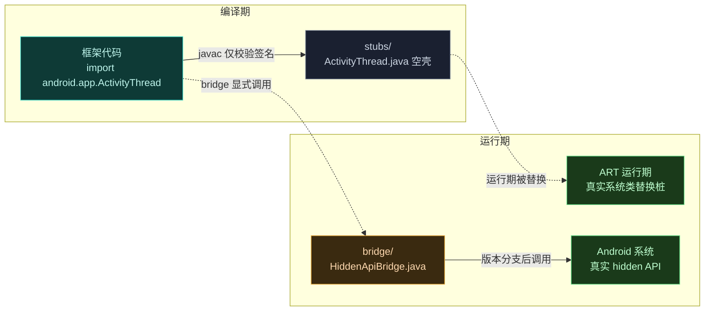
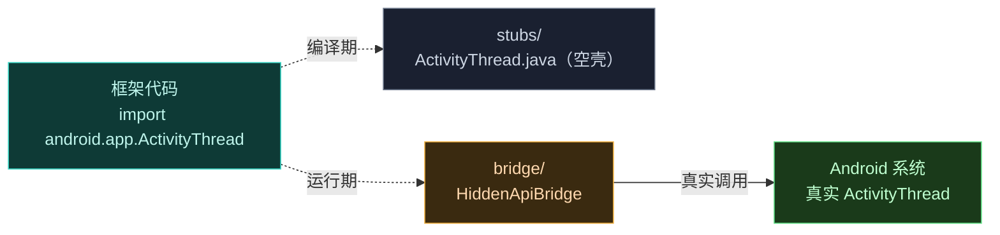
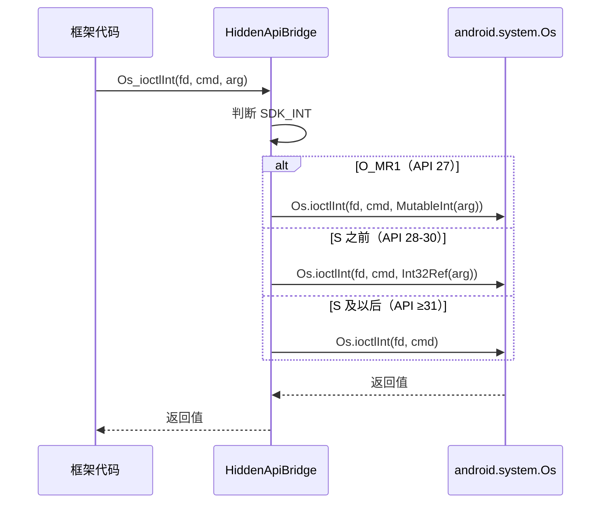

# 🏛️ Hidden API 参考

Vector 调用 Android 非公开（hidden）API 的全部桥接与桩。分 `bridge`（运行时桥接）和 `stubs`（编译期桩）两个子模块。

> 📂 `hiddenapi/bridge/src/main/java/hidden/` · `hiddenapi/stubs/src/main/java/`
> 目录：[hiddenapi 模块](../modules/hiddenapi)
> 语言：Java · 兼容 Android 8.1–17

## 职责

Android 的 `@hide` API 不在公开 SDK 中，框架代码无法直接 `import` 编译，运行期又需访问真实系统内部类。hiddenapi 模块同时解决这两端问题：

- **编译期**：`stubs` 提供 100 个空壳类，签名与 AOSP 内部类一致，让框架代码能正常编译、通过静态检查。
- **运行期**：`bridge` 把对桩的访问转发到真实 hidden API，承担版本分支、隐藏字段访问、内存加载 DEX 等运行期工作。

桩与真实系统类的"替换"由 ART 在运行期完成：JVM 加载桩类用于编译，VM 启动后真实系统类占据同名的运行期类，调用自然落到真实实现上。bridge 则显式调用真实方法，集中处理跨版本差异。

## 子模块

| 子模块 | 文档 | 职责 |
| :--- | :--- | :--- |
| bridge | [bridge 详述](./bridge) | 运行时桥接：`HiddenApiBridge` 转发桩调用到真实 hidden API；`ByteBufferDexClassLoader` 从内存加载 DEX |
| stubs | [stubs 总览](./stubs) | 编译期桩：约 100 个空壳类镜像 Android 内部签名，让框架代码可编译 |

## 模块结构

## 组成

`stubs` 是纯签名集合，按 AOSP 包结构组织，覆盖 `android.app` / `android.content` / `android.os` / `android.content.pm` / `dalvik.system` / `xposed.dummy` 等约 20 个子包，仅保留被框架引用到的字段、方法、常量签名，方法体留空或抛异常。`bridge` 仅两个类：

| 类 | 作用 |
| :--- | :--- |
| `HiddenApiBridge` | 静态方法集合，转发对隐藏字段/方法/常量的访问，封装跨版本差异 |
| `ByteBufferDexClassLoader` | 继承 `BaseDexClassLoader`，用 `ByteBuffer[]` 从内存加载 DEX，避免落盘 |

`bridge` 的 `build.gradle.kts` 以 `compileOnly(projects.hiddenapi.stubs)` 依赖 stubs，保证编译时桩可见、打包时不重复引入；`stubs` 则设 Java 8 源/目标兼容，适配各版本工具链。

## 工作原理

## 调用时序：以 `Os.ioctlInt` 为例

`HiddenApiBridge.Os_ioctlInt` 演示 bridge 如何收敛版本分支。框架调用 ioctl 传参，bridge 按 SDK 选不同签名重载转发：

Android 8.1 用 `MutableInt`、9–11 用 `Int32Ref`、12 起改为裸 `int`，三套签名由 bridge 内部分支，调用方只感知一个统一入口。

## 设计要点

- **stubs 与系统类签名一致**：桩类的方法签名、字段类型与 AOSP 内部实现保持一致，编译期通过，运行期被 ART 的真实类替换。
- **bridge 集中转发**：所有对 hidden API 的访问收敛到 `HiddenApiBridge` 的静态方法，便于排查与适配多版本。
- **版本分支**：bridge 内针对不同 SDK 版本做分支（如 `Os.ioctlInt` 在 O_MR1 / S 之前 / S 之后签名不同）。
- **`@RequiresApi` 守卫**：仅在特定版本引入的字段（如 `ApplicationInfo.overlayPaths` 标注 `@RequiresApi(31)`）由注解显式声明，便于静态核查与裁剪。

## 使用场景与约束

- **场景一：访问隐藏字段**。如读取 `ApplicationInfo.credentialProtectedDataDir`，直接调 `HiddenApiBridge.ApplicationInfo_credentialProtectedDataDir(info)`，bridge 内部访问真实字段并提供成对读写重载。
- **场景二：跨版本常量**。如 `ActivityManager.UID_OBSERVER_*` 等隐藏常量，bridge 暴露为静态方法返回真实值，避免在框架代码里硬编码。
- **场景三：内存加载 DEX**。`ByteBufferDexClassLoader` 把 DEX 字节流直接喂给 `BaseDexClassLoader`，daemon 预加载框架 DEX 时无需写临时文件，减少落盘痕迹。
- **约束：stubs 仅供编译，不能被运行期使用**。桩方法体为空，真正逻辑在系统类里；任何依赖桩返回值的代码都会失败，运行期访问必须经 bridge 或交给已被 ART 替换的系统类。
- **约束：bridge 静态方法成对设计**。读与写、不同版本重载以方法名后缀区分，调用方需按目标 Android 版本选择正确入口；新增隐藏 API 适配时应在 bridge 集中添加而非散落到框架各处。

## 相关

- [hiddenapi 模块总览](../modules/hiddenapi)
- [legacy 模块](../modules/legacy) — hiddenapi 的主要消费方
- bridge 实现细节见 [bridge 详述](./bridge)
- 桩清单见 [stubs 总览](./stubs)
