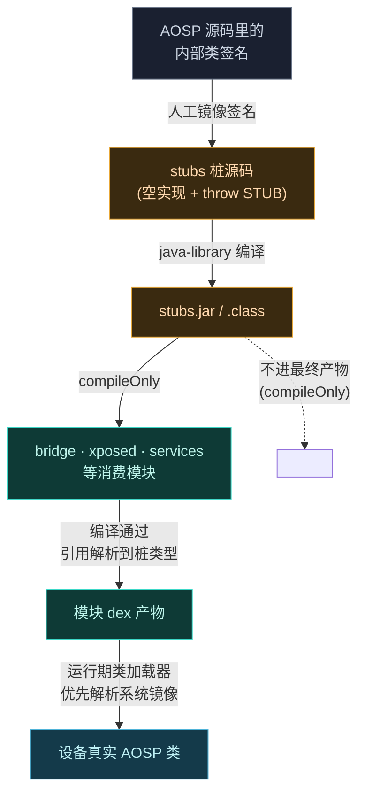
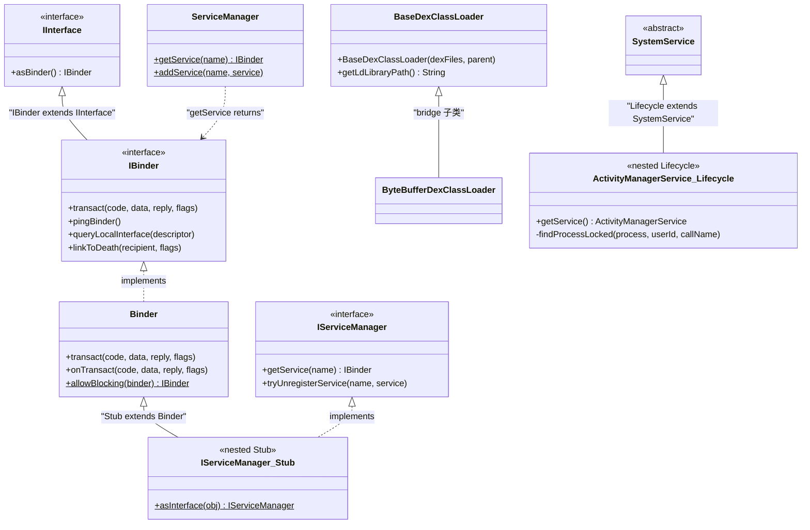
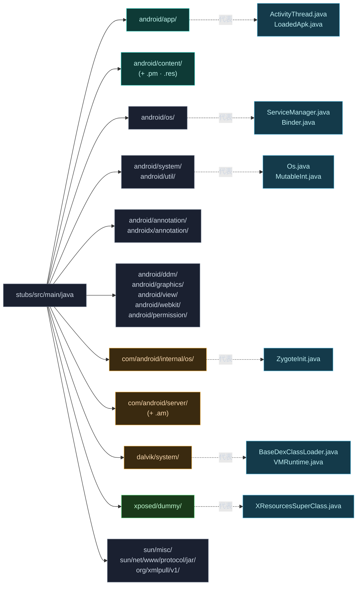

# 🧱 stubs 子模块

编译期桩：约 100 个空壳 Java 类，镜像 Android 内部类的方法/字段签名，让 Vector 框架代码能编译通过。运行期这些类被 ART 的真实实现替换。

> 📂 [`hiddenapi/stubs/src/main/java/`](https://github.com/android-security-engineer/Vector-skills/blob/master/hiddenapi/stubs/src/main/java/)
> 🏛️ hiddenapi · stubs

## 工作方式

桩类只声明签名（方法空实现、字段占位），编译期满足引用，运行期 JVM/ART 加载系统真实类。每个桩对应一个 AOSP 内部类，按原始包名组织。

### 编译期桩生成与消费流程

stubs 是纯 `java-library`（见 [`hiddenapi/stubs/build.gradle.kts`](https://github.com/android-security-engineer/Vector-skills/blob/master/hiddenapi/stubs/build.gradle.kts)），无 Android 依赖，Java 8 字节码。手工编写的空壳类按 AOSP 原始包名组织，被 bridge / xposed / services 等模块以 `compileOnly` 消费：

> `compileOnly` 是关键——桩只为编译期存在，不打包进任何运行期产物，运行期由设备系统镜像提供真实类。这也是为什么桩方法体可以只写 `throw new RuntimeException("STUB")`。

## 按包总览

桩按 AOSP 原始包名组织，下面这张图把所有包按"应用进程 / 系统 / 运行时 / 资源 Hook 专用"四类归并，展示包之间的逻辑分层与典型依赖走向：

```mermaid
graph TD
    subgraph APP["应用进程内部"]
        APP1["android.app<br/>ActivityThread · LoadedApk"]:::app
        CT1["android.content / .pm<br/>Context · PackageManager"]:::app
        RES1["android.content.res<br/>ResourcesImpl · AssetManager"]:::res
    end
    subgraph SYS["系统层"]
        OS1["android.os<br/>ServiceManager · Binder"]:::sys
        SYS1["android.system / .util<br/>Os · MutableInt"]:::sys
        PERM1["android.permission<br/>IPermissionManager"]:::sys
        VIEW1["android.view · android.graphics<br/>IWindowManager · Drawable"]:::sys
    end
    subgraph RT["运行时 / Zygote"]
        DV1["dalvik.system<br/>BaseDexClassLoader · VMRuntime"]:::rt
        ZG1["com.android.internal.os<br/>ZygoteInit · BinderInternal"]:::rt
        SRV1["com.android.server(.am)<br/>ActivityManagerService"]:::rt
    end
    subgraph XPOS["资源 Hook 专用"]
        XD1["xposed.dummy<br/>XResourcesSuperClass"]:::xpos
        WK1["android.webkit<br/>WebViewFactory"]:::xpos
    end
    subgraph MISC["杂项 / 注解"]
        ANN1["android.annotation / androidx.annotation<br/>RequiresApi · NonNull"]:::misc
        SUN1["sun.* / org.xmlpull<br/>CompoundEnumeration"]:::misc
        DDM1["android.ddm<br/>DdmHandleAppName"]:::misc
    end
    APP1 -.消费.-> BR["bridge / xposed / services"]:::consumer
    CT1 -.消费.-> BR
    OS1 -.消费.-> BR
    DV1 -.被继承.-> BR
    ZG1 -.挂钩点.-> BR
    XD1 -.运行期动态生成.-> BR
    classDef app fill:#0e3a36,stroke:#3dd8c8,color:#bff5ec
    classDef res fill:#143a4a,stroke:#4fb3d8,color:#bff0f5
    classDef sys fill:#1a2030,stroke:#6b7689,color:#cdd6e3
    classDef rt fill:#3a2a10,stroke:#e8a838,color:#ffd9b0
    classDef xpos fill:#1a3a1a,stroke:#5cd980,color:#bfffd0
    classDef misc fill:#1a2030,stroke:#6b7689,color:#cdd6e3
    classDef consumer fill:#143a4a,stroke:#4fb3d8,color:#bff0f5
```

> 同色的包属于同一逻辑层。`xposed.dummy` 是唯一"运行期才生成真实实现"的桩——编译期是空壳，设备上框架动态生成继承 ROM `Resources` 子类的占位父类（详见 [server/运行时桩](./stubs/stubs-android-server)）。

### android.app — 应用进程内部

| 关键桩类 | 用途 |
| :--- | :--- |
| `ActivityThread` | 应用主线程入口，进程上下文与 `Application` 装配 |
| `LoadedApk` | 已加载 APK 的运行时表示，类加载器与资源归属 |
| `ContextImpl` | `Context` 的实现，bridge 调 `getActivityToken` |
| `IActivityManager` · `IApplicationThread` | 与 AMS 的 Binder 接口 |
| `IActivityController` · `IUidObserver` · `INotificationManager` | 系统 watchdog/UID/通知回调 |
| `ResourcesManager` | 进程级资源管理单例 |
| `ContentProviderHolder` · `ProfilerInfo` · `Notification` · `NotificationChannel` · `Application` · `IServiceConnection` | 各类数据/接口桩 |

### android.content / android.content.pm — 内容与包管理

| 关键桩类 | 用途 |
| :--- | :--- |
| `Context` · `Intent` · `IntentFilter` · `ComponentName` · `IntentSender` · `BroadcastReceiver` | Content/Intent 体系 |
| `IContentProvider` · `IIntentReceiver` · `IIntentSender` | 内容/Intent Binder 接口 |
| `AttributionSource` | Android 11+ 权限归因 |
| `PackageManager` · `IPackageManager` · `PackageInfo` · `ApplicationInfo` | 包查询与管理 |
| `PackageInstaller` · `IPackageInstaller` · `VersionedPackage` | 包安装 |
| `ParceledListSlice` · `BaseParceledListSlice` | 跨进程大列表传递（`ILSPManagerService` 返回类型） |
| `PackageParser` · `ResolveInfo` · `UserInfo` | 解析/查询/用户 |

### android.content.res — 资源

| 关键桩类 | 用途 |
| :--- | :--- |
| `ResourcesImpl` · `Resources` · `AssetManager` | 资源实现（bridge 的 `setImpl`/`addAssetPath` 目标） |
| `CompatibilityInfo` · `Configuration` · `ResourcesKey` · `TypedArray` | 资源配置与类型化数组 |

### android.os — 系统

| 关键桩类 | 用途 |
| :--- | :--- |
| `ServiceManager` | `getService`/`addService` 获取系统 Binder |
| `Binder` · `IBinder` · `IInterface` · `Parcel` · `Parcelable` | Binder 基础设施 |
| `SystemProperties` · `SELinux` | 系统属性与 SELinux |
| `UserHandle` · `UserManager` · `IUserManager` | 多用户 |
| `IServiceManager` · `IPowerManager` · `IServiceCallback` | 系统/电源/回调接口 |
| `Build` · `Environment` · `Handler` · `Bundle` · `PersistableBundle` · `ResultReceiver` · `RemoteException` · `ShellCallback` · `ShellCommand` | 各类系统桩 |

### android.system / android.ddm / android.util — 运行时与工具

| 桩类 | 用途 |
| :--- | :--- |
| `Os` · `ErrnoException` · `Int32Ref` | POSIX 包装（bridge 的 `ioctlInt`） |
| `DdmHandleAppName` | DDMS 进程名设置 |
| `DisplayMetrics` · `MutableInt` · `TypedValue` | 度量与值容器（`MutableInt` 见 bridge 版本分支） |

### android.permission / android.view / android.graphics / android.webkit

| 桩类 | 用途 |
| :--- | :--- |
| `IPermissionManager` | 权限管理 Binder |
| `IWindowManager` | 窗口管理 Binder |
| `Drawable` · `Movie` | 图形桩 |
| `WebViewDelegate` · `WebViewFactory` · `WebViewFactoryProvider` | WebView 内部（资源 Hook 需触及） |

### androidx.annotation / android.annotation — 注解

| 桩类 | 用途 |
| :--- | :--- |
| `IntRange` · `RequiresApi` | androidx 注解（bridge 用 `@RequiresApi(31)`） |
| `NonNull` · `Nullable` | 空安全注解 |

### com.android.internal.os — Zygote / Binder 内部

| 关键桩类 | 用途 |
| :--- | :--- |
| `ZygoteInit` | Zygote 启动入口，注入挂钩点 |
| `BinderInternal` | Binder 内部（限制器、对象计数） |

### com.android.server / com.android.server.am — 系统服务

| 关键桩类 | 用途 |
| :--- | :--- |
| `ActivityManagerService` · `ProcessRecord` | AMS 内部，进程记录 |
| `SystemService` · `SystemServiceManager` · `LocalServices` | 系统服务生命周期与本地注册表 |

### dalvik.system — 运行时

| 关键桩类 | 用途 |
| :--- | :--- |
| `BaseDexClassLoader` | `ByteBufferDexClassLoader` 的父类，hidden 的 ByteBuffer 构造 |
| `VMRuntime` | ART 运行时（GC、dexopt、指令集） |

### xposed.dummy — 资源 Hook 动态父类

| 关键桩类 | 用途 |
| :--- | :--- |
| `XResourcesSuperClass` | `XResources` 的动态父类桩，让资源替换可被系统识别 |
| `XTypedArraySuperClass` | `XTypedArray` 的动态父类桩 |

这两个桩是 Xposed 资源 Hook 的特殊设计——运行期框架动态生成子类，需要这些占位父类满足类型层级。

### 其他桩

| 包 · 桩类 | 用途 |
| :--- | :--- |
| `org.xmlpull.v1.XmlPullParserException` | XML 解析异常（资源解析） |
| `sun.misc.CompoundEnumeration` | 类加载器枚举合并（隐藏 native 库查找） |
| `sun.net.www.protocol.jar.Handler` | `jar:` URL 协议处理器 |

## 代表性桩类层次

下面这张 classDiagram 抽取了几个有继承/实现关系的代表性桩，展示桩之间的类型层级（与 AOSP 真实层级一致）：

> 实际桩目录下有约 100 个类，上图只画有继承/实现链的典型。`IServiceManager.Stub` 与 `ActivityManagerService.Lifecycle` 是嵌套类桩（AOSP 用嵌套类做 Binder Stub / 服务生命周期包装），bridge 的 `ByteBufferDexClassLoader` 直接继承 `BaseDexClassLoader` 桩提供的 hidden 构造——见 [bridge 子模块](./bridge)。

## 桩目录的包结构

桩按 AOSP 原始包名一对一落盘到 [`hiddenapi/stubs/src/main/java/`](https://github.com/android-security-engineer/Vector-skills/blob/master/hiddenapi/stubs/src/main/java/) 下，目录树与 AOSP 源码完全同构。下图给出关键包与其代表性桩文件的映射关系，便于按包定位源码：

> 每个包对应一篇子文档：[`android.app`](./stubs/stubs-android-app) · [`android.content`](./stubs/stubs-android-content) · [`android.os`](./stubs/stubs-android-os) · [server/运行时/杂项](./stubs/stubs-android-server)。`android.system` 与 `android.util` 并入 [`android.os`](./stubs/stubs-android-os) 篇（同属系统层）。

## 相关

- [bridge 子模块](./bridge) — 运行时桥接
- [hiddenapi 模块总览](../modules/hiddenapi)
- [legacy 模块](../modules/legacy) — 桩的主要消费方
