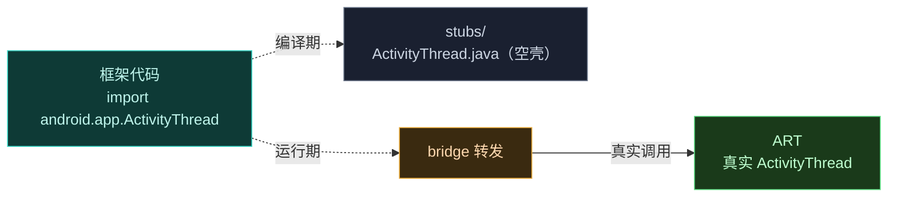

# 📱 android.app 桩

`android.app.*` 桩覆盖应用进程内部的核心类——主线程入口、APK 加载表示、与 `ActivityManagerService` 的 Binder 接口、通知与系统回调。Vector 的 `bridge` 与 `legacy` 模块大量经这些桩访问应用进程内部状态。

> 📂 `hiddenapi/stubs/src/main/java/android/app/`
> 🏛️ hiddenapi · [stubs 总览](.) · [bridge](../bridge)

## 桩类一览

| 桩类 | 作用 |
| :--- | :--- |
| `ActivityThread` | 应用主线程入口，进程上下文与 `Application` 装配 |
| `LoadedApk` | 已加载 APK 的运行时表示，类加载器与资源归属 |
| `ContextImpl` | `Context` 的真实实现，bridge 调 `getActivityToken` 等 |
| `ActivityManager` | `ActivityManager` 静态常量（UID 观察者、进程状态） |
| `Application` | 模块 `Application` 生命周期桩 |
| `IActivityManager` | 与 AMS 的 Binder 接口（广播、启动 Activity） |
| `IApplicationThread` | 应用侧供 AMS 回调的 Binder 接口 |
| `IActivityController` | 系统 ANR/crash 监视回调 |
| `IUidObserver` | UID 状态变化回调（active/idle/cached） |
| `INotificationManager` | 通知投递/取消/通道管理 Binder |
| `IServiceConnection` | Service 连接回调 Binder |
| `ResourcesManager` | 进程级资源管理单例 |
| `ContentProviderHolder` | 跨进程 ContentProvider 句柄 |
| `ProfilerInfo` | 进程 profile 配置桩 |
| `Notification` | 通知对象桩 |
| `NotificationChannel` | 通知通道桩 |

## 重点桩

### ActivityThread

应用进程的"心脏"。桩声明了 Vector 常用的静态入口与实例方法：

```java
public final class ActivityThread {
    public static ActivityThread currentActivityThread() { ... }
    public static Application currentApplication() { ... }
    public static String currentPackageName() { ... }
    public static String currentProcessName() { ... }
    public static ActivityThread systemMain() { ... }
    public final LoadedApk getPackageInfoNoCheck(ApplicationInfo, CompatibilityInfo) { ... }
    public ContextImpl getSystemContext() { ... }
}
```

`bridge` 通过 `currentActivityThread()` / `currentApplication()` 拿到当前进程的入口对象，进而取 `LoadedApk`、`Application`、`ClassLoader`，是模块加载、资源注入、上下文获取的根。`systemMain()` 用于在 `system_server` 之外构造系统上下文。`getPackageInfoNoCheck` 是无校验地构造 `LoadedApk` 的关键路径，Vector 在加载模块 APK 时用到。

### LoadedApk

```java
public final class LoadedApk {
    public ApplicationInfo getApplicationInfo() { ... }
    public ClassLoader getClassLoader() { ... }
    public String getPackageName() { ... }
    public String getResDir() { ... }
}
```

一个已加载 APK 的运行时视图。Vector 从 `ActivityThread` 取出目标 `LoadedApk`，经 `getClassLoader()` 得到加载宿主类的 `ClassLoader`（Hook 反射 `findClass` 的基础），经 `getResDir()` 拿到资源路径（资源替换目标）。字段 `mDefaultClassLoader` 用于干预默认类加载器装配。

### ContextImpl

```java
public class ContextImpl extends Context {}
```

`Context` 的实现类。桩里基本是空壳，但**类型本身**重要——bridge 把它当作获取进程内部 token、资源、包名的入口（`getActivityToken`、`getResources`、`getApplicationInfo`）。

## Binder 接口桩

`IActivityManager`、`IApplicationThread`、`INotificationManager`、`IServiceConnection` 都带 `abstract class Stub extends Binder implements I...`，并提供静态 `asInterface(IBinder)`——这是 Android AIDL 的标准桩模式。Vector 经 `ServiceManager.getService(...)` 拿到原始 `IBinder`，再 `IActivityManager.Stub.asInterface(binder)` 转成业务接口。

`IActivityController` 桩声明了 `activityStarting`/`activityResuming`/`appCrashed`/`appEarlyNotResponding` 等回调——系统在 Activity 启动、ANR、崩溃时回调，Vector 可借此监控系统级活动。`IUidObserver` 桩声明 `onUidGone`/`onUidActive`/`onUidIdle`/`onUidCachedChanged`，配合 `ActivityManager` 桩里的 `UID_OBSERVER_*` 常量使用。

`INotificationManager` 桩声明了投递/取消通知、创建/查询通道的方法，部分用 `@RequiresApi(30)` 标注新增签名，bridge 据此按版本选重载。

## 工作方式



桩方法体统一抛 `UnsupportedOperationException("STUB")`——编译期满足签名，运行期 ART 的真实实现覆盖这些类，桩代码永远不会被执行。

## 桩的命名与 AOSP 一致

桩严格按 AOSP 原始包名组织（`android.app.ActivityThread` 即 AOSP 同名类），签名尽量与真实类对齐——这样 bridge 反射调用真实类时方法/字段名与签名完全一致，无需映射。部分桩为兼容多版本声明了同名方法的新旧重载（如带 `@RequiresApi` 标注），bridge 按运行时 `Build.VERSION.SDK_INT`（`Build` 桩提供 `VERSION_CODES` 常量）选重载。

## 相关

- [stubs 总览](.) — 全部桩按包总览
- [android.os 桩](./stubs-android-os) — Binder/ServiceManager 等
- [android.content 桩](./stubs-android-content) — Context/Intent/包管理
- [hiddenapi 模块总览](../../modules/hiddenapi) — bridge 与 stubs 关系
