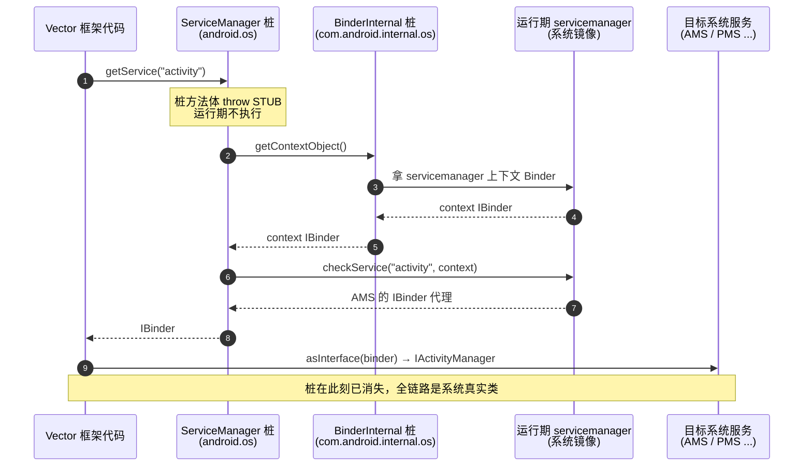
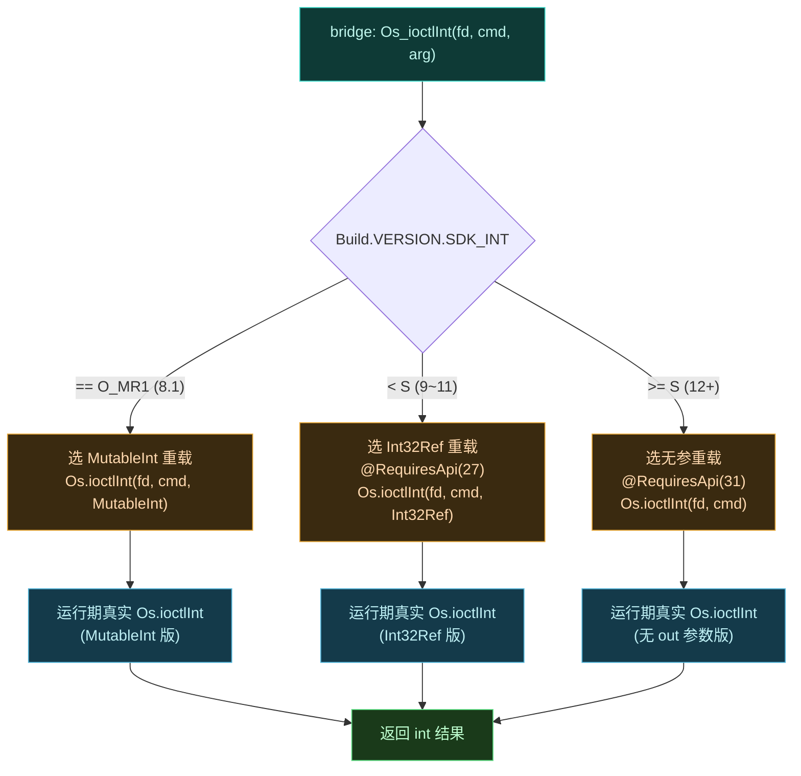

# ⚙️ android.os 桩

`android.os.*` 桩覆盖 Binder 基础设施、系统服务获取、系统属性、SELinux、多用户、POSIX 包装与各类系统工具类。这是桩数量最多的一个包，是 Vector 与 Android 系统服务交互的基础。

> 📂 [`hiddenapi/stubs/src/main/java/android/os/`](https://github.com/android-security-engineer/Vector-skills/blob/master/hiddenapi/stubs/src/main/java/android/os/) · [`android/system/`](https://github.com/android-security-engineer/Vector-skills/blob/master/hiddenapi/stubs/src/main/java/android/system/) · [`android/util/`](https://github.com/android-security-engineer/Vector-skills/blob/master/hiddenapi/stubs/src/main/java/android/util/)
> 🏛️ hiddenapi · [stubs 总览](.) · [bridge](../bridge)

## 桩类一览

| 桩类 | 作用 |
| :--- | :--- |
| `ServiceManager` | `getService`/`addService` 获取系统 Binder |
| `Binder` | Binder 基类，`transact`/`queryLocalInterface`/`linkToDeath` |
| `IBinder` | Binder 接口契约 |
| `IInterface` | Binder 业务接口基类 |
| `Parcel` | 跨进程数据容器 |
| `Parcelable` | 可打包对象接口 |
| `SystemProperties` | 读/写系统属性 `ro.*`/`persist.*` |
| `SELinux` | SELinux 上下文检查与设置 |
| `ServiceManager` | 同上（系统服务注册表） |
| `IServiceManager` | servicemanager 的 Binder 接口 |
| `IServiceCallback` | 服务注册回调 |
| `IPowerManager` | 电源管理 Binder |
| `IUserManager` | 用户管理 Binder |
| `UserHandle` | 用户句柄 |
| `UserManager` | 用户管理客户端封装 |
| `Handler` | 消息循环投递桩 |
| `Environment` | 文件系统目录（数据/配置） |
| `Build` | 设备信息常量 |
| `Bundle` · `PersistableBundle` | 键值容器 |
| `RemoteException` | 跨进程异常 |
| `ResultReceiver` | 跨进程结果回调 |
| `ShellCallback` | shell 命令回调 |
| `ShellCommand` | 抽象 shell 命令处理器 |
| `Os` · `ErrnoException` · `Int32Ref` | POSIX 包装与异常 |
| `MutableInt` | 可变 int 容器 |

## 重点桩

### ServiceManager

```java
public class ServiceManager {
    public static IBinder getService(String name) { ... }
    public static void addService(String name, IBinder service) { ... }
}
```

Android 系统服务的注册表入口。Vector 经 `getService("activity")`、`getService("package")` 等拿到 AMS、PMS 等核心系统服务的 Binder 代理，再 `asInterface` 转成业务接口（`IActivityManager`、`IPackageManager`）。这是框架跨进程操作（查包、装包、广播、通知）的根。

`ServiceManager.getService` 在运行期经 `BinderInternal.getContextObject()` 拿到 servicemanager 的上下文 Binder，再以服务名为 key 查询，返回对应系统服务的 IBinder 代理。桩只声明静态方法签名，运行期整个调用落到系统镜像：



> 桩的 `getService` / `addService` 方法体是 `throw new RuntimeException("STUB")`（见 [`ServiceManager.java`](https://github.com/android-security-engineer/Vector-skills/blob/master/hiddenapi/stubs/src/main/java/android/os/ServiceManager.java)）。运行期类加载器解析到的是 `boot classpath` 上的真实 `android.os.ServiceManager`，桩被短路——这套机制的总览见 [stubs 总览](.)，桥接细节见 [bridge](../bridge)。

### Binder

桩实现了 `IBinder` 的全部方法：`transact`/`pingBinder`/`isBinderAlive`/`queryLocalInterface`/`dump`/`dumpAsync`/`linkToDeath`/`unlinkToDeath`/`onTransact`，以及静态 `allowBlocking(IBinder)`。Vector 的 AIDL stub（如 `ILSPManagerService`）与系统 Binder 交互时需要这些类型。

### SystemProperties / SELinux

```java
public class SystemProperties {
    public static String get(String key) { ... }
    public static void set(String key, String val) { ... }
    public static boolean getBoolean(String key, boolean def) { ... }
}
public class SELinux {
    public static boolean checkSELinuxAccess(...) { ... }
    public static String getFileContext(String path) { ... }
}
```

`SystemProperties` 用于读设备指纹、调试开关等 `ro.*`/`persist.*` 属性；`SELinux` 用于在受限环境下检查/设置文件上下文——Vector 在系统分区注入资源、判断受限进程时用到。

### Os / ErrnoException / Int32Ref / MutableInt

```java
public class Os {
    public static int ioctlInt(FileDescriptor fd, int cmd, MutableInt arg) throws ErrnoException { ... }
    @RequiresApi(27)
    public static int ioctlInt(FileDescriptor fd, int cmd, Int32Ref arg) throws ErrnoException { ... }
    @RequiresApi(31)
    public static int ioctlInt(FileDescriptor fd, int cmd) throws ErrnoException { ... }
}
```

POSIX 包装。`ioctlInt` 三个重载对应不同 API level——旧版用 `MutableInt`（`android.util.MutableInt`），API 27+ 用 `Int32Ref`，API 31+ 无 out 参数。bridge 的 `ioctlInt` 据此做版本分支。`MutableInt` 是 `android.util` 下仅有的可变值容器之一。

bridge 在运行期按 `Build.VERSION.SDK_INT` 选桩声明的那一个重载签名，转发给真实 `android.system.Os`。下图展示三个版本分支如何落到桩里不同的重载声明：



> 三个重载在 [`Os.java`](https://github.com/android-security-engineer/Vector-skills/blob/master/hiddenapi/stubs/src/main/java/android/system/Os.java) 里用 `@RequiresApi(27)`/`@RequiresApi(31)` 标注，bridge 的选择逻辑见 [`HiddenApiBridge.Os_ioctlInt`](https://github.com/android-security-engineer/Vector-skills/blob/master/hiddenapi/bridge/src/main/java/hidden/HiddenApiBridge.java)。这是 hidden API 跨版本兼容的典型样例——同名方法在不同 API level 签名不同，靠 `@RequiresApi` + 桩重载 + 运行期分支三层对齐。

### ShellCommand

抽象 shell 命令处理器，桩声明 `exec`/`onCommand`/`onHelp`/`getNextOption`/`getNextArgRequired`/`getErrPrintWriter` 等。Vector 的管理器通过 `adb shell` 暴露调试命令时用到这套机制。

## 注解桩（android.annotation）

| 桩类 | 作用 |
| :--- | :--- |
| `NonNull` · `Nullable` | 空安全注解（桩签名广泛使用） |

`androidx.annotation` 下的 `IntRange`、`RequiresApi` 同理——bridge 用 `@RequiresApi(27)`/`@RequiresApi(31)` 标注版本相关方法。

## 相关

- [stubs 总览](.) — 全部桩按包总览
- [android.app 桩](./stubs-android-app) — ActivityThread/LoadedApk 等
- [android.content 桩](./stubs-android-content) — Context/Intent/包管理
- [hiddenapi 模块总览](../../modules/hiddenapi) — bridge 与 stubs 关系
