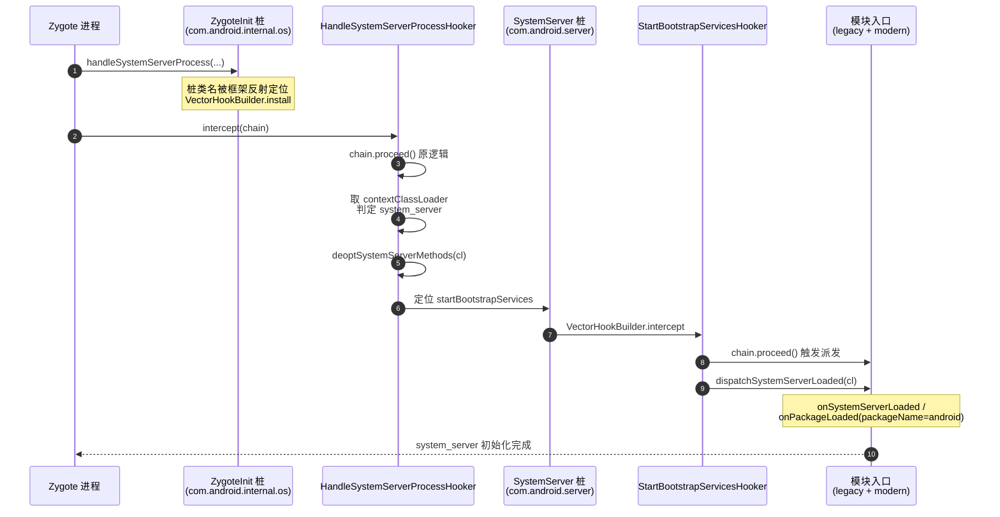

# 🖥️ server / 运行时 / 杂项桩

本篇收录不在前三个包里的桩：`com.android.server.*`（系统服务内部）、`com.android.internal.os.*`（Zygote/Binder 内部）、`dalvik.system.*`（运行时）、`xposed.dummy.*`（资源 Hook 动态父类），以及 `android.view`/`android.webkit`/`android.graphics`/`android.ddm`/`sun.*`/`org.xmlpull` 等杂项。

> 📂 [`hiddenapi/stubs/src/main/java/`](https://github.com/android-security-engineer/Vector-skills/blob/master/hiddenapi/stubs/src/main/java/) 下多个包
> 🏛️ hiddenapi · [stubs 总览](.) · [bridge](../bridge)

## com.android.internal.os — Zygote / Binder 内部

| 桩类 | 作用 |
| :--- | :--- |
| `ZygoteInit` | Zygote 启动入口，注入挂钩点 |
| `BinderInternal` | Binder 内部（`getContextObject`） |

### ZygoteInit

```java
public class ZygoteInit {}
```

桩本身是空壳，但**类名**是关键。Vector 在 Zygote 阶段挂 `com.android.internal.os.ZygoteInit` 的关键方法（如资源预加载、`forkSystemServer` 附近），在所有应用进程 fork 出来之前完成早期注入——这是 `IXposedHookZygoteInit` 的底层落点。桩让框架代码能引用这个类型。

`HandleSystemServerProcessHooker` 拦截 `ZygoteInit.handleSystemServerProcess`，在 system_server 真正启动前对系统服务路径做反优化，并 hook `SystemServer.startBootstrapServices` 把模块加载派发到 legacy/modern 两套生命周期。下图展示桩类名如何串联起这条早期注入链：



> 这条链上 `ZygoteInit` 与 `SystemServer` 桩只贡献"类名 + 方法签名"，让框架的 `Class.forName("com.android.internal.os.ZygoteInit")` 能在编译期通过；运行期 `handleSystemServerProcess` 的真实实现由系统镜像提供，hooker 在其 `after` 阶段插入注入逻辑。详见 [`SystemServerHookers.kt`](https://github.com/android-security-engineer/Vector-skills/blob/master/xposed/src/main/kotlin/org/matrix/vector/impl/hookers/SystemServerHookers.kt) 与 [Zygote 注入配方](../../../cookbook/hook-zygote)。

### BinderInternal

```java
public class BinderInternal {
    public static final native IBinder getContextObject();
}
```

`getContextObject()` 返回 ServiceManager 的底层 Binder 句柄（等同于 `BinderInternal.getContextObject()` → servicemanager 的上下文对象），是 `ServiceManager.getService` 链路的起点。`native` 方法，桩只声明签名。

## com.android.server — 系统服务内部

| 桩类 | 作用 |
| :--- | :--- |
| `ActivityManagerService` | AMS 内部，`Lifecycle` + `findProcessLocked` |
| `ProcessRecord` | 进程记录（`processName`） |
| `SystemService` | 系统服务抽象基类 |
| `SystemServiceManager` | 系统服务生命周期管理 |
| `LocalServices` | system_server 进程内本地服务注册表 |

`ActivityManagerService` 桩声明了内部 `Lifecycle` 类（AMS 作为 `SystemService` 的启动包装）与 `findProcessLocked`——Vector 在 `system_server` 作用域内查进程记录时用到。`LocalServices.getService(Class)` 是 system_server 进程内"非 Binder、直接对象"的服务查找入口。

## dalvik.system — 运行时

| 桩类 | 作用 |
| :--- | :--- |
| `BaseDexClassLoader` | `ByteBufferDexClassLoader` 的父类，hidden 的 ByteBuffer 构造 |
| `VMRuntime` | ART 运行时（指令集、is64Bit、isJavaDebuggable） |

### BaseDexClassLoader

```java
public class BaseDexClassLoader extends ClassLoader {
    public BaseDexClassLoader(ByteBuffer[] dexFiles, ClassLoader parent) { ... }
    public BaseDexClassLoader(ByteBuffer[] dexFiles, String librarySearchPath, ClassLoader parent) { ... }
    public String getLdLibraryPath() { ... }
}
```

bridge 的 `ByteBufferDexClassLoader` 直接继承这个 hidden 构造——它能让 Vector 从内存里的 `ByteBuffer`（而非磁盘 DEX 文件）加载模块类，避免落盘、规避检测。桩提供了 hidden 的 `ByteBuffer[]` 构造签名。

### VMRuntime

```java
public class VMRuntime {
    public static VMRuntime getRuntime() { ... }
    public native boolean is64Bit();
    public native String vmInstructionSet();
    public native boolean isJavaDebuggable();
}
```

ART 运行时单例。`vmInstructionSet()` 返回 `arm64`/`x86_64` 等，Vector 据此加载对应 ABI 的 native 库；`isJavaDebuggable()` 判断进程是否可调试（影响 Hook 策略）。

## xposed.dummy — 资源 Hook 动态父类

| 桩类 | 作用 |
| :--- | :--- |
| `XResourcesSuperClass` | `XResources` 的动态父类桩 |
| `XTypedArraySuperClass` | `XTypedArray` 的动态父类桩 |

这两个桩是 Xposed 资源 Hook 的特殊设计。注释说明：

> This implementation isn't included in the .dex file. Instead, it's created on the device. Usually, it will extend `Resources`, but some ROMs use their own `Resources` subclass. In that case, `XResourcesSuperClass` will extend the ROM's subclass in an attempt to increase compatibility.

即桩的 .class 不会进最终 dex——运行期框架在设备上动态生成真实父类（默认继承 `Resources`，ROM 改了就继承 ROM 的子类），让 `XResources` 既保有 hook 能力又不破坏类型层级。`XTypedArraySuperClass` 同理对应 `TypedArray`。

下图展示 `XResourcesSuperClass` 桩在编译期与运行期的双形态：编译期是空壳占位父类，运行期框架按 ROM 实际的 `Resources` 子类动态生成真实父类，把桩"替换"为有实现的真实类：

```mermaid
graph TD
    subgraph CT["编译期(stubs.jar / compileOnly)"]
        XS["XResourcesSuperClass 桩<br/>(空壳, extends Resources 占位)"]:::stub
        XR["XResources extends<br/>XResourcesSuperClass"]:::code
    end
    subgraph RT["运行期(设备上动态生成)"]
        DET{"ROM 是否改了 Resources?"}
        GEN1["动态生成: extends Resources"]:::gen
        GEN2["动态生成: extends ROMResourcesSub"]:::gen
        RXR["XResources 真实父类<br/>(带 hook 实现)"]:::real
    end
    XS -.编译期占位.-> XR
    XS -.运行期被动态类替换.-> DET
    DET -->|否(原生 AOSP)| GEN1
    DET -->|是(MIUI/EMUI 等)| GEN2
    GEN1 --> RXR
    GEN2 --> RXR
    RXR -.XResources 实际继承.-> XR
    classDef stub fill:#3a2a10,stroke:#e8a838,color:#ffd9b0
    classDef code fill:#0e3a36,stroke:#3dd8c8,color:#bff5ec
    classDef gen fill:#143a4a,stroke:#4fb3d8,color:#bff0f5
    classDef real fill:#1a3a1a,stroke:#5cd980,color:#bfffd0
```

> 这是 stubs 里**唯一不靠"系统镜像替换"的桩**：其他桩运行期由 `boot classpath` 的真实类接管，而 `xposed.dummy.*` 运行期由框架**自己生成**的真实类接管（继承 ROM 的 `Resources` 子类以提升兼容性）。桩在此只承诺"类型层级里有这个父类"，真实实现交给运行期动态字节码。

## 其他杂项桩

| 包 · 桩类 | 作用 |
| :--- | :--- |
| `android.view.IWindowManager` | 窗口管理 Binder（`lockNow` 等） |
| `android.webkit.WebViewFactory` · `WebViewDelegate` · `WebViewFactoryProvider` | WebView 内部，资源 Hook 需触及 |
| `android.graphics.drawable.Drawable` · `android.graphics.Movie` | 图形桩（资源类型支持） |
| `android.ddm.DdmHandleAppName` | DDMS 进程名设置（`setAppName`） |
| `android.permission.IPermissionManager` | 权限管理 Binder |
| `org.xmlpull.v1.XmlPullParserException` | XML 解析异常（资源解析） |
| `sun.misc.CompoundEnumeration` | 类加载器枚举合并（隐藏 native 库查找） |
| `sun.net.www.protocol.jar.Handler` | `jar:` URL 协议处理器 |

`DdmHandleAppName.setAppName(name, userId)` 用于改进程在 DDMS 里的显示名。`CompoundEnumeration` 把多个 `Enumeration` 串成一个，Vector 在合并 BootClassLoader 与应用 ClassLoader 的资源/native 库查找路径时用到。`Handler` 让框架能注册 `jar:` 协议处理器加载模块内嵌 jar 资源。

## 相关

- [stubs 总览](.) — 全部桩按包总览
- [android.app 桩](./stubs-android-app) — ActivityThread/LoadedApk
- [android.os 桩](./stubs-android-os) — ServiceManager/Binder
- [android.content 桩](./stubs-android-content) — Context/Intent/资源
- [hiddenapi 模块总览](../../modules/hiddenapi) — bridge 与 stubs 关系
