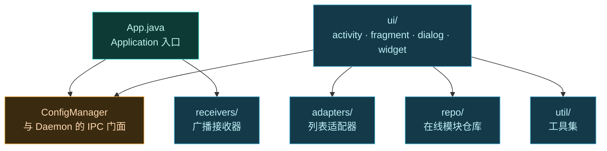

# 🟦 app — 寄生式管理器

`app` 模块是用户唯一能直接交互的界面——Vector 的**管理器**。它不是独立安装的应用，而是以[寄生方式](../../architecture/zygisk#寄生式管理器与身份移植)运行在宿主进程（如 `com.android.shell`）里。

> 包名空间：`org.lsposed.manager.*`（继承自 LSPosed 管理器）
> 语言：Java · UI 框架：AndroidX + Material Components

## 它解决什么

用户需要一处图形界面来：启用/禁用模块、为模块勾选作用域、浏览在线模块仓库、查看日志、调整设置。但 Vector 框架本身**没有独立包名**——管理器 APK 被注入宿主进程运行。`app` 模块就是这套寄生 UI 的全部代码。

## 模块结构



## 关键组件

| 包 | 关键类 | 职责 |
| :--- | :--- | :--- |
| 根 | [`App`](../../architecture/zygisk) | `Application` 子类，初始化主题、语言、通知通道 |
| 根 | `ConfigManager` | **核心门面**：所有与 Daemon 的 IPC 调用都经此封装 |
| 根 | `Constants` | 版本号、API 版本等常量 |
| `adapters` | `AppHelper` · `ScopeAdapter` | 应用列表与作用域列表的 RecyclerView 适配器 |
| `receivers` | `LSPManagerServiceHolder` | 持有管理器服务 Binder |
| `repo` | `RepoLoader` · `OnlineModule` · `Release` | 在线模块仓库拉取与解析 |
| `ui/activity` | `MainActivity` · `BaseActivity` | 单 Activity + 多 Fragment 架构 |
| `ui/fragment` | `HomeFragment` · `ModulesFragment` · `LogsFragment` · `RepoFragment` · `SettingsFragment` · `AppListFragment` · `CompileDialogFragment` | 各功能页 |
| `ui/dialog` | `WelcomeDialog` · `BlurBehindDialogBuilder` | 对话框 |
| `ui/widget` | `StatefulRecyclerView` · `EmptyStateRecyclerView` · `ExpandableTextView` · `ScrollWebView` | 自定义控件 |
| `util` | `ModuleUtil` · `BackupUtils` · `ThemeUtil` · `UpdateUtil` · `NavUtil` · `ShortcutUtil` · `AppIconModelLoader` | 工具集 |

## ConfigManager：Daemon 的门面

`ConfigManager` 是整个 app 模块的中枢。它把所有跨进程操作封装成静态方法，UI 层只调这些方法，不直接碰 Binder：

```kotlin
// 典型用法（UI 层）
ConfigManager.setModuleEnabled(pkg, true)        // 启用模块
ConfigManager.setModuleScope(pkg, scope)         // 设置作用域
ConfigManager.getLog(verbose)                    // 拉取日志 FD
ConfigManager.forceStopPackage(pkg, userId)      // 强停应用
ConfigManager.reboot()                           // 重启设备
```

背后这些调用都经 `ILSPManagerService` AIDL 转发给 Daemon。详见 [services AIDL 参考](../aidl/ilspmanagerservice)。

## 与框架的关系

`app` 模块**运行在宿主进程里**，但通过 Daemon 提供的 `ILSPManagerService` 操控全局状态。它本身不做 Hook，只是管理界面。寄生注入机制见 [Zygisk 模块 · 寄生式管理器](../../architecture/zygisk#寄生式管理器与身份移植)。

## 子文档

每个包/类的详细参考见 [类参考 · app](../classes/app-adapters) 起的系列页。
