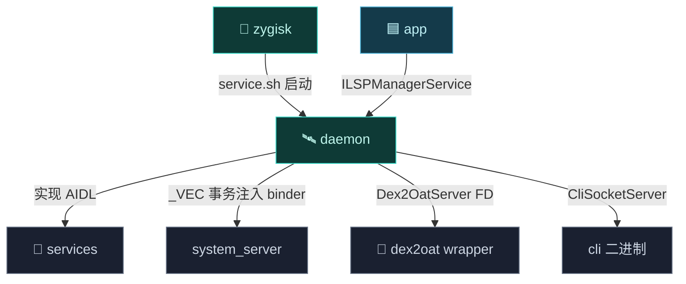
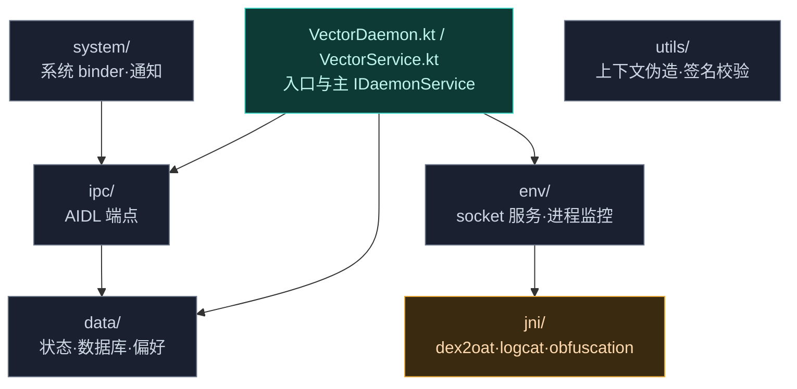

# 🛰️ daemon — 守护进程

`daemon` 是 Vector 的**中央协调者**——一个独立的、root 权限的 Dalvik 可执行程序，经 `app_process` 引导，完全运行在标准 Android 应用沙箱之外。

> 包名空间：`org.matrix.vector.daemon.*`
> 语言：Kotlin（主体）+ C++（native 子系统）· 入口：`VectorDaemon`

## 它解决什么

目标进程受严格沙箱与 SELinux 约束，**无法安全访问外部配置或数据库**。Daemon 把这些操作卸载到自己身上，作为 IPC 后端，向目标应用安全交付内存映射资源、配置状态和 native 文件描述符。详见 [架构 · Daemon 守护进程](../../architecture/daemon)。

## 模块职责

- **沙箱外状态中心**：以 root 身份在应用沙箱外运行，承载配置、模块数据库、偏好、文件系统等目标进程无法安全访问的资源。
- **IPC 后端**：实现 `daemon-service`/`manager-service` 的全部 AIDL 接口，向 system_server、被注入应用、libxposed 模块、管理器交付服务。
- **Binder 桥注入**：把自身 `VectorService` binder 经 `_VEC` 事务注入 system_server，供 Zygisk 模块发现。
- **编译劫持协调**：`Dex2OatServer` 经 abstract socket 向 [dex2oat](./dex2oat) wrapper 传递原始编译器 FD。
- **native 子系统**：C++ 子系统直接解析 logcat 缓冲、协调 dex2oat、管理混淆映射，绕开 shell 工具开销。
- **CLI**：提供 `cli` 二进制，经 Unix socket 接受带 token 的管理命令（强停、重启、状态查询）。

## 依赖关系

| 依赖 | 形式 | 用途 |
| :--- | :--- | :--- |
| 📚 [external/apache](./external) | `implementation` | commons-lang 工具 |
| 🏛️ [hiddenapi/bridge](./hiddenapi) | `implementation` | hidden API 桥接 |
| 📡 [services/daemon-service](./services) | `implementation` | 实现其 AIDL 接口 |
| 📡 [services/manager-service](./services) | `implementation` | 实现 `ILSPManagerService` |
| 🏛️ [hiddenapi/stubs](./hiddenapi) | `compileOnly` | 编译期桩 |
| `androidx.annotation` | `compileOnly` | 注解 |
| `agp.apksig` / `gson` / `picocli` | `implementation` | APK 签名校验、JSON、CLI 解析 |
| `kotlinx.coroutines` | `implementation` | 并发状态管理 |
| 🧬 lsplant / dex_builder | CMake（native 子系统） | 与 [native](./native) 共享 external 子树 |

## 主要组成类

| 类 | 包 | 一句话职责 |
| :--- | :--- | :--- |
| `VectorDaemon` | 根 | 入口 `main()`：锁单例、注册代理服务、启动环境守护、注入 binder 到 system_server、`Looper.loop()`。 |
| `VectorService` | 根 | 主 `IDaemonService` 实现，分发系统上下文、预启动管理器。 |
| `Cli` | 根 | CLI 命令定义（picocli），经 `CliSocketServer` 接受带 token 命令。 |
| `DaemonState` | data | 不可变快照容器，IPC 线程无锁读取，变更时后台协程重建并原子交换。 |
| `Database` / `ModuleDatabase` | data | SQLite schema 与模块表操作。 |
| `Dex2OatServer` | env | abstract socket 服务，向 [dex2oat](./dex2oat) wrapper 传递原始编译器 FD。 |
| `LogcatMonitor` | env | 经 native `logcat.cpp` 直接解析系统日志缓冲。 |
| `ApplicationService` / `ManagerService` / `SystemServerService` | ipc | 各 AIDL 端点实现。 |
| `ObfuscationManager` | utils | 混淆映射管理（native `obfuscation.cpp` 配合）。 |

## 构建产物

- **`daemon.apk`** —— `com.android.application`（namespace `org.matrix.vector.daemon`），但 `AndroidManifest.xml` 为空 `<manifest/>`，实际是**寄生式 Dalvik 可执行**，经 `app_process` 引导而非标准 Activity 启动。
- **`libdaemon.so`** —— CMake 共享库（`add_library(daemon SHARED dex2oat.cpp logcat.cpp obfuscation.cpp)`），含 dex2oat 协调、logcat 解析、混淆管理 native 代码。
- 构建期生成 `SignInfo.kt`（从 app 的签名配置提取证书字节），供 daemon 校验调用方身份。
- release 启用 R8 minify + proguard。

## 与其它模块的交互

- 被 [zygisk](./zygisk) 启动：`service.sh` 经 `unshare -m` 后台启动 daemon 二进制，传 `--system-server-max-retry` 等参数。
- 向 [services](./services) 提供 AIDL 实现，被 [app](./app)/[xposed](./xposed)/[legacy](./legacy) 作为客户端调用。
- 向 [dex2oat](./dex2oat) 提供 `Dex2OatServer`：wrapper 连 abstract socket 取原始编译器 + hooker 的 FD。
- 与 [native](./native) 共享 external CMake 子树（lsplant/dex_builder），但不直接链接 `libnative.a`。
- 经 `sendToBridge` 把 binder 注入 system_server，并在 system_server 崩溃时重占代理服务名、清缓存重注入。

## 模块结构

## 关键组件

| 包 | 关键类/文件 | 职责 |
| :--- | :--- | :--- |
| 根 | `VectorDaemon` · `VectorService` · `Cli` | 入口、主 `IDaemonService` 实现、CLI 命令定义 |
| `data` | `ConfigCache` · `DaemonState` · `Database` · `ModuleDatabase` · `PreferenceStore` · `FileSystem` | 不可变状态缓存、SQLite schema、偏好差分更新 |
| `env` | `CliSocketServer` · `Dex2OatServer` · `LogcatMonitor` | UNIX domain socket 服务、native 进程监控 |
| `ipc` | `ApplicationService` · `ManagerService` · `ModuleService` · `SystemServerService` · `InjectedModuleService` · `CliHandler` | AIDL 端点实现 |
| `system` | `NotificationManager` · `SystemBinders` · `SystemExtensions` | 系统 binder 代理、通知 UI |
| `utils` | `FakeContext` · `InstallerVerifier` · `ObfuscationManager` · `Workarounds` | 上下文伪造、签名校验、混淆管理 |
| `jni` | `dex2oat.cpp` · `logcat.cpp` · `obfuscation.cpp` | native C++ 子系统 |

## 核心机制

### 并发与状态管理

`DaemonState` 是不可变快照容器，IPC 线程**无锁读取**；底层 SQLite 变更时后台协程重建快照并原子交换。详见 [架构 · daemon · 并发](../../architecture/daemon#并发与状态管理)。

### native 子系统

Daemon 依赖 C++ 子系统拦截编译管线（见 [dex2oat 劫持](../modules/dex2oat)）并直接解析系统日志缓冲，绕开标准 shell 工具开销。

## 子文档

各包/类详细参考见 [类参考 · daemon](../classes/daemon-data) 起的系列页。
