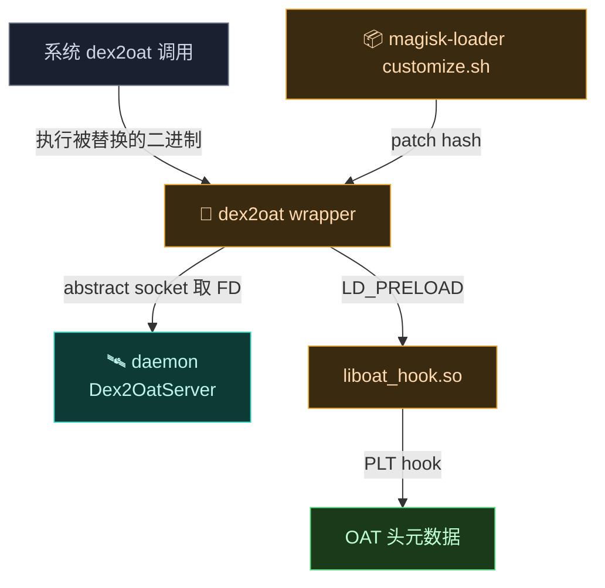
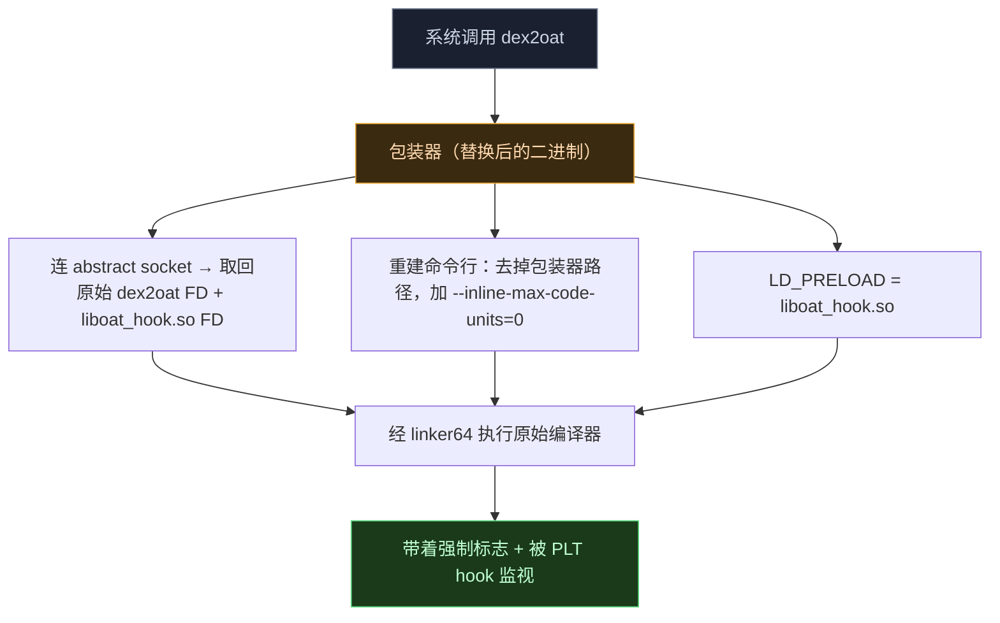

# 🔨 dex2oat — 编译劫持

`dex2oat` 是 Android 的 AOT 编译器，把 DEX 编译成 OAT。VectorDex2Oat 是一套针对它的包装与插桩工具，用于拦截编译过程、强制禁止方法内联，并透明伪装生成的 OAT 元数据以隐藏包装器存在。详见 [架构 · dex2oat 编译劫持](../../architecture/dex2oat)。

> 目录：`dex2oat/src/main/cpp/` · 语言：C++ · 依赖：[LSPlt](https://github.com/JingMatrix/LSPlt)

## 它解决什么

ART 会把短方法内联进调用者——一旦内联，调用方直接执行机器码，不查 `entry_point`，Hook 失效。本模块强制 `--inline-max-code-units=0` 让所有方法保持离散可 Hook。

## 模块职责

- **二进制替换**：把系统 `dex2oat` 替换为包装器，拦截所有 AOT 编译调用。
- **内联抑制**：重建命令行，追加 `--inline-max-code-units=0`，保证方法可 Hook。
- **元数据伪装**：经 PLT hook 清洗 OAT 头，从 `.oat` 移除包装器痕迹，避免被检测。
- **FD 协调**：经 Linux Abstract Namespace Unix socket 从 [daemon](./daemon) 取回原始 `dex2oat` FD 与 `liboat_hook.so` FD，避免路径暴露。

## 依赖关系

| 依赖 | 形式 | 用途 |
| :--- | :--- | :--- |
| 📐 [lsplt](https://github.com/JingMatrix/LSPlt) | CMake `lsplt_static` | PLT hook，用于 OAT 头元数据清洗 |
| `log` | 系统 | Android 日志 |

> 不依赖 [native](./native)（与 native 共享 external 子树技术但独立 CMake）。运行时依赖 [daemon](./daemon) 的 `Dex2OatServer` 提供 FD。

## 主要组成类

| 文件 | 一句话职责 |
| :--- | :--- |
| `dex2oat.cpp` | Wrapper 包装器：替换系统二进制，连 abstract socket 取原始 FD，重建命令行，经 linker 执行原始编译器。 |
| `oat_hook.cpp` | Hooker：经 `LD_PRELOAD` 注入，用 lsplt PLT hook 清洗 `OatHeader::ComputeChecksum`/`GetKeyValueStore`。 |
| `include/oat.h` | ART OAT 头结构镜像，供 hooker 读写元数据。 |
| `include/base_macros.h` / `macros.h` / `logging.h` | 基础宏与日志辅助。 |

## 构建产物

- **`dex2oat`** —— CMake 可执行文件（`add_executable`），替换系统 `dex2oat` 二进制，按 ABI 分 32/64 位（`dex2oat32`/`dex2oat64`）。
- **`liboat_hook.so`** —— 共享库（`add_library(oat_hook SHARED)`），经 `LD_PRELOAD` 注入原始编译器，按 ABI 分 `liboat_hook32.so`/`liboat_hook64.so`。
- 两者被 zygisk 模块的 `zipAll` 任务打包进分发 zip 的 `bin/<abi>/`，安装时经 `customize.sh` 提取并 patch 占位 hash。

## 与其它模块的交互

- 与 [daemon](./daemon)：运行时经 `Dex2OatServer`（abstract socket）从 daemon 取回原始 `dex2oat` 与 `liboat_hook.so` 的 FD；daemon 的 JNI `dex2oat.cpp` 负责协调。
- 与 [magisk-loader](./magisk-loader)/[zygisk](./zygisk)：`customize.sh` 在安装期 patch 二进制内的占位 socket 名 hash（`5291374c...` → 随机串）做反检测。
- 与 [native](./native)：共享 `external/` 技术栈但不直接链接 native 静态库；`dex_builder_static`（native 用）与 lsplt（dex2oat 用）同源于 external CMake 树。

## 两个组件

| 组件 | 文件 | 角色 |
| :--- | :--- | :--- |
| **Wrapper 包装器** | `dex2oat.cpp` | 替换二进制，拦截执行，经 Unix socket 取原始编译器，带强制标志执行 |
| **Hooker** | `oat_hook.cpp` | 经 `LD_PRELOAD` 注入，用 PLT hook 清洗 OAT 头元数据 |

## 辅助头文件

| 文件 | 内容 |
| :--- | :--- |
| `include/oat.h` | ART OAT 头结构镜像 |
| `include/base_macros.h` · `macros.h` | 基础宏 |
| `include/logging.h` | 日志 |

## 关键特性

- **内联抑制**：追加 `--inline-max-code-units=0`。
- **基于 FD 的执行**：经 linker 用 `/proc/self/fd/` 路径执行原始 `dex2oat`。
- **元数据伪装**：hook `OatHeader::ComputeChecksum` / `GetKeyValueStore`，从 `.oat` 移除包装器痕迹。
- **Abstract Socket**：Linux Abstract Namespace 的 Unix socket 协调 FD 传递。

## 工作流

## 子文档

包装器与 hooker 的详细参考见 [类参考 · dex2oat](../classes/dex2oat-wrapper)。
